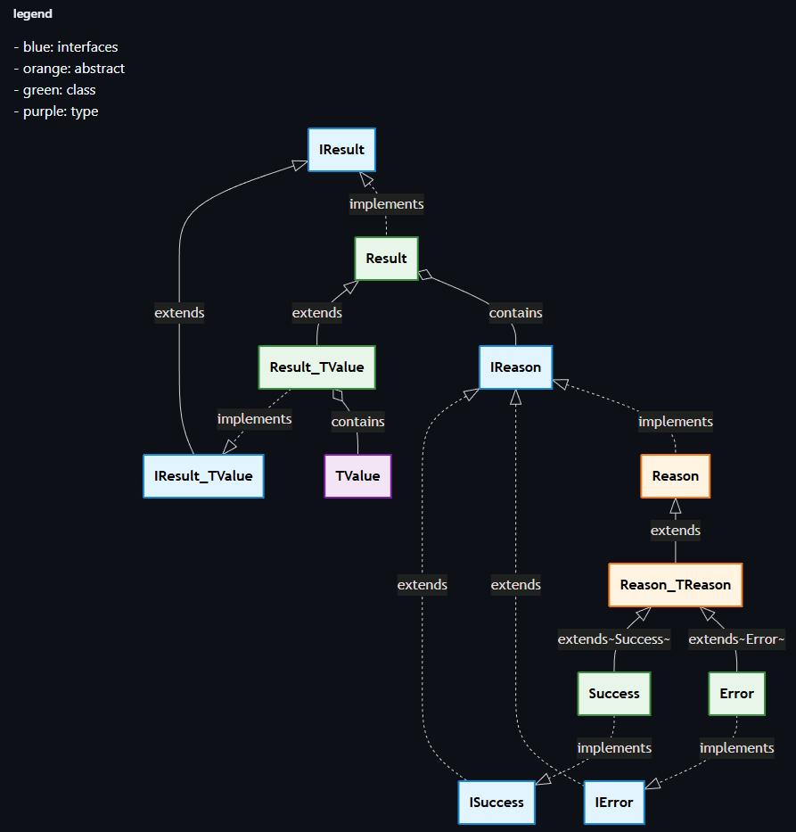

# REslava.Result

 🚧 **Under Construction** - This library is currently in active development

<div align="center">


[](https://GitHub.com/reslava/REslava.Result/graphs/contributors/) 
[](https://github.com/reslava/REslava.Result/stargazers) 
[](https://github.com/reslava/REslava.Result/blob/master/LICENSE.txt)

</div>

## 📋 Table of Contents
- [Introducing REslava.Result](#-introducing-reslavaresult) 
- [Why Result Pattern?](#-why-result-pattern)
- [Overview](#-overview)
- [Architecture Highlights](#%EF%B8%8F-architecture-highlights)
- [UML Class Diagrams](#-uml-class-diagrams)
- [Clean Design](#-clean-design)
- [References](#-references)

## 🚀 Introducing REslava.Result 

A Clean, Fluent Approach to Error Handling in C#
I'm excited to share my new open-source library that brings elegant error handling to .NET applications using the Result pattern.


## 🎯 Why Result Pattern?
Instead of throwing exceptions for expected error cases, REslava.Result allows you to return detailed success/failure information along with your data, making your code more predictable and maintainable.

## 🎯 Overview
**REslava.Result** provides a functional approach to error handling in C# by implementing the Result pattern. Instead of throwing exceptions for expected error cases, this library allows you to return detailed information about the error along with your data, making your code more predictable and easier to understand.

After studying the excellent ErrorOr and FluentResults libraries (many thanks to the authors of both) and their approaches to implementing the Result pattern, I decided to start a new library from scratch based on FluentResults. 
I like to start from a blank project because that way I can design my own class structure and implement the features I consider appropriate. 

My idea is to make this library as simple as possible, easy to understand and use.

I hope you find this library useful. Thank you!

## 🔄 Development Workflow

### Quick Start
```bash
# Clone the repository
git clone https://github.com/reslava/nuget-package-reslava-result.git
cd nuget-package-reslava-result

# Install dependencies
npm install
dotnet restore

# Start working
git checkout dev
git checkout -b feature/my-feature

# Make changes and commit
git add .
npm run commit

# For detailed workflow, see [QUICK-START.md](QUICK-START.md)
```

### Branching Strategy

- **main**: Production releases only
- **dev**: Active development (work here!)
- **feature/\***: New features
- **fix/\***: Bug fixes

See [BRANCHING-STRATEGY.md](BRANCHING-STRATEGY.md) for complete details.

### Creating Releases
```bash
# Preview release
npm run release:dry

# Create release
npm run release:minor  # or :beta, :major

# Push
git push --follow-tags
```

See [QUICK-START.md](QUICK-START.md#creating-releases) for detailed release workflow.

## 🏗️ Architecture Highlights
1. Fluent Interfaces & Method Chaining
The entire library is designed around fluent APIs for maximum expressiveness:
```csharp
var result = Result<User>.Ok("User created successfully")
    .WithValue(newUser)
    .WithSuccess("Email sent");

var failedResult = Result.Fail("Invalid input")
    .WithError("Username already exists")
    .WithError("Email format invalid");
```
2. CRTP (Curiously Recurring Template Pattern)
To achieve fluent chaining while maintaining type safety and maximizing code reuse, I leveraged CRTP in the design:
```csharp
public abstract class Reason<TReason> : Reason
    where TReason : Reason<TReason>
{
    public TReason WithMessage(string message) { ... return (TReason)this; }
    public TReason WithTags(string key, object value) { ... return (TReason)this; }
}

public class Error : Reason<Error>, IError { }
public class Success : Reason<Success>, ISuccess { }
```
This pattern enables:
✅ Type-safe method chaining
✅ Code reuse across Success and Error classes
✅ Fluent APIs that return the correct derived type
✅ No code duplication

## 📐 Clean Design
The architecture follows SOLID principles with a clear separation between interfaces and implementations. Check out the UML diagram below to see how everything fits together!

## 📶 UML Class Diagrams

Here you can see UML class diagrama used to implement Result pattern in the project:

- [UML](docs/UML.md)
- [UML simplified](docs/UML-simple.md) (only class names)



## 📕 References
- [Series: Working with the result pattern](https://andrewlock.net/series/working-with-the-result-pattern/)
- [The Result Pattern in C#: A Smarter Way to Handle Errors](https://medium.com/@aseem2372005/the-result-pattern-in-c-a-smarter-way-to-handle-errors-c6dee28a0ef0)
- [Functional Error Handling in .NET With the Result Pattern](https://www.milanjovanovic.tech/blog/functional-error-handling-in-dotnet-with-the-result-pattern)
- [ErrorOr](https://github.com/amantinband/error-or)
- [OneOf](https://github.com/mcintyre321/OneOf)
- [FluentResults](https://github.com/altmann/FluentResults)

---

<div align="center">

**⭐ Star this repository if you find it useful!**

Made with ❤️ by [Rafa Eslava](https://github.com/reslava) for developers

</div>
