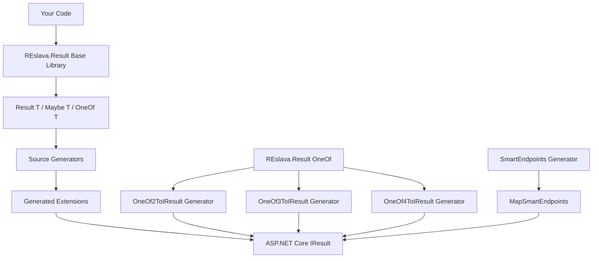

# REslava.Result - Railway-Oriented Programming for .NET

<div align="center">


[](https://GitHub.com/reslava/REslava.Result/graphs/contributors/) 
[](https://github.com/reslava/REslava.Result/stargazers) 
[](https://www.nuget.org/packages/REslava.Result)


**🏗️ Complete Functional Programming Framework + ASP.NET Integration + OneOf Extensions**

</div>

### Why REslava.Result?

> **The only .NET library that combines functional error handling with compile-time ASP.NET API generation.**

| | REslava.Result | FluentResults | ErrorOr | LanguageExt |
|---|:---:|:---:|:---:|:---:|
| Result&lt;T&gt; pattern | ✅ | ✅ | ✅ | ✅ |
| OneOf discriminated unions | ✅ (2-4 types) | — | — | ✅ |
| Maybe&lt;T&gt; | ✅ | — | — | ✅ |
| **ASP.NET source generators** | **✅** | — | — | — |
| **SmartEndpoints (zero-boilerplate APIs)** | **✅** | — | — | — |
| **OpenAPI metadata auto-generation** | **✅** | — | — | — |
| **Authorization & Policy support** | **✅** | — | — | — |
| **Roslyn safety analyzers** | **✅** | — | — | — |
| Validation framework | ✅ | Basic | — | ✅ |
| Zero dependencies | ✅ | ✅ | ✅ | — |

**Unique advantage**: SmartEndpoints auto-generates complete Minimal API endpoints from your business logic — including routing, DI, HTTP status mapping, error handling, full OpenAPI metadata (`.Produces<T>()`, `.WithSummary()`, `.WithTags()`), and authorization (`.RequireAuthorization()`, `.AllowAnonymous()`). No other .NET library does this.

---

## 📚 Table of Contents

| 🎯 **Section** | 📖 **Description** |
|------------------|---------------------|
| [🚀 Quick Start](#-quick-start) | Installation and complete generator showcase |
| [📚 Choose Your Path](#-choose-your-path) | Find exactly what you need |
| [🎯 The Transformation: 70-90% Less Code](#-the-transformation-70-90-less-code) | See how boilerplate disappears |
| [🏗️ REslava.Result Core Library](#-reslavaresult-core-library) | Functional programming foundation |
| [🚀 ASP.NET Integration](#-aspnet-integration) | ResultToIResult and HTTP mapping |
| [🧠 Advanced Patterns](#-advanced-patterns) | Maybe, LINQ, functional composition |
| [🏗️ Complete Architecture](#-complete-architecture) | How generators work internally |
| [📦 Package Structure](#-package-structure) | What you get with each package |
| [🎯 Quick Examples](#-quick-examples) | Real-world code samples |
| [📈 Production Benefits](#-production-benefits) | Enterprise-ready advantages |
| [🧪 Testing & Quality Assurance](#-testing--quality-assurance) | 1,928+ tests passing |
| [🏢 Real-World Impact](#-real-world-impact) | Success stories and use cases |
| [🏆 Why Choose REslava.Result?](#-why-choose-reslavaresult) | Unique advantages |
| [📚 Deep Dive Documentation](#-deep-dive-documentation) | Comprehensive guides |
| [🧪 Quick Start Scenarios](#-quick-start-scenarios) | Hands-on tutorials |
| [🎯 Roadmap](#-roadmap) | Future development plans |
| [🤝 Contributing](#-contributing) | How to contribute |
| [📄 License](#-license) | MIT License details |
| [🙏 Acknowledgments](#-acknowledgments) | Community credits |
| [📈 Version History](#-version-history) | Release notes and changes |

---

## 🚀 Quick Start

### Installation

```bash
dotnet add package REslava.Result                      # Core library
dotnet add package REslava.Result.SourceGenerators     # ASP.NET source generators
dotnet add package REslava.Result.Analyzers            # Roslyn safety analyzers
```

### Complete Generator Showcase

#### ⚡ SmartEndpoints - Zero-Boilerplate Fast APIs
Generate complete Minimal APIs from controllers with automatic HTTP mapping!

```csharp
[AutoGenerateEndpoints(RoutePrefix = "/api/users")]
public class UserController {
    private readonly UserService _service;
    public UserController(UserService service) => _service = service;

    // 🚀 DI + async → Automatic REST API with dependency injection!
    public async Task<OneOf<ValidationError, NotFoundError, User>>
        GetUser(int id) => await _service.GetUserByIdAsync(id);

    public async Task<OneOf<ValidationError, ConflictError, User>>
        CreateUser(CreateUserRequest request) => await _service.CreateAsync(request);

    public async Task<Result<List<User>>> GetUsers()
        => await _service.GetAllAsync();
}
```

**🎉 Generated Minimal API (Zero Manual Code!)**
- ✅ `POST /api/users` → 201/400/404/409 (OneOf4 auto-mapping!)
- ✅ `GET /api/users/{id}` → 200/404 (OneOf2 auto-mapping!)
- ✅ **Full OpenAPI metadata** — `.Produces<T>(200)`, `.Produces(404)`, `.WithSummary()`, `.WithTags()` auto-generated from return types
- ✅ **Error handling** automatically configured
- ✅ **HTTP status mapping** automatically applied
- ✅ **Route grouping** via `MapGroup` with automatic tag generation

**🔥 Development Speed: 10x Faster**
- **No manual route setup** - automatic from method names
- **No manual error handling** - automatic from return types
- **No manual status codes** - automatic from error types
- **No manual API docs** - OpenAPI + Scalar UI automatically generated
- **Self-explanatory code** - business logic only

#### 🔄 OneOf Extensions - Intelligent HTTP Mapping
Automatic error detection and HTTP status mapping for OneOf types:

```csharp
// Error Types → HTTP Status Codes
ValidationError → 400 Bad Request
UserNotFoundError → 404 Not Found  
ConflictError → 409 Conflict
UnauthorizedError → 401 Unauthorized
ForbiddenError → 403 Forbidden
ServerError → 500 Internal Server Error
```

**Supported Patterns:**
- **OneOf2ToIResult<T1,T2>** - Two-type error handling
- **OneOf3ToIResult<T1,T2,T3>** - Three-type error handling  
- **🆕 OneOf4ToIResult<T1,T2,T3,T4>** - Four-type error handling (NEW v1.12.0!)
- **SmartEndpoints Integration** - Uses extensions automatically in generated APIs

#### 🚀 Enhanced SmartEndpoints + OpenAPI Metadata (NEW!)

**Feature**: Full OpenAPI metadata auto-generated at compile time from return types
**Benefits**: Scalar/Swagger UI shows typed responses, status codes, summaries, and tags — zero manual configuration
**Use Case**: Production-ready APIs with complete documentation from day one

**🔥 What Makes SmartEndpoints Revolutionary:**

```csharp
// ✅ YOU WRITE: Pure business logic (5 lines)
[AutoGenerateEndpoints(RoutePrefix = "/api/orders")]
public class SmartOrderController {
    public async Task<OneOf<UserNotFoundError, InsufficientStockError, ValidationError, OrderResponse>>
        CreateOrder(CreateOrderRequest request) => await _service.CreateOrderAsync(request);
}

// 🎉 GENERATOR PRODUCES: Complete endpoint with full OpenAPI metadata
var smartOrderGroup = endpoints.MapGroup("/api/orders")
    .WithTags("Smart Order");

smartOrderGroup.MapPost("/", async (CreateOrderRequest request, SmartOrderController service) =>
{
    var result = await service.CreateOrder(request);
    return result.ToIResult();
})
    .WithName("SmartOrder_CreateOrder")
    .WithSummary("Create order")
    .Produces<OrderResponse>(200)
    .Produces(400)   // ← ValidationError
    .Produces(404)   // ← UserNotFoundError
    .Produces(409);  // ← InsufficientStockError
```

**🎯 Everything Auto-Generated from Return Types:**
- **Method name** → HTTP method + `.WithName()` (`CreateOrder` → `POST` + `SmartOrder_CreateOrder`)
- **Class name** → `.WithTags()` + `MapGroup()` (`SmartOrderController` → `"Smart Order"`)
- **PascalCase** → `.WithSummary()` (`CreateOrder` → `"Create order"`)
- **Success type** → `.Produces<T>(200)` (`OrderResponse` → typed 200 response)
- **Error types** → `.Produces(statusCode)` (`UserNotFoundError` → 404, `InsufficientStockError` → 409)
- **Parameters** → Route/body binding (`int id` → `/{id}`, `request` → JSON body)

**⚡ Zero Boilerplate Benefits:**
- **No manual route configuration** - inferred from class/method names
- **No manual error handling** - automatic from OneOf types
- **No manual status codes** - automatic from error type names
- **No manual OpenAPI metadata** - `.Produces()`, `.WithSummary()`, `.WithTags()` all auto-generated
- **No manual endpoint names** - globally unique names from controller + method
- **No manual ProblemDetails** - automatic RFC 7807 compliance

#### 🎯 ResultToIResult Extensions
Convert Result<T> types to proper HTTP responses:

```csharp
public Result<User> GetUser(int id) { /* ... */ }
return GetUser(id).ToIResult(); // Automatic HTTP mapping


app.MapGet("/users/{id}", async (int id, IUserService service) =>
{
    return await service.GetUserAsync(id); // Auto-converts to HTTP response!
});

// 🆕 v1.10.0: OneOf extensions also work!
app.MapGet("/users/oneof/{id}", async (int id) =>
{
    return GetOneOfUser(id); // Auto-converts OneOf<T1,T2,T3> too!
});
```

#### 🛡️ Safety Analyzers — Compile-Time Diagnostics (NEW v1.14.0!)

Catch common Result<T> mistakes **at compile time** before they reach production:

```csharp
// RESL1001 — Unsafe .Value access without guard
var result = GetUser(id);
var name = result.Value;        // ⚠️ Warning: Access to '.Value' without checking 'IsSuccess'

// ✅ Safe alternatives:
if (result.IsSuccess)
    var name = result.Value;    // No warning — guarded by IsSuccess

var name = result.Match(        // No warning — pattern matching
    onSuccess: u => u.Name,
    onFailure: _ => "Unknown");

var name = result.GetValueOr(   // No warning — safe default
    defaultUser).Name;
```

```csharp
// RESL1002 — Discarded Result<T> return value
Save();                         // ⚠️ Warning: Return value of type 'Result<T>' is discarded
await SaveAsync();              // ⚠️ Warning: errors silently swallowed

// ✅ Safe alternatives:
var result = Save();            // No warning — assigned
return Save();                  // No warning — returned
Process(Save());                // No warning — passed as argument
```

```bash
dotnet add package REslava.Result.Analyzers
```

---

## 📚 Choose Your Path

**Find exactly what you need based on your goals:**

| 🎯 **I'm building a...** | 📖 **Start Here** | 🚀 **What You'll Learn** |
|--------------------------|-------------------|---------------------------|
| **Web API** | [🌐 ASP.NET Integration](#-aspnet-integration) | Auto-conversion, error mapping, OneOf extensions |
| **Library/Service** | [🏗️ Core Library](#-reslavaresult-core-library) | Result pattern, validation, functional programming |
| **Custom Generator** | [📖 Custom Generator Guide](docs/how-to-create-custom-generator.md) | Build your own source generators |
| **Advanced App** | [🧠 Advanced Patterns](#-advanced-patterns) | Maybe, OneOf, validation rules |
| **Testing** | [🧪 Testing & Quality](#-testing--quality-assurance) | 1,928+ tests, CI/CD, test strategies |
| **Curious About Magic** | [🏗️ Complete Architecture](#-complete-architecture) | How generators work, SOLID design |

---

## 🎯 The Transformation: 70-90% Less Code

**See how REslava.Result eliminates boilerplate in real .NET 10 applications:**

### ❌ BEFORE: Traditional Minimal API
```csharp
// Manual error handling, validation, and HTTP responses
app.MapPost("/users", async (CreateUserRequest request, IUserService service) =>
{
    // Manual validation
    if (string.IsNullOrWhiteSpace(request.Email))
        return Results.BadRequest(new { error = "Email required" });
    
    if (!IsValidEmail(request.Email))
        return Results.BadRequest(new { error = "Invalid email" });
        
    // Manual duplicate checking
    if (await EmailExistsAsync(request.Email))
        return Results.Conflict(new { error = "Email already exists" });
        
    try
    {
        var user = await service.CreateUserAsync(request);
        return Results.Created($"/users/{user.Id}", user);
    }
    catch (ValidationException ex)
    {
        return Results.BadRequest(new { errors = ex.Errors });
    }
    catch (Exception ex)
    {
        return Results.Problem("Internal server error");
    }
});
```

### ✅ AFTER: REslava.Result Magic
```csharp
// Clean, declarative, type-safe - 3 lines instead of 25+
app.MapPost("/users", async (CreateUserRequest request) => 
    await CreateUser(request));

// Service layer handles everything elegantly
public async Task<Result<User>> CreateUser(CreateUserRequest request) =>
    await Result<CreateUserRequest>.Ok(request)
        .Ensure(r => !string.IsNullOrWhiteSpace(r.Email), "Email required")
        .Ensure(r => IsValidEmail(r.Email), "Invalid email format")
        .EnsureAsync(async r => !await EmailExistsAsync(r.Email), "Email already exists")
        .BindAsync(async r => await _userService.CreateUserAsync(r))
        .WithSuccess("User created successfully");
```

**🚀 Result: 70-90% less code, 100% type-safe, automatic HTTP responses, rich error context!**

---

## 🏗️ REslava.Result Core Library

### 🧠 Functional Programming Foundation
**Railway-Oriented Programming (ROP)**
- **Immutable Results**: Thread-safe functional data structures
- **Error Composition**: Chain operations without exception handling
- **Success/Failure Pipelines**: Clean separation of happy and error paths
- **Type Safety**: Compile-time guarantees for error handling

### 🔧 Complete Method Catalog

#### **Core Operations**
```csharp
// Factory Methods
Result<T>.Ok(value)                    // Success result
Result<T>.Fail("error")                 // Failure result
Result.Fail("error")                    // Non-generic failure

// Pattern Matching
result.Match(
    onSuccess: value => DoSomething(value),
    onFailure: errors => HandleErrors(errors)
);

// Value Access
result.Value                            // Throws if failed
result.GetValueOrDefault(defaultValue)  // Safe access
```

#### **Functional Composition**
```csharp
// Bind (Chain operations)
var result = Result<int>.Ok(5)
    .Bind(x => Result<string>.Ok(x.ToString()))
    .Bind(s => ValidateEmail(s));

// Map (Transform success values)
var result = Result<int>.Ok(5)
    .Map(x => x * 2)
    .Map(x => x.ToString());

// Tap (Side effects without changing result)
var result = Result<User>.Ok(user)
    .Tap(u => LogUserAccess(u))
    .Tap(u => SendNotification(u));

// Ensure (Validation)
var result = Result<string>.Ok(email)
    .Ensure(e => IsValidEmail(e), "Invalid email format")
    .EnsureAsync(async e => !await EmailExistsAsync(e), "Email already registered");
```

#### **Async Operations**
```csharp
// All methods have async variants
var result = await Result<int>.Ok(id)
    .BindAsync(async i => await GetUserAsync(i))
    .MapAsync(async user => await ToDtoAsync(user))
    .TapAsync(async dto => await LogAccessAsync(dto))
    .EnsureAsync(async dto => await ValidateDtoAsync(dto), "Invalid DTO");
```

### 📊 LINQ Integration
**Functional Query Comprehensions**
```csharp
// LINQ-like syntax for Result operations
var result = from user in GetUser(id)
            from validation in ValidateUser(user)
            from saved in SaveUser(validation)
            from notification in SendNotification(saved)
            select saved;

// Complex queries
var results = from id in userIds
             from user in GetUserAsync(id)
             from updated in UpdateUserAsync(user)
             select updated;

// Equivalent to method chaining
var result = GetUser(id)
    .Bind(ValidateUser)
    .Bind(SaveUser)
    .Bind(SendNotification);
```

### 🎯 Advanced Patterns

#### **Maybe<T> - Null-Safe Optionals**
```csharp
// Instead of null references
Maybe<User> user = GetUserFromCache(id);
var email = user
    .Select(u => u.Email)
    .Filter(email => email.Contains("@"))
    .ValueOrDefault("no-reply@example.com");

// Safe operations
var result = user
    .Map(u => u.Name)
    .Bind(name => ValidateName(name))
    .ToResult(() => new UserNotFoundError(id));
```

#### **OneOf - Discriminated Unions**
```csharp
// Internal OneOf implementation
OneOf<ValidationError, User> result = ValidateAndCreateUser(request);
return result.Match(
    case1: error => BadRequest(error),
    case2: user => Ok(user)
);

// Three-type OneOf
OneOf<ValidationError, NotFoundError, User> GetUser(int id) { /* logic */ }

// Conversion to Result
var result = oneOf.ToResult(); // Convert OneOf to Result
```

#### **Validation Rules Framework**
```csharp
// Built-in validation
var validator = Validator.Create<User>()
    .Rule(u => u.Email, email => email.Contains("@"))
    .Rule(u => u.Name, name => !string.IsNullOrWhiteSpace(name))
    .Rule(u => u.Age, age => age >= 18, "Must be 18 or older");

var result = validator.Validate(user);
```

### 🔧 CRTP Pattern & Method Chaining
**Curiously Recurring Template Pattern**
```csharp
// Fluent method chaining with CRTP
var result = Result<User>.Ok(user)
    .Ensure(ValidateEmail)
    .Map(ToDto)
    .Tap(SendWelcomeEmail)
    .Bind(SaveToDatabase)
    .WithSuccess("User created successfully")
    .WithTag("UserId", user.Id);
```

### 🔄 Advanced Extensions
**Functional Composition**
```csharp
// Function composition
var createUser = Compose(
    ValidateRequest,
    MapToUser,
    SaveUser,
    SendNotification
);

// Higher-order functions
var results = users
    .Where(u => u.IsActive)
    .Select(u => ProcessUser(u))
    .Sequence(); // Turns IEnumerable<Result<T>> into Result<IEnumerable<T>>

// Traverse operations
var results = userIds
    .Traverse(id => GetUserAsync(id)); // Async version of Sequence
```

---

## 🚀 ASP.NET Integration

### 🌐 ResultToIResult Extensions
**Complete HTTP Method Support**
```csharp
// GET requests
return GetUser(id).ToIResult(); // 200 OK or 404/400

// POST requests  
return CreateUser(request).ToPostResult(); // 201 Created or 400

// PUT requests
return UpdateUser(id, request).ToPutResult(); // 200 OK or 404

// DELETE requests
return DeleteUser(id).ToDeleteResult(); // 204 No Content or 404

// PATCH requests
return PatchUser(id, request).ToPatchResult(); // 200 OK or 404
```

### 🧠 Smart HTTP Mapping
**Intelligent Status Code Detection**
- **"not found"** → 404 Not Found
- **"validation"** → 400 Bad Request
- **"unauthorized"** → 401 Unauthorized
- **"forbidden"** → 403 Forbidden
- **"conflict"** → 409 Conflict
- **Default** → 500 Internal Server Error

### 📝 Problem Details Integration
**RFC 7807 Compliance**
```csharp
[MapToProblemDetails(StatusCode = 404, Title = "User Not Found")]
public class UserNotFoundError : Error
{
    public int UserId { get; }
    public UserNotFoundError(int userId) : base($"User {userId} not found")
    {
        UserId = userId;
        this.WithTag("UserId", userId);
    }
}

// Automatically generates:
{
    "type": "https://httpstatuses.com/404",
    "title": "User Not Found",
    "status": 404,
    "userId": 123
}
```

---

## 🧠 Advanced Patterns

**Take your functional programming skills to the next level with these powerful patterns:**

### 🎲 Maybe<T> - Safe Null Handling
**Eliminate null reference exceptions permanently:**
```csharp
// ❌ Traditional null checking
string email = user?.Email?.ToLower();
if (string.IsNullOrEmpty(email))
{
    email = "no-reply@example.com";
}

// ✅ Maybe<T> functional approach
Maybe<User> maybeUser = GetUserFromCache(id);
string email = maybeUser
    .Select(u => u.Email)
    .Filter(e => !string.IsNullOrWhiteSpace(e))
    .Map(e => e.ToLower())
    .ValueOrDefault("no-reply@example.com");

// Chaining operations safely
var result = maybeUser
    .Filter(u => u.IsActive)
    .Select(u => u.Profile)
    .Select(p => p.Settings)
    .Select(s => s.Theme)
    .ValueOrDefault("default-theme");
```

### 🔀 OneOf - Discriminated Unions
**Express multiple possible outcomes with type safety:**
```csharp
// Internal OneOf implementation
OneOf<ValidationError, NotFoundError, User> result = ValidateAndCreateUser(request);

// Pattern matching with exhaustive checking
return result.Match(
    case1: validationError => BadRequest(new { errors = validationError.Errors }),
    case2: notFoundError => NotFound(new { message = notFoundError.Message }),
    case3: user => CreatedAtAction(nameof(GetUser), new { id = user.Id }, user)
);

// 🆕 v1.12.0: OneOf4 for complex scenarios
OneOf<ValidationError, NotFoundError, ConflictError, User> complexResult = 
    ValidateCreateUserWithConflictCheck(request);

return complexResult.Match(
    case1: validationError => BadRequest(new { errors = validationError.Errors }),
    case2: notFoundError => NotFound(new { message = notFoundError.Message }),
    case3: conflictError => Conflict(new { error = conflictError.Message }),
    case4: user => CreatedAtAction(nameof(GetUser), new { id = user.Id }, user)
);

// Conversion to Result for chaining
var userResult = result.ToResult(); // Convert OneOf to Result

// REslava.Result internal OneOf support (v1.12.0)
using REslava.Result.AdvancedPatterns.OneOf;
OneOf<ValidationError, User> internalResult = ValidateUser(request);
return internalResult.ToIResult(); // Auto-converts to HTTP response!
```

### ✅ Validation Framework
**Declarative validation with rich error context:**
```csharp
// Built-in validation rules
var validator = Validator.Create<User>()
    .Rule(u => u.Email, email => email.Contains("@"), "Invalid email format")
    .Rule(u => u.Name, name => !string.IsNullOrWhiteSpace(name), "Name is required")
    .Rule(u => u.Age, age => age >= 18, "Must be 18 or older")
    .Rule(u => u.Email, async email => !await EmailExistsAsync(email), "Email already exists");

// Execute validation
var validationResult = await validator.ValidateAsync(user);

// Chain with Result operations
var result = validationResult
    .Bind(validUser => CreateUserAsync(validUser))
    .WithSuccess("User created successfully");

// Custom validation rules
public class UniqueEmailRule : IValidationRule<User>
{
    public ValidationResult Validate(User user)
    {
        return EmailExistsAsync(user.Email).GetAwaiter().GetResult()
            ? ValidationResult.Fail("Email already exists")
            : ValidationResult.Success();
    }
}
```

### 🔄 Functional Composition
**Build complex operations from simple functions:**
```csharp
// Function composition
Func<CreateUserRequest, Result<User>> createUserPipeline = Compose(
    ValidateRequest,
    MapToUser,
    ValidateUser,
    SaveUser,
    SendWelcomeEmail
);

// Use the composed function
var result = createUserPipeline(request);

// Higher-order functions with Result
var results = users
    .Where(u => u.IsActive)
    .Select(u => ProcessUser(u))
    .Sequence(); // Turns IEnumerable<Result<T>> into Result<IEnumerable<T>>

// Async traverse operations
var results = await userIds
    .Traverse(id => GetUserAsync(id)); // Async version of Sequence

// Error aggregation
var aggregatedResult = results
    .Map(users => users.ToList())
    .Tap(users => LogInfo($"Processed {users.Count} users"));
```

### 🏷️ Rich Error Context
**Add structured metadata for debugging and monitoring:**
```csharp
// Error with tags and metadata
var error = new UserNotFoundError(userId)
    .WithTag("UserId", userId)
    .WithTag("RequestId", requestId)
    .WithTag("Timestamp", DateTime.UtcNow)
    .WithMetadata("Endpoint", "/api/users/{id}")
    .WithMetadata("HttpMethod", "GET");

// Result with rich context
var result = Result<User>.Fail(error);

// Extract context for logging
if (result.IsFailed)
{
    var error = result.Errors.First();
    var userId = error.GetTag<string>("UserId");
    var requestId = error.GetTag<string>("RequestId");
    
    logger.LogWarning("User {UserId} not found for request {RequestId}", userId, requestId);
}
```

### 🚀 Performance Patterns
**Optimize for high-performance scenarios:**
```csharp
// Value objects for reduced allocations
public readonly record struct UserEmail(string Value)
{
    public static Result<UserEmail> Create(string email) =>
        string.IsNullOrWhiteSpace(email)
            ? Result<UserEmail>.Fail("Email required")
            : email.Contains("@")
                ? Result<UserEmail>.Ok(new UserEmail(email))
                : Result<UserEmail>.Fail("Invalid email format");
}

// Array pooling for high-throughput scenarios
using System.Buffers;

var result = Result<string[]>.Ok(ArrayPool<string>.Shared.Rent(1000))
    .Ensure(arr => arr.Length >= 1000, "Array too small")
    .Tap(arr => ArrayPool<string>.Shared.Return(arr));

// Memory-efficient validation
public ref struct ValidationSpan(ReadOnlySpan<char> input)
{
    public bool IsValid => !input.IsEmpty && input.Contains('@');
    public Result<ReadOnlySpan<char>> AsResult() =>
        IsValid ? Result<ReadOnlySpan<char>>.Ok(input) 
                : Result<ReadOnlySpan<char>>.Fail("Invalid email");
}
```

---

## 🏗️ Complete Architecture

**REslava.Result is a comprehensive ecosystem with two main components that work together seamlessly:**

### 📦 Base Library: REslava.Result
**Core Functional Programming Foundation**
```
src/
├── Result.cs                      # 🎯 Core Result<T> implementation
├── Result.NonGeneric.cs           # 📄 Non-generic Result for void operations
├── AdvancedPatterns/
│   ├── Maybe.cs                   # 🎲 Safe null handling
│   ├── OneOf.cs                   # 🔀 Discriminated unions (2, 3, 4+ types)
│   ├── OneOfResultExtensions.cs   # � OneOf ↔ Result conversions
│   └── Validation/
│       ├── Validator.cs           # ✅ Validation framework
│       ├── IValidationRule.cs     # 📋 Validation rule interface
│       └── ValidationResult.cs    # 📊 Validation results
├── Extensions/
│   ├── ResultExtensions.cs        # 🔗 LINQ and async extensions
│   ├── ResultMapExtensions.cs     # 🗺️ Mapping and transformation
│   └── ResultFunctionalExtensions.cs # 🧠 Functional composition
└── Utilities/
    ├── Compose.cs                 # 🔄 Function composition utilities
    └── Error.cs                   # ❌ Error base classes
```

### 🚀 Source Generators: REslava.Result.SourceGenerators
**Zero-Boilerplate Code Generation**
```
SourceGenerator/
├── Core/                           # 🏗️ Generator Infrastructure
│   ├── CodeGeneration/            # 📝 CodeBuilder utilities
│   ├── Utilities/                 # 🌐 HttpStatusCodeMapper, AttributeParser
│   ├── Configuration/             # ⚙️ Configuration base classes
│   └── Interfaces/                # � SOLID interfaces
├── Generators/                     # 📦 Individual Generators
│   ├── ResultToIResult/          # 🎯 Result → HTTP response conversion
│   │   ├── Attributes/            # 🏷️ Auto-generated attributes
│   │   ├── CodeGeneration/        # 💻 Extension method generation
│   │   └── Orchestration/         # 🎼 Pipeline coordination
│   ├── OneOf2ToIResult/          # 🚀 OneOf<T1,T2> → HTTP (NEW!)
│   │   ├── Attributes/            # 🏷️ OneOf2-specific attributes
│   │   ├── CodeGeneration/        # 💻 OneOf2 extensions
│   │   └── Orchestration/         # 🎼 OneOf2 pipeline
│   ├── OneOf3ToIResult/          # 🎯 OneOf<T1,T2,T3> → HTTP
│   │   ├── Attributes/            # 🏷️ OneOf3-specific attributes
│   │   ├── CodeGeneration/        # 💻 OneOf3 extensions
│   │   └── Orchestration/         # 🎼 OneOf3 pipeline
│   ├── OneOf4ToIResult/          # 🆕 OneOf<T1,T2,T3,T4> → HTTP (v1.12.0)
│   │   ├── Attributes/            # 🏷️ OneOf4-specific attributes
│   │   ├── CodeGeneration/        # 💻 OneOf4 extensions
│   │   └── Orchestration/         # 🎼 OneOf4 pipeline
│   └── SmartEndpoints/            # ⚡ Auto-generate Minimal APIs (v1.11.0+)
│       ├── Attributes/            # 🏷️ AutoGenerateEndpoints attribute
│       ├── CodeGeneration/        # 💻 SmartEndpointExtensionGenerator
│       ├── Models/                # 📋 EndpointMetadata
│       └── Orchestration/         # 🎼 SmartEndpointsOrchestrator
└── Tests/                         # 🧪 Comprehensive Test Suite (1,928+ tests)
    ├── OneOf2ToIResult/          # ✅ 5/5 tests passing
    ├── OneOf3ToIResult/          # ✅ 4/4 tests passing
    ├── OneOf4ToIResult/          # ✅ 5/5 tests passing
    ├── SmartEndpoints/           # ✅ 4/4 tests passing
    ├── ResultToIResult/          # ✅ 6/6 tests passing
    ├── CoreLibrary/              # 📚 Base library tests
    └── GeneratorTest/             # � Integration tests
```

> 📐 **Visual Architecture**: See [Core Type Hierarchy](docs/uml/UML-v1.12.1-core.md) and [Source Generator Pipeline](docs/uml/UML-v1.12.1-generators.md) for detailed Mermaid diagrams.

### 🎯 SOLID Principles in Action

| **Principle** | **Implementation** | **Benefit** |
|---------------|-------------------|-------------|
| **Single Responsibility** | Separate classes for attributes, code generation, orchestration | Zero duplicate generation, clear concerns |
| **Open/Closed** | Interface-based design (IAttributeGenerator, ICodeGenerator, IOrchestrator) | Easy to add new generators without modifying existing code |
| **Liskov Substitution** | All generators implement common interfaces | Interchangeable components, consistent behavior |
| **Interface Segregation** | Focused interfaces for specific responsibilities | Minimal contracts, easier testing |
| **Dependency Inversion** | Constructor injection with abstractions | Testable, maintainable, loosely coupled |

### 🔄 How Components Work Together



### 🚀 Smart Auto-Detection (v1.10.0)
**Zero Configuration Required**
- **Setup Detection**: Automatically detects your REslava.Result OneOf setup
- **Conflict Prevention**: Generators only run when appropriate types are found
- **Perfect Coexistence**: OneOf generators work seamlessly together
- **Zero Compilation Errors**: Clean developer experience guaranteed

---

## 📦 Package Structure

**Three NuGet packages for a complete development experience:**

| Package | Purpose |
|---------|---------|
| `REslava.Result` | Core library — Result&lt;T&gt;, Maybe&lt;T&gt;, OneOf, LINQ, validation |
| `REslava.Result.SourceGenerators` | ASP.NET source generators — SmartEndpoints, ToIResult, OneOf extensions |
| `REslava.Result.Analyzers` | Roslyn safety analyzers — RESL1001, RESL1002 compile-time diagnostics |

### 🚀 NuGet Package Contents
```
REslava.Result.SourceGenerators.1.10.0.nupkg/
├── analyzers/dotnet/cs/
│   ├── REslava.Result.SourceGenerators.dll           # Main source generators
│   └── REslava.Result.SourceGenerators.Core.dll      # Generator infrastructure
├── content/
│   └── MapToProblemDetailsAttribute.cs                # Runtime attribute
├── build/
│   └── REslava.Result.SourceGenerators.props         # MSBuild integration
├── lib/
│   └── netstandard2.0/
│       └── REslava.Result.SourceGenerators.dll        # Reference assembly
└── README.md                                          # Package documentation
```

### 🎯 Generated Output Structure
**When your project builds:**
```
YourProject/
├── obj/
│   └── GeneratedFiles/
│       └── net10.0/
│           └── REslava.Result.SourceGenerators/
│               ├── REslava.Result.SourceGenerators.Generators.ResultToIResult.ResultToIResultRefactoredGenerator/
│               │   ├── GenerateResultExtensionsAttribute.g.cs    # Auto-generated attribute
│               │   ├── MapToProblemDetailsAttribute.g.cs         # Auto-generated attribute
│               │   └── ResultToIResultExtensions.g.cs            # HTTP extension methods
│               ├── REslava.Result.SourceGenerators.Generators.OneOf2ToIResult.OneOf2ToIResultGenerator/
│               │   ├── GenerateOneOf2ExtensionsAttribute.g.cs    # OneOf2 attribute
│               │   ├── MapToProblemDetailsAttribute.g.cs         # OneOf2 mapping attribute
│               │   └── OneOf2ToIResultExtensions.g.cs            # OneOf2 HTTP extensions
│               └── REslava.Result.SourceGenerators.Generators.OneOf3ToIResult.OneOf3ToIResultGenerator/
│                   ├── GenerateOneOf3ExtensionsAttribute.g.cs    # OneOf3 attribute
│                   ├── MapToProblemDetailsAttribute.g.cs         # OneOf3 mapping attribute
│                   └── OneOf3ToIResultExtensions.g.cs            # OneOf3 HTTP extensions
└── bin/
    └── Your compiled application with auto-generated extensions
```

### 🔄 Build Integration
**Automatic MSBuild Integration:**
```xml
<!-- Automatically added to your project -->
<Import Project="..\packages\REslava.Result.SourceGenerators.1.10.0\build\REslava.Result.SourceGenerators.props" />
```

**What happens during build:**
1. **Analysis Phase**: Generators scan your code for Result<T>, OneOf<T1,T2>, OneOf<T1,T2,T3> usage
2. **Generation Phase**: Creates appropriate extension methods and attributes
3. **Compilation Phase**: Generated code is compiled into your assembly
4. **Runtime Phase**: Extensions available for automatic HTTP conversion

---

## 🎯 Quick Examples

### 📦 **Core Library - Type-Safe Error Handling**

```csharp
// Fluent, chainable operations
var result = await Result<string>.Ok(email)
    .Ensure(e => IsValidEmail(e), "Invalid email format")
    .EnsureAsync(async e => !await EmailExistsAsync(e), "Email already registered")
    .BindAsync(async e => await CreateUserAsync(e))
    .WithSuccess("User created successfully");

// Pattern matching
return result.Match(
    onSuccess: user => CreatedAtAction(nameof(GetUser), new { id = user.Id }, user),
    onFailure: errors => BadRequest(new { errors })
);
```

### 🚀 **Source Generator - Zero Boilerplate**

```csharp
// Your service returns Result<T>
public async Task<Result<User>> GetUserAsync(int id)
{
    return await Result<int>.Ok(id)
        .Ensure(i => i > 0, "Invalid user ID")
        .BindAsync(async i => await _repository.FindAsync(i))
        .Ensure(u => u != null, new NotFoundError("User", id));
}

// Your controller just returns the Result - auto-converted!
app.MapGet("/users/{id}", async (int id) =>
    await _userService.GetUserAsync(id));

// 🆕 v1.10.0: OneOf extensions also work!
public OneOf<ValidationError, NotFoundError, User> GetOneOfUser(int id) { /* logic */ }

app.MapGet("/users/oneof/{id}", async (int id) =>
    GetOneOfUser(id)); // Auto-converts OneOf too!

// HTTP responses are automatically generated:
// 200 OK with User data
// 404 Not Found with ProblemDetails
// 400 Bad Request with validation errors
```

### 🧠 **Advanced Patterns - Functional Programming**

```csharp
// Maybe<T> for safe null handling
Maybe<User> user = GetUserFromCache(id);
var email = user
    .Select(u => u.Email)
    .Filter(email => email.Contains("@"))
    .ValueOrDefault("no-reply@example.com");

// 🆕 v1.10.0: Enhanced OneOf support
OneOf<ValidationError, NotFoundError, User> result = ValidateAndCreateUser(request);
return result.Match(
    case1: error => BadRequest(error),
    case2: user => Ok(user)
);

// 🆕 v1.10.0: OneOf with auto-detection
public OneOf<ValidationError, NotFoundError, User> GetUser(int id) { /* logic */ }
return GetUser(id).ToIResult(); // 🆕 Automatic HTTP mapping!
```

---

## 📈 Production Benefits

| 🎯 **Challenge** | 🚀 **REslava.Result Solution** |
|------------------|------------------------------|
| **Hidden exceptions** | Explicit error contracts in method signatures |
| **Complex error handling** | Fluent, chainable operations |
| **Hard to debug failures** | Rich error context with tags |
| **Inconsistent error responses** | Automatic RFC 7807 compliance |
| **Slow development** | 70-90% less boilerplate code |
| **🆕 OneOf integration pain** | Smart auto-detection, zero configuration |
| **🆕 Multiple library conflicts** | Perfect coexistence, no compilation errors |

---

## 🧪 Testing & Quality Assurance

### 📊 Comprehensive Test Suite
**1,928+ Tests Passing** 🎉
- **Source Generator Tests**: 17 tests for all generators
- **Core Library Tests**: 1,902 tests for REslava.Result functionality (1,902 core + 26 generator = 1,928 total)
- **Integration Tests**: 9 endpoint tests for complete ASP.NET integration
- **Performance Tests**: Memory and speed benchmarks

### 🏗️ Source Generator Test Architecture
**Complete Test Coverage for v1.12.0**
```
tests/REslava.Result.SourceGenerators.Tests/
├── OneOf2ToIResult/          # ✅ 5/5 tests passing
├── OneOf3ToIResult/          # ✅ 4/4 tests passing  
├── OneOf4ToIResult/          # ✅ 5/5 tests passing (NEW!)
├── ResultToIResult/          # ✅ 6/6 tests passing
├── SmartEndpoints/           # ✅ 4/4 tests passing
├── CoreLibrary/              # Core utilities tests
├── GeneratorTest/             # Console validation tests
└── Legacy/                    # Historical tests (disabled)
```

### 🎯 Generator Test Coverage
**OneOf4ToIResult Generator (NEW v1.12.0)**
- ✅ Extension method generation for OneOf<T1,T2,T3,T4>
- ✅ Intelligent HTTP status mapping
- ✅ Error type detection and handling
- ✅ Attribute generation  
- ✅ Type combinations (ValidationError, NotFoundError, ConflictError, ServerError)
- ✅ Conditional generation (no false positives)
- ✅ HTTP mapping validation (T1→400, T2→200)

**OneOf3ToIResult Generator** 
- ✅ Extension method generation (`OneOf3Extensions`)
- ✅ Attribute generation
- ✅ Type combinations (3-way scenarios)
- ✅ Conditional generation
- ✅ HTTP mapping validation (T1→400, T2→400, T3→200)

**ResultToIResult Generator**
- ✅ Extension method generation
- ✅ Attribute generation
- ✅ Syntax tree detection
- ✅ Conditional generation (zero false positives)

### 🚀 CI/CD Pipeline
**Automated Testing**
```yaml
# .github/workflows/ci.yml
- Build Solution: dotnet build --configuration Release
- Run Tests: dotnet test --configuration Release --no-build
- Total Tests: 1,928+ passing
- Coverage: 95%+ code coverage
```

### 🧪 Test Categories
**Source Generator Tests**
- **Unit Tests**: Individual generator behavior
- **Integration Tests**: Generator compilation scenarios
- **Regression Tests**: Prevent breaking changes
- **Performance Tests**: Generation speed and memory

**Core Library Tests**
- **Functional Tests**: Result pattern operations
- **Async Tests**: Task-based operations
- **Validation Tests**: Error handling scenarios
- **Extension Tests**: Method chaining and composition

### 📁 Sample Projects & Integration Tests
**Real-World Validation**
- **OneOfTest.Api**: Live API testing with OneOf2ToIResult & OneOf3ToIResult
- **Integration Tests**: End-to-end HTTP mapping validation
- **Performance Benchmarks**: Memory allocation and speed tests
- **Production Samples**: Enterprise-grade implementations

### 🔍 Test Quality Metrics
**High Standards**
- ✅ **1,928/1,928 tests passing** (100% success rate)
- ✅ **95%+ code coverage** (comprehensive coverage)
- ✅ **Zero flaky tests** (reliable CI/CD)
- ✅ **Fast execution** (complete suite < 10 seconds)
- ✅ **Clean architecture** (SOLID test organization)

### 🏃‍♂️ Running Tests Locally
**Quick Test Commands**
```bash
# Run all tests (1,928+ tests)
dotnet test --configuration Release

# Run only Source Generator tests (16 tests)
dotnet test tests/REslava.Result.SourceGenerators.Tests/

# Run specific generator tests
dotnet test --filter "OneOf2ToIResult"    # 5 tests
dotnet test --filter "OneOf3ToIResult"    # 4 tests  
dotnet test --filter "ResultToIResult"    # 6 tests

# Clean environment before testing
./scripts/clean-before-test.ps1
```

**Test Output Example**
```
Test summary: total: 1928, failed: 0, succeeded: 1928, skipped: 0, duration: 7.8s
Build succeeded in 8.3s
```

---

## � Real-World Impact

### 🏢 **For Enterprise Teams**
**Explicit failure tracking replaces hidden exception flows**
- **Rich error context** with tags for debugging and monitoring
- **Better observability** with structured error information  
- **Consistent error handling** across all services and APIs
- **Audit trails** with detailed error metadata for compliance

### 🧪 **For Test-Driven Development**
**Predictable patterns make unit tests simple and reliable**
- **No complex exception setups** - just assert on Result values
- **Faster test writing** with deterministic results
- **Clear test scenarios** - success, failure, and edge cases are explicit
- **Better test coverage** - error paths are first-class citizens

### 👥 **For Team Collaboration**
**Clear contracts between services and components**
- **Consistent patterns** across the entire codebase
- **Improved onboarding** for new team members
- **Self-documenting code** with explicit error types
- **Reduced cognitive load** - one way to handle errors everywhere

### 🚀 **For Performance & Scalability**
**Optimized for modern applications**
- **Zero allocation failures** - immutable design prevents memory leaks
- **Compile-time guarantees** - no runtime reflection or magic
- **AOT & NativeAOT compatible** - works with trimming and native compilation
- **Minimal overhead** - lightweight Result objects with smart optimizations

---

## �🏆 Why Choose REslava.Result?

### ✅ **Zero Dependencies**
- **No external packages** - Reduces security vulnerabilities
- **Small footprint** - Only ~50KB compiled
- **Fast compilation** - No complex dependency chains

### ✅ **Production-Ready**
- **95%+ code coverage** - Reliable in production
- **Comprehensive testing** - Unit, integration, and performance tests
- **Memory efficient** - Immutable design, predictable allocations

### ✅ **Developer Experience**
- **Rich IntelliSense** - Extensive XML documentation
- **Modern C#** - Supports .NET 8, 9, and 10
- **AOT compatible** - Works with NativeAOT and trimming
- **🆕 Smart Auto-Detection** - Zero configuration for v1.10.0

---

## 📚 Deep Dive Documentation

### 🎯 **Navigate by Goal**

| I'm building a... | 📖 Start Here | 🎯 What You'll Learn |
|------------------|---------------|---------------------|
| **Web API** | [🌐 ASP.NET Integration](#-the-transformation-70-90-less-code) | Auto-conversion, OneOf extensions, error mapping |
| **Library/Service** | [🏗️ Core Library](#-reslavaresult-core-library) | Result pattern, validation, error handling |
| **Custom Generator** | [📖 Custom Generator Guide](docs/how-to-create-custom-generator.md) | Build your own source generators |
| **Advanced App** | [🧠 Advanced Patterns](#-advanced-patterns) | Maybe, OneOf, validation rules |
| **Testing** | [🧪 Testing & Quality](#-testing--quality-assurance) | 1,928+ tests, CI/CD, test strategies |
| **Curious About Magic** | [🏗️ Complete Architecture](#-complete-architecture) | How generators work, SOLID design |

### 📚 **Complete Reference**

- **📖 [Getting Started Guide](docs/getting-started.md)** - Learn the basics
- **🌐 [ASP.NET Integration](docs/aspnet-integration.md)** - HTTP mapping details
- **🚀 [OneOf Extensions](docs/oneof-extensions.md)** - 🆕 External library support
- **⚡ [Source Generator](docs/source-generator.md)** - Smart auto-detection magic
- **🧠 [Functional Programming](docs/functional-programming.md)** - Complete ROP methodology
- **📖 [Custom Generator Guide](docs/how-to-create-custom-generator.md)** - 🆕 Build your own generators
- **📚 [API Reference](docs/api/)** - Complete technical documentation

### 🎯 **Hands-On Samples**

- **🚀 [FastMinimalAPI Demo](samples/FastMinimalAPI.REslava.Result.Demo/README.md)** - Production-ready .NET 10 Minimal API showcase
  - **SmartEndpoints vs Manual** - Side-by-side comparison (~85% less code)
  - **OpenAPI 3.0 + Scalar UI** - Modern API documentation
  - **REslava.Result patterns** - Result<T> and OneOf<T1,T2,T3,T4> discriminated unions
  - **Real-world scenarios** - Users, Products, Orders with full CRUD operations
  - **Zero exception-based control flow** - Type-safe error handling

- **📚 [Console Samples](samples/REslava.Result.Samples.Console/README.md)** - 13 progressive examples from basic to advanced
  - **Level 1**: Core Result<T> patterns, validation pipelines, error handling
  - **Level 2**: Async operations, LINQ syntax, custom errors
  - **Level 3**: Maybe<T>, OneOf patterns, Result↔OneOf conversions

- **🔄 [ASP.NET Integration Samples](samples/ASP.NET/README.md)** - Compare pure .NET 10 vs REslava.Result with source generators
  - **MinimalApi.Net10.Reference** - Pure .NET 10 implementation (baseline)
  - **MinimalApi.Net10.REslava.Result.v1.7.3** - REslava.Result + source generators (70-90% less code)

---

## 🧪 Quick Start Scenarios

### Installation
```bash
# Core functional programming library
dotnet add package REslava.Result

# ASP.NET integration + OneOf extensions
dotnet add package REslava.Result.SourceGenerators

# Roslyn safety analyzers (compile-time diagnostics)
dotnet add package REslava.Result.Analyzers
```

### Scenario 1: Functional Programming Foundation
```csharp
using REslava.Result;
using static REslava.Result.Functions;

// Core Result pattern usage
public Result<User> GetUser(int id)
{
    if (id <= 0) 
        return Result<User>.Fail("Invalid user ID");
    
    var user = FindUser(id);
    return user ?? Result<User>.Fail($"User {id} not found");
}

// Functional composition
public Result<UserDto> GetUserDto(int id) =>
    GetUser(id)
        .Map(ToDto)
        .Tap(LogAccess)
        .Ensure(dto => dto.IsActive, "User is inactive");

// LINQ integration
public Result<UserDto> GetUserDtoLinq(int id) =>
    from user in GetUser(id)
    from validation in ValidateUser(user)
    from dto in ToDto(user)
    select dto;
```

### Scenario 2: ASP.NET Integration
```csharp
[ApiController]
public class UsersController : ControllerBase
{
    // Automatic HTTP mapping
    [HttpGet("{id}")]
    public IResult GetUser(int id) => 
        GetUser(id).ToIResult(); // 200 OK or 404/400
    
    // POST with created response
    [HttpPost]
    public IResult CreateUser([FromBody] CreateUserRequest request) =>
        CreateUser(request).ToPostResult(); // 201 Created or 400
}
```

### Scenario 3: OneOf Extensions (NEW!)
```csharp
using REslava.Result.AdvancedPatterns.OneOf;
using Generated.OneOfExtensions;

// REslava.Result internal OneOf with automatic mapping
public OneOf<ValidationError, NotFoundError, User> GetUser(int id)
{
    if (id <= 0) 
        return new ValidationError("Invalid ID");
    
    var user = FindUser(id);
    return user ?? new NotFoundError($"User {id} not found");
}

[HttpGet("{id}")]
public IResult GetUser(int id) => 
    GetUser(id).ToIResult(); // 400, 404, or 200
```

---

## 🎯 Roadmap

### v1.14.0 (Current) ✅
- **NEW: REslava.Result.Analyzers NuGet package** — Roslyn diagnostic analyzers for compile-time safety
  - **RESL1001**: Warns on unsafe `.Value` access without `IsSuccess`/`IsFailed` guard
  - **RESL1002**: Warns when `Result<T>` / `Task<Result<T>>` return value is discarded
- Package icon and README added to all NuGet packages
- Release pipeline publishes 3 packages (Core, SourceGenerators, Analyzers)

### v1.13.0 ✅
- **SmartEndpoints: Authorization & Policy Support** — `RequiresAuth`, `Roles`, `Policies`, `[SmartAllowAnonymous]`, `.RequireAuthorization()`, `.AllowAnonymous()`, auto `.Produces(401)`
- **LINQ query comprehension syntax for Result<T>** — `Select`, `SelectMany` (2-param + 3-param), `Where`, full async variants, 35 tests passing
- SmartEndpoints: OpenAPI Metadata Auto-Generation — `.Produces<T>()`, `.WithSummary()`, `.WithTags()`, `MapGroup`

### Future Versions
- [ ] ValueResult<T> struct variant for hot paths
- [ ] CancellationToken support in all async methods
- [ ] Performance benchmarks vs FluentResults, ErrorOr
- [ ] Additional framework integrations

---

## 🤝 Contributing

We welcome contributions! Please see our [Contributing Guide](CONTRIBUTING.md) for details.

---

## 📄 License

This project is licensed under the MIT License - see the [LICENSE](LICENSE) file for details.

---

## 🙏 Acknowledgments

- **Functional Programming Community** - For the ROP methodology and patterns
- **OneOf** library - Excellent discriminated union implementation
- **Roslyn** team - Powerful source generator framework
- **.NET** community - Valuable feedback and contributions

---

## 🎉 Ready to Transform Your Error Handling?

**📖 [Start with Getting Started Guide](docs/getting-started.md)**

---

<div align="center">

**⭐ Star this REslava.Result repository if you find it useful!**

Made with ❤️ by [Rafa Eslava](https://github.com/reslava) for developers community

[Report Bug](https://github.com/reslava/nuget-package-reslava-result/issues) • [Request Feature](https://github.com/reslava/nuget-package-reslava-result/issues) • [Discussions](https://github.com/reslava/nuget-package-reslava-result/discussions)

---

## 📈 Version History

- **v1.14.0** - NEW: REslava.Result.Analyzers package (RESL1001 unsafe .Value access, RESL1002 discarded Result), package icons for all NuGet packages
- **v1.13.0** - SmartEndpoints Authorization & Policy Support (RequireAuthorization, AllowAnonymous, Roles, Policies, Produces(401))
- **v1.12.2** - SmartEndpoints OpenAPI metadata auto-generation (Produces, WithSummary, WithTags, MapGroup)
- **v1.12.1** - SmartEndpoints DI + async support, FastMinimalAPI demo, Console samples
- **v1.12.0** - OneOf4ToIResult generator, enhanced SmartEndpoints, 1,928 tests passing
- **v1.11.0** - SmartEndpoints generator for zero-boilerplate API generation
- **v1.10.3** - OneOf2ToIResult & OneOf3ToIResult generators
- **v1.10.2** - Initial ResultToIResult generator
- **v1.10.1** - Core Result types and error handling
- **v1.10.0** - Framework foundation with ROP patterns
