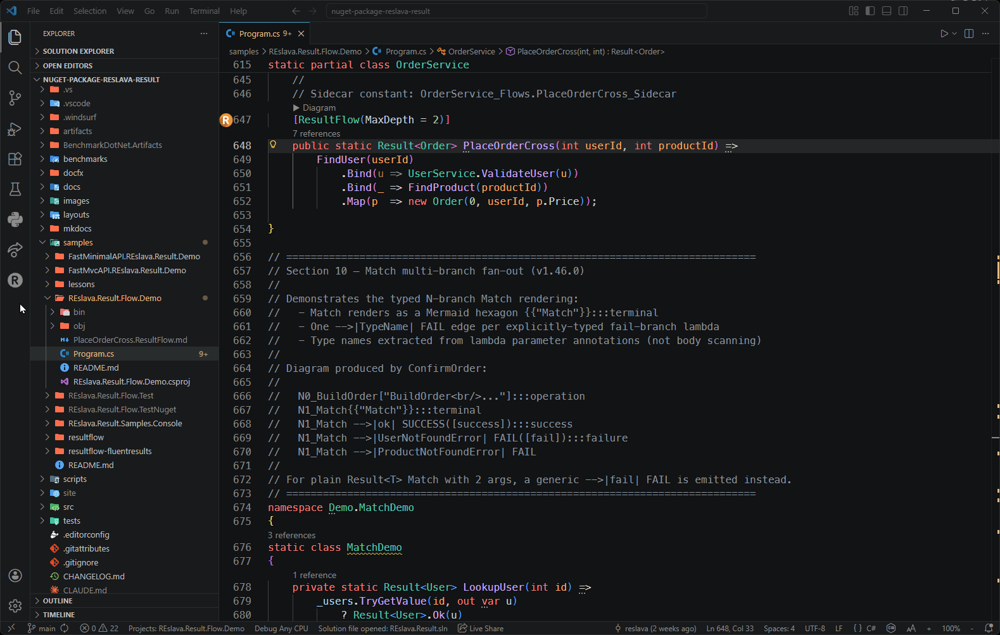
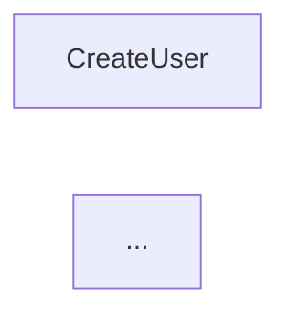
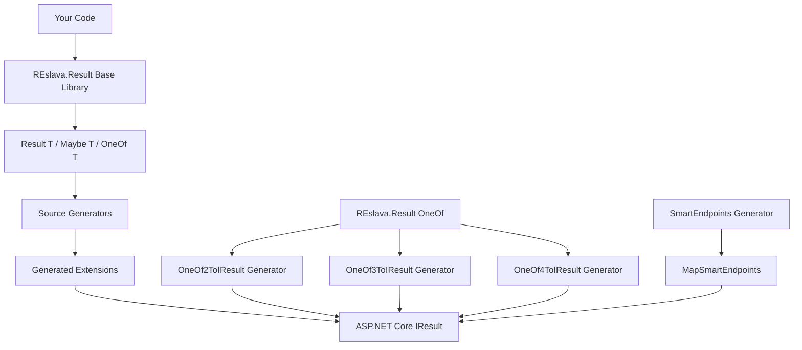

REslava.Result — Visual Result pipelines for .NET

<div align="center">
                  
[](https://reslava.github.io/nuget-package-reslava-result/)
[](https://reslava.github.io/nuget-package-reslava-result/reference/api/index.html)


[](LICENSE)
[](https://GitHub.com/reslava/REslava.Result/graphs/contributors/) 
[](https://github.com/reslava/REslava.Result/stargazers) 
[](https://www.nuget.org/packages/REslava.Result)


</div>

**Visual Result pipelines for .NET**

*Don't try to understand the pipeline—watch the flow.*

Build Railway-Oriented pipelines with strongly typed errors, automatically generated flow diagrams, and built-in runtime observation — **trace every node, debug visually.**

| | |
|---|---|
| ✏️ **Write** | Add `[ResultFlow]` — Mermaid diagram constants generated at compile time |
| ▶️ **Run** | Make your class `partial` — FlowProxy traces every node (output, type, elapsed ms) |
| 🐛 **Debug** | Drop a `reslava-*.json` — VS Code Debug Panel replays the trace on your live diagram |

**Why REslava.Result?**

> **The only .NET library that combines functional error handling with compile-time ASP.NET API generation and automatic pipeline visualization.**




*[`[ResultFlow]`](#3--resultflow--mermaid-diagrams-autogenerated) — add one attribute, get a live Mermaid diagram of your pipeline. Type travel, async markers, named error edges — generated from your code.*



**📖 [Full documentation](https://reslava.github.io/nuget-package-reslava-result/)** · API reference, advanced patterns, and interactive examples.

> **🧵 Loom** — While building this library I started keeping design and planning in persistent Markdown instead of disposable chats. That practice grew into **[Loom](https://github.com/reslava/loom)** — a visual environment where knowledge becomes artifacts, artifacts become context, and context drives implementation.

**⚡ Quick start — Pipeline Visualization**

Choose your track based on which Result library you use:

| | Track A | Track B |
|---|---|---|
| **Use when** | Using REslava.Result | Any other Result library — ErrorOr, LanguageExt, FluentResults, or custom |
| **Install** | `REslava.Result` + `REslava.Result.Flow` | `REslava.ResultFlow` |
| **Analysis** | Full semantic — typed error edges, type travel, FAIL annotation, body scanning | Syntax-only — library-agnostic, convention file |
| **Diagram constants** | `_Diagram` · `_TypeFlow` · `_LayerView` · `_Stats` · `_ErrorSurface` · `_ErrorPropagation` | `_Diagram` · `_TypeFlow` |

**Track A — REslava.Result users:**
```bash
dotnet add package REslava.Result
dotnet add package REslava.Result.Flow
```

**Track B — Any other Result library:**
```bash
dotnet add package REslava.ResultFlow
```

**VS Code extension (both tracks):** [REslava.Result Extensions](https://marketplace.visualstudio.com/items?itemName=reslava.reslava-result-extensions) — Flow Catalog sidebar + `▶ Open diagram preview` CodeLens.

---

**What REslava.Result gives you:**

| Pillar | Features |
|---|---|
| **Railway-oriented pipelines** | `Result<T>`, `Bind`, `Map`, `Ensure`, `Tap`, `Or`, `MapError` — sync + async |
| **Typed error pipelines** | `Result<T,TError>`, `ErrorsOf<T1..T8>` — compile-time error type safety |
| **Rich domain errors** | `ValidationError`, `ForbiddenError`, `NotFoundError`, `ConflictError`, `ExceptionError` + `TagKey<T>`, `DomainTags`, `SystemTags` |
| **Error metadata & context** | `ReasonMetadata` (caller info), `ResultContext` (entity / correlation / tenant / operation), auto-enrichment |
| **Pipeline visualization** | `[ResultFlow]` → auto-generated Mermaid diagrams from your code |
| **Framework integrations** | ASP.NET Core Smart Endpoints, FluentValidation, OpenTelemetry, HTTP client mapping |
| **Safety analyzers** | RESL10xx / RESL20xx Roslyn analyzers enforcing correct usage patterns |

| | REslava.Result | FluentResults | ErrorOr | LanguageExt |
|---|:---:|:---:|:---:|:---:|
| Result&lt;T&gt; pattern | ✅ | ✅ | ✅ | ✅ |
| ✨**Pipeline visualization (`[ResultFlow]`)** | **✅** | — | — | — |
| **OneOf** discriminated unions | ✅ (2-8 types) | — | — | ✅ |
| **Typed error pipelines** (`ErrorsOf` + `Result<T,TError>`) | **✅** | — | — | — |
| Maybe&lt;T&gt; | ✅ | — | — | ✅ |
| **ASP.NET source generators** (Minimal API + MVC) | **✅** | — | — | — |
| **SmartEndpoints** (zero-boilerplate APIs) | **✅** | — | — | — |
| **OpenAPI** metadata auto-generation | **✅** | — | — | — |
| Authorization & Policy support | **✅** | — | — | — |
| **Roslyn safety analyzers** | **✅** | — | — | — |
| **JSON serialization** (System.Text.Json) | **✅** | — | — | — |
| **Async patterns** (WhenAll, Retry, Timeout) | **✅** | — | — | — |
| **Domain error hierarchy** (NotFound, Validation, etc.) | **✅** | — | Partial | — |
| Validation framework | ✅ | Basic | — | ✅ |
| Zero dependencies | ✅ | ✅ | ✅ | — |
| **[`Ok` creation speed](https://reslava.github.io/nuget-package-reslava-result/reference/performance/)** | **5.9 ns / 48 B** | 57 ns / 112 B | — | — |
| **[Failure path vs exceptions](https://reslava.github.io/nuget-package-reslava-result/reference/performance/)** | **6.8× faster** | ~5.8× faster | — | — |

⚡ **[Performance benchmarks](https://reslava.github.io/nuget-package-reslava-result/reference/performance/)** — `Ok` creation **9.6× faster** than FluentResults · failure handling **6.8× faster** than exceptions · all measured on .NET 9 with BenchmarkDotNet.

**Unique advantage**: SmartEndpoints auto-generates complete Minimal API endpoints from your business logic — including routing, DI, HTTP status mapping, error handling, full OpenAPI metadata (`.Produces<T>()`, `.WithSummary()`, `.WithTags()`), and authorization (`.RequireAuthorization()`, `.AllowAnonymous()`). No other .NET library does this.

> 🎯 **Typed Error Pipelines — compile-time failure edges (v1.39.0)**
> Replace `IEnumerable<IError>` bags with exact, exhaustive error types. Each `Bind` step grows the error union one slot (`ErrorsOf<T1,T2,...>`). At the callsite, `Match` is exhaustive — the compiler tells you if you missed a case.
> [→ Typed Error Pipelines](#9--typed-error-pipelines)

> 🗺️ **See how your `Result<T>` / `Result<T, TError>` flows — before it runs.**
> One attribute. Zero runtime overhead. Instant Mermaid diagram of every success path, failure branch, and side effect. For `Result<T, TError>` pipelines, failure edges show the **exact error type** — reads directly from the return type, no body scanning.
> [→ [ResultFlow] Pipeline Visualization](#3--resultflow--mermaid-diagrams-autogenerated)

> 📚 **New to functional programming?** The [progressive tutorial series](samples/lessons/) teaches functional & railway-oriented programming step by step — 9 self-contained lessons from plain C# exceptions to async pipelines and ASP.NET, each a standalone `dotnet run`. Covers `REslava.Result`, `REslava.ResultFlow`, and `REslava.Result.AspNetCore`. YouTube video series — coming soon.

**Find by goal:**
[Build error-safe pipelines](#2-getting-started) ·
[Visualize my pipeline](#3--resultflow--mermaid-diagrams-autogenerated) ·
[Model domain errors](#5-️-error-types) ·
[Typed error pipelines (compile-time)](#9--typed-error-pipelines) ·
[Validate input](#6--validation-rules) ·
[Generate ASP.NET endpoints automatically](#10--smartendpoints) ·
[Enforce patterns with analyzers](#18-️-safety-analyzers) ·
[Integrate with OpenTelemetry](#431--opentelemetry-integration--withactivity)

---

## 1. 📚 Table of Contents

- [1. 📚 Table of Contents](#1--table-of-contents)
- [2. Getting Started](#2-getting-started)
  - [2.1. 📦 Installation](#21--installation)
    - [2.1.1. NuGet CLI](#211-nuget-cli)
    - [2.1.2. PackageReference (csproj)](#212-packagereference-csproj)
    - [2.1.3. Supported Frameworks](#213-supported-frameworks)
    - [2.1.4. Prerequisites](#214-prerequisites)
  - [2.2. 🚀 Quick Start](#22--quick-start)
  - [2.3. 🧪 Quick Start Scenarios](#23--quick-start-scenarios)
    - [2.3.1. Scenario 1: Functional Programming Foundation](#231-scenario-1-functional-programming-foundation)
    - [2.3.2. Scenario 2: ASP.NET Integration](#232-scenario-2-aspnet-integration)
    - [2.3.3. Scenario 3: OneOf Extensions (NEW!)](#233-scenario-3-oneof-extensions-new)
  - [2.4. 📚 Choose Your Path](#24--choose-your-path)
  - [2.5. 🎯 The Transformation: 70-90% Less Code](#25--the-transformation-70-90-less-code)
    - [2.5.1. ❌ BEFORE: Traditional Minimal API](#251--before-traditional-minimal-api)
    - [2.5.2. ✅ AFTER: REslava.Result Magic](#252--after-reslavaresult-magic)
- [3. 🧩 ResultFlow — Mermaid diagrams autogenerated](#3--resultflow--mermaid-diagrams-autogenerated)
  - [3.1. 🗺️ Pipeline Visualization — `[ResultFlow]`](#31-️-pipeline-visualization--resultflow)
  - [3.2. 📦 Installation — `REslava.Result.Flow`](#32--installation--reslavaresultflow)
  - [3.3. 🛠️ Code Action — Insert Diagram as Comment](#33-️-code-action--insert-diagram-as-comment)
  - [3.4. ⚙️ resultflow.json — Custom Classification](#34-️-resultflowjson--custom-classification)
  - [3.5. ⚡ Async Step Annotation](#35--async-step-annotation)
  - [3.6. 🏷️ Success Type Travel](#36-️-success-type-travel)
  - [3.7. 🌐 REslava.ResultFlow — Library-agnostic Alternative](#37--reslavaresultflow--library-agnostic-alternative)
    - [3.7.1. What REslava.ResultFlow does NOT have (compared to REslava.Result.Flow)](#371-what-reslavaresultflow-does-not-have-compared-to-reslavaresultflow)
  - [3.8. 🏷️ Error Type Annotation on Failure Edges (v1.40.0)](#38-️-error-type-annotation-on-failure-edges-v1400)
  - [3.9. 🔗 Clickable Mermaid Nodes — VS Code Navigation (v1.43.0)](#39--clickable-mermaid-nodes--vs-code-navigation-v1430)
  - [3.10. 📄 Sidecar Markdown Constant — Pipeline Docs Alongside Code (v1.43.0)](#310--sidecar-markdown-constant--pipeline-docs-alongside-code-v1430)
  - [3.11. 🗺️ Node Type Legend — `Legend` constant (v1.47.2)](#311-️-node-type-legend--legend-constant-v1472)
  - [3.12. 🔀 Cross-Method Pipeline Tracing — `MaxDepth` (v1.45.0)](#312--cross-method-pipeline-tracing--maxdepth-v1450)
  - [3.13. 🏛️ Domain Boundary Diagrams — `_LayerView`, `_Stats`, `_ErrorSurface`, `_ErrorPropagation` (v1.45.0)](#313-️-domain-boundary-diagrams--_layerview-_stats-_errorsurface-_errorpropagation-v1450)
  - [3.14. 🌙 Dark Theme Diagrams (v1.47.4)](#314--dark-theme-diagrams-v1474)
  - [3.15. 🔀 Match — Multi-Branch Fan-Out (v1.46.0)](#315--match--multi-branch-fan-out-v1460)
  - [3.16. 🖊️ CodeLens — Diagram Preview (v1.48.0)](#316-️-codelens--diagram-preview-v1480)
  - [3.17. 🎨 Solution-Wide Default Theme — `Directory.Build.props` (v1.48.0)](#317--solution-wide-default-theme--directorybuildprops-v1480)
  - [3.18. 🗂️ Pipeline Registry Generator (v1.50.0)](#318-️-pipeline-registry-generator-v1500)
  - [3.19. ⚡ Flow Catalog sidebar (VSIX v1.2.0)](#319--flow-catalog-sidebar-vsix-v120)
  - [3.20. ⊞ Single / Multiple Window Mode (VSIX v1.2.0)](#320--single--multiple-window-mode-vsix-v120)
  - [3.21. 🔑 Pipeline Identity — PipelineId, NodeId \& Namespace (v1.51.0)](#321--pipeline-identity--pipelineid-nodeid--namespace-v1510)
  - [3.22. 🔀 Type-Flow Diagram — `_TypeFlow` (v1.51.0)](#322--type-flow-diagram--_typeflow-v1510)
  - [3.23. 🏥 VSIX — Health Icon, Namespace Grouping \& Loading Indicator (v1.51.0)](#323--vsix--health-icon-namespace-grouping--loading-indicator-v1510)
  - [3.24. 🔴 FAIL Node Error Annotation (v1.51.0)](#324--fail-node-error-annotation-v1510)
  - [3.25. 🏥 VSIX v1.2.2 — Error Children, Layer Tabs, Revised Health \& Walkthrough (v1.51.0)](#325--vsix-v122--error-children-layer-tabs-revised-health--walkthrough-v1510)
  - [3.26. 📦 Two-Track Package Messaging + NuGet Dependency Fix (v1.51.0)](#326--two-track-package-messaging--nuget-dependency-fix-v1510)
  - [3.27. 🔬 Pipeline Runtime Observation — FlowProxy + RingBufferObserver (v1.52.0)](#327--pipeline-runtime-observation--flowproxy--ringbufferobserver-v1520)
  - [3.28. 🔀 FlowProxy — Always-On Tracing + Debug Mode (v1.53.0)](#328--flowproxy--always-on-tracing--debug-mode-v1530)
  - [3.29. 💾 Debug Panel — File-Drop Workflow + Multi-File Picker (v1.53.0)](#329--debug-panel--file-drop-workflow--multi-file-picker-v1530)
  - [3.30. 🔍 Error Taxonomy Map (v1.54.0)](#330--error-taxonomy-map-v1540)
  - [3.31. 🛠️ Debug Panel — nodeId Subchain Fix + VSIX v1.4.1 (v1.54.0)](#331-️-debug-panel--nodeid-subchain-fix--vsix-v141-v1540)
  - [3.32. 🤖 AI Pipeline Intelligence — GenerateTest \& ExplainFailure (vsix v1.5.0)](#332--ai-pipeline-intelligence--generatetest--explainfailure-vsix-v150)
- [4. 📐 REslava.Result Core Library](#4--reslavaresult-core-library)
  - [4.1. Core Operations](#41-core-operations)
    - [4.1.1. 💡 Why Result Instead of Exceptions?](#411--why-result-instead-of-exceptions)
    - [4.1.2. 🧠 Functional Programming Foundation](#412--functional-programming-foundation)
    - [4.1.3. 🔧 Complete Method Catalog](#413--complete-method-catalog)
      - [4.1.3.1. **Core Operations**](#4131-core-operations)
      - [4.1.3.2. **Functional Composition**](#4132-functional-composition)
      - [4.1.3.3. **Async Operations**](#4133-async-operations)
      - [4.1.3.4. **Async Patterns (WhenAll, Retry, Timeout)**](#4134-async-patterns-whenall-retry-timeout)
    - [4.1.4. 📊 LINQ Integration](#414--linq-integration)
    - [4.1.5. 🎯 Advanced Patterns](#415--advanced-patterns)
      - [4.1.5.1. **Maybe - Null-Safe Optionals**](#4151-maybe---null-safe-optionals)
      - [4.1.5.2. **OneOf - Discriminated Unions**](#4152-oneof---discriminated-unions)
      - [4.1.5.3. **Validation Rules Framework**](#4153-validation-rules-framework)
      - [4.1.5.4. **JSON Serialization (System.Text.Json)**](#4154-json-serialization-systemtextjson)
    - [4.1.6. 🔧 CRTP Pattern \& Method Chaining](#416--crtp-pattern--method-chaining)
    - [4.1.7. 🔄 Advanced Extensions](#417--advanced-extensions)
    - [4.1.8. 🚫 Tap on Failure — `TapOnFailure`](#418--tap-on-failure--taponfailure)
    - [4.1.9. 🔀 Conditional Factories — `OkIf` / `FailIf`](#419--conditional-factories--okif--failif)
  - [4.2. Async Patterns](#42-async-patterns)
    - [4.2.1. 🛡️ Exception Wrapping — `Try` / `TryAsync`](#421-️-exception-wrapping--try--tryasync)
    - [4.2.2. ⏳ CancellationToken Support](#422--cancellationtoken-support)
    - [4.2.3. 🪤 Inline Exception Handling — `Catch<TException>` / `CatchAsync<TException>`](#423--inline-exception-handling--catchtexception--catchasynctexception)
  - [4.3. Extensions](#43-extensions)
    - [4.3.1. 📡 OpenTelemetry Integration — `WithActivity`](#431--opentelemetry-integration--withactivity)
    - [4.3.2. 📝 Structured Logging — `WithLogger` / `LogOnFailure`](#432--structured-logging--withlogger--logonfailure)
    - [4.3.3. 🔄 Railway Recovery — `Recover` / `RecoverAsync`](#433--railway-recovery--recover--recoverasync)
    - [4.3.4. 🔍 Predicate Filtering — `Filter` / `FilterAsync`](#434--predicate-filtering--filter--filterasync)
    - [4.3.5. 🔀 Void Dispatch — `Switch` / `SwitchAsync`](#435--void-dispatch--switch--switchasync)
    - [4.3.6. 🗺️ Error Path Transform — `MapError` / `MapErrorAsync`](#436-️-error-path-transform--maperror--maperrorasync)
    - [4.3.7. 🔄 Fallback on Failure — `Or` / `OrElse` / `OrElseAsync`](#437--fallback-on-failure--or--orelse--orelseasync)
  - [4.4. Advanced](#44-advanced)
    - [4.4.1. ✅ Applicative Validation — `Result.Validate`](#441--applicative-validation--resultvalidate)
    - [4.4.2. 🔓 Tuple Unpacking — `Result<T>.Deconstruct`](#442--tuple-unpacking--resulttdeconstruct)
    - [4.4.3. 🔁 `Maybe<T>` ↔ `Result<T>` Interop](#443--maybet--resultt-interop)
    - [4.4.4. ✅ Best Practices](#444--best-practices)
    - [4.4.5. 🎯 When to Use Each Pattern](#445--when-to-use-each-pattern)
    - [4.4.6. 🔄 Functional Composition](#446--functional-composition)
    - [4.4.7. 🚀 Performance Patterns](#447--performance-patterns)
- [5. ⚠️ Error Types](#5-️-error-types)
  - [5.1. Error Hierarchy](#51-error-hierarchy)
  - [5.2. Domain Errors](#52-domain-errors)
  - [5.3. Generic Errors](#53-generic-errors)
  - [5.4. Custom Error Types](#54-custom-error-types)
  - [5.5. Rich Error Context — Tags \& Fluent Chaining](#55-rich-error-context--tags--fluent-chaining)
  - [5.6. `Success` — Success Reasons](#56-success--success-reasons)
  - [5.7. ReasonMetadata — Structured Diagnostic Metadata (v1.40.0)](#57-reasonmetadata--structured-diagnostic-metadata-v1400)
  - [5.8. Typed Tags — `TagKey<T>`, `DomainTags`, `SystemTags` (v1.41.0)](#58-typed-tags--tagkeyt-domaintags-systemtags-v1410)
    - [5.8.1. Predefined keys](#581-predefined-keys)
    - [5.8.2. Reading tags — `TryGet<T>` / `Has<T>`](#582-reading-tags--trygett--hast)
    - [5.8.3. Writing custom tags](#583-writing-custom-tags)
    - [5.8.4. `IErrorFactory<TSelf>` — generic error construction (v1.41.0)](#584-ierrorfactorytself--generic-error-construction-v1410)
- [6. ✅ Validation Rules](#6--validation-rules)
  - [6.1. Basic Usage](#61-basic-usage)
  - [6.2. All Failures Collected](#62-all-failures-collected)
  - [6.3. Pipeline Composition](#63-pipeline-composition)
  - [6.4. Custom Validators](#64-custom-validators)
  - [6.5. Native Validation DSL](#65-native-validation-dsl)
  - [6.6. 🏷️ Validation Attributes](#66-️-validation-attributes)
    - [6.6.1. Quick Setup](#661-quick-setup)
    - [6.6.2. Generated Extension Method](#662-generated-extension-method)
    - [6.6.3. Pipeline Integration](#663-pipeline-integration)
    - [6.6.4. Supported Annotations](#664-supported-annotations)
    - [6.6.5. Error Details](#665-error-details)
- [7. 🎲 Maybe](#7--maybe)
  - [7.1. Operations](#71-operations)
  - [7.2. When to Use `Maybe<T>`](#72-when-to-use-maybet)
- [8. 🔀 OneOf Unions](#8--oneof-unions)
  - [8.1. Arities: 2, 3, 4, 5, 6, 7, 8](#81-arities-2-3-4-5-6-7-8)
  - [8.2. Convert to `Result<T>` or `IResult`](#82-convert-to-resultt-or-iresult)
  - [8.3. When to Use `OneOf<...>` vs `Result<T>`](#83-when-to-use-oneof-vs-resultt)
- [9. 🎯 Typed Error Pipelines](#9--typed-error-pipelines)
  - [9.1. `ErrorsOf<T1..T8>` — Typed Error Union (v1.39.0)](#91-errorsoft1t8--typed-error-union-v1390)
  - [9.2. `Result<TValue, TError>` — Factory and Accessors (v1.39.0)](#92-resulttvalue-terror--factory-and-accessors-v1390)
  - [9.3. Full Pipeline Walkthrough (v1.39.0)](#93-full-pipeline-walkthrough-v1390)
  - [9.4. Operations Table (v1.39.0)](#94-operations-table-v1390)
  - [9.5. `Ensure` — Guard with Union Widening (v1.39.0)](#95-ensure--guard-with-union-widening-v1390)
  - [9.6. `MapError` — Layer-Boundary Translation (v1.39.0)](#96-maperror--layer-boundary-translation-v1390)
  - [9.7. `Result.Flow` — Type-Read Mode (v1.39.0)](#97-resultflow--type-read-mode-v1390)
- [10. 🚀 SmartEndpoints](#10--smartendpoints)
  - [10.1. Setup](#101-setup)
    - [10.1.1. `[AutoGenerateEndpoints]` — Class-Level Attribute](#1011-autogenerateendpoints--class-level-attribute)
    - [10.1.2. `[AutoMapEndpoint]` — Method-Level Override](#1012-automapendpoint--method-level-override)
    - [10.1.3. HTTP Verb Convention](#1013-http-verb-convention)
    - [10.1.4. Mapping Strategy](#1014-mapping-strategy)
  - [10.2. Features](#102-features)
    - [10.2.1. OpenAPI Auto-Generation](#1021-openapi-auto-generation)
    - [10.2.2. Authorization](#1022-authorization)
    - [10.2.3. Endpoint Filters — `[SmartFilter]`](#1023-endpoint-filters--smartfilter)
    - [10.2.4. Output Caching \& Rate Limiting](#1024-output-caching--rate-limiting)
    - [10.2.5. Attribute Precedence Cheat Sheet](#1025-attribute-precedence-cheat-sheet)
    - [10.2.6. Auto-Validation](#1026-auto-validation)
  - [10.3. Advanced Usage](#103-advanced-usage)
    - [10.3.1. CancellationToken Support](#1031-cancellationtoken-support)
    - [10.3.2. FluentValidation Bridge](#1032-fluentvalidation-bridge)
  - [10.4. 🔀 OneOf to IResult](#104--oneof-to-iresult)
    - [10.4.1. `OneOf<T1,T2>.ToIResult()`](#1041-oneoft1t2toiresult)
    - [10.4.2. `OneOf<T1,T2,T3>.ToIResult()`](#1042-oneoft1t2t3toiresult)
    - [10.4.3. `OneOf<T1,T2,T3,T4>.ToIResult()`](#1043-oneoft1t2t3t4toiresult)
    - [10.4.4. HTTP Method Variants](#1044-http-method-variants)
    - [10.4.5. Error → HTTP Status Mapping](#1045-error--http-status-mapping)
- [11. 🚀 ASP.NET Integration](#11--aspnet-integration)
  - [11.1. 🌐 ResultToIResult Extensions](#111--resulttoiresult-extensions)
  - [11.2. 🧠 Smart HTTP Mapping](#112--smart-http-mapping)
  - [11.3. 🎯 ResultToActionResult Extensions (MVC Support — v1.21.0)](#113--resulttoactionresult-extensions-mvc-support--v1210)
  - [11.4. 🎯 OneOfToActionResult Extensions (MVC OneOf Support — v1.22.0)](#114--oneoftoactionresult-extensions-mvc-oneof-support--v1220)
  - [11.5. 📝 Problem Details Integration](#115--problem-details-integration)
  - [11.6. 🌐 Http Client — REslava.Result.Http](#116--http-client--reslavaresulthttp)
    - [11.6.1. `GetResult<T>` — Type-safe GET](#1161-getresultt--type-safe-get)
    - [11.6.2. `PostResult<TBody, TResponse>` — Type-safe POST](#1162-postresulttbody-tresponse--type-safe-post)
    - [11.6.3. `PutResult<TBody, TResponse>` — Type-safe PUT](#1163-putresulttbody-tresponse--type-safe-put)
    - [11.6.4. `DeleteResult` — Type-safe DELETE (no body)](#1164-deleteresult--type-safe-delete-no-body)
    - [11.6.5. `DeleteResult<T>` — Type-safe DELETE (with response body)](#1165-deleteresultt--type-safe-delete-with-response-body)
    - [11.6.6. `HttpResultOptions` — Custom JSON \& Error Mapping](#1166-httpresultoptions--custom-json--error-mapping)
    - [11.6.7. Status Code → Error Mapping (defaults)](#1167-status-code--error-mapping-defaults)
- [12. 📐 Complete Architecture](#12--complete-architecture)
  - [12.1. 📦 Base Library: REslava.Result](#121--base-library-reslavaresult)
  - [12.2. 🚀 Source Generators: REslava.Result.AspNetCore](#122--source-generators-reslavaresultaspnetcore)
  - [12.3. 🎯 SOLID Principles in Action](#123--solid-principles-in-action)
  - [12.4. 🔄 How Components Work Together](#124--how-components-work-together)
  - [12.5. 🚀 Smart Auto-Detection (v1.10.0)](#125--smart-auto-detection-v1100)
  - [12.6. 🗺️ Error → HTTP Status Code Convention](#126-️-error--http-status-code-convention)
  - [12.7. 🔧 Source Generator Core Library Components](#127--source-generator-core-library-components)
- [13. 📦 Package Structure](#13--package-structure)
  - [13.1. 🚀 NuGet Package Contents](#131--nuget-package-contents)
  - [13.2. 🎯 Generated Output Structure](#132--generated-output-structure)
  - [13.3. 🔄 Build Integration](#133--build-integration)
- [14. 🔧 How Generators Work](#14--how-generators-work)
  - [14.1. Two-Phase Pipeline](#141-two-phase-pipeline)
  - [14.2. SOLID Design (v1.9.4+)](#142-solid-design-v194)
  - [14.3. Incremental Rebuilds](#143-incremental-rebuilds)
- [15. 📦 Sample Projects](#15--sample-projects)
- [16. 🎯 Quick Examples](#16--quick-examples)
  - [16.1. 📦 **Core Library - Type-Safe Error Handling**](#161--core-library---type-safe-error-handling)
  - [16.2. 🚀 **Source Generator - Zero Boilerplate**](#162--source-generator---zero-boilerplate)
  - [16.3. 🧠 **Advanced Patterns - Functional Programming**](#163--advanced-patterns---functional-programming)
- [17. 🧪 Testing \& Quality Assurance](#17--testing--quality-assurance)
  - [17.1. 📊 Comprehensive Test Suite](#171--comprehensive-test-suite)
  - [17.2. 📐 Source Generator Test Architecture](#172--source-generator-test-architecture)
  - [17.3. 🎯 Generator Test Coverage](#173--generator-test-coverage)
  - [17.4. 🚀 CI/CD Pipeline](#174--cicd-pipeline)
  - [17.5. 🧪 Test Categories](#175--test-categories)
  - [17.6. 📁 Sample Projects \& Integration Tests](#176--sample-projects--integration-tests)
  - [17.7. 🔍 Test Quality Metrics](#177--test-quality-metrics)
  - [17.8. 🏃‍♂️ Running Tests Locally](#178-️-running-tests-locally)
- [18. 🛡️ Safety Analyzers](#18-️-safety-analyzers)
  - [18.1. RESL1001 — Unsafe `.Value` Access `[Warning + Code Fix]`](#181-resl1001--unsafe-value-access-warning--code-fix)
  - [18.2. RESL1002 — Discarded `Result<T>` Return Value `[Warning]`](#182-resl1002--discarded-resultt-return-value-warning)
  - [18.3. RESL1003 — Prefer `Match()` Over If-Check `[Info]`](#183-resl1003--prefer-match-over-if-check-info)
  - [18.4. RESL1004 — `Task<Result<T>>` Not Awaited `[Warning + Code Fix]`](#184-resl1004--taskresultt-not-awaited-warning--code-fix)
  - [18.5. RESL2001 — Unsafe `OneOf.AsT*` Access `[Warning + Code Fix]`](#185-resl2001--unsafe-oneofast-access-warning--code-fix)
  - [18.6. RESL1005 — Consider Domain Error `[Info]`](#186-resl1005--consider-domain-error-info)
  - [18.7. RESL1006 — Conflicting `[Validate]` + `[FluentValidate]` `[Error]`](#187-resl1006--conflicting-validate--fluentvalidate-error)
  - [18.8. RESL1009 — Migrate `try/catch` to `Result<T>.Try` `[Info + Code Fix]`](#188-resl1009--migrate-trycatch-to-resultttry-info--code-fix)
  - [18.9. RESL1010 — Unhandled `Result<T>` Failure Path `[Warning]`](#189-resl1010--unhandled-resultt-failure-path-warning)
  - [18.10. RESL2002 — `ErrorsOf.Match()` Not Exhaustive `[Warning]`](#1810-resl2002--errorsofmatch-not-exhaustive-warning)
  - [18.11. RESL1021 — Multi-Argument `IError` Constructor `[Warning]`](#1811-resl1021--multi-argument-ierror-constructor-warning)
  - [18.12. RESL1030 — Domain Boundary Typed Error Crossing `[Warning]`](#1812-resl1030--domain-boundary-typed-error-crossing-warning)
- [19. 📈 Production Benefits](#19--production-benefits)
  - [19.1. 🌍 Real-World Impact](#191--real-world-impact)
    - [19.1.1. 🏢 **For Enterprise Teams**](#1911--for-enterprise-teams)
    - [19.1.2. 🧪 **For Test-Driven Development**](#1912--for-test-driven-development)
    - [19.1.3. 👥 **For Team Collaboration**](#1913--for-team-collaboration)
    - [19.1.4. 🚀 **For Performance \& Scalability**](#1914--for-performance--scalability)
  - [19.2. 🏆 Why Choose REslava.Result?](#192--why-choose-reslavaresult)
    - [19.2.1. ✅ **Zero Dependencies**](#1921--zero-dependencies)
    - [19.2.2. ✅ **Production-Ready**](#1922--production-ready)
    - [19.2.3. ✅ **Developer Experience**](#1923--developer-experience)
- [20. ⚡ Performance](#20--performance)
- [21. 🔗 ResultContext — Pipeline Context Propagation (v1.42.0)](#21--resultcontext--pipeline-context-propagation-v1420)
  - [21.1. Auto-seeding and `WithContext`](#211-auto-seeding-and-withcontext)
  - [21.2. Parent-wins propagation](#212-parent-wins-propagation)
  - [21.3. Error auto-enrichment (non-overwriting)](#213-error-auto-enrichment-non-overwriting)
  - [21.4. Non-generic `Result`](#214-non-generic-result)
  - [21.5. Typed pipelines (`Result<T,TError>`)](#215-typed-pipelines-resulttterror)
- [22. 📡 OpenTelemetry Integration — `REslava.Result.OpenTelemetry` (v1.42.0)](#22--opentelemetry-integration--reslavaresultopentelemetry-v1420)
  - [22.1. `.WithOpenTelemetry()` — seed context from active span](#221-withopentelemetry--seed-context-from-active-span)
  - [22.2. `.WriteErrorTagsToSpan()` — write error tags to active span](#222-writeerrortagstospan--write-error-tags-to-active-span)
  - [22.3. End-to-end example](#223-end-to-end-example)
- [23. 🎯 Roadmap](#23--roadmap)
  - [23.1. v1.54.0 — VSIX v1.5.0 only (Current) ✅](#231-v1540--vsix-v150-only-current-)
  - [23.2. v1.54.0 ✅](#232-v1540-)
  - [23.3. v1.53.0 ✅](#233-v1530-)
  - [23.4. v1.52.0 ✅](#234-v1520-)
  - [23.5. v1.51.0 ✅](#235-v1510-)
  - [23.6. v1.50.1 ✅](#236-v1501-)
  - [23.7. v1.50.0 ✅](#237-v1500-)
  - [23.8. v1.49.0 ✅](#238-v1490-)
  - [23.9. v1.48.0 ✅](#239-v1480-)
  - [23.10. v1.47.5 ✅](#2310-v1475-)
  - [23.11. v1.47.4 ✅](#2311-v1474-)
  - [23.12. v1.47.3 ✅](#2312-v1473-)
  - [23.13. v1.47.2 ✅](#2313-v1472-)
  - [23.14. v1.47.1 ✅](#2314-v1471-)
  - [23.15. v1.47.0 ✅](#2315-v1470-)
  - [23.16. v1.46.3 ✅](#2316-v1463-)
  - [23.17. v1.46.2 ✅](#2317-v1462-)
  - [23.18. v1.46.1 ✅](#2318-v1461-)
  - [23.19. v1.46.0 ✅](#2319-v1460-)
  - [23.20. v1.45.0 ✅](#2320-v1450-)
  - [23.21. v1.44.1 ✅](#2321-v1441-)
  - [23.22. v1.44.0 ✅](#2322-v1440-)
  - [23.23. v1.43.0 ✅](#2323-v1430-)
  - [23.24. v1.42.0 ✅](#2324-v1420-)
  - [23.25. v1.41.0 ✅](#2325-v1410-)
  - [23.26. v1.40.0 ✅](#2326-v1400-)
  - [23.27. v1.39.1 ✅](#2327-v1391-)
  - [23.28. v1.39.0 ✅](#2328-v1390-)
  - [23.29. v1.38.1 ✅](#2329-v1381-)
  - [23.30. v1.38.0 ✅](#2330-v1380-)
  - [23.31. v1.37.0 ✅](#2331-v1370-)
  - [23.32. v1.36.0 ✅](#2332-v1360-)
  - [23.33. v1.35.0 ✅](#2333-v1350-)
  - [23.34. v1.34.0 ✅](#2334-v1340-)
  - [23.35. v1.33.0 ✅](#2335-v1330-)
  - [23.36. v1.32.0 ✅](#2336-v1320-)
  - [23.37. v1.31.0 ✅](#2337-v1310-)
  - [23.38. v1.30.0 ✅](#2338-v1300-)
  - [23.39. v1.29.0 ✅](#2339-v1290-)
  - [23.40. v1.28.0 ✅](#2340-v1280-)
  - [23.41. v1.27.0 ✅](#2341-v1270-)
  - [23.42. v1.26.0 ✅](#2342-v1260-)
  - [23.43. v1.25.0 ✅](#2343-v1250-)
  - [23.44. v1.24.0 ✅](#2344-v1240-)
  - [23.45. v1.23.0 ✅](#2345-v1230-)
  - [23.46. v1.22.0 ✅](#2346-v1220-)
  - [23.47. v1.21.0 ✅](#2347-v1210-)
  - [23.48. v1.20.0 ✅](#2348-v1200-)
  - [23.49. v1.19.0 ✅](#2349-v1190-)
  - [23.50. v1.18.0 ✅](#2350-v1180-)
  - [23.51. v1.17.0 ✅](#2351-v1170-)
  - [23.52. v1.16.0 ✅](#2352-v1160-)
  - [23.53. v1.15.0 ✅](#2353-v1150-)
  - [23.54. v1.14.x ✅](#2354-v114x-)
  - [23.55. v1.13.0 ✅](#2355-v1130-)
- [24. 📈 Version History](#24--version-history)
- [25. 🤝 Contributing](#25--contributing)
- [26. 📄 License](#26--license)
- [27. 🙏 Acknowledgments](#27--acknowledgments)
- [28. Contributors](#28-contributors)

---

## 2. Getting Started

### 2.1. 📦 Installation

#### 2.1.1. NuGet CLI

```bash
dotnet add package REslava.Result                      # Core library — Result<T>, errors, functional composition
dotnet add package REslava.Result.Analyzers            # Roslyn analyzers — catch unsafe .Value access at compile time

# ⚠️ OPTIONAL — only for ASP.NET Core projects.
# Source generators: SmartEndpoints, [Validate], OneOfToIResult.
dotnet add package REslava.Result.AspNetCore

# ⚠️ OPTIONAL — pipeline diagram generator (REslava.Result-native).
# Full type travel + typed error surface inference. Requires REslava.Result.
dotnet add package REslava.Result.Flow

# ⚠️ OPTIONAL — pipeline diagram generator (library-agnostic).
# Works with any Result library (ErrorOr, LanguageExt, etc.). No REslava.Result dependency.
dotnet add package REslava.ResultFlow

# ⚠️ OPTIONAL — HTTP client extensions. Only if you need typed Result<T> from HttpClient calls.
dotnet add package REslava.Result.Http

# ⚠️ OPTIONAL — migration bridge only. NOT needed for new projects.
# REslava.Result already includes full validation via [Validate] + Validation DSL.
# Only install if your team already uses FluentValidation and wants to keep existing validators.
dotnet add package REslava.Result.FluentValidation
```

#### 2.1.2. PackageReference (csproj)

> [!WARNING]
> **`REslava.Result.SourceGenerators` was renamed to `REslava.Result.AspNetCore`** in v1.36.0.
> Update your `PackageReference` directly — no compatibility shim is provided.

```xml
<ItemGroup>
  <PackageReference Include="REslava.Result" Version="1.54.0" />
  <PackageReference Include="REslava.Result.Analyzers" Version="1.54.0" />

  <!-- OPTIONAL — only for ASP.NET Core projects.
       Source generators: SmartEndpoints, [Validate], OneOfToIResult. -->
  <PackageReference Include="REslava.Result.AspNetCore" Version="1.54.0" />

  <!-- OPTIONAL — pipeline diagram generator (REslava.Result-native).
       Full type travel + typed error surface inference. Requires REslava.Result. -->
  <PackageReference Include="REslava.Result.Flow" Version="1.54.0" />

  <!-- OPTIONAL — pipeline diagram generator (library-agnostic).
       Works with any Result library (ErrorOr, LanguageExt, etc.). No REslava.Result dependency. -->
  <PackageReference Include="REslava.ResultFlow" Version="1.54.0" />

  <!-- OPTIONAL — HTTP client extensions: wrap HttpClient calls as typed Result<T> -->
  <PackageReference Include="REslava.Result.Http" Version="1.54.0" />

  <!-- OPTIONAL — OpenTelemetry integration. Seeds ResultContext from the active span and
       writes error tags as span attributes on failure. Zero-cost when no active span. -->
  <PackageReference Include="REslava.Result.OpenTelemetry" Version="1.54.0" />

  <!-- OPTIONAL — Debug panel (v1.52.0+). Exposes RingBufferObserver via HTTP so the
       REslava.Result Extensions VSIX can display History / Single / Step / Replay modes.
       Use PipelineTraceHost.Start(buffer) or app.MapResultFlowTraces(buffer). -->
  <PackageReference Include="REslava.Result.Diagnostics" Version="1.54.0" />

  <!--
    OPTIONAL — migration bridge. NOT needed for new projects.
    REslava.Result already includes equivalent validation via [Validate] + Validation DSL.
    Only add this if your team has existing FluentValidation validators you want to keep.
  -->
  <PackageReference Include="REslava.Result.FluentValidation" Version="1.54.0" />
</ItemGroup>
```

#### 2.1.3. Supported Frameworks

| Package | Target Frameworks | Notes |
|---------|------------------|-------|
| `REslava.Result` | .NET 8, .NET 9, .NET 10 | Core library |
| `REslava.Result.Analyzers` | .NET Standard 2.0 | |
| `REslava.Result.AspNetCore` ⚠️ **Optional** | .NET Standard 2.0 (generates code for any TFM) | ASP.NET Core only |
| `REslava.Result.Flow` ⚠️ **Optional** | .NET Standard 2.0 (generator-only, no runtime) | Requires REslava.Result |
| `REslava.ResultFlow` ⚠️ **Optional** | .NET Standard 2.0 (generator-only, no runtime) | Library-agnostic |
| `REslava.Result.Http` ⚠️ **Optional** | .NET 8, .NET 9, .NET 10 | |
| `REslava.Result.FluentValidation` ⚠️ **Optional** | .NET Standard 2.0 (generator-only, no runtime) | Migration bridge only |

#### 2.1.4. Prerequisites

- **.NET 8 SDK or later** — required for the core library
- **C# 12 or later** — recommended (required for some generator patterns)
- **Visual Studio 2022 17.8+**, **VS Code with C# Dev Kit**, or **JetBrains Rider**

---

### 2.2. 🚀 Quick Start

See [📦 Installation](#-installation) for NuGet setup.

Decorate a controller class — the source generator builds complete Minimal API endpoints automatically:

```csharp
[AutoGenerateEndpoints(RoutePrefix = "/api/users")]
public class UserController
{
    private readonly UserService _service;
    public UserController(UserService service) => _service = service;

    public async Task<OneOf<ValidationError, NotFoundError, User>>
        GetUser(int id) => await _service.GetUserByIdAsync(id);

    public async Task<OneOf<ValidationError, ConflictError, User>>
        CreateUser(CreateUserRequest request) => await _service.CreateAsync(request);

    public async Task<Result<List<User>>> GetUsers() => await _service.GetAllAsync();
}
```

**Generated automatically — zero manual code:**
- `GET /api/users/{id}` → 200 / 400 / 404 (HTTP status from `OneOf` error types)
- `POST /api/users` → 201 / 400 / 409
- `GET /api/users` → 200
- Full OpenAPI metadata — `.Produces<T>()`, `.WithSummary()`, `.WithTags()`, `.WithName()`

For complete feature documentation see [🚀 SmartEndpoints](#-smartendpoints), [🌐 ASP.NET Integration](#-aspnet-integration), and the sections below.

---

### 2.3. 🧪 Quick Start Scenarios

See [📦 Installation](#-installation) for NuGet setup.

#### 2.3.1. Scenario 1: Functional Programming Foundation
```csharp
using REslava.Result;

// Core Result pattern usage
public Result<User> GetUser(int id)
{
    if (id <= 0)
        return Result<User>.Fail("Invalid user ID");

    var user = FindUser(id);
    return user is null ? Result<User>.Fail($"User {id} not found") : Result<User>.Ok(user);
}

// Functional composition
public Result<UserDto> GetUserDto(int id) =>
    GetUser(id)
        .Map(ToDto)
        .Tap(LogAccess)
        .Ensure(dto => dto.IsActive, "User is inactive");

// LINQ integration
public Result<UserDto> GetUserDtoLinq(int id) =>
    from user in GetUser(id)
    from validation in ValidateUser(user)
    from dto in ToDto(user)
    select dto;
```

#### 2.3.2. Scenario 2: ASP.NET Integration
```csharp
[ApiController]
public class UsersController : ControllerBase
{
    // Automatic HTTP mapping
    [HttpGet("{id}")]
    public IResult GetUser(int id) => 
        GetUser(id).ToIResult(); // 200 OK or 404/400
    
    // POST with created response
    [HttpPost]
    public IResult CreateUser([FromBody] CreateUserRequest request) =>
        CreateUser(request).ToPostResult(); // 201 Created or 400
}
```

#### 2.3.3. Scenario 3: OneOf Extensions (NEW!)
```csharp
using REslava.Result;
using Generated.OneOfExtensions;

// REslava.Result internal OneOf with automatic mapping
public OneOf<ValidationError, NotFoundError, User> GetUser(int id)
{
    if (id <= 0)
        return new ValidationError("Invalid ID");

    var user = FindUser(id);
    if (user is null) return new NotFoundError($"User {id} not found");
    return user;
}

[HttpGet("{id}")]
public IResult GetUser(int id) => 
    GetUser(id).ToIResult(); // 400, 404, or 200
```

---

### 2.4. 📚 Choose Your Path

**Find exactly what you need based on your goals:**

| 🎯 **I'm building a...** | 📖 **Start Here** | 🚀 **What You'll Learn** |
|--------------------------|-------------------|---------------------------|
| **Web API** | [🌐 ASP.NET Integration](#-aspnet-integration) | Auto-conversion, error mapping, OneOf extensions |
| **Library/Service** | [📐 Core Library](#-reslavaresult-core-library) | Result pattern, validation, functional programming |
| **Custom Generator** | [⚙️ How Generators Work](#-how-generators-work) | Build your own source generators |
| **Advanced App** | [🧠 Advanced Patterns](#-advanced-patterns) | Maybe, OneOf, validation rules |
| **Testing** | [🧪 Testing & Quality](#-testing--quality-assurance) | 2,862+ tests, CI/CD, test strategies |
| **Curious About Magic** | [📐 Complete Architecture](#-complete-architecture) | How generators work, SOLID design |

---

### 2.5. 🎯 The Transformation: 70-90% Less Code

**See how REslava.Result eliminates boilerplate in real .NET 10 applications:**

#### 2.5.1. ❌ BEFORE: Traditional Minimal API
```csharp
// Manual error handling, validation, and HTTP responses
app.MapPost("/users", async (CreateUserRequest request, IUserService service) =>
{
    // Manual validation
    if (string.IsNullOrWhiteSpace(request.Email))
        return Results.BadRequest(new { error = "Email required" });
    
    if (!IsValidEmail(request.Email))
        return Results.BadRequest(new { error = "Invalid email" });
        
    // Manual duplicate checking
    if (await EmailExistsAsync(request.Email))
        return Results.Conflict(new { error = "Email already exists" });
        
    try
    {
        var user = await service.CreateUserAsync(request);
        return Results.Created($"/users/{user.Id}", user);
    }
    catch (ValidationException ex)
    {
        return Results.BadRequest(new { errors = ex.Errors });
    }
    catch (Exception ex)
    {
        return Results.Problem("Internal server error");
    }
});
```

#### 2.5.2. ✅ AFTER: REslava.Result Magic
```csharp
// Clean, declarative, type-safe - 3 lines instead of 25+
app.MapPost("/users", async (CreateUserRequest request) => 
    await CreateUser(request));

// Service layer handles everything elegantly
public async Task<Result<User>> CreateUser(CreateUserRequest request) =>
    await Result<CreateUserRequest>.Ok(request)
        .Ensure(r => !string.IsNullOrWhiteSpace(r.Email), "Email required")
        .Ensure(r => IsValidEmail(r.Email), "Invalid email format")
        .EnsureAsync(async r => !await EmailExistsAsync(r.Email), "Email already exists")
        .BindAsync(async r => await _userService.CreateUserAsync(r))
        .WithSuccess("User created successfully");
```

**🚀 Result: 70-90% less code, 100% type-safe, automatic HTTP responses, rich error context!**

---

## 3. 🧩 ResultFlow — Mermaid diagrams autogenerated

> **Which package?**
> Using **REslava.Result**? → install **`REslava.Result.Flow`** — richer diagrams with typed error edges, entry-point node, and full semantic type travel.
> Using **FluentResults**, **ErrorOr**, **LanguageExt**, or any other library? → install **`REslava.ResultFlow`** — library-agnostic, zero configuration for common methods.

### 3.1. 🗺️ Pipeline Visualization — `[ResultFlow]`

Annotate any fluent pipeline with `[ResultFlow]` and with **single-click code action** ResultFlow will insert a **Mermaid diagram comment** so you can visualize every success path, failure branch, and typed error edge — zero runtime overhead, zero maintenance.

```csharp
/*
```mermaid
flowchart LR
    N0_CreateUser["CreateUser<br/>User"]:::operation
    N0_CreateUser --> N1_EnsureAsync
    N1_EnsureAsync["EnsureAsync ⚡<br/>User"]:::gatekeeper
    N1_EnsureAsync -->|pass| N2_BindAsync
    N1_EnsureAsync -->|ValidationError| FAIL
    N2_BindAsync["BindAsync ⚡<br/>User"]:::transform
    N2_BindAsync -->|ok| N3_TapAsync
    N2_BindAsync -->|DatabaseError| FAIL
    N3_TapAsync["TapAsync ⚡<br/>User"]:::operation
    N3_TapAsync --> N4_MapAsync
    N4_MapAsync["MapAsync ⚡<br/>User → UserDto"]:::transform
    FAIL([fail]):::failure
    classDef gatekeeper fill:#e3e9fa,color:#3f5c9a
    classDef transform fill:#e3f0e8,color:#2f7a5c
    classDef failure fill:#f8e3e3,color:#b13e3e
    classDef operation fill:#e8f4f0,color:#1c7e6f
```*/
[ResultFlow]
public Task<Result<UserDto>> RegisterAsync(RegisterCommand cmd) =>
    CreateUser(cmd)
        .EnsureAsync(IsEmailValid, u => new ValidationError("email", "invalid"))
        .BindAsync(SaveUser)
        .TapAsync(SendWelcomeEmail)
        .MapAsync(ToUserDto);
```

Here you can see the resulting diagram:



Each operation is color-coded by semantic role: **lavender** = gatekeepers (Ensure), **mint** = transforms (Bind/Map), **teal** = entry-point / side effects (Tap), **soft pink** = failure paths. Named error types appear directly on failure edges.

### 3.2. 📦 Installation — `REslava.Result.Flow`

For **REslava.Result** projects — the recommended package with the richest diagram output:

```bash
dotnet add package REslava.Result.Flow
```

Add `using REslava.Result.Flow;` — the attribute is injected automatically by the generator, no separate assembly reference needed.

### 3.3. 🛠️ Code Action — Insert Diagram as Comment

 On every `[ResultFlow]` method with a detectable chain a **single-click code action** inserts the Mermaid diagram as a `/* ... */` block comment directly above the method — no build required:

```csharp
/*
```mermaid
flowchart LR
    N0_EnsureAsync["EnsureAsync"]:::gatekeeper
    N0_EnsureAsync -->|pass| N1_BindAsync
    ...
```*/
[ResultFlow]
public async Task<Result<UserDto>> RegisterAsync(RegisterCommand cmd) => ...
```

The `` ```mermaid `` fence renders the diagram inline in VS Code, GitHub, Rider, and other Markdown-aware IDEs — no external tool needed. This is done by the companion analyzer (REF002).

### 3.4. ⚙️ resultflow.json — Custom Classification

Add a `resultflow.json` AdditionalFile to classify custom or third-party methods. Config entries **override** the built-in dictionary.

```json
{
  "mappings": [
    {
      "bind":       ["Chain", "AndThen"],
      "map":        ["Transform"],
      "tap":        ["Log", "Audit"],
      "gatekeeper": ["Require"],
      "terminal":   ["Fold"]
    }
  ]
}
```

```xml
<ItemGroup>
  <AdditionalFiles Include="resultflow.json" />
</ItemGroup>
```

Supported keys: `bind`, `map`, `tap`, `tapOnFailure`, `gatekeeper`, `terminal`.

### 3.5. ⚡ Async Step Annotation

`*Async` methods are automatically annotated with a **⚡ suffix** in the diagram label — no configuration required.

```csharp
[ResultFlow]
public async Task<Result<UserDto>> RegisterAsync(RegisterCommand cmd) =>
    await CreateUser(cmd)
        .EnsureAsync(IsEmailValid, new InvalidEmailError())   // → "EnsureAsync ⚡"
        .BindAsync(SaveUser)                                   // → "BindAsync ⚡"
        .MapAsync(ToUserDto);                                  // → "MapAsync ⚡"
```

Sync methods keep their plain label; mixed pipelines mark only the async steps. Custom methods mapped via `resultflow.json` that end in `Async` inherit ⚡ automatically — no extra config needed.

### 3.6. 🏷️ Success Type Travel

`REslava.ResultFlow` infers the **success type `T`** at each pipeline step and renders it inline in the node label — zero configuration, works with **any** Result library (`Result<T>`, `ErrorOr<T>`, `Fin<T>`, or any `SomeWrapper<T>`).

```
Type-preserving step  →  "Bind ⚡<br/>User"
Type-changing step    →  "Map ⚡<br/>User → UserDto"
Non-generic return    →  "Bind"   ← current behavior, no regression
```

The type is extracted from the generic return type's first type argument using Roslyn's semantic model — no `IResultBase` check, no library-specific knowledge. Inference falls back gracefully to method-name-only when the type cannot be resolved.

### 3.7. 🌐 REslava.ResultFlow — Library-agnostic Alternative

For projects **not using REslava.Result**, **`REslava.ResultFlow`** works with any fluent Result library (ErrorOr, FluentResults, LanguageExt, or your own):

```bash
dotnet add package REslava.ResultFlow
```

Add `using REslava.ResultFlow;` — the attribute is injected automatically by the generator.

Built-in convention dictionary — zero configuration for the most popular methods:

| Library | Recognized methods |
|---|---|
| **REslava.Result** | `Ensure`, `Bind`, `Map`, `Tap`, `TapOnFailure`, `TapBoth`, `Match`, `WithSuccess` (+ Async) |
| **ErrorOr** | `Then`, `ThenAsync`, `Switch`, `SwitchAsync` |
| **LanguageExt** | `Filter`, `Do`, `DoAsync`, `DoLeft`, `DoLeftAsync` |
| **FluentResults** | `Bind`, `Map` |

Any unrecognized method renders as a generic operation node.

#### 3.7.1. What REslava.ResultFlow does NOT have (compared to REslava.Result.Flow)

For projects using **`REslava.Result`**, the companion package **`REslava.Result.Flow`** adds two capabilities not possible in the library-agnostic package:

- **Typed error edges** — scans each step's method body for `new XxxError(...)` constructions where `XxxError implements IError`; renders `-->|DatabaseError| FAIL` edges instead of generic fail arrows
- **IOperation chain walker** — uses Roslyn's semantic model at the `IInvocationOperation` level, which makes the pipeline entry-point call (e.g. `CreateUser()`) visible as its own node

```bash
dotnet add package REslava.Result.Flow
```

Add `using REslava.Result.Flow;` — the attribute type is injected automatically by the generator, no separate assembly reference needed.

```csharp
/*
```mermaid
flowchart LR
    N0_CreateUser["CreateUser<br/>User"]:::operation
    N0_CreateUser --> N1_EnsureAsync
    N1_EnsureAsync["EnsureAsync ⚡<br/>User"]:::gatekeeper
    N1_EnsureAsync -->|pass| N2_BindAsync
    N1_EnsureAsync -->|ValidationError| FAIL
    N2_BindAsync["BindAsync ⚡<br/>User"]:::transform
    N2_BindAsync -->|ok| N3_MapAsync
    N2_BindAsync -->|DatabaseError| FAIL
    N3_MapAsync["MapAsync ⚡<br/>User → UserDto"]:::transform
    FAIL([fail]):::failure
    classDef gatekeeper fill:#e3e9fa,color:#3f5c9a
    classDef transform fill:#e3f0e8,color:#2f7a5c
    classDef failure fill:#f8e3e3,color:#b13e3e
    classDef operation fill:#e8f4f0,color:#1c7e6f
```*/
[ResultFlow]
public Task<Result<UserDto>> RegisterAsync(RegisterCommand cmd) =>
    CreateUser(cmd)
        .EnsureAsync(IsEmailValid, u => new ValidationError("email", "invalid"))
        .BindAsync(SaveUser)
        .MapAsync(ToUserDto);
```

Paste the comment into [mermaid.live](https://mermaid.live) — `CreateUser` becomes the pipeline root, `ValidationError` and `DatabaseError` appear as typed failure edges on their respective steps.
Here you can see the resulting diagram:



**Error scanning is best-effort** — only scans methods in the same compilation; errors created but not returned may appear as false positives; helper methods are not recursively followed.

| | `REslava.ResultFlow` | `REslava.Result.Flow` |
|---|---|---|
| Works with any library | ✅ | ❌ REslava.Result only |
| ⚡ async annotation | ✅ | ✅ |
| Success type travel | ✅ (first generic arg) | ✅ (via IResultBase) |
| Typed error edges | ❌ | ✅ (IError body scan) |
| Entry-point call as node | ❌ | ✅ (IOperation walk) |

### 3.8. 🏷️ Error Type Annotation on Failure Edges (v1.40.0)

For body-scan pipelines (`Result<T>`), `REslava.ResultFlow` now annotates failure edges with the error type name when a step argument is a direct error constructor or static factory call.

```csharp
[ResultFlow]
public Result<Order> Process(CreateOrderCmd cmd) =>
    FindUser(cmd.UserId)
        .Ensure(u => u.IsActive,         new NotFoundError("User inactive"))
        .Bind(u => ReserveInventory(cmd, u))
        .Ensure(o => o.HasStock,         ConflictError.Duplicate<Product>("sku", cmd.Sku))
        .Map(o => ValidateAddress(o))
        .Ensure(o => o.AddressIsValid,   ValidationError.Field("Address", "Invalid"))
        .Bind(o => SaveOrder(o));
```

Generated Mermaid diagram — failure edges now show the error type:

```
flowchart LR
    N0_FindUser["FindUser"] -->|pass| N1_Ensure
    N1_Ensure["Ensure"] -->|pass| N2_ReserveInventory
    N1_Ensure -->|"fail: NotFoundError"| F1["Failure"]
    N2_ReserveInventory["ReserveInventory"] -->|ok| N3_Ensure
    N2_ReserveInventory -->|"fail"| F2["Failure"]
    N3_Ensure["Ensure"] -->|pass| N4_ValidateAddress
    N3_Ensure -->|"fail: ConflictError"| F3["Failure"]
    ...
```

For `Result<T, TError>` typed pipelines, the error type comes from the generic return type (semantic, exact) and always takes precedence over the syntactic extraction.

### 3.9. 🔗 Clickable Mermaid Nodes — VS Code Navigation (v1.43.0)

When `ResultFlowLinkMode` is set to `vscode`, each node in the generated diagram becomes a hyperlink that opens the exact source line in VS Code.

**Enable in your `.csproj`:**

```xml
<PropertyGroup>
  <ResultFlowLinkMode>vscode</ResultFlowLinkMode>
</PropertyGroup>
```

The generator embeds a `click` directive per node:

```
click N0_FindUser "vscode://file/C:/src/OrderService.cs:42" "Go to FindUser"
```

Clicking the node in the VS Code Mermaid preview (`Ctrl+Shift+V`) jumps directly to the method call in the source file.

**Supported modes:**

| `ResultFlowLinkMode` | Behaviour |
|---|---|
| _(unset / `none`)_ | No click directives — default, diagram unchanged |
| `vscode` | `vscode://file/{path}:{line}` URI — opens in VS Code |

> Nodes without a known source location (e.g. stubs created in-memory during tests) are silently skipped — no click directive is emitted for them.

Works in both `REslava.Result.Flow` (via MSBuild `build_property.ResultFlowLinkMode`) and `REslava.ResultFlow` (via `resultflow.json` `"linkMode"` key).

---

### 3.10. 📄 Sidecar Markdown Constant — Pipeline Docs Alongside Code (v1.43.0)

For every `[ResultFlow]`-decorated method, the generator now emits a second constant, `{MethodName}_Sidecar`, alongside the existing diagram constant. The sidecar wraps the Mermaid diagram in a fenced code block ready for GitHub rendering or VS Code preview.

```csharp
// Auto-generated alongside the diagram constant:
public const string RegisterAsync_Sidecar = @"
# Pipeline — RegisterAsync


```mermaid
flowchart LR
    N0_CreateUser[""CreateUser""]:::operation
    ...
```
";
```

**Write it to disk as a standalone `.md` file:**

```csharp
// One-liner in tests, tooling, or a post-build script:
File.WriteAllText("RegisterAsync.ResultFlow.md", OrderService_Flows.RegisterAsync_Sidecar);
```

The `.md` file renders immediately in VS Code (`Ctrl+Shift+V`) or on GitHub — no copy-paste into a Mermaid renderer required.

> The sidecar constant is always generated regardless of `ResultFlowLinkMode`. It contains the same diagram as the primary constant, wrapped in markdown.

---

### 3.11. 🗺️ Node Type Legend — `Legend` constant (v1.47.2)

One `Legend` constant is emitted per `*_Flows` class (not per method). It contains a compact Mermaid diagram showing all 9 node types — shapes, colors, and the entry-arrow symbol — in a single horizontal row:

```csharp
// Access at runtime:
Console.WriteLine(OrderService_Flows.Legend);
```

Paste into any Mermaid renderer to review the color and shape reference at a glance. The note also explains that Guard nodes show their condition as a hover tooltip.



---

### 3.12. 🔀 Cross-Method Pipeline Tracing — `MaxDepth` (v1.45.0)

When a `Bind` lambda delegates to another method in the same project, `[ResultFlow]` can **follow the call and expand it inline** as a Mermaid `subgraph` — giving you a single diagram that spans multiple methods.

```csharp
[ResultFlow(MaxDepth = 2)]
public Result<OrderDto> PlaceOrder(CreateOrderCmd cmd) =>
    CreateOrder(cmd)
        .Bind(o => ValidateOrder(o))   // ← ResultFlow traces into ValidateOrder
        .Map(ToDto);

// Same class — ResultFlow walks this body and nests it as a subgraph:
static Result<Order> ValidateOrder(Order o) =>
    Result<Order>.Ok(o)
        .Ensure(x => x.Id > 0,     new ValidationError("Id",    "Required"))
        .Ensure(x => x.Total > 0m, new ValidationError("Total", "Must be positive"));
```

Generated Mermaid — `ValidateOrder` is expanded as a named subgraph, connected to the outer pipeline with `-->|ok|`:

```
flowchart LR
    N0_CreateOrder["CreateOrder<br/>Order"]:::operation
    N0_CreateOrder -->|ok| sg_N1_ValidateOrder

    subgraph sg_N1_ValidateOrder["ValidateOrder"]
        ENTRY_N1_ValidateOrder[ ]:::entry
        ENTRY_N1_ValidateOrder[ ] ==> N1_ValidateOrder_0_Ensure
        N1_ValidateOrder_0_Ensure["Ensure<br/>Order"]:::gatekeeper
        N1_ValidateOrder_0_Ensure -->|pass| N1_ValidateOrder_1_Ensure
        N1_ValidateOrder_0_Ensure -->|"ValidationError"| FAIL
        N1_ValidateOrder_1_Ensure["Ensure<br/>Order"]:::gatekeeper
        N1_ValidateOrder_1_Ensure -->|"ValidationError"| FAIL
    end

    sg_N1_ValidateOrder -->|ok| N2_Map
    N2_Map["Map<br/>OrderDto"]:::transform
    FAIL([fail]):::failure
    classDef entry fill:none,stroke:none
```

**`MaxDepth`** controls how deep tracing follows nested calls. The default is `2`; set to `0` to disable cross-method expansion entirely.

| Value | Behaviour |
|---|---|
| `MaxDepth = 0` | No cross-method tracing — Bind nodes stay as leaf boxes |
| `MaxDepth = 1` | Only the first level of called methods is expanded |
| `MaxDepth = 2` _(default)_ | Two levels of nesting — covers most real-world pipelines |

> **Cycle guard** — mutual recursion terminates cleanly. If method A expands into method B which calls A again, the second visit is suppressed (the current call-stack path is tracked, not a global visited set — so the same method can expand in sibling branches).

> **Ambiguity guard** (`REslava.ResultFlow` only) — if two or more methods share the same name, cross-method tracing is skipped for that node to avoid false positives.

### 3.13. 🏛️ Domain Boundary Diagrams — `_LayerView`, `_Stats`, `_ErrorSurface`, `_ErrorPropagation` (v1.45.0)

Apply `[DomainBoundary("LayerName")]` to a class or method and `[ResultFlow]` generates four additional constants that expose the architectural picture of your pipeline.

```csharp
[DomainBoundary("Domain")]
static class UserService { ... }

[DomainBoundary("Application")]
static class OrderService
{
    [ResultFlow(MaxDepth = 2)]
    public static Result<Order> PlaceOrderCross(int userId, int productId) => ...
}
```

**`_Diagram` with cross-method tracing** — the full pipeline, sub-methods expanded as subgraphs:


**`_LayerView`** — architecture layers, color-coded by layer:


**`_ErrorPropagation`** — each error type grouped under the layer it originates from:



| Constant | Type | What it shows |
|---|---|---|
| `_Diagram` | `flowchart LR` | Full pipeline — type travel, typed error edges, cross-method subgraphs |
| `_LayerView` | `flowchart TD` | Architecture — Layer → Class → Method, color-coded subgraphs |
| `_ErrorSurface` | `flowchart LR` | Fail-edges only — the complete error surface at a glance |
| `_ErrorPropagation` | `flowchart TD` | Error types grouped by the layer they originate from |
| `_Stats` | Markdown table | Step count, async steps, error types, layers crossed, max depth |

`[DomainBoundary]` can be placed on a **class** (applies to all its methods) or on a **method** directly. Without the attribute, the generator falls back to namespace heuristics: `*.Domain.*` → Domain, `*.Application.*` → Application, `*.Infrastructure.*` → Infrastructure.

---

### 3.14. 🌙 Dark Theme Diagrams (v1.47.4)

Add `Theme = ResultFlowTheme.Dark` to any `[ResultFlow]` annotation to emit the full diagram set using a dark colour scheme — optimised for dark-mode editors, MkDocs slate, and presentation slides.

```csharp
[ResultFlow(MaxDepth = 2, Theme = ResultFlowTheme.Dark)]
public static Result<StockReservation> FulfillOrder(int productId, int quantity) =>
    FindProduct(productId)
        .Bind(p => WarehouseService.ReserveStock(p, quantity))
        .Map(p  => new StockReservation(p.Id, quantity, p.Price));
```

All five generated views (`_Pipeline`, `_LayerView`, `_Stats`, `_ErrorSurface`, `_ErrorPropagation`) use the dark palette. Light is the default — existing diagrams are unaffected.

| Light | Dark |
|---|---|
|  |  |
|  |  |

---

### 3.15. 🔀 Match — Multi-Branch Fan-Out (v1.46.0)

`Match` renders as a **decision hexagon** with explicit exits to both `SUCCESS` and `FAIL`. When `Match` is called with explicitly-typed lambda parameters, `REslava.Result.Flow` emits one typed fail edge per branch — all converging on the shared `FAIL` terminal.

```csharp
Result<Order, ErrorsOf<ValidationError, InventoryError, PaymentError>>
Checkout(CheckoutRequest request) =>
    Validate(request)
        .Bind(ReserveInventory)
        .Bind(ProcessPayment);

[ResultFlow]
public string PlaceOrder(CheckoutRequest req) =>
    Checkout(req).Match(
        (Order o)             => Confirm(o),
        (ValidationError v)   => Reject(v.Message),
        (InventoryError i)    => Retry(i),
        (PaymentError p)      => Decline(p));
```



The typed labels (`ValidationError`, `InventoryError`, `PaymentError`) are extracted from the explicit parameter type annotations in each lambda — no body scanning needed. For plain `Result<T>` with a 2-argument `Match`, a generic `-->|fail| FAIL` edge is emitted instead. `REslava.ResultFlow` (library-agnostic) emits the hexagon shape and generic 2-branch edges only.

---

### 3.16. 🖊️ CodeLens — Diagram Preview (v1.48.0)

Install **REslava.Result Extensions** from the VS Code Marketplace to get a `▶ Open diagram preview` CodeLens above every `[ResultFlow]`-annotated method — always visible, no cursor needed.

```
[ResultFlow(MaxDepth = 2)]
▶ Open diagram preview          ← click to open a dedicated diagram panel
public Result<Order> PlaceOrder(...)
```


*Upgraded to WebviewPanel renderer in v1.49.0 — bundled Mermaid v10.9.5, fully offline, no external dependencies.*

**Panel features (v1.49.0 / VSIX v1.1.0):**

- **Node-click navigation** — click any diagram node to jump to that exact line in your source (requires `ResultFlowLinkMode=vscode` — see [§3.9](#39--clickable-mermaid-nodes--vs-code-navigation-v1430))
- **Source** button — view and copy the raw Mermaid DSL
- **Legend** button — node colour guide and interaction hints
- **SVG / PNG** buttons — export the diagram to disk; PNG at 2× resolution for high-DPI screens
- Light and dark background follows your `ResultFlowDefaultTheme` MSBuild property

To enable node-click navigation, add to your `.csproj` or `Directory.Build.props`:

```xml
<PropertyGroup>
  <ResultFlowLinkMode>vscode</ResultFlowLinkMode>
</PropertyGroup>
```

**How it works — 4-step fallback chain:**

1. Looks for `*_Flows.g.cs` in the workspace → extracts the Mermaid constant → opens preview ✅
2. If the project hasn't been built yet: automatically runs the **Insert diagram as comment** code action (Roslyn must be warm) → extracts diagram from the inserted comment → opens preview ✅
3. If a `/* ```mermaid...``` */` comment already exists above the method: extracts it directly → opens preview ✅
4. Otherwise: shows an information message — *"Diagram not ready yet — try again in a moment"*

The VSIX is a **separate install** from the NuGet packages — install both independently:
- NuGet: `dotnet add package REslava.Result.Flow`
- VS Code Marketplace: [REslava.Result Extensions](https://marketplace.visualstudio.com/items?itemName=reslava.reslava-result-extensions)

> The VSIX does not ship inside the NuGet package. `Ctrl+.` lightbulb keeps the existing **Insert / Refresh diagram** actions (REF002) unchanged.

---

### 3.17. 🎨 Solution-Wide Default Theme — `Directory.Build.props` (v1.48.0)

Set a default diagram theme for the entire solution without touching individual `[ResultFlow]` attributes. Add to `Directory.Build.props` (or any `.csproj`):

```xml
<PropertyGroup>
  <ResultFlowDefaultTheme>Dark</ResultFlowDefaultTheme>
</PropertyGroup>
```

**Priority chain:**

```
[ResultFlow(Theme = Dark)]           ← method attribute — always wins
  ↑
<ResultFlowDefaultTheme>Dark</...>   ← Directory.Build.props / .csproj
  ↑
Light                                ← built-in default
```

Accepted values: `Light` (default), `Dark` (case-insensitive). Applies to both `REslava.Result.Flow` and `REslava.ResultFlow`.

---

### 3.18. 🗂️ Pipeline Registry Generator (v1.50.0)

Both `REslava.Result.Flow` and `REslava.ResultFlow` now emit an additional **always-on** generated file alongside the existing `*_Flows.g.cs`:

```
obj/Generated/.../OrderService_PipelineRegistry.g.cs
```

For every class that has at least one `[ResultFlow]` method, the generator produces a companion `{ClassName}_PipelineRegistry` partial class with two constants per method:

```csharp
// List of all pipeline method names in this class
public const string _Methods = "[\"PlaceOrder\",\"CancelOrder\"]";

// Rich metadata per method — parse with JsonSerializer.Deserialize
public const string PlaceOrder_Info = "{\"returnType\":\"Order\",\"nodeCount\":5,\"nodeKinds\":[\"Root\",\"Bind\",\"Gatekeeper\",\"Tap\",\"Terminal\"],\"errorTypes\":[\"ValidationError\",\"NotFoundError\"],\"hasDiagram\":true,\"sourceLine\":42}";
public const string CancelOrder_Info = "{\"returnType\":\"Result\",\"nodeCount\":3,\"nodeKinds\":[\"Root\",\"Gatekeeper\",\"Terminal\"],\"errorTypes\":[\"NotFoundError\"],\"hasDiagram\":true,\"sourceLine\":78}";
```

**Usage:**

```csharp
// Read all pipeline names
var methods = JsonSerializer.Deserialize<string[]>(OrderService_PipelineRegistry._Methods)!;

// Read metadata for a specific method
var info = JsonSerializer.Deserialize<JsonElement>(OrderService_PipelineRegistry.PlaceOrder_Info);
int nodeCount = info.GetProperty("nodeCount").GetInt32(); // 5
string returnType = info.GetProperty("returnType").GetString()!; // "Order"
```

**`_Info` JSON fields:**

| Field | Type | Description |
|---|---|---|
| `returnType` | `string` | Inner `T` from `Result<T>` / `Result<T,TError>` — `"void"` for non-generic |
| `nodeCount` | `int` | Number of rendered pipeline nodes |
| `nodeKinds` | `string[]` | Ordered node-kind names (`Root`, `Bind`, `Gatekeeper`, `Tap`, `Terminal`, …) |
| `errorTypes` | `string[]` | Distinct error type names extracted from the pipeline |
| `hasDiagram` | `bool` | `true` when a `*_Flows.g.cs` companion constant also exists |
| `sourceLine` | `int` | 1-based line number of the `[ResultFlow]` method declaration |

To disable registry generation for a specific project, add to its `.csproj`:

```xml
<PropertyGroup>
  <ResultFlowRegistry>false</ResultFlowRegistry>
</PropertyGroup>
```

---

### 3.19. ⚡ Flow Catalog sidebar (VSIX v1.2.0)

The **REslava.Result Extensions** VSIX v1.2.0 adds a dedicated activity bar panel — **⚡ Flow Catalog** — that lists every `[ResultFlow]` method across your entire workspace, grouped by project and class:

- **No need to navigate to a source file** — browse all pipelines from the sidebar
- **Project nodes** turn green when the project has been built (registry found), red when a build is needed
- **Method nodes** show `⚡` for async methods, return type, and node count as description
- **Hover a method** to see the full tooltip: return type, node count, node kinds, and error types
- **Click a method** to open its diagram preview instantly
- **Right-click a project** → **Build Project** runs `dotnet build --no-incremental` and auto-refreshes the tree
- **↺ button** in the panel header manually refreshes the full workspace scan
- **Stats bar** above the tree shows total projects · pipelines · nodes

The sidebar reads from `*_PipelineRegistry.g.cs` files in `obj/` — build your project at least once to populate it. Projects that haven't been built show a red icon and a "Needs build" tooltip.

---

### 3.20. ⊞ Single / Multiple Window Mode (VSIX v1.2.0)

Control whether pipeline diagram previews reuse one shared panel or open a new panel per method.

- **Single mode** (default) — clicking any pipeline replaces the content of one shared panel; the panel title updates to the current method
- **Multiple mode** — each method gets its own panel; panels are identified by `ClassName.MethodName`

Toggle with the **⊞** button in the sidebar toolbar or the **Single / Multi** button in the diagram panel toolbar. The choice persists across sessions via the `reslava.diagramWindowMode` VS Code setting:

```json
// .vscode/settings.json
{
  "reslava.diagramWindowMode": "single"   // or "multiple"
}
```

---

### 3.21. 🔑 Pipeline Identity — PipelineId, NodeId & Namespace (v1.51.0)

Each `[ResultFlow]` method's registry `_Info` now includes three additional fields that form a stable identity for runtime ↔ diagram correlation:

| Field | Example | Description |
|---|---|---|
| `pipelineId` | `"a1b2c3d4"` | Deterministic 8-hex-char hash of `(fullyQualifiedType, assembly, methodName, paramTypes)` — stable across builds |
| `nodeIds` | `["a1b2c3d4_3f9e","a1b2c3d4_7c12",…]` | Ordered array of node identity hashes; each = `ShortHash(pipelineId, type, method, params, index)` |
| `namespace` | `"MyApp.Services.Orders"` | Fully qualified namespace of the containing class |

```csharp
var info = JsonSerializer.Deserialize<JsonElement>(OrderService_PipelineRegistry.PlaceOrder_Info);
string pipelineId = info.GetProperty("pipelineId").GetString()!;   // "a1b2c3d4"
string ns         = info.GetProperty("namespace").GetString()!;     // "MyApp.Services.Orders"
string[] nodeIds  = info.GetProperty("nodeIds")
                        .EnumerateArray()
                        .Select(e => e.GetString()!)
                        .ToArray();
```

`pipelineId` is embedded in every Mermaid node ID generated by `ResultFlowMermaidRenderer` — enabling a direct link between a runtime `ReasonMetadata` and the corresponding diagram node without any source-file look-up.

---

### 3.22. 🔀 Type-Flow Diagram — `_TypeFlow` (v1.51.0)

Every `[ResultFlow]` method now generates a second Mermaid constant: `{MethodName}_TypeFlow`. It has the same nodes as the main diagram but labels every **success edge** with the `Result<T>` type flowing through it, making the static type journey visible at a glance.

```csharp
// _Diagram — structural view (default)
Console.WriteLine(Pipelines_Flows.PlaceOrder);
// → N0 -->|ok| N1 -->|ok| SUCCESS

// _TypeFlow — type travel view
Console.WriteLine(Pipelines_Flows.PlaceOrder_TypeFlow);
// → N0 -->|Result<User>| N1 -->|Result<Order>| SUCCESS
```

Useful for type-level documentation, design reviews, and IDE hover previews. The **VSIX sidebar Types button** swaps between `_Diagram` and `_TypeFlow` for any open pipeline panel; the button is disabled when `_TypeFlow` is absent.

---

### 3.23. 🏥 VSIX — Health Icon, Namespace Grouping & Loading Indicator (v1.51.0)

Three UX improvements to the **⚡ Flow Catalog** sidebar (VSIX v1.2.1+):

**Health icon** — each method node in the tree now shows a status badge derived from its registry `_Info`:

| Icon | Condition |
|---|---|
| ✅ | Has `[ResultFlow]` diagram + at least one declared error type |
| ⚠️ | Has `[ResultFlow]` diagram but no error types (errors inferred or absent) |
| ❌ | No diagram or registry missing |

**Namespace grouping** — classes are now grouped under intermediate namespace nodes (top two segments) between the project root and the class list, keeping large workspaces navigable.

**Loading indicator** — while `dotnet build` is running, the affected project node shows a spinning `$(loading~spin)` icon and "Building…" description; restores to the health/build-status icon on completion.

---

### 3.24. 🔴 FAIL Node Error Annotation (v1.51.0)

The `FAIL` node in generated Mermaid diagrams now displays the **actual error types** that can reach it — making failure surfaces visible without opening source.

**`errorTypes` depth-2 scan** — when collecting error types for `_Info` and the diagram, the generator now descends into directly-called methods up to depth 2. A delegate like `.Bind(o => ValidateOrder(o))` will scan `ValidateOrder`'s body for `new XxxError()` constructions. Unconditional and independent of `MaxDepth`.

**Inline label (1–3 errors)** — `Error` suffix stripped, newline-separated:
```
FAIL(["fail\nNotFound\nValidation"])
```

**Tooltip (4+ errors)** — ℹ️ prefix with hover text:
```
FAIL(["<span title='NotFound, Validation, Forbidden, Conflict'>ℹ️fail</span>"])
```

**`%% pipelineId:` comment** — `_Diagram` and `_TypeFlow` constants now emit `%% pipelineId: a1b2c3d4` immediately after `flowchart LR`, correlating each diagram to its registry `_Info` entry.

Both `REslava.Result.Flow` and `REslava.ResultFlow`.

---

### 3.25. 🏥 VSIX v1.2.2 — Error Children, Layer Tabs, Revised Health & Walkthrough (v1.51.0)

**Error children** — method nodes with declared `errorTypes` expand to show each error type as an amber `$(warning)` child node. Click a child to jump to that error class definition (workspace symbol search).

**Revised health icon semantics:**

| Icon | Condition |
|---|---|
| ✅ | `errorTypes.length > 0` |
| ⚠️ | `Bind`/`Gatekeeper` nodes present AND `errorTypes` empty |
| ⚪ | `Terminal`/`Map`/`Tap` only — no fail-able paths |
| ❌ | No diagram or registry missing |

**Layer diagram tabs** — the webview panel toolbar now includes `_LayerView`, `_Stats`, `_ErrorSurface`, and `_ErrorPropagation` tabs alongside `_Diagram` and `_TypeFlow`. Tabs not present in the generated file are hidden.

**First-run walkthrough** — a VS Code walkthrough guides new users through installing a NuGet package, adding `[ResultFlow]`, and opening their first diagram.

**Missing package detection** — on activate, the extension scans workspace `.csproj` files. If no ResultFlow package is found, a notification offers "Install Track A", "Install Track B", and "See Demo" buttons. Single-project workspaces auto-detect the project path; multi-project workspaces show a Quick Pick.

**Empty-state tree item** — when the sidebar tree has no pipelines after a full scan, an info item is shown with install instructions and a link to the [REslava.Result.Flow.Demo](https://github.com/reslava/nuget-package-reslava-result/tree/main/samples/REslava.Result.Flow.Demo).

---

### 3.26. 📦 Two-Track Package Messaging + NuGet Dependency Fix (v1.51.0)

**Two-track install table** — `README.md`, all three ResultFlow NuGet READMEs, and the VSIX README now present a clear Track A / Track B choice:

| | Track A | Track B |
|---|---|---|
| **Use when** | Using REslava.Result | Any other Result library (ErrorOr, LanguageExt, FluentResults, custom) |
| **Install** | `REslava.Result` + `REslava.Result.Flow` | `REslava.ResultFlow` |
| **Analysis** | Full semantic — typed error edges, type travel, FAIL annotation | Syntax-only — library-agnostic, convention file |
| **Diagram constants** | `_Diagram` · `_TypeFlow` · `_LayerView` · `_Stats` · `_ErrorSurface` · `_ErrorPropagation` | `_Diagram` · `_TypeFlow` |

**NuGet transitive dependency fix** — `REslava.Result.Flow`, `REslava.Result.Analyzers`, and `REslava.Result.AspNetCore` now correctly declare `REslava.Result` as a NuGet transitive dependency in their `.nuspec`. Previously, `SuppressDependenciesWhenPacking=true` blocked the dep from appearing; installing these packages did not automatically bring in `REslava.Result`. Stale `REslava.Result.SourceGenerators.Core` v1.9.0 reference also removed from `REslava.Result.AspNetCore`.

---

### 3.27. 🔬 Pipeline Runtime Observation — FlowProxy + RingBufferObserver (v1.52.0)

Make your class `partial` and the generator emits a **FlowProxy** — always-on tracing via `svc.Flow.Process()` and single-trace debug via `svc.Flow.Debug.Process()`. Per-node output values, error types, and elapsed milliseconds for every execution.

**Always-on tracing (multiple calls, full ring buffer):**

```csharp
using REslava.Result.Observers;

// Make the class partial — FlowProxy is generated automatically:
public partial class OrderService { ... }

var ringBuffer = new RingBufferObserver(capacity: 50);
PipelineObserver.Register(ringBuffer);

var result = svc.Flow.Process(userId, productId);  // wraps the real method

PipelineObserver.Unregister();
ringBuffer.Save();  // → reslava-traces.json in bin/ — VSIX Debug panel picks it up

foreach (var trace in ringBuffer.GetTraces())
{
    Console.WriteLine($"{trace.MethodName} → {(trace.IsSuccess ? "✓" : "✗ " + trace.ErrorType)}  ({trace.ElapsedMs}ms)");
    foreach (var node in trace.Nodes)
        Console.WriteLine($"  [{node.Index}] {node.NodeId,-8}: {node.OutputValue}  ({node.ElapsedMs}ms)");
}
```

**Single-trace debug (one call, one trace, auto-saved):**

```csharp
svc.Flow.Debug.Process(userId, productId);
// → reslava-debug-Process.json saved to bin/
// → VSIX file watcher fires → Debug panel opens automatically
```

The `DebugProxy` creates its own `RingBufferObserver(capacity: 1)`, captures exactly one execution, and calls `Save()` in the `finally` block — no manual setup required.

**`RingBufferObserver` API:**

```csharp
var obs = new RingBufferObserver(capacity: 100); // bounded; evicts oldest on overflow
PipelineObserver.Register(obs);
// ... run pipelines ...
var traces = obs.GetTraces();   // snapshot — safe to iterate while pipelines run
obs.Clear();                    // reset
obs.Save();                     // → reslava-traces.json (default, VSIX auto-loads)
obs.Save("my-run");             // → reslava-my-run.json
obs.Save("/abs/path/out.json"); // → exact path (not picked up by VSIX watcher)
```

**Scoped registration (test / per-request isolation):**

```csharp
using var _ = PipelineObserver.RegisterScoped(new RingBufferObserver());
// observer is automatically unregistered when the using block exits
```

**VSIX Debug panel — `▶ Debug` CodeLens (v1.53.0):**

The `REslava.Result Extensions` VS Code extension adds a `▶ Debug` CodeLens above every `.Flow.Debug.` call. Clicking it opens the **Debug panel** — trace list, node stepper, and animated replay with diagram node highlight.

The extension watches `**/reslava-*.json` and opens the panel automatically when any trace file appears. A **file picker** in the panel header lets you switch between `reslava-debug-Process.json`, `reslava-traces.json`, and any custom-named save without closing the panel.

**Advanced — HTTP endpoint (long-running / remote scenarios):**

For apps where file-drop isn't convenient, add [`REslava.Result.Diagnostics`](https://www.nuget.org/packages/REslava.Result.Diagnostics) to expose traces over HTTP:

```bash
dotnet add package REslava.Result.Diagnostics
```

For **console / worker apps:**

```csharp
using REslava.Result.Diagnostics;

var buffer = new RingBufferObserver();
PipelineObserver.Register(buffer);

using var host = PipelineTraceHost.Start(buffer, port: 5297);
// GET http://localhost:5297/reslava/traces  ← Debug panel polls here
```

For **ASP.NET Core apps:**

```csharp
app.MapResultFlowTraces(buffer);
// or, if you used PipelineObserver.Register above:
app.MapResultFlowTraces(); // auto-reads from PipelineObserver.Current
```

The default port (5297) matches the VSIX default. Change it via **VS Code Settings → `resultflow.tracePort`**.

### 3.28. 🔀 FlowProxy — Always-On Tracing + Debug Mode (v1.53.0)

Make your class `partial` and the generator emits a **FlowProxy** alongside the diagram constants — no manual observer wiring required.

```csharp
// 1. Add 'partial' to the class:
public partial class OrderService
{
    [ResultFlow]
    public Result<Order> Process(int userId, int productId) =>
        FindUser(userId)
            .Bind(_ => FindProduct(productId))
            .Map(p => new Order(userId, p.Id, p.Price));
}

// 2. Always-on tracing — wraps the real method, seeds exact pipelineId + nodeIds:
var ringBuffer = new RingBufferObserver(capacity: 50);
PipelineObserver.Register(ringBuffer);

var result = svc.Flow.Process(userId, productId);  // same signature as the real method

PipelineObserver.Unregister();
ringBuffer.Save();  // → reslava-traces.json — VSIX Debug panel auto-opens

// 3. Single-trace debug — one execution, auto-saved, no setup:
svc.Flow.Debug.Process(userId, productId);
// → reslava-debug-Process.json in bin/
// → VSIX file watcher fires → Debug panel opens with the trace
```

**Static class variant** — `Flow` is a static property on the class itself:

```csharp
public static partial class MathService
{
    [ResultFlow]
    public static Result<int> Triple(int i) => Result<int>.Ok(i).Map(x => x * 3);
}

MathService.Flow.Triple(5);         // always-on
MathService.Flow.Debug.Triple(5);   // debug → reslava-debug-Triple.json
```

**`REF004` diagnostic** — fires when a `[ResultFlow]` class is not `partial`. A one-click **code fix** adds `partial` to the class declaration — no need to type it manually.

### 3.29. 💾 Debug Panel — File-Drop Workflow + Multi-File Picker (v1.53.0)

`RingBufferObserver.Save()` persists traces as BOM-free JSON. The VSIX watches `**/reslava-*.json` and opens the Debug panel automatically — no HTTP server, no blocking call.

**`Save()` path rules:**

| Call | File written | VSIX picks up? |
|---|---|---|
| `buf.Save()` | `reslava-traces.json` in `bin/` | ✅ |
| `buf.Save("my-run")` | `reslava-my-run.json` in `bin/` | ✅ |
| `buf.Save("/abs/path/out.json")` | exact path (no prefix) | ❌ (escape hatch) |

Generated `DebugProxy` always saves to `reslava-debug-{methodName}.json` — one file per method, never collides with manual `Save()`.

**Multi-file picker** — when multiple `reslava-*.json` files exist, the Debug panel header shows a file picker. Labels strip the `reslava-` prefix (`traces.json`, `debug-Process.json`, `debug-Validate.json`). Switch between traces without closing the panel.

**Source badge** — small badge in the panel header shows where data came from: `⏳ waiting` → `📄 file · {dir}` when file data arrives, `🌐 http` when the HTTP endpoint responds first.

---

### 3.30. 🔍 Error Taxonomy Map (v1.54.0)

Both `REslava.Result.Flow` and `REslava.ResultFlow` now emit a `_ErrorTaxonomy` constant alongside the pipeline diagram constants. It is a markdown table of every detectable error type per method, generated at compile time — no runtime cost, no extra tooling.

**Activation** — automatic for any class that has at least one `[ResultFlow]` method. No attribute needed.

**Two confidence levels:**

| Source | Confidence | How detected |
|---|---|---|
| `Result<T, TError>` return type | `certain` | Generic type argument — exact, from symbol |
| `Fail(new XxxError(...))` in method body | `inferred` | Object creation in body scan |
| `Ensure(..., new XxxError(...))` in method body | `inferred` | Object creation in body scan |

```csharp
public partial class OrderService
{
    [ResultFlow]
    public Result<Order, NotFoundError> GetOrder(int id) => ...;

    [ResultFlow]
    public Result<Order> PlaceOrder(OrderRequest req) =>
        Result<Order>.Ok(new Order())
            .Bind(ValidateRequest)          // throws ValidationError
            .Ensure(HasStock, new OutOfStockError("no stock"))
            .Map(FulfillOrder);
}
```

Generated constant in `Generated.ErrorTaxonomy.OrderService_ErrorTaxonomy`:

```csharp
public const string _ErrorTaxonomy = @"
| Method | Error Type | Confidence |
|---|---|---|
| GetOrder | NotFoundError | certain |
| PlaceOrder | OutOfStockError | inferred |
| PlaceOrder | ValidationError | inferred |
";
```

**`REslava.ResultFlow` (syntax-only)** uses a name heuristic instead of `IError` interface resolution — types ending in `Error` or `Exception` are matched. Confidence labels are identical.

---

### 3.31. 🛠️ Debug Panel — nodeId Subchain Fix + VSIX v1.4.1 (v1.54.0)

**Generator fix — `_nodeIds_` array for cross-method pipelines**

In `MaxDepth > 0` pipelines, inner method calls (e.g. `ValidateUser`) run their own `Bind`/`Map` hooks on the **same** `PipelineState`. The outer `_nodeIds_` array previously only listed outer chain steps — inner slots consumed indexes silently, causing outer steps to fall back to `fd319c15:3`-style IDs.

The generator now walks inner sub-chains recursively and includes their nodeIds in execution order:

```
_nodeIds_PlaceOrderCross = {
  "6e5097fb",   // 0 — outer Bind → ValidateUser (subgraph container)
  "879c46d8",   // 1 — inner Bind: IsActive check
  "c882fd49",   // 2 — inner Bind: Role check
  "3d5813e1",   // 3 — FindProduct
  "eefef016",   // 4 — Map
}
```

**VSIX v1.4.1 Debug panel improvements:**

- **Subgraph ENTRY highlight** — stepping into a cross-method node now highlights `ENTRY_{nodeId}` (the real Mermaid entry node inside the subgraph) instead of emitting a no-op `class` directive on the subgraph container
- **Sort by nodeIndex** — nodes are sorted by `nodeIndex` on arrival (JSON order ≠ execution order for cross-method pipelines)
- **Node output word-wrap** — output values are no longer cut off at 220 px; `word-break: break-word` lets long values wrap naturally
- **Debug toolbar button fix** — was calling unregistered `resultflow.openLivePanel`; now correctly calls `resultflow.openDebugPanel`
- **File picker sync** — watcher auto-load now passes the loaded file as `selectedPath` so the picker reflects the active file

### 3.32. 🤖 AI Pipeline Intelligence — GenerateTest & ExplainFailure (vsix v1.5.0)

Two AI-powered buttons in the **Debug Panel node stepper**:

| Button | Visible when | What it does |
|---|---|---|
| **🧪 Test** | Any trace selected | Generates a compilable MSTest unit test from real execution data (inputs, outputs, error types) |
| **🔍 Explain** | Failing trace selected | Explains in 3–5 sentences why the pipeline failed and where the root cause is |

**Setup — no extra config needed if you have Claude Code installed.** The extension calls `claude -p` automatically and uses your Pro subscription. If `claude` is not in PATH, the error message shows the exact install location found on disk and links to setup instructions. Set `resultflow.anthropicApiKey` in VS Code Settings as a fallback (free tier available at console.anthropic.com).

**Why it works well:** the AI receives a structured `FlowAIModel` — typed node names, real inputs, exact error type, failing step — not raw log text. Hallucination surface is dramatically lower than log-based AI debugging tools.

---

## 4. 📐 REslava.Result Core Library

### 4.1. Core Operations

#### 4.1.1. 💡 Why Result Instead of Exceptions?

| | ❌ Exceptions | ✅ Result Pattern |
|--|---|---|
| **Visibility** | Hidden in method signatures | Explicit in return type |
| **Surprises** | Runtime surprises | Compile-time guarantees |
| **Code** | Complex try-catch blocks | Simple pattern matching |
| **Testing** | Hard to test error paths | Easy to test both paths |
| **Composition** | Break the call chain | Chain operations cleanly |

#### 4.1.2. 🧠 Functional Programming Foundation
**Railway-Oriented Programming (ROP)**
- **Immutable Results**: Thread-safe functional data structures
- **Error Composition**: Chain operations without exception handling
- **Success/Failure Pipelines**: Clean separation of happy and error paths
- **Type Safety**: Compile-time guarantees for error handling

#### 4.1.3. 🔧 Complete Method Catalog

##### 4.1.3.1. **Core Operations**
```csharp
// Factory Methods
Result<T>.Ok(value)                    // Success result
Result<T>.Fail("error")                 // Failure result
Result.Fail("error")                    // Non-generic failure

// Pattern Matching
result.Match(
    onSuccess: value => DoSomething(value),
    onFailure: errors => HandleErrors(errors)
);

// Value Access
result.Value                            // Throws if failed
result.GetValueOrDefault(defaultValue)  // Safe access
```

##### 4.1.3.2. **Functional Composition**
```csharp
// Bind (Chain operations)
var result = Result<int>.Ok(5)
    .Bind(x => Result<string>.Ok(x.ToString()))
    .Bind(s => ValidateEmail(s));

// Map (Transform success values)
var result = Result<int>.Ok(5)
    .Map(x => x * 2)
    .Map(x => x.ToString());

// Tap (Side effects without changing result)
var result = Result<User>.Ok(user)
    .Tap(u => LogUserAccess(u))
    .Tap(u => SendNotification(u));

// Ensure (Validation)
var result = Result<string>.Ok(email)
    .Ensure(e => IsValidEmail(e), "Invalid email format")
    .EnsureAsync(async e => !await EmailExistsAsync(e), "Email already registered");
```

##### 4.1.3.3. **Async Operations**
```csharp
// All methods have async variants
var result = await Result<int>.Ok(id)
    .BindAsync(async i => await GetUserAsync(i))
    .MapAsync(async user => await ToDtoAsync(user))
    .TapAsync(async dto => await LogAccessAsync(dto))
    .EnsureAsync(async dto => await ValidateDtoAsync(dto), "Invalid DTO");
```

##### 4.1.3.4. **Async Patterns (WhenAll, Retry, Timeout)**
```csharp
// Run multiple async results concurrently — typed tuples!
var result = await Result.WhenAll(GetUser(id), GetAccount(id));
var (user, account) = result.Value;

// Retry with exponential backoff
var result = await Result.Retry(
    () => CallExternalApi(),
    maxRetries: 3,
    delay: TimeSpan.FromSeconds(1),
    backoffFactor: 2.0);

// Enforce time limits
var result = await GetSlowData().Timeout(TimeSpan.FromSeconds(5));
```

#### 4.1.4. 📊 LINQ Integration
**Functional Query Comprehensions**
```csharp
// LINQ-like syntax for Result operations
var result = from user in GetUser(id)
            from validation in ValidateUser(user)
            from saved in SaveUser(validation)
            from notification in SendNotification(saved)
            select saved;

// Complex queries
var results = from id in userIds
             from user in GetUserAsync(id)
             from updated in UpdateUserAsync(user)
             select updated;

// Equivalent to method chaining
var result = GetUser(id)
    .Bind(ValidateUser)
    .Bind(SaveUser)
    .Bind(SendNotification);
```

#### 4.1.5. 🎯 Advanced Patterns

##### 4.1.5.1. **Maybe<T> - Null-Safe Optionals**
```csharp
// Instead of null references
Maybe<User> user = GetUserFromCache(id);
var email = user
    .Map(u => u.Email)
    .Filter(email => email.Contains("@"))
    .ValueOrDefault("no-reply@example.com");

// Safe operations
var result = user
    .Map(u => u.Name)
    .Bind(name => ValidateName(name))
    .ToResult(() => new UserNotFoundError(id));
```

##### 4.1.5.2. **OneOf - Discriminated Unions**
```csharp
// Internal OneOf implementation
OneOf<ValidationError, User> result = ValidateAndCreateUser(request);
return result.Match(
    case1: error => BadRequest(error),
    case2: user => Ok(user)
);

// Three-type OneOf
OneOf<ValidationError, NotFoundError, User> GetUser(int id) { /* logic */ }

// Conversion to Result
var result = oneOf.ToResult(); // Convert OneOf to Result
```

##### 4.1.5.3. **Validation Rules Framework**
```csharp
// Built-in validation DSL
var rules = new ValidatorRuleBuilder<User>()
    .EmailAddress(u => u.Email)
    .NotEmpty(u => u.Name)
    .GreaterThan(u => u.Age, 17, "Must be 18 or older")
    .Build();                          // returns ValidatorRuleSet<User>

var result = rules.Validate(user);    // returns ValidationResult<User>
```

##### 4.1.5.4. **JSON Serialization (System.Text.Json)**
```csharp
using REslava.Result.Serialization;

// Register converters once
var options = new JsonSerializerOptions();
options.AddREslavaResultConverters();

// Result<T> serialization
var result = Result<User>.Ok(new User("Alice", "alice@test.com"));
var json = JsonSerializer.Serialize(result, options);
// {"isSuccess":true,"value":{"name":"Alice","email":"alice@test.com"},"errors":[],"successes":[]}

var deserialized = JsonSerializer.Deserialize<Result<User>>(json, options);

// OneOf<T1,T2> serialization
OneOf<Error, User> oneOf = OneOf<Error, User>.FromT2(user);
var json2 = JsonSerializer.Serialize(oneOf, options);
// {"index":1,"value":{"name":"Alice","email":"alice@test.com"}}

// Maybe<T> serialization
var maybe = Maybe<string>.Some("hello");
var json3 = JsonSerializer.Serialize(maybe, options);
// {"hasValue":true,"value":"hello"}
```

#### 4.1.6. 🔧 CRTP Pattern & Method Chaining
**Curiously Recurring Template Pattern**
```csharp
// Fluent method chaining with CRTP
var result = Result<User>.Ok(user)
    .Ensure(ValidateEmail)
    .Map(ToDto)
    .Tap(SendWelcomeEmail)
    .Bind(SaveToDatabase)
    .WithSuccess("User created successfully");
```

#### 4.1.7. 🔄 Advanced Extensions
**Functional Composition**
```csharp
// Function composition
var createUser = Compose(
    ValidateRequest,
    MapToUser,
    SaveUser,
    SendNotification
);

// Higher-order functions
var results = users
    .Where(u => u.IsActive)
    .Select(u => ProcessUser(u))
    .Sequence(); // Turns IEnumerable<Result<T>> into Result<IEnumerable<T>>

// Traverse operations
var results = userIds
    .Traverse(id => GetUserAsync(id)); // Async version of Sequence
```

#### 4.1.8. 🚫 Tap on Failure — `TapOnFailure`

Execute a side-effect **only when the result has failed** — logging, metrics, alerting. The result passes through unchanged:

```csharp
Result<User> result = await GetUserAsync(id)
    .TapOnFailure(error => _logger.LogWarning("GetUser failed: {Msg}", error.Message));

// Async side-effect
Result<Order> order = await CreateOrderAsync(request)
    .TapOnFailureAsync(async error => await _metrics.IncrementAsync("order.failed"));

// Non-generic Result
Result operation = await DeleteUserAsync(id)
    .TapOnFailure(error => _audit.RecordFailure("delete_user", error));
```

Combine with `Tap()` for full success/failure observability in one chain:

```csharp
Result<Order> order = await CreateOrderAsync(request)
    .Tap(o => _logger.LogInformation("Order {Id} created", o.Id))
    .TapOnFailure(e => _logger.LogError("Order creation failed: {Msg}", e.Message));
```

#### 4.1.9. 🔀 Conditional Factories — `OkIf` / `FailIf`

Create results directly from boolean conditions — no if/else boilerplate:

```csharp
// Result (no value)
Result r1 = Result.OkIf(age >= 18, "Must be 18 or older");
Result r2 = Result.FailIf(user.IsSuspended, new ValidationError("Account suspended"));

// Result<T> — value on success
Result<User> r3 = Result<User>.OkIf(user != null, user!, "User not found");
Result<User> r4 = Result<User>.FailIf(user.Age < 18, new ValidationError("Age", "Must be 18+"), user);

// Lazy evaluation — condition and/or value computed only when needed
Result<User> r5 = Result<User>.OkIf(
    () => _db.IsUserActive(id),         // predicate evaluated lazily
    () => _db.LoadUser(id),             // value only loaded when needed
    "User not found");

// Async versions
Result result = await Result.OkIfAsync(() => _api.CheckExistsAsync(id), "Not found");
Result<User> result = await Result<User>.OkIfAsync(
    () => _api.CheckExistsAsync(id),
    () => _api.LoadUserAsync(id),
    "User not found");
```

### 4.2. Async Patterns

#### 4.2.1. 🛡️ Exception Wrapping — `Try` / `TryAsync`

Safely execute code that may throw — exceptions become `ExceptionError` in a failed `Result<T>`:

```csharp
// Sync — wraps any thrown exception
Result<int> parsed = Result<int>.Try(() => int.Parse(input));
Result<User> user  = Result<User>.Try(() => GetUser(id));

// Custom error handler — map exception to a domain error
Result<User> result = Result<User>.Try(
    () => JsonSerializer.Deserialize<User>(json),
    ex => new ValidationError("body", $"Invalid JSON: {ex.Message}"));

// Async
Result<User> result = await Result<User>.TryAsync(
    async () => await _api.FetchUserAsync(id));

// Async with custom handler
Result<User> result = await Result<User>.TryAsync(
    async () => await _repo.GetAsync(id),
    ex => new NotFoundError($"User {id} not found"));
```

#### 4.2.2. ⏳ CancellationToken Support

All `*Async` methods accept `CancellationToken cancellationToken = default`:

```csharp
// Pass through from your endpoint/controller
Result<User> result = await Result<User>.TryAsync(
    async () => await _repo.GetAsync(id),
    cancellationToken: ct);

// Bind / Map / Tap async chains also accept ct
Result<UserDto> dto = await result
    .BindAsync(u => _mapper.MapAsync(u, ct))
    .TapAsync(d => _cache.SetAsync(d, ct));
```

#### 4.2.3. 🪤 Inline Exception Handling — `Catch<TException>` / `CatchAsync<TException>`

When a pipeline step may throw a specific exception type, `Catch` converts the `ExceptionError` wrapping that exception into a domain error — without breaking the pipeline:

```csharp
// Convert HttpRequestException to a domain NotFoundError
Result<User> user = await Result<User>.TryAsync(() => _api.FetchUserAsync(id))
    .Catch<HttpRequestException>(ex => new NotFoundError("User", id));

// Convert DbException to ConflictError
Result<Order> order = await Result<Order>.TryAsync(() => _db.InsertOrderAsync(dto))
    .Catch<DbException>(ex => new ConflictError($"Order insert failed: {ex.Message}"));

// Async handler
Result<User> result = await Result<User>.TryAsync(() => _api.FetchUserAsync(id))
    .CatchAsync<HttpRequestException>(async ex =>
    {
        await _telemetry.TrackExceptionAsync(ex);
        return new NotFoundError("User", id);
    });
```

The `ExceptionError` is replaced **in-place** — preserving its position in the error list. Other errors are untouched. If there is no matching exception error, or the result is successful, it passes through unchanged.

---

### 4.3. Extensions

#### 4.3.1. 📡 OpenTelemetry Integration — `WithActivity`

Enriches an existing `Activity` span with result outcome metadata — Tap-style, returns the result unchanged:

```csharp
using var activity = ActivitySource.StartActivity("GetUser");

Result<User> user = await _userService.GetAsync(id)
    .WithActivity(activity);    // or Activity.Current
```

Tags set on the activity:

| Tag | Value |
|-----|-------|
| `result.outcome` | `"success"` or `"failure"` |
| `result.error.type` | First error type name (on failure) |
| `result.error.message` | First error message (on failure) |
| `result.error.count` | Error count (only when > 1) |

Activity status is set to `ActivityStatusCode.Ok` on success, `ActivityStatusCode.Error` on failure. Null-safe — no-op when `activity` is `null`. No extra NuGet dependency — uses BCL `System.Diagnostics.Activity`.

---

#### 4.3.2. 📝 Structured Logging — `WithLogger` / `LogOnFailure`

Tap-style ILogger integration — log result outcomes without breaking the pipeline:

```csharp
// Log every result: Debug on success, Warning/Error on failure
Result<User> user = await _userService.GetAsync(id)
    .WithLogger(_logger, "GetUser");

// Log only failures — success is silent
Result<Order> order = await _orderService.CreateAsync(dto)
    .LogOnFailure(_logger, "CreateOrder");

// Composable in pipelines
Result<UserDto> dto = await _userService.GetAsync(id)
    .WithLogger(_logger, "GetUser")
    .MapAsync(u => _mapper.Map(u));
```

Log levels per outcome:

| Outcome | Level | When |
|---------|-------|------|
| Success | `Debug` | `IsSuccess` |
| Domain failure | `Warning` | `IsFailure`, no `ExceptionError` |
| Exception failure | `Error` | `IsFailure`, contains `ExceptionError` |

Structured log properties on every failure entry: `{OperationName}`, `{ErrorType}`, `{ErrorMessage}`, `{ErrorCount}` (when > 1 error). `Task<Result<T>>` extensions accept `CancellationToken`.

---

#### 4.3.3. 🔄 Railway Recovery — `Recover` / `RecoverAsync`

The counterpart to `Bind`: where `Bind` chains on the success path, `Recover` chains on the failure path. Transform any failure into a new `Result` — which can itself succeed or fail:

```csharp
// Fallback to cache if the primary DB call fails
Result<User> user = await _userRepo.GetAsync(id)
    .Recover(errors => _cache.Get(id));

// Async fallback — secondary data source
Result<User> user = await _userRepo.GetAsync(id)
    .RecoverAsync(errors => _fallbackApi.GetUserAsync(id));

// Context-aware: skip recovery on ForbiddenError
Result<Document> doc = await FetchDocument(id)
    .Recover(errors => errors.Any(e => e is ForbiddenError)
        ? Result<Document>.Fail(errors)
        : _localCache.Get(id));

// Non-generic Result — command recovery
Result result = await DeleteUser(id)
    .Recover(errors => ArchiveUser(id));
```

The recovery func receives the full `ImmutableList<IError>` — enabling context-aware branching. Pass-through on success. Distinct from `Catch<TException>`: `Catch` targets only `ExceptionError` wrapping a specific exception type and always returns a failure; `Recover` handles any failure and can return success.

---

#### 4.3.4. 🔍 Predicate Filtering — `Filter` / `FilterAsync`

Convert a successful result to a failure when a predicate on the value is not met. The error factory receives the value — enabling contextual error messages that embed actual data:

```csharp
// Value-dependent error — the primary Filter use case
Result<User> activeUser = userResult
    .Filter(u => u.IsActive, u => new Error($"User '{u.Name}' is not active."));

// Static error — convenience overload
Result<Order> pending = orderResult
    .Filter(o => o.Status == OrderStatus.Pending, new ConflictError("Order", "Status", OrderStatus.Pending));

// String message — convenience overload
Result<Product> inStock = productResult
    .Filter(p => p.Stock > 0, "Product is out of stock.");

// Async predicate (e.g. external validation service)
Result<Order> valid = await orderResult
    .FilterAsync(async o => await _validator.IsValidAsync(o),
                 o => new ValidationError("Order", o.Id.ToString(), "failed validation"));
```

Distinct from `Ensure`: `Ensure` takes a static `Error` fixed at the call site. `Filter` takes `Func<T, IError>` — the error is built from the value itself, enabling messages like `"User 'John' is not active"`. Predicate exceptions are wrapped in `ExceptionError`. Pass-through on failure.

---

#### 4.3.5. 🔀 Void Dispatch — `Switch` / `SwitchAsync`

Route success and failure to two actions without returning a value. The explicit intent signal for end-of-chain side-effect dispatch — distinct from `void Match` (same semantics, but `Switch` signals that the caller explicitly has no interest in a return value). The primary new value is the `Task` extensions, which don't exist for `void Match`:

```csharp
// Sync — named parameters make intent explicit
result.Switch(
    onSuccess: user   => _cache.Set(user.Id, user),
    onFailure: errors => _metrics.Increment("fetch.error"));

// Async — end-of-chain after async pipeline
await GetUserAsync(id)
    .Switch(
        onSuccess: user   => _cache.Set(user.Id, user),
        onFailure: errors => _metrics.Increment("fetch.error"));

// Async actions — Task<Result<T>> extension
await CreateOrderAsync(dto)
    .SwitchAsync(
        onSuccess: async order  => await PublishAsync(order),
        onFailure: async errors => await AlertAsync(errors[0]));
```

Pass-through: `Switch` returns `void` — use `Tap`/`TapOnFailure` when you need to continue the chain.

---

#### 4.3.6. 🗺️ Error Path Transform — `MapError` / `MapErrorAsync`

Transforms errors in the failure path. The symmetric counterpart to `Map`: where `Map` transforms the success value, `MapError` transforms the error list. Success passes through unchanged; the result state (IsSuccess/IsFailure) **never changes**:

```csharp
// Enrich errors with service context — success unchanged
Result<User> result = await userRepository.GetAsync(id)
    .MapError(errors => errors
        .Select(e => (IError)new NotFoundError($"[UserService] {e.Message}"))
        .ToImmutableList());

// Async mapper
Result<Order> result = await orderTask
    .MapErrorAsync(async errors =>
    {
        await _audit.LogAsync(errors);
        return errors.Select(e => (IError)new Error($"[OrderSvc] {e.Message}")).ToImmutableList();
    });
```

Distinct from `Recover`: `Recover` can turn failure into success; `MapError` always remains a failure. Use `MapError` to add context or re-wrap errors mid-pipeline without breaking the chain.

---

#### 4.3.7. 🔄 Fallback on Failure — `Or` / `OrElse` / `OrElseAsync`

Return a fallback result when failure occurs. Simpler API than `Recover` for the common case where you just need a default:

```csharp
// Or — eager fallback (pre-built result)
Result<User> result = TryGetUser(id).Or(Result<User>.Ok(GuestUser.Instance));

// OrElse — lazy fallback (receives the error list, computed on demand)
Result<User> result = TryGetUser(id)
    .OrElse(errors => _cache.Get(errors[0].Message));

// OrElse — fallback can itself fail
Result<User> result = TryPrimary(id)
    .OrElse(errors => TrySecondary(id));

// Task extension — end-of-chain after async pipeline
Result<User> result = await TryGetUserAsync(id)
    .OrElse(errors => _localCache.Get(id));

// Async factory
Result<User> result = await TryGetUserAsync(id)
    .OrElseAsync(async errors => await FetchFromCacheAsync(id));
```

Distinct from `Recover`: semantically identical — `Or`/`OrElse` are the discoverable, intention-revealing names. `Or` is the eager overload (pass the fallback directly), `OrElse` is lazy (factory only called on failure). The fallback can itself be a failure.

---

### 4.4. Advanced

#### 4.4.1. ✅ Applicative Validation — `Result.Validate`

Run multiple independent validations and accumulate **all** errors at once. Distinct from `Bind` (which short-circuits on first failure) and `Combine` (same-type collection, no mapper):

```csharp
// All three validations run regardless of individual failure — ALL errors surface
Result<CreateOrderDto> dto = Result.Validate(
    ValidateName(request.Name),       // Result<string>
    ValidateEmail(request.Email),     // Result<string>
    ValidateAge(request.Age),         // Result<int>
    (name, email, age) => new CreateOrderDto(name, email, age));

// If Name and Age fail, dto.Errors contains BOTH errors simultaneously
// If all succeed, dto.Value = new CreateOrderDto(...)
```

2-way and 4-way overloads follow the same pattern. Mapper is only invoked when all inputs succeed.

---

#### 4.4.2. 🔓 Tuple Unpacking — `Result<T>.Deconstruct`

C# 8+ deconstruction support for concise result handling:

```csharp
// 2-component: value is default when IsFailure
var (value, errors) = GetUser(id);
if (errors.Count == 0) Console.WriteLine(value!.Name);

// 3-component: full unpack
var (isSuccess, value, errors) = GetUser(id);
if (isSuccess) Console.WriteLine(value!.Name);

// Non-generic Result
var (isSuccess, errors) = DoSomething();
```

---

#### 4.4.3. 🔁 `Maybe<T>` ↔ `Result<T>` Interop

Bridge between the two optional-value types in the library:

```csharp
// Maybe → Result (None becomes a typed failure)
Maybe<User> maybe = repository.FindUser(id);
Result<User> result = maybe.ToResult(() => new NotFoundError("User", id)); // lazy factory
Result<User> result = maybe.ToResult(new NotFoundError("User", id));      // static error
Result<User> result = maybe.ToResult("User not found");                    // string overload

// Result → Maybe (error info is discarded — use when absence, not error detail, is needed)
Maybe<User> maybe = result.ToMaybe(); // Some(user) on success, None on failure
```

---

#### 4.4.4. ✅ Best Practices

**Do:**
- Use `Result<T>` for expected business failures (validation, not found, conflict)
- Create custom error types for your domain (`OrderNotFoundError`, `InsufficientStockError`)
- Use tags to add structured context: `.WithTag("OrderId", id).WithTag("StatusCode", 422)`
- Chain operations with `Bind` for sequential steps; `Map` for transforms only
- Test both success and failure paths in unit tests

**Avoid:**
- Using `Result<T>` for truly unexpected/exceptional cases — those still warrant exceptions
- Accessing `.Value` without checking `IsSuccess` first (use `GetValueOrDefault` or `Match`)
- Deep nesting — break complex pipelines into small named methods
- Ignoring errors — always handle the failure case in `Match`

#### 4.4.5. 🎯 When to Use Each Pattern

| Pattern | Best For | When to Avoid |
|---------|----------|---------------|
| **Maybe\<T>** | Optional values, cache lookups | When you need error details |
| **OneOf\<T1,...>** | Typed multi-outcome returns, API responses | When you have >6 outcomes |
| **Result + LINQ** | Complex data pipelines with query syntax | Simple single-step operations |
| **Compose / Sequence** | Multi-step pipelines, fan-out/fan-in | Single-step operations |

#### 4.4.6. 🔄 Functional Composition
**Build complex operations from simple functions:**
```csharp
// Function composition
Func<CreateUserRequest, Result<User>> createUserPipeline = Compose(
    ValidateRequest,
    MapToUser,
    ValidateUser,
    SaveUser,
    SendWelcomeEmail
);

// Use the composed function
var result = createUserPipeline(request);

// Higher-order functions with Result
var results = users
    .Where(u => u.IsActive)
    .Select(u => ProcessUser(u))
    .Sequence(); // Turns IEnumerable<Result<T>> into Result<IEnumerable<T>>

// Async traverse operations
var results = await userIds
    .Traverse(id => GetUserAsync(id)); // Async version of Sequence

// Error aggregation
var aggregatedResult = results
    .Map(users => users.ToList())
    .Tap(users => LogInfo($"Processed {users.Count} users"));
```

#### 4.4.7. 🚀 Performance Patterns
**Optimize for high-performance scenarios:**
```csharp
// Value objects for reduced allocations
public readonly record struct UserEmail(string Value)
{
    public static Result<UserEmail> Create(string email) =>
        string.IsNullOrWhiteSpace(email)
            ? Result<UserEmail>.Fail("Email required")
            : email.Contains("@")
                ? Result<UserEmail>.Ok(new UserEmail(email))
                : Result<UserEmail>.Fail("Invalid email format");
}

// Array pooling for high-throughput scenarios
using System.Buffers;

var result = Result<string[]>.Ok(ArrayPool<string>.Shared.Rent(1000))
    .Ensure(arr => arr.Length >= 1000, "Array too small")
    .Tap(arr => ArrayPool<string>.Shared.Return(arr));

// Memory-efficient validation
public ref struct ValidationSpan(ReadOnlySpan<char> input)
{
    public bool IsValid => !input.IsEmpty && input.Contains('@');
    public Result<ReadOnlySpan<char>> AsResult() =>
        IsValid ? Result<ReadOnlySpan<char>>.Ok(input)
                : Result<ReadOnlySpan<char>>.Fail("Invalid email");
}
```

---

## 5. ⚠️ Error Types

All errors inherit from `Reason<TReason>` (CRTP base) and implement `IError`. Domain errors automatically set an `HttpStatusCode` tag that drives HTTP mapping in `ToIResult()` and `ToActionResult()`.

### 5.1. Error Hierarchy

```
Reason<TReason> (abstract, immutable, CRTP)
├── Error                    — generic error, no HTTP tag
├── ValidationError          — HTTP 422 Unprocessable Entity
├── NotFoundError            — HTTP 404 Not Found
├── ConflictError            — HTTP 409 Conflict
├── UnauthorizedError        — HTTP 401 Unauthorized
├── ForbiddenError           — HTTP 403 Forbidden
├── ExceptionError           — wraps .NET exceptions
└── ConversionError          — implicit conversion failures
Success                      — used with .WithSuccess()
```

### 5.2. Domain Errors

Built-in errors for the most common HTTP scenarios (v1.20.0+):

| Type | HTTP | Factory / Constructor | Key tags |
|---|---|---|---|
| `ValidationError` | 422 | `new(message)` \| `Field(fieldName, message)` ✨ | `FieldName`, `HttpStatusCode` |
| `NotFoundError` | 404 | `new(message)` \| `new(entityName, id)` | `EntityName`, `EntityId`, `HttpStatusCode` |
| `ConflictError` | 409 | `new(message)` \| `Duplicate(entity, field, value)` ✨ \| `Duplicate<T>(field, value)` ✨ | `EntityName`, `ConflictField`, `ConflictValue`, `HttpStatusCode` |
| `UnauthorizedError` | 401 | `new()` \| `new(message)` | `HttpStatusCode` |
| `ForbiddenError` | 403 | `new()` \| `new(message)` \| `For(action, resource)` ✨ | `Action`, `Resource`, `HttpStatusCode` |

> ✨ Static factories (v1.40.0) capture `Metadata.CallerMember` automatically — the calling method name is stored as diagnostic metadata, separate from `Tags`.

```csharp
// ValidationError
new ValidationError("Email is required")
ValidationError.Field("email", "Must be a valid email address")  // FieldName = "email", CallerMember captured

// NotFoundError
new NotFoundError("User not found")
new NotFoundError("User", userId)                  // "User with id '42' was not found", CallerMember captured

// ConflictError
new ConflictError("A user with this email already exists")
ConflictError.Duplicate("User", "email", email)    // "User with email 'x@y.com' already exists"
ConflictError.Duplicate<User>("email", email)       // entity name inferred from typeof(User).Name

// UnauthorizedError / ForbiddenError
new UnauthorizedError()                            // "Authentication required"
new UnauthorizedError("Token has expired")
new ForbiddenError()                               // "Access denied"
ForbiddenError.For("Delete", "Order")             // "Access denied: insufficient permissions to Delete Order"
```

### 5.3. Generic Errors

| Type | Constructor | Use case |
|---|---|---|
| `Error` | `(message)` | Generic domain error without HTTP tag |
| `ExceptionError` | `(exception)` \| `(message, exception)` | Wraps .NET exceptions (set by `Try`/`TryAsync`) |
| `ConversionError` | `(reason)` | Created automatically by implicit conversion failures |

```csharp
new Error("Something went wrong")
new ExceptionError(ex)                     // message from ex.Message, tags: ExceptionType, StackTrace
new ExceptionError("Custom message", ex)   // custom message, same tags

// ConversionError is created automatically when an implicit Result<T> → T conversion fails.
// Severity tag is set to Warning (not Error) — rarely constructed manually.
new ConversionError("Cannot convert 'abc' to int")
// result.Errors[0].Tags["Severity"] == "Warning"
```

### 5.4. Custom Error Types

Extend `Reason<TYourError>` with the CRTP pattern:

```csharp
// ✅ Recommended pattern (v1.40.0+): single-string public ctor + static factory
// Avoids RESL1021 and captures CallerMember automatically via the factory.
public class InsufficientStockError : Reason<InsufficientStockError>, IError
{
    public int ProductId  { get; }
    public int Requested  { get; }
    public int Available  { get; }

    // Single-string public ctor: captures [CallerMemberName] automatically
    public InsufficientStockError(
        string message,
        [System.Runtime.CompilerServices.CallerMemberName] string? callerMember = null,
        [System.Runtime.CompilerServices.CallerFilePath]   string? callerFile   = null,
        [System.Runtime.CompilerServices.CallerLineNumber] int     callerLine   = 0)
        : base(message, ImmutableDictionary<string, object>.Empty.Add("HttpStatusCode", 409),
               ReasonMetadata.FromCaller(callerMember, callerFile, callerLine))
    { }

    // Static factory: multi-param path, captures CallerMember at call site
    public static InsufficientStockError For(
        int productId, int requested, int available,
        [System.Runtime.CompilerServices.CallerMemberName] string? callerMember = null,
        [System.Runtime.CompilerServices.CallerFilePath]   string? callerFile   = null,
        [System.Runtime.CompilerServices.CallerLineNumber] int     callerLine   = 0)
    {
        var tags = ImmutableDictionary<string, object>.Empty
            .Add("HttpStatusCode", 409)
            .Add("ProductId", productId)
            .Add("Requested", requested)
            .Add("Available", available);
        return new InsufficientStockError(
            $"Insufficient stock for product {productId}: requested {requested}, available {available}",
            tags, productId, requested, available)
        { Metadata = ReasonMetadata.FromCaller(callerMember, callerFile, callerLine) };
    }

    private InsufficientStockError(string message, ImmutableDictionary<string, object> tags,
        int productId, int requested, int available)
        : base(message, tags)
    { ProductId = productId; Requested = requested; Available = available; }

    protected override InsufficientStockError CreateNew(string message, ImmutableDictionary<string, object> tags)
        => new(message, tags, ProductId, Requested, Available);
}

// Usage — CallerMember is captured as the name of the calling method
Result<Order>.Fail(InsufficientStockError.For(productId: 42, requested: 10, available: 3));
```

### 5.5. Rich Error Context — Tags & Fluent Chaining

Every error type supports immutable tag chaining via `WithTag()`:

```csharp
// Chain additional context onto any error
var error = new ValidationError("email", "Invalid format")
    .WithTag("AttemptedValue", userInput)
    .WithTag("RequestId", requestId)
    .WithTag("Timestamp", DateTime.UtcNow);

// Tags surface in ProblemDetails.Extensions (via ToIResult/ToActionResult)
// and are accessible on the error object:
var statusCode = (int)error.Tags["HttpStatusCode"];  // 422
var field = error.Tags["FieldName"];                  // "email"
```

### 5.6. `Success` — Success Reasons

Used with `.WithSuccess()` to attach informational messages to successful results:

```csharp
var result = Result<User>.Ok(user)
    .WithSuccess("User created successfully");

result.Successes // IEnumerable<ISuccess>
result.Successes.First().Message // "User created successfully"
```

### 5.7. ReasonMetadata — Structured Diagnostic Metadata (v1.40.0)

Every `Reason`-derived type now carries a `Metadata` property of type `ReasonMetadata` — a lightweight sealed record capturing **who created this error**. It is completely separate from `Tags` (no framework leakage into your business metadata).

```csharp
// ReasonMetadata is captured automatically — no extra code needed
public sealed record ReasonMetadata
{
    public string? CallerMember { get; init; }  // name of the method that created the error
    public string? CallerFile   { get; init; }  // source file path
    public int?    CallerLine   { get; init; }  // line number
    public static readonly ReasonMetadata Empty = new();
}

// Accessing metadata
var error = ValidationError.Field("Email", "Invalid format");
Console.WriteLine(error.Metadata.CallerMember);  // name of the calling method — e.g. "ValidateUser"

// Reading from an IReason-typed reference via IReasonMetadata capability interface
IReason reason = error;
ReasonMetadata? meta = reason.TryGetMetadata();     // null if IReason doesn't implement IReasonMetadata
bool hasCaller = reason.HasCallerInfo();            // true when CallerMember is set
```

**Three data planes — clean separation:**

| Plane | Storage | Purpose |
|---|---|---|
| `Message` | `string` | Human-readable description for logs and UI |
| `Tags` | `ImmutableDictionary<string, object>` | Business/domain context (HttpStatusCode, FieldName, …) |
| `Metadata` | `ReasonMetadata` | System/diagnostic context (who created this error) |

**JSON serialization** — `"metadata"` is written only when `Metadata != Empty`; reading is backward-compatible (missing key → `Empty`):

```json
{
  "type": "ValidationError",
  "message": "Invalid format",
  "tags": { "ErrorType": "Validation", "FieldName": "Email" },
  "metadata": { "CallerMember": "ValidateEmail", "CallerFile": "/src/UserService.cs", "CallerLine": 42 }
}
```

### 5.8. Typed Tags — `TagKey<T>`, `DomainTags`, `SystemTags` (v1.41.0)

Tags are stored as `ImmutableDictionary<string, object>` internally. `TagKey<T>` gives you a typed, refactor-safe accessor — no magic strings, no casts.

#### 5.8.1. Predefined keys

```csharp
// DomainTags — business/domain context
DomainTags.Entity      // TagKey<string>  — entity type name, e.g. "Order"
DomainTags.EntityId    // TagKey<string>  — entity identifier
DomainTags.Field       // TagKey<string>  — field name for validation/conflict errors
DomainTags.Value       // TagKey<object?> — conflicting value (any type)
DomainTags.Operation   // TagKey<string>  — operation name, e.g. "CreateOrder"

// SystemTags — integration/infrastructure context
SystemTags.HttpStatus  // TagKey<int>     — HTTP status code (key = "HttpStatusCode")
SystemTags.ErrorCode   // TagKey<string>  — machine-readable error code
SystemTags.RetryAfter  // TagKey<int>     — seconds before retry
SystemTags.Service     // TagKey<string>  — originating service name
```

#### 5.8.2. Reading tags — `TryGet<T>` / `Has<T>`

```csharp
var error = new NotFoundError("Order", orderId);

// Typed read — no cast, no KeyNotFoundException
if (error.TryGet(DomainTags.Entity, out var entity))
    Console.WriteLine(entity);  // "Order"

if (error.TryGet(DomainTags.EntityId, out var id))
    Console.WriteLine(id);      // "42"

// Presence check
bool hasField = error.Has(DomainTags.Field);

// Works on any IReason
IReason reason = error;
reason.TryGet(SystemTags.HttpStatus, out var status);  // 404
```

#### 5.8.3. Writing custom tags

```csharp
// Typed WithTag — key + value type are verified at compile time
var error = new Error("Payment declined")
    .WithTag(SystemTags.ErrorCode, "CARD_DECLINED")
    .WithTag(SystemTags.RetryAfter, 30);

// Custom application-level keys
var OrderIdKey = new TagKey<Guid>("OrderId");
var error2 = new ConflictError("Duplicate order")
    .WithTag(OrderIdKey, orderId);

error2.TryGet(OrderIdKey, out var oid);  // oid is Guid
```

#### 5.8.4. `IErrorFactory<TSelf>` — generic error construction (v1.41.0)

Built-in errors implement `IErrorFactory<TSelf>`, enabling typed factory calls — useful in generic code:

```csharp
// Instead of: Result<User>.Fail(new NotFoundError("User not found"))
Result<User>.Fail<NotFoundError>("User not found");

// Generic helper — no Activator.CreateInstance, no reflection
Result<T> Fail<T, TError>(string message) where TError : IErrorFactory<TError>
    => Result<T>.Fail<TError>(message);
```

---

## 6. ✅ Validation Rules

The built-in validation framework lets you compose declarative rules that accumulate all failures and return `Result<T>`.

### 6.1. Basic Usage

```csharp
var rules = new ValidatorRuleBuilder<User>()
    .EmailAddress(u => u.Email, "Invalid email address")
    .NotEmpty(u => u.Name, "Name is required")
    .GreaterThan(u => u.Age, 17, "Must be 18 or older")
    .Build();

Result<User> result = rules.Validate(user);
```

### 6.2. All Failures Collected

Unlike `if`/`throw` validation, every rule is always evaluated — all failures surface together:

```csharp
if (!result.IsSuccess)
{
    foreach (var error in result.Errors)
        Console.WriteLine($"{error.Message}");
    // Outputs all failures in one pass
}
```

### 6.3. Pipeline Composition

```csharp
// Validate → bind business logic → transform output
Result<OrderDto> dto = await rules.Validate(request)
    .BindAsync(r => _service.CreateOrderAsync(r))
    .Map(order => order.ToDto());

// In Minimal APIs
return rules.Validate(request).ToIResult();
```

### 6.4. Custom Validators

```csharp
public class PasswordValidator : IValidatorRuleSync<RegisterRequest>
{
    public string Name => "Password";
    public string ErrorMessage => "Password must be at least 8 characters";

    public ValidationResult<RegisterRequest> Validate(RegisterRequest request) =>
        request.Password.Length >= 8
            ? ValidationResult<RegisterRequest>.Success(request)
            : ValidationResult<RegisterRequest>.Failure(
                new ValidationError("Password", ErrorMessage));
}

var rules = new ValidatorRuleBuilder<RegisterRequest>()
    .AddRule(new PasswordValidator())
    .Build();
```

### 6.5. Native Validation DSL

**v1.27.0** — `ValidatorRuleBuilderExtensions` adds 19 named, fluent methods on `ValidatorRuleBuilder<T>`. Property names are inferred automatically from `Expression<Func<T, TProperty>>` for clear default error messages — no raw predicates needed:

```csharp
// Before — verbose, raw predicates, manual error messages
var validator = new ValidatorRuleBuilder<CreateUserRequest>()
    .Rule(u => u.Name, "NotEmpty", "Name is required", v => !string.IsNullOrEmpty(v))
    .Rule(u => u.Name, "MaxLength", "Name is too long", v => v.Length <= 100)
    .Rule(u => u.Email, "Email", "Invalid email", v => emailRegex.IsMatch(v))
    .Rule(u => u.Age, "Range", "Age must be 18–120", v => v >= 18 && v <= 120)
    .Build();

// After — native DSL, field names auto-inferred in default messages
var validator = new ValidatorRuleBuilder<CreateUserRequest>()
    .NotEmpty(u => u.Name)                    // "'Name' must not be empty."
    .MaxLength(u => u.Name, 100)              // "'Name' must not exceed 100 characters."
    .EmailAddress(u => u.Email)               // "'Email' must be a valid email address."
    .Range(u => u.Age, 18, 120)              // "'Age' must be between 18 and 120."
    .Build();
```

| Category | Rules |
|----------|-------|
| **String** | `NotEmpty`, `NotWhiteSpace`, `MinLength`, `MaxLength`, `Length`, `EmailAddress`, `Matches`, `StartsWith`, `EndsWith`, `Contains` |
| **Numeric** (`IComparable<TNum>`) | `GreaterThan`, `LessThan`, `Range`, `Positive`, `NonNegative` |
| **Collection** | `NotEmpty<TItem>`, `MinCount`, `MaxCount` |
| **Reference** | `NotNull` |

All numeric rules are generic — work with `int`, `long`, `double`, `decimal`, and any `IComparable<TNum>`.

---

<!-- anchor: §10 Validation Attributes merged into §9 Validation Rules -->
### 6.6. 🏷️ Validation Attributes

**v1.24.0** — The `[Validate]` source generator creates a `.Validate()` extension method for any record or class decorated with `System.ComponentModel.DataAnnotations` attributes, returning `Result<T>` — fully composable with the rest of the pipeline.

#### 6.6.1. Quick Setup

```csharp
using REslava.Result.AspNetCore;

[Validate]
public record CreateProductRequest(
    [Required] string Name,
    [Range(0.01, double.MaxValue)] decimal Price,
    [StringLength(500)] string? Description
);
```

#### 6.6.2. Generated Extension Method

The generator emits this code at compile time — no runtime reflection overhead:

```csharp
// Auto-generated in Generated.ValidationExtensions namespace
public static Result<CreateProductRequest> Validate(this CreateProductRequest instance)
{
    var context = new ValidationContext(instance);
    var results = new List<ValidationResult>();
    if (Validator.TryValidateObject(instance, context, results, validateAllProperties: true))
        return Result<CreateProductRequest>.Ok(instance);

    var errors = results
        .Select(r => (IError)new ValidationError(
            r.ErrorMessage ?? "Validation failed",
            r.MemberNames.FirstOrDefault()))
        .ToList();
    return Result<CreateProductRequest>.Fail(errors);
}
```

#### 6.6.3. Pipeline Integration

```csharp
// Minimal API — validate and respond in one line
app.MapPost("/api/products", (CreateProductRequest request) =>
    request.Validate().ToIResult());

// MVC Controller — validate then call service
return (await request.Validate()
    .BindAsync(r => _service.CreateAsync(r)))
    .ToActionResult();

// Chain further operations
Result<ProductDto> result = await request.Validate()
    .BindAsync(r => _service.CreateAsync(r))
    .Map(p => p.ToDto());
```

#### 6.6.4. Supported Annotations

All 20+ `System.ComponentModel.DataAnnotations` types work automatically because the generator delegates to `Validator.TryValidateObject`:

`[Required]`, `[Range]`, `[StringLength]`, `[MinLength]`, `[MaxLength]`, `[RegularExpression]`, `[EmailAddress]`, `[Phone]`, `[Url]`, `[Compare]`, `[CreditCard]`, `[DataType]`, and any custom class inheriting from `ValidationAttribute`.

#### 6.6.5. Error Details

Each `ValidationError` carries the field name and message:

```csharp
result.Errors.OfType<ValidationError>().ToList().ForEach(e =>
    Console.WriteLine($"{e.FieldName}: {e.Message}"));
// → Name: The Name field is required.
// → Price: The field Price must be between 0.01 and 1.7976931348623157E+308.
```

---

## 7. 🎲 Maybe

Null-safe optional values — eliminate null reference exceptions with a composable type:

```csharp
// ❌ Traditional null checking
string email = user?.Email?.ToLower();
if (string.IsNullOrEmpty(email))
    email = "no-reply@example.com";

// ✅ Maybe<T> functional approach
Maybe<User> maybeUser = GetUserFromCache(id);
string email = maybeUser
    .Map(u => u.Email)
    .Filter(e => !string.IsNullOrWhiteSpace(e))
    .Map(e => e.ToLower())
    .ValueOrDefault("no-reply@example.com");
```

### 7.1. Operations

```csharp
Maybe<User> maybe = GetUserFromCache(id);

// Transform the value if present
Maybe<string> name = maybe.Select(u => u.Name);

// Filter — becomes None if predicate is false
Maybe<User> active = maybe.Filter(u => u.IsActive);

// Chain safely through nested optionals
var theme = maybe
    .Select(u => u.Profile)
    .Select(p => p.Settings)
    .Select(s => s.Theme)
    .ValueOrDefault("default-theme");

// Extract value
User user = maybe.Value;                        // throws if None
User user = maybe.ValueOrDefault(fallback);     // safe
bool has = maybe.HasValue;                      // true/false

// Convert to Result for error pipeline integration
Result<User> result = maybe.ToResult(new NotFoundError("User", id));
```

### 7.2. When to Use `Maybe<T>`

- Cache lookups that may miss
- Optional configuration values
- Database queries that return null for "not found" (when no error context is needed)
- Anywhere `T?` causes null-safety issues in functional pipelines

---

## 8. 🔀 OneOf Unions

Express multiple possible return types with exhaustive pattern matching — no inheritance, no casting:

```csharp
// Declare: method returns one of three types
public OneOf<ValidationError, NotFoundError, User> GetUser(int id) { ... }

// Consume: exhaustive Match (compiler ensures all cases handled)
return GetUser(id).Match(
    validationError => Results.UnprocessableEntity(validationError.Message),
    notFoundError   => Results.NotFound(notFoundError.Message),
    user            => Results.Ok(user));
```

### 8.1. Arities: 2, 3, 4, 5, 6, 7, 8

```csharp
// OneOf<T1, T2> — binary outcome
OneOf<Error, User> result = TryGetUser(id);

// OneOf<T1, T2, T3> — three-way outcome
OneOf<ValidationError, NotFoundError, User> result = ValidateAndGet(id);

// OneOf<T1, T2, T3, T4> — four-way outcome (v1.12.0+)
OneOf<ValidationError, UnauthorizedError, NotFoundError, Order> result = GetOrder(id);

// OneOf<T1, T2, T3, T4, T5> — five-way outcome (v1.27.0+)
OneOf<ValidationError, UnauthorizedError, NotFoundError, ConflictError, Order> result = ProcessOrder(id);

// OneOf<T1, T2, T3, T4, T5, T6> — six-way outcome (v1.27.0+)
OneOf<ValidationError, UnauthorizedError, NotFoundError, ConflictError, ForbiddenError, Order> result = ComplexOp(id);

// OneOf<T1, T2, T3, T4, T5, T6, T7> — seven-way outcome (v1.39.0+)
// OneOf<T1, T2, T3, T4, T5, T6, T7, T8> — eight-way outcome (v1.39.0+)
```

> ⚠️ **v1.39.0 — Breaking change**: `OneOf<T1..T8>` converted from `readonly struct` to `sealed class`. Copy semantics → reference semantics. `default(OneOf<T1,T2>)` now returns `null`. Nullable reference types (already enabled) flag unsafe callsites at compile time.

Chain extension methods convert between adjacent arities:

```csharp
// Up-convert: add a new type slot (anchors the new type via defaultValue — not used at runtime)
OneOf<ValidationError, NotFoundError, User> three = ...;
OneOf<ValidationError, NotFoundError, User, ConflictError> four = three.ToFourWay(default(ConflictError));
OneOf<ValidationError, NotFoundError, User, ConflictError, ForbiddenError> five = four.ToFiveWay(default(ForbiddenError));

// Down-convert: narrows to lower arity — returns null if the dropped type slot was active
OneOf<ValidationError, NotFoundError, User>? narrowed = four.ToThreeWay();
```

### 8.2. Convert to `Result<T>` or `IResult`

```csharp
// ToResult — joins all failure cases into Result.Errors
Result<User> r = GetUser(id).ToResult();

// ToIResult / ToPostResult / etc. — HTTP mapping (see OneOf → IResult)
return GetUser(id).ToIResult();     // 422 / 404 / 200
```

### 8.3. When to Use `OneOf<...>` vs `Result<T>`

| | `Result<T>` | `OneOf<T1,...,T4>` |
|---|---|---|
| **Success** | Single value `T` | One of N types |
| **Failure** | `IEnumerable<IError>` | Typed failure cases |
| **Pattern match** | `Match(onSuccess, onFailure)` | `Match(case1, case2, ...)` |
| **HTTP mapping** | `ToIResult()` | `ToIResult()` |
| **Best for** | Validation pipelines, multiple errors | API responses, typed error discrimination |

---

## 9. 🎯 Typed Error Pipelines

Use `Result<TValue, TError>` when you want **compile-time-known, exhaustive failure edges** — every error type in the pipeline is explicit in the signature. Use `Result<T>` when you prefer a shared `IEnumerable<IError>` bag and runtime polymorphism (e.g. FluentValidation-style lists).

### 9.1. `ErrorsOf<T1..T8>` — Typed Error Union (v1.39.0)

`ErrorsOf<T1, T2, ...>` is a discriminated union over error types. It inherits `OneOfBase` (same shared dispatch as `OneOf`) and implements `IError` — so it is itself a valid error usable as `TError` in `Result<TValue, TError>`.

All type slots must implement `IError` (`where T1 : IError where T2 : IError ...`).

```csharp
// Implicit conversions from each Ti — no explicit wrapping needed
ErrorsOf<ValidationError, InventoryError> err = new ValidationError("Amount required");

// Exhaustive match over the active case
string message = err.Match(
    v => v.Message,
    i => i.Message);

// IError implementation delegates to the active case
Console.WriteLine(err.Message); // "Amount required"

// IsT1..T8 / AsT1..T8
if (err.IsT2) { var inv = err.AsT2; /* InventoryError */ }
```

### 9.2. `Result<TValue, TError>` — Factory and Accessors (v1.39.0)

```csharp
// Factory
var ok   = Result<Order, ValidationError>.Ok(order);
var fail = Result<Order, ValidationError>.Fail(new ValidationError("Amount required"));

// Accessors
bool succeeded = ok.IsSuccess;    // true
bool failed    = ok.IsFailure;    // false
Order value    = ok.Value;        // throws InvalidOperationException on failure
ValidationError err = fail.Error; // throws InvalidOperationException on success
```

### 9.3. Full Pipeline Walkthrough (v1.39.0)

Each step declares a single concrete error type. `Bind` widens the union by exactly one slot per step — the error surface grows automatically:

```csharp
// Steps — clean single-error signatures
Result<Order, ValidationError> Validate(CheckoutRequest req) => ...
Result<Order, InventoryError>  ReserveInventory(Order order) => ...
Result<Order, PaymentError>    ProcessPayment(Order order)   => ...
Result<Order, DatabaseError>   CreateOrder(Order order)      => ...

// Pipeline — union grows: E1 → E1,E2 → E1,E2,E3 → E1,E2,E3,E4
Result<Order, ErrorsOf<ValidationError, InventoryError, PaymentError, DatabaseError>>
Checkout(CheckoutRequest request) =>
    Validate(request)
        .Bind(ReserveInventory)
        .Bind(ProcessPayment)
        .Bind(CreateOrder);

// Callsite — exhaustive match, compile-time safe
var result = Checkout(request);
result.Error.Match(
    v => HandleValidation(v),
    i => HandleInventory(i),
    p => HandlePayment(p),
    d => HandleDatabase(d));
```

### 9.4. Operations Table (v1.39.0)

| Method | Effect |
|--------|--------|
| `Bind(next)` ×7 | Chain step, grow union by one slot |
| `Map(mapper)` | Transform value, error type unchanged |
| `Tap(action)` | Side effect on success, returns original result |
| `TapOnFailure(action)` | Side effect on failure, returns original result |
| `Ensure(pred, error)` ×7 | Guard — widen union by one slot if predicate fails |
| `EnsureAsync(pred, error)` ×7 | Async guard — same widening |
| `MapError(mapper)` | Translate error surface (`TErrorIn → TErrorOut`) |

### 9.5. `Ensure` — Guard with Union Widening (v1.39.0)

`Ensure` adds a guard condition. Each call widens the error union by one slot when the predicate fails:

```csharp
Result<Order, ValidationError> Validate(CheckoutRequest req) => ...

// First Ensure: Result<Order, ValidationError>
//            → Result<Order, ErrorsOf<ValidationError, CreditLimitError>>
var guarded = Validate(request)
    .Ensure(order => order.Amount > 0,      new CreditLimitError("Amount must be positive"))
    .Ensure(order => order.Amount < 10_000, new CreditLimitError("Amount exceeds limit"));

// EnsureAsync — predicate is async
var asyncGuarded = await result
    .EnsureAsync(order => CheckCreditAsync(order), new CreditLimitError("Credit check failed"));
```

### 9.6. `MapError` — Layer-Boundary Translation (v1.39.0)

Collapse or translate the error union at layer boundaries — e.g. convert a domain union into a single API error type:

```csharp
// Collapse union into a single domain error for the HTTP layer
Result<Order, DomainError> adapted = result.MapError(e => e.Match(
    v => new DomainError(v.Message),
    i => new DomainError(i.Message),
    p => new DomainError(p.Message),
    d => new DomainError(d.Message)));
```

### 9.7. `Result.Flow` — Type-Read Mode (v1.39.0)

When a `[ResultFlow]`-annotated method returns `Result<T, TError>`, failure edges in the generated Mermaid diagram show the **exact error type** — no body scanning needed. The generator reads `TypeArguments[1]` directly from the Roslyn return type symbol.

```
// Result<T, ErrorsOf<ValidationError, InventoryError>> return type
N0_Bind["Bind<br/>Order → Order"]:::transform
N0_Bind -->|"fail: ErrorsOf&lt;ValidationError, InventoryError&gt;"| F0["Failure"]:::failure
```

See [Section 18. 🔀 Result.Flow](#) for the full `[ResultFlow]` / Mermaid diagram feature.

---

## 10. 🚀 SmartEndpoints

Decorate a plain C# class with `[AutoGenerateEndpoints]` — the source generator produces complete Minimal API endpoints with HTTP mapping, route inference, OpenAPI metadata, authorization, filters, caching, and rate limiting. Zero boilerplate.

**Before SmartEndpoints (manual, ~50 lines):**
```csharp
app.MapGet("/api/users/{id}", async (int id, UserService svc) =>
{
    var user = await svc.GetByIdAsync(id);
    if (user is null) return Results.NotFound();
    return Results.Ok(user);
}).Produces<User>(200).Produces(404).WithSummary("Get user").WithTags("Users");
// ... repeat for every endpoint
```

**With SmartEndpoints (5 lines, same result):**
```csharp
[AutoGenerateEndpoints(RoutePrefix = "/api/users")]
public class UserController
{
    public async Task<OneOf<NotFoundError, User>> GetUser(int id)
        => await _service.GetByIdAsync(id);
}
```

### 10.1. Setup

#### 10.1.1. `[AutoGenerateEndpoints]` — Class-Level Attribute

Applied to any plain class (no base class required). Controls route prefix, tags, auth, strategy, caching, and rate limiting for all methods in the class.

| Property | Type | Default | Description |
|---|---|---|---|
| `RoutePrefix` | `string?` | class name | Route prefix, e.g. `"/api/users"` |
| `Tags` | `string[]?` | class name | OpenAPI tags |
| `IncludeClassNameInRoute` | `bool` | `true` | Include class name in auto-generated route |
| `RequiresAuth` | `bool` | `false` | Require authentication for all methods |
| `Policies` | `string[]?` | — | Authorization policy names |
| `Roles` | `string[]?` | — | Allowed roles |
| `Strategy` | `EndpointMappingStrategy` | `Convention` | Which methods to map |
| `CacheSeconds` | `int` | `0` | GET response cache duration (class default) |
| `RateLimitPolicy` | `string?` | — | Rate limiting policy name (class default) |

```csharp
[AutoGenerateEndpoints(
    RoutePrefix = "/api/products",
    Tags = new[] { "Products", "Catalog" },
    RequiresAuth = true,
    Policies = new[] { "AdminOnly" },
    Strategy = EndpointMappingStrategy.Convention,
    CacheSeconds = 60,
    RateLimitPolicy = "standard")]
public class ProductController { /* ... */ }
```

#### 10.1.2. `[AutoMapEndpoint]` — Method-Level Override

Override or supplement class-level settings per method. Enables explicit routes, custom HTTP methods, method-level auth, and per-method caching/rate limiting. Required when `Strategy = Explicit`.

| Property | Type | Default | Description |
|---|---|---|---|
| `route` | `string` | *(required)* | Explicit route template |
| `HttpMethod` | `string` | `"GET"` | HTTP method: `"GET"`, `"POST"`, `"PUT"`, `"DELETE"`, `"PATCH"` |
| `Name` | `string?` | auto | Endpoint name for URL generation |
| `Tags` | `string[]?` | class tags | Override OpenAPI tags |
| `Summary` | `string?` | from method name | Override `.WithSummary()` |
| `RequiresAuth` | `bool` | class default | Require auth for this method |
| `Policies` | `string[]?` | class default | Authorization policies |
| `Roles` | `string[]?` | class default | Allowed roles |
| `AllowAnonymous` | `bool` | `false` | Override class `RequiresAuth = true` |
| `CacheSeconds` | `int` | `0` | GET cache duration (`-1` to disable) |
| `RateLimitPolicy` | `string?` | class default | Rate limit policy (`"none"` to disable) |

```csharp
[AutoGenerateEndpoints(RoutePrefix = "/api/orders", RequiresAuth = true)]
public class OrderController
{
    // Convention-mapped (GET /api/orders/{id})
    public Task<Result<Order>> GetOrder(int id) => ...;

    // Explicit override — custom route + HTTP method
    [AutoMapEndpoint("/api/orders/{id}/cancel", HttpMethod = "POST",
        Summary = "Cancel an order", CacheSeconds = -1)]
    public Task<Result<Order>> CancelOrder(int id) => ...;

    // Per-method anonymous access override
    [AutoMapEndpoint("/api/orders/public", AllowAnonymous = true)]
    public Task<Result<List<OrderSummary>>> GetPublicOrders() => ...;
}
```

#### 10.1.3. HTTP Verb Convention

When `Strategy = Convention` (default), method names determine HTTP verb and route:

| Method prefix | HTTP verb | Route (no `id` param) | Route (with `id` param) |
|---|---|---|---|
| `Get*` | `GET` | `{prefix}` | `{prefix}/{id}` |
| `Create*` / `Add*` | `POST` | `{prefix}` | `{prefix}` |
| `Update*` | `PUT` | `{prefix}` | `{prefix}/{id}` |
| `Delete*` | `DELETE` | `{prefix}` | `{prefix}/{id}` |

```csharp
public Task<Result<List<Product>>> GetProducts()          // GET /api/products
public Task<Result<Product>> GetProduct(int id)           // GET /api/products/{id}
public Task<Result<Product>> CreateProduct(ProductRequest r) // POST /api/products
public Task<Result<Product>> UpdateProduct(int id, ...)   // PUT /api/products/{id}
public Task<Result> DeleteProduct(int id)                 // DELETE /api/products/{id}
```

#### 10.1.4. Mapping Strategy

`EndpointMappingStrategy` controls which methods the generator maps:

| Value | Behaviour |
|---|---|
| `Convention` | Map methods matching naming conventions (`Get*`, `Create*`, `Add*`, `Update*`, `Delete*`) |
| `Explicit` | Map only methods decorated with `[AutoMapEndpoint]` |
| `All` | Map all `public` methods returning `Result<T>` or `OneOf<...>` |

```csharp
// Convention (default) — naming convention drives mapping
[AutoGenerateEndpoints(RoutePrefix = "/api/users", Strategy = EndpointMappingStrategy.Convention)]

// Explicit — only [AutoMapEndpoint]-decorated methods are mapped
[AutoGenerateEndpoints(RoutePrefix = "/api/admin", Strategy = EndpointMappingStrategy.Explicit)]

// All — every public Result<T>/OneOf<...> method is mapped
[AutoGenerateEndpoints(RoutePrefix = "/api/internal", Strategy = EndpointMappingStrategy.All)]
```

### 10.2. Features

#### 10.2.1. OpenAPI Auto-Generation

Every generated endpoint gets full OpenAPI metadata at compile time — nothing to configure:

| Source | Generated metadata |
|---|---|
| Method name (`CreateOrder`) | `.WithName("Class_CreateOrder")` + `.WithSummary("Create order")` |
| Class name (`OrderController`) | `.WithTags("Order")` + `MapGroup("/api/orders")` |
| Success return type (`Order`) | `.Produces<Order>(200)` or `.Produces<Order>(201)` for POST |
| `OneOf` error types | `.Produces(statusCode)` per error (e.g. `NotFoundError` → `404`) |
| `Result<T, ErrorsOf<T1..Tn>>` | `.Produces<Ti>(status)` **per error type** — `ValidationError`→422, `NotFoundError`→404, `ForbiddenError`→403, `ConflictError`→409, default→400 |
| `int id` parameter | `/{id}` route segment |
| Request body parameter | JSON body binding |

#### 10.2.2. Authorization

Class-level auth applies to all convention-mapped methods. Use `[SmartAllowAnonymous]` or `[AutoMapEndpoint(AllowAnonymous = true)]` to exempt individual methods:

```csharp
[AutoGenerateEndpoints(RoutePrefix = "/api/orders", RequiresAuth = true,
    Policies = new[] { "CanReadOrders" })]
public class OrderController
{
    // Inherits RequiresAuth = true + "CanReadOrders" policy
    public Task<Result<Order>> GetOrder(int id) => ...;

    // [SmartAllowAnonymous] — override class-level auth for public reads
    [SmartAllowAnonymous]
    public Task<Result<List<OrderSummary>>> GetOrderSummaries() => ...;

    // [AutoMapEndpoint] — per-method roles override
    [AutoMapEndpoint("/api/orders", HttpMethod = "POST",
        Roles = new[] { "Admin", "OrderManager" })]
    public Task<Result<Order>> CreateOrder(CreateOrderRequest request) => ...;
}
```

#### 10.2.3. Endpoint Filters — `[SmartFilter]`

Apply `IEndpointFilter` implementations to individual methods. Stack multiple filters — applied in declaration order:

```csharp
[AutoGenerateEndpoints(RoutePrefix = "/api/products")]
public class ProductController
{
    // Single filter
    [SmartFilter(typeof(LoggingFilter))]
    public Task<Result<Product>> GetProduct(int id) => ...;

    // Stacked filters — LoggingFilter runs first, then ValidationFilter
    [SmartFilter(typeof(LoggingFilter))]
    [SmartFilter(typeof(ValidationFilter<CreateProductRequest>))]
    public Task<Result<Product>> CreateProduct(CreateProductRequest request) => ...;
}
```

#### 10.2.4. Output Caching & Rate Limiting

Set response cache duration and rate limiting at class level (as defaults) and override per method:

```csharp
[AutoGenerateEndpoints(
    RoutePrefix = "/api/catalog",
    CacheSeconds = 300,          // 5-minute GET cache for all methods
    RateLimitPolicy = "standard")]  // standard rate limit for all methods
public class CatalogController
{
    // Inherits 5-min cache + standard rate limit
    public Task<Result<List<Product>>> GetProducts() => ...;

    // Override: shorter cache, stricter rate limit
    [AutoMapEndpoint("/api/catalog/{id}", CacheSeconds = 60, RateLimitPolicy = "strict")]
    public Task<Result<Product>> GetProduct(int id) => ...;

    // Opt out: disable cache and rate limiting for this method
    [AutoMapEndpoint("/api/catalog", HttpMethod = "POST",
        CacheSeconds = -1, RateLimitPolicy = "none")]
    public Task<Result<Product>> CreateProduct(CreateProductRequest request) => ...;
}
```

#### 10.2.5. Attribute Precedence Cheat Sheet

When class-level and method-level attributes overlap, the rule is always **method wins over class**. The table below shows the full resolution order for each configurable feature.

| Feature | Highest priority → Lowest priority | Opt-out value |
|---|---|---|
| **Auth: allow anonymous** | `[SmartAllowAnonymous]` → `[AutoMapEndpoint(AllowAnonymous = true)]` → *(not set)* | — |
| **Auth: require auth** | `[AutoMapEndpoint(RequiresAuth/Policies/Roles)]` → class `RequiresAuth/Policies/Roles` | `[SmartAllowAnonymous]` |
| **Output cache** | `[AutoMapEndpoint(CacheSeconds = N)]` → class `CacheSeconds` → no cache | `-1` (method-level disables even if class sets it) |
| **Rate limiting** | `[AutoMapEndpoint(RateLimitPolicy = "X")]` → class `RateLimitPolicy` → no limiting | `"none"` (method-level disables even if class sets it) |
| **Endpoint filters** | `[SmartFilter]` on the method only — no class-level inheritance | remove the attribute |
| **OpenAPI summary** | XML `<summary>` doc → `[AutoMapEndpoint(Summary)]` → PascalCase inference | — |
| **Route / HTTP method** | `[AutoMapEndpoint(Route, HttpMethod)]` → naming convention (`Get*`, `Create*`, …) | — |

**Key rules to remember:**
- `[SmartAllowAnonymous]` is atomic — it wins over everything, no other auth check applies to that method.
- `-1` and `"none"` are explicit opt-outs, not zero values. `CacheSeconds = 0` means "use class default"; `CacheSeconds = -1` means "disable cache for this method."
- Filters never inherit from the class — every method that needs a filter must declare it explicitly.

#### 10.2.6. Auto-Validation

Decorate a request type with `[Validate]` (from `REslava.Result.AspNetCore`) and SmartEndpoints injects the validation call automatically — no extra code in the controller method needed:

```csharp
[Validate]
public record CreateProductRequest(
    [Required] string Name,
    [Range(0.01, double.MaxValue)] decimal Price);

[AutoGenerateEndpoints(RoutePrefix = "/api/catalog")]
public class CatalogController
{
    public Task<Result<Product>> CreateProduct(CreateProductRequest request) => ...;
}
```

Generated lambda (v1.26.0+):
```csharp
catalogGroup.MapPost("", async (CreateProductRequest request, CatalogController service) =>
{
    var validation = request.Validate();
    if (!validation.IsSuccess) return validation.ToIResult();  // 422 on failure
    var result = await service.CreateProduct(request);
    return result.ToIResult();
});
```

Before v1.26.0 this required a manual `.Validate().ToIResult()` in the endpoint body. Now placing `[Validate]` on the request type is the only signal required. Only POST/PUT body parameters are auto-validated; GET query parameters are not affected.

### 10.3. Advanced Usage

#### 10.3.1. CancellationToken Support

**v1.27.0** — When a service method declares `CancellationToken cancellationToken = default`, SmartEndpoints detects it and injects the cancellation token through the generated lambda automatically. Methods without this parameter are unaffected — fully backward-compatible.

```csharp
[AutoGenerateEndpoints(RoutePrefix = "/api/users")]
public class UserController
{
    // CancellationToken detected — generator threads it through
    public async Task<Result<User>> GetUser(int id, CancellationToken cancellationToken = default)
        => await _service.GetByIdAsync(id, cancellationToken);

    // No CancellationToken — generated normally, no change
    public async Task<Result<List<User>>> GetUsers()
        => await _service.GetAllAsync();
}
```

Generated lambdas (v1.27.0+):

```csharp
// With CancellationToken — ct injected by ASP.NET Minimal API
userGroup.MapGet("/{id}", async (int id, UserController service, CancellationToken ct) =>
{
    var result = await service.GetUser(id, ct);
    return result.ToIResult();
});

// Without CancellationToken — unchanged
userGroup.MapGet("", async (UserController service) =>
{
    var result = await service.GetUsers();
    return result.ToIResult();
});
```

#### 10.3.2. FluentValidation Bridge

> ⚠️ **Optional — migration bridge only. Not needed for new projects.**
>
> REslava.Result already includes full native validation via `[Validate]` (DataAnnotations → `Result<T>`) and the Validation DSL (19 fluent rules). This package exists **only** for teams that already have FluentValidation validators and want to adopt REslava.Result without rewriting them. New projects should use `[Validate]` or the Validation DSL instead.

**v1.28.0** — For teams migrating from FluentValidation, the `REslava.Result.FluentValidation` package emits `.Validate(IValidator<T>)` extensions and integrates with SmartEndpoints — existing validators require zero changes:

```bash
dotnet add package REslava.Result.FluentValidation
dotnet add package FluentValidation   # your existing validators
```

```csharp
using REslava.Result.FluentValidation;

[FluentValidate]   // ← swap [Validate] for [FluentValidate] on existing FV types
public record CreateOrderRequest(string CustomerId, decimal Amount);

// Your AbstractValidator<T> stays unchanged
public class CreateOrderRequestValidator : AbstractValidator<CreateOrderRequest>
{
    public CreateOrderRequestValidator()
    {
        RuleFor(x => x.CustomerId).NotEmpty();
        RuleFor(x => x.Amount).GreaterThan(0);
    }
}
```

Generated lambda (v1.28.0+):
```csharp
ordersGroup.MapPost("", async (
    CreateOrderRequest req,
    IValidator<CreateOrderRequest> reqValidator,   // ← auto-injected from DI
    IOrderService svc,
    CancellationToken cancellationToken) =>
{
    var validation = req.Validate(reqValidator);   // ← uses FluentValidation internally
    if (!validation.IsSuccess) return validation.ToIResult();

    var result = await svc.CreateOrder(req, cancellationToken);
    return result.ToIResult();
});
```

Register in DI once — SmartEndpoints handles the rest:
```csharp
builder.Services.AddScoped<IValidator<CreateOrderRequest>, CreateOrderRequestValidator>();
```

> **Note:** `[FluentValidate]` and `[Validate]` cannot be applied to the same type (RESL1006 compile error). Choose the bridge for existing FV validators; use `[Validate]` for new types with DataAnnotations.

---

<!-- anchor: §15 OneOf to IResult — folded into ASP.NET Integration as ### subsection -->
### 10.4. 🔀 OneOf to IResult

Convert `OneOf<T1,T2,...>` discriminated unions to `IResult` in a single call — HTTP status codes are inferred from error type names and `HttpStatusCode` tags.

```csharp
// In Minimal API endpoints
app.MapGet("/users/{id}", async (int id) =>
    (await _service.GetUserAsync(id)).ToIResult());

app.MapPost("/users", async (CreateUserRequest req) =>
    (await _service.CreateAsync(req)).ToPostResult());   // 201 Created on success
```

> **Setup — add only the arities you use:**
> ```csharp
> [assembly: GenerateOneOf2ExtensionsAttribute]  // OneOf<T1,T2>.ToIResult()
> [assembly: GenerateOneOf3ExtensionsAttribute]  // OneOf<T1,T2,T3>.ToIResult()
> [assembly: GenerateOneOf4ExtensionsAttribute]  // OneOf<T1,T2,T3,T4>.ToIResult()
> ```
> Without the corresponding attribute that arity's `.ToIResult()` extension is not generated.

#### 10.4.1. `OneOf<T1,T2>.ToIResult()`

```csharp
OneOf<NotFoundError, User> result = await _service.GetAsync(id);
return result.ToIResult();  // 404 or 200
```

#### 10.4.2. `OneOf<T1,T2,T3>.ToIResult()`

```csharp
OneOf<ValidationError, ConflictError, User> result = await _service.CreateAsync(request);
return result.ToIResult();  // 422 or 409 or 200
```

#### 10.4.3. `OneOf<T1,T2,T3,T4>.ToIResult()`

```csharp
OneOf<ValidationError, UnauthorizedError, NotFoundError, Order> result =
    await _service.GetOrderAsync(id);
return result.ToIResult();  // 422 or 401 or 404 or 200
```

#### 10.4.4. HTTP Method Variants

Use typed variants for non-GET endpoints to get the correct success status:

| Method | Success status | Typical use |
|---|---|---|
| `.ToIResult()` | 200 OK | GET |
| `.ToPostResult()` | 201 Created | POST |
| `.ToPutResult()` | 200 OK | PUT / PATCH |
| `.ToDeleteResult()` | 204 No Content | DELETE |

```csharp
app.MapPost("/orders",    async (req) => (await _svc.CreateAsync(req)).ToPostResult());
app.MapPut("/orders/{id}", async (id, req) => (await _svc.UpdateAsync(id, req)).ToPutResult());
app.MapDelete("/orders/{id}", async (id) => (await _svc.DeleteAsync(id)).ToDeleteResult());
```

#### 10.4.5. Error → HTTP Status Mapping

Status codes are resolved in order of precedence:

1. `HttpStatusCode` tag set on the error object at construction (domain errors set this automatically)
2. Type-name heuristic — `NotFoundError` → 404, `ValidationError` → 422, `ConflictError` → 409, etc.
3. Default → 400 Bad Request

```csharp
// Domain errors set HttpStatusCode at construction — no configuration needed
public class NotFoundError : Reason<NotFoundError>      // → 404
public class ValidationError : Reason<ValidationError>  // → 422
public class ConflictError : Reason<ConflictError>      // → 409
public class UnauthorizedError : Reason<UnauthorizedError>  // → 401
public class ForbiddenError : Reason<ForbiddenError>    // → 403

// Custom error with explicit tag
public class PaymentRequiredError : Error
{
    public PaymentRequiredError() => this.WithTag(HttpStatusCode.PaymentRequired);
}
```

---

## 11. 🚀 ASP.NET Integration

### 11.1. 🌐 ResultToIResult Extensions

> **Setup — required once per assembly:**
> ```csharp
> // Any .cs file — typically Program.cs or AssemblyInfo.cs
> [assembly: GenerateResultExtensions]
> ```
> Without this attribute the source generator does not emit `ToIResult()` / `ToPostResult()` / etc. for this assembly.

**Complete HTTP Method Support**
```csharp
// GET requests
return GetUser(id).ToIResult(); // 200 OK or 404/400

// POST requests  
return CreateUser(request).ToPostResult(); // 201 Created or 400

// PUT requests
return UpdateUser(id, request).ToPutResult(); // 200 OK or 404

// DELETE requests
return DeleteUser(id).ToDeleteResult(); // 204 No Content or 404

// PATCH requests
return PatchUser(id, request).ToPatchResult(); // 200 OK or 404
```

### 11.2. 🧠 Smart HTTP Mapping
**Domain Error-Aware Status Code Detection (v1.20.0)**

The `ToIResult()` family reads the `HttpStatusCode` tag from domain errors for accurate HTTP mapping:

| Domain Error | HTTP Status | IResult |
|---|---|---|
| `NotFoundError` | 404 | `Results.NotFound(message)` |
| `ValidationError` | 422 | `Results.Problem(detail, statusCode: 422)` |
| `ConflictError` | 409 | `Results.Conflict(message)` |
| `UnauthorizedError` | 401 | `Results.Unauthorized()` |
| `ForbiddenError` | 403 | `Results.Forbid()` |
| No tag / generic Error | 400 | `Results.Problem(detail, statusCode: 400)` |

```csharp
// Domain errors automatically map to correct HTTP status codes
var result = Result<User>.Fail(new NotFoundError("User", 42));
return result.ToIResult(); // → 404 Not Found (reads HttpStatusCode tag)
```

### 11.3. 🎯 ResultToActionResult Extensions (MVC Support — v1.21.0)

> **Setup — required once per assembly:**
> ```csharp
> // Any .cs file — typically Program.cs or AssemblyInfo.cs
> [assembly: GenerateActionResultExtensions]
> ```
> Without this attribute the source generator does not emit `ToActionResult()` / `ToPostActionResult()` / etc. for this assembly.

**Convention-based HTTP mapping for ASP.NET MVC Controllers**
```csharp
// Convention-based — domain errors auto-map to correct HTTP status codes
[HttpGet]
public async Task<IActionResult> GetAll()
    => (await _service.GetAllUsersAsync()).ToActionResult();

[HttpPost]
public async Task<IActionResult> Create([FromBody] CreateUserRequest request)
    => (await _service.CreateUserAsync(request)).ToPostActionResult();

[HttpDelete("{id:int}")]
public async Task<IActionResult> Delete(int id)
    => (await _service.DeleteUserAsync(id)).ToDeleteActionResult();
    // NotFoundError → 404, ConflictError → 409, success → 204

// Explicit overload — escape hatch for full control
[HttpGet("{id:int}")]
public async Task<IActionResult> GetById(int id)
{
    return (await _service.GetUserAsync(id))
        .ToActionResult(
            onSuccess: user => Ok(user),
            onFailure: errors => NotFound(errors.First().Message));
}
```

| Method | Success | Failure |
|--------|---------|---------|
| `ToActionResult<T>()` | `OkObjectResult` (200) | Auto-mapped via `HttpStatusCode` tag |
| `ToActionResult<T>(onSuccess, onFailure)` | Custom | Custom |
| `ToPostActionResult<T>()` | `CreatedResult` (201) | Auto-mapped |
| `ToPutActionResult<T>()` | `OkObjectResult` (200) | Auto-mapped |
| `ToPatchActionResult<T>()` | `OkObjectResult` (200) | Auto-mapped |
| `ToDeleteActionResult<T>()` | `NoContentResult` (204) | Auto-mapped |

**MVC Error Auto-Mapping (MapErrorToActionResult)**

| Domain Error | HTTP | MVC Result Type |
|-------------|------|-----------------|
| `NotFoundError` | 404 | `NotFoundObjectResult` |
| `UnauthorizedError` | 401 | `UnauthorizedResult` |
| `ForbiddenError` | 403 | `ForbidResult` |
| `ConflictError` | 409 | `ConflictObjectResult` |
| `ValidationError` | 422 | `ObjectResult { StatusCode = 422 }` |
| No tag / other | 400 | `ObjectResult { StatusCode = 400 }` |

### 11.4. 🎯 OneOfToActionResult Extensions (MVC OneOf Support — v1.22.0)
**One-liner MVC controllers for discriminated union returns**
```csharp
// BEFORE — manual .Match() for every OneOf return
[HttpPost]
public async Task<IActionResult> Create([FromBody] CreateOrderRequest request)
{
    var result = await _service.CreateOrderAsync(request);
    return result.Match(
        notFound => new NotFoundObjectResult(notFound.Message) as IActionResult,
        conflict => new ConflictObjectResult(conflict.Message),
        validation => new ObjectResult(validation.Message) { StatusCode = 422 },
        order => new OkObjectResult(order));
}

// AFTER — one-liner, domain errors auto-mapped
[HttpPost]
public async Task<IActionResult> Create([FromBody] CreateOrderRequest request)
    => (await _service.CreateOrderAsync(request)).ToActionResult();
    // NotFoundError → 404, ConflictError → 409, ValidationError → 422, success → 200
```

Uses the same two-phase error mapping as OneOfToIResult:
1. **Phase 1**: Checks `IError.Tags["HttpStatusCode"]` for tag-based mapping
2. **Phase 2**: Falls back to type-name heuristic (NotFound → 404, Conflict → 409, etc.)

### 11.5. 📝 Problem Details Integration
**RFC 7807 Compliance**

| Property | Type | Description |
|----------|------|-------------|
| `StatusCode` | `int` | HTTP status code for this error type |
| `Title` | `string?` | Short human-readable summary (RFC 7807 `title`) |
| `Type` | `string?` | RFC 7807 `type` URI identifying the error class |
| `IncludeTags` | `bool` | Include the error's `.Tags` dict in `ProblemDetails.Extensions` (default: `false`) |

```csharp
[MapToProblemDetails(StatusCode = 404, Title = "User Not Found")]
public class UserNotFoundError : Error
{
    public int UserId { get; }
    public UserNotFoundError(int userId) : base($"User {userId} not found")
    {
        UserId = userId;
        this.WithTag("UserId", userId);
    }
}

// Automatically generates:
{
    "type": "https://httpstatuses.com/404",
    "title": "User Not Found",
    "status": 404,
    "userId": 123
}
```

Use `Type` and `IncludeTags` for richer RFC 7807 responses:

```csharp
[MapToProblemDetails(
    StatusCode = 404,
    Title = "User Not Found",
    Type = "https://api.example.com/errors/user-not-found",  // RFC 7807 type URI
    IncludeTags = true)]  // adds Tags dict to ProblemDetails.Extensions
public class UserNotFoundError : Error
{
    public UserNotFoundError(int userId) : base($"User {userId} not found")
        => this.WithTag("UserId", userId).WithTag("Resource", "User");
}

// Response with Type + IncludeTags:
{
    "type": "https://api.example.com/errors/user-not-found",
    "title": "User Not Found",
    "status": 404,
    "extensions": {
        "UserId": 42,
        "Resource": "User"
    }
}
```

### 11.6. 🌐 Http Client — REslava.Result.Http

> **REslava.Result.Http** wraps `HttpClient` calls so every HTTP response and network failure becomes a typed `Result<T>`. The client-side complement to `ToIResult()` — completes the full round-trip.

Install: `dotnet add package REslava.Result.Http`

#### 11.6.1. `GetResult<T>` — Type-safe GET

Sends a GET request and deserializes the body on 2xx; maps 4xx/5xx to typed domain errors automatically. Accepts both `string` and `Uri` overloads.

```csharp
using REslava.Result.Http;

// string overload
Result<User> user = await httpClient.GetResult<User>("/api/users/42");

user.Match(
    onSuccess: u  => Console.WriteLine($"Got {u.Name}"),
    onFailure: errors => Console.WriteLine(errors[0].Message));
    // 404 → NotFoundError, 401 → UnauthorizedError, network failure → ExceptionError

// Uri overload
Result<User> user2 = await httpClient.GetResult<User>(new Uri("https://api.example.com/users/42"));
```

#### 11.6.2. `PostResult<TBody, TResponse>` — Type-safe POST

Sends a POST request with a JSON-serialized body and returns `Result<TResponse>`.

```csharp
Result<User> created = await httpClient.PostResult<CreateUserRequest, User>(
    "/api/users",
    new CreateUserRequest("Alice", "alice@example.com"));

if (created.IsSuccess)
    Console.WriteLine($"Created user {created.Value.Id}");
```

#### 11.6.3. `PutResult<TBody, TResponse>` — Type-safe PUT

Sends a PUT request with a JSON-serialized body and returns `Result<TResponse>`.

```csharp
Result<User> updated = await httpClient.PutResult<UpdateUserRequest, User>(
    "/api/users/42",
    new UpdateUserRequest("Alice Updated"));

updated.Match(
    onSuccess: u    => Console.WriteLine($"Updated: {u.Name}"),
    onFailure: errors => Console.WriteLine(errors[0].Message));
```

#### 11.6.4. `DeleteResult` — Type-safe DELETE (no body)

Sends a DELETE request and returns a non-generic `Result` — use when the API returns no body on success (204 No Content pattern).

```csharp
Result deleted = await httpClient.DeleteResult("/api/users/42");

if (deleted.IsSuccess)
    Console.WriteLine("Resource deleted");
```

#### 11.6.5. `DeleteResult<T>` — Type-safe DELETE (with response body)

Sends a DELETE request and deserializes the response body into `Result<T>` — use when the API returns the deleted resource or a confirmation object.

```csharp
Result<DeletedUserDto> result = await httpClient.DeleteResult<DeletedUserDto>("/api/users/42");

if (result.IsSuccess)
    Console.WriteLine($"Archived at: {result.Value.ArchivedAt}");
```

#### 11.6.6. `HttpResultOptions` — Custom JSON & Error Mapping

Configures JSON deserialization options and/or replaces the entire status-code-to-error mapping with a custom delegate. Pass as the last parameter to any extension method.

```csharp
var options = new HttpResultOptions
{
    // Custom JSON serialization (default: JsonSerializerDefaults.Web)
    JsonOptions = new JsonSerializerOptions
    {
        PropertyNamingPolicy = JsonNamingPolicy.SnakeCaseLower
    },

    // Complete override of the status-code → IError mapping
    StatusCodeMapper = (statusCode, reasonPhrase) => statusCode switch
    {
        (HttpStatusCode)429 => new RateLimitError("Too many requests — back off and retry"),
        _                   => new Error($"HTTP {(int)statusCode}: {reasonPhrase}")
    }
};

Result<User> user = await httpClient.GetResult<User>("/api/users/42", options);
```

#### 11.6.7. Status Code → Error Mapping (defaults)

| HTTP Status | Domain Error | Default Message |
|------------|-------------|-----------------|
| 404 Not Found | `NotFoundError` | "Resource not found" |
| 401 Unauthorized | `UnauthorizedError` | "Authentication required" |
| 403 Forbidden | `ForbiddenError` | "Access denied" |
| 409 Conflict | `ConflictError` | "A conflict occurred" |
| 422 Unprocessable Entity | `ValidationError` | "Validation failed" |
| Other 4xx / 5xx | `Error` | "HTTP {code}: {reasonPhrase}" |
| Network / timeout | `ExceptionError` | ex.Message |

Override any or all mappings via `HttpResultOptions.StatusCodeMapper`.

See [REslava.Result.Http README](https://github.com/reslava/nuget-package-reslava-result/blob/main/docs/nuget/README.REslava.Result.Http.md) for the full API reference.

---

## 12. 📐 Complete Architecture

**REslava.Result is a comprehensive ecosystem with two main components that work together seamlessly:**

### 12.1. 📦 Base Library: REslava.Result
**Core Functional Programming Foundation**
```
src/
├── Result.cs                      # 🎯 Core Result<T> implementation
├── Result.NonGeneric.cs           # 📄 Non-generic Result for void operations
├── AdvancedPatterns/
│   ├── Maybe.cs                   # 🎲 Safe null handling
│   ├── OneOf.cs                   # 🔀 Discriminated unions (2, 3, 4+ types)
│   ├── OneOfResultExtensions.cs   # � OneOf ↔ Result conversions
│   └── Validation/
│       ├── Validator.cs           # ✅ Validation framework
│       ├── IValidationRule.cs     # 📋 Validation rule interface
│       └── ValidationResult.cs    # 📊 Validation results
├── Extensions/
│   ├── ResultExtensions.cs        # 🔗 LINQ and async extensions
│   ├── ResultMapExtensions.cs     # 🗺️ Mapping and transformation
│   └── ResultFunctionalExtensions.cs # 🧠 Functional composition
└── Utilities/
    ├── Compose.cs                 # 🔄 Function composition utilities
    └── Error.cs                   # ❌ Error base classes
```

### 12.2. 🚀 Source Generators: REslava.Result.AspNetCore
**Zero-Boilerplate Code Generation**
```
SourceGenerator/
├── Core/                           # 📐 Generator Infrastructure
│   ├── CodeGeneration/            # 📝 CodeBuilder utilities
│   ├── Utilities/                 # 🌐 HttpStatusCodeMapper, AttributeParser
│   ├── Configuration/             # ⚙️ Configuration base classes
│   └── Interfaces/                # � SOLID interfaces
├── Generators/                     # 📦 Individual Generators
│   ├── ResultToIResult/          # 🎯 Result → Minimal API IResult conversion
│   │   ├── Attributes/            # 🏷️ Auto-generated attributes
│   │   ├── CodeGeneration/        # 💻 Extension method generation
│   │   └── Orchestration/         # 🎼 Pipeline coordination
│   ├── ResultToActionResult/      # 🎯 Result → MVC IActionResult conversion (v1.21.0)
│   │   ├── Attributes/            # 🏷️ Auto-generated attributes
│   │   ├── CodeGeneration/        # 💻 Extension method generation
│   │   └── Orchestration/         # 🎼 Pipeline coordination
│   ├── OneOfToIResult/            # 🚀 OneOf<T1,...,TN> → HTTP (consolidated v1.14.1)
│   │   ├── OneOf2ToIResultGenerator.cs  # 🎯 Thin wrapper (arity=2)
│   │   ├── OneOf3ToIResultGenerator.cs  # 🎯 Thin wrapper (arity=3)
│   │   ├── OneOf4ToIResultGenerator.cs  # 🎯 Thin wrapper (arity=4)
│   │   ├── Attributes/            # 🏷️ Shared attribute generators
│   │   ├── CodeGeneration/        # 💻 Arity-parameterized extensions
│   │   └── Orchestration/         # 🎼 Single shared orchestrator
│   ├── OneOfToActionResult/       # 🎯 OneOf<T1,...,TN> → MVC IActionResult (v1.22.0)
│   │   ├── OneOf2ToActionResultGenerator.cs  # 🎯 Thin wrapper (arity=2)
│   │   ├── OneOf3ToActionResultGenerator.cs  # 🎯 Thin wrapper (arity=3)
│   │   ├── OneOf4ToActionResultGenerator.cs  # 🎯 Thin wrapper (arity=4)
│   │   ├── Attributes/            # 🏷️ Shared attribute generators
│   │   ├── CodeGeneration/        # 💻 Arity-parameterized extensions
│   │   └── Orchestration/         # 🎼 Single shared orchestrator
│   └── SmartEndpoints/            # ⚡ Auto-generate Minimal APIs (v1.11.0+)
│       ├── Attributes/            # 🏷️ AutoGenerateEndpoints attribute
│       ├── CodeGeneration/        # 💻 SmartEndpointExtensionGenerator
│       ├── Models/                # 📋 EndpointMetadata
│       └── Orchestration/         # 🎼 SmartEndpointsOrchestrator
└── Tests/                         # 🧪 Comprehensive Test Suite (1,976+ tests)
    ├── OneOfToIResult/           # ✅ 12/12 tests (unified, covers arity 2/3/4)
    ├── OneOfToActionResult/      # ✅ 12/12 tests passing (NEW v1.22.0!)
    ├── SmartEndpoints/           # ✅ 4/4 tests passing
    ├── ResultToIResult/          # ✅ 6/6 tests passing
    ├── ResultToActionResult/     # ✅ 9/9 tests passing (NEW v1.21.0!)
    ├── CoreLibrary/              # 📚 Base library tests
    └── GeneratorTest/             # � Integration tests
```

> 📐 **Visual Architecture**: See [Core Type Hierarchy](docs/uml/UML-v1.12.1-core.md) and [Source Generator Pipeline](docs/uml/UML-v1.12.1-generators.md) for detailed Mermaid diagrams.

### 12.3. 🎯 SOLID Principles in Action

| **Principle** | **Implementation** | **Benefit** |
|---------------|-------------------|-------------|
| **Single Responsibility** | Separate classes for attributes, code generation, orchestration | Zero duplicate generation, clear concerns |
| **Open/Closed** | Interface-based design (IAttributeGenerator, ICodeGenerator, IOrchestrator) | Easy to add new generators without modifying existing code |
| **Liskov Substitution** | All generators implement common interfaces | Interchangeable components, consistent behavior |
| **Interface Segregation** | Focused interfaces for specific responsibilities | Minimal contracts, easier testing |
| **Dependency Inversion** | Constructor injection with abstractions | Testable, maintainable, loosely coupled |

### 12.4. 🔄 How Components Work Together


```mermaid
graph TB
    A[Your Code] --> B[REslava.Result Base Library]
    B --> C[Result T / Maybe T / OneOf T]
    C --> D[Source Generators]
    D --> E[Generated Extensions]
    E --> F[ASP.NET Core IResult]

    G[REslava.Result OneOf] --> H[OneOf2ToIResult Generator]
    G --> I[OneOf3ToIResult Generator]
    G --> J[OneOf4ToIResult Generator]
    H --> F
    I --> F
    J --> F

    K[SmartEndpoints Generator] --> L[MapSmartEndpoints]
    L --> F
```

### 12.5. 🚀 Smart Auto-Detection (v1.10.0)
**Zero Configuration Required**
- **Setup Detection**: Automatically detects your REslava.Result OneOf setup
- **Conflict Prevention**: Generators only run when appropriate types are found
- **Perfect Coexistence**: OneOf generators work seamlessly together
- **Zero Compilation Errors**: Clean developer experience guaranteed

### 12.6. 🗺️ Error → HTTP Status Code Convention

The source generators use convention-based name matching to determine HTTP status codes automatically. No configuration needed for the common cases:

| Error Name Pattern | HTTP Status | Examples |
|---|---|---|
| `*NotFound*`, `*DoesNotExist*`, `*Missing*` | **404** | `UserNotFoundError`, `RecordMissingException` |
| `*Validation*`, `*Invalid*`, `*Malformed*` | **422** | `ValidationError`, `InvalidInputException` |
| `*Unauthorized*`, `*Unauthenticated*` | **401** | `UnauthorizedError`, `NotAuthenticatedException` |
| `*Forbidden*`, `*AccessDenied*` | **403** | `ForbiddenError`, `AccessDeniedException` |
| `*Conflict*`, `*Duplicate*`, `*AlreadyExists*` | **409** | `ConflictError`, `DuplicateResourceException` |
| `*RateLimit*`, `*Throttle*` | **429** | `RateLimitError`, `ThrottleException` |
| `*Timeout*`, `*TimedOut*` | **408** | `TimeoutError`, `RequestTimedOutException` |
| *(default)* | **400** | Any other error type |

For non-convention errors use `IError.Tags["HttpStatusCode"]` or `SmartEndpoints`' `[SmartFilter]` for explicit mapping.

### 12.7. 🔧 Source Generator Core Library Components

The `REslava.Result.AspNetCore` project uses a shared Core Library infrastructure that each generator delegates to:

| Component | Purpose |
|---|---|
| `CodeBuilder` | Fluent API for emitting well-indented C# code (class/method declarations, XML docs, braces) |
| `HttpStatusCodeMapper` | Convention-based + custom error-name → HTTP status resolution |
| `AttributeParser` | Type-safe extraction of attribute arguments (string, bool, int, arrays) |
| `GeneratorConfigurationBase<T>` | Base class for generator configs: validation + deep cloning |
| `IncrementalGeneratorBase<T>` | Base for configuration-driven `IIncrementalGenerator` implementations |

Each generator (`ResultToIResultGenerator`, `SmartEndpointsGenerator`, `ValidateGenerator`, etc.) is a thin `[Generator]`-attributed wrapper that delegates to an Orchestrator → AttributeGenerator + CodeGenerator pair.

---

## 13. 📦 Package Structure

**Four NuGet packages for a complete development experience:**

| Package | Purpose |
|---------|---------|
| `REslava.Result` | Core library — Result&lt;T&gt;, Maybe&lt;T&gt;, OneOf, domain errors (NotFound/Validation/Conflict/Unauthorized/Forbidden), LINQ, validation, JSON serialization, async patterns |
| `REslava.Result.AspNetCore` | ASP.NET source generators — SmartEndpoints, ToIResult (Minimal API), ToActionResult (MVC), OneOf extensions |
| `REslava.Result.Analyzers` | Roslyn safety analyzers — RESL1001–RESL1006, RESL1009 + RESL2001 (8 diagnostics + 4 code fixes) |
| `REslava.Result.FluentValidation` ⚠️ **Optional** | FluentValidation bridge — `[FluentValidate]` generator + SmartEndpoints auto-injection. **Migration aid only** — not needed for new projects; REslava.Result includes equivalent validation natively |

### 13.1. 🚀 NuGet Package Contents
```
REslava.Result.AspNetCore.1.10.0.nupkg/
├── analyzers/dotnet/cs/
│   ├── REslava.Result.AspNetCore.dll           # Main source generators
│   └── REslava.Result.AspNetCore.Core.dll      # Generator infrastructure
├── content/
│   └── MapToProblemDetailsAttribute.cs                # Runtime attribute
├── build/
│   └── REslava.Result.AspNetCore.props         # MSBuild integration
├── lib/
│   └── netstandard2.0/
│       └── REslava.Result.AspNetCore.dll        # Reference assembly
└── README.md                                          # Package documentation
```

### 13.2. 🎯 Generated Output Structure
**When your project builds:**
```
YourProject/
├── obj/
│   └── GeneratedFiles/
│       └── net10.0/
│           └── REslava.Result.AspNetCore/
│               ├── REslava.Result.AspNetCore.Generators.ResultToIResult.ResultToIResultRefactoredGenerator/
│               │   ├── GenerateResultExtensionsAttribute.g.cs    # Auto-generated attribute
│               │   ├── MapToProblemDetailsAttribute.g.cs         # Auto-generated attribute
│               │   └── ResultToIResultExtensions.g.cs            # HTTP extension methods
│               ├── REslava.Result.AspNetCore.Generators.ResultToActionResult.ResultToActionResultGenerator/
│               │   ├── GenerateActionResultExtensionsAttribute.g.cs # MVC attribute
│               │   └── ResultToActionResultExtensions.g.cs          # MVC extension methods
│               ├── REslava.Result.AspNetCore.Generators.OneOf2ToIResult.OneOf2ToIResultGenerator/
│               │   ├── GenerateOneOf2ExtensionsAttribute.g.cs    # OneOf2 attribute
│               │   ├── MapToProblemDetailsAttribute.g.cs         # OneOf2 mapping attribute
│               │   └── OneOf2ToIResultExtensions.g.cs            # OneOf2 HTTP extensions
│               ├── REslava.Result.AspNetCore.Generators.OneOf3ToIResult.OneOf3ToIResultGenerator/
│               │   ├── GenerateOneOf3ExtensionsAttribute.g.cs    # OneOf3 attribute
│               │   ├── MapToProblemDetailsAttribute.g.cs         # OneOf3 mapping attribute
│               │   └── OneOf3ToIResultExtensions.g.cs            # OneOf3 HTTP extensions
│               ├── REslava.Result.AspNetCore.Generators.OneOfToActionResult.OneOf2ToActionResultGenerator/
│               │   ├── GenerateOneOf2ActionResultExtensionsAttribute.g.cs  # OneOf2 MVC attribute
│               │   └── OneOf2ActionResultExtensions.g.cs                   # OneOf2 MVC extensions
│               └── REslava.Result.AspNetCore.Generators.OneOfToActionResult.OneOf3ToActionResultGenerator/
│                   ├── GenerateOneOf3ActionResultExtensionsAttribute.g.cs  # OneOf3 MVC attribute
│                   └── OneOf3ActionResultExtensions.g.cs                   # OneOf3 MVC extensions
└── bin/
    └── Your compiled application with auto-generated extensions
```

### 13.3. 🔄 Build Integration
**Automatic MSBuild Integration:**
```xml
<!-- Automatically added to your project -->
<Import Project="..\packages\REslava.Result.AspNetCore.1.10.0\build\REslava.Result.AspNetCore.props" />
```

**What happens during build:**
1. **Analysis Phase**: Generators scan your code for Result<T>, OneOf<T1,T2>, OneOf<T1,T2,T3> usage
2. **Generation Phase**: Creates appropriate extension methods and attributes (ToIResult for Minimal API, ToActionResult for MVC)
3. **Compilation Phase**: Generated code is compiled into your assembly
4. **Runtime Phase**: Extensions available for automatic HTTP conversion

---

## 14. 🔧 How Generators Work

REslava.Result.AspNetCore uses Roslyn's **incremental generator API** (`IIncrementalGenerator`) for zero-overhead, fast-rebuild code generation.

### 14.1. Two-Phase Pipeline

Every generator follows the same pattern: **Phase 1** emits the attribute definition (available immediately, in the same compilation). **Phase 2** reads the compilation to find code using that attribute and emits the extension methods.

```
Source files in your project
    │
    ▼
[Generator] class (thin wrapper)
    │  delegates to
    ▼
Orchestrator
    ├── AttributeGenerator   → RegisterPostInitializationOutput
    │   └── emits [AutoGenerateEndpoints] etc. (Phase 1 — always runs)
    │
    └── ExtensionGenerator   → RegisterSourceOutput
        └── emits .ToIResult(), .ToActionResult(), .Validate() etc.
            (Phase 2 — runs only when matching types found)
```

### 14.2. SOLID Design (v1.9.4+)

Each generator is split into three focused classes following SRP:

| Class | Responsibility |
|---|---|
| `*Generator` (e.g. `ResultToIResultGenerator`) | Entry point — thin `[Generator]` wrapper, delegates to orchestrator |
| `*Orchestrator` | Coordinates pipeline — registers Phase 1 + Phase 2 |
| `*AttributeGenerator` | Emits the `[GenerateResultExtensions]` / `[AutoGenerateEndpoints]` etc. attribute |
| `*ExtensionGenerator` / `*CodeGenerator` | Emits the actual extension methods |

This eliminates duplicate generation (CS0101/CS0579 errors) and makes each piece independently testable.

### 14.3. Incremental Rebuilds

Using `RegisterSourceOutput` with `SyntaxValueProvider`, generators only re-run when relevant syntax changes. On a clean build, all generators run; on subsequent builds, only the generators whose inputs changed run — keeping build times fast even in large solutions.

---

## 15. 📦 Sample Projects

Working code samples — each is a standalone `dotnet run` project.

| Project | Framework | Description |
|---------|-----------|-------------|
| **[FastMinimalAPI Demo](https://github.com/reslava/nuget-package-reslava-result/tree/main/samples/FastMinimalAPI.REslava.Result.Demo)** | .NET 10 Minimal API | SmartEndpoints, OneOf, `[Validate]`, DSL, `[FluentValidate]`, EF Core, Scalar UI |
| **[FastMvcAPI Demo](https://github.com/reslava/nuget-package-reslava-result/tree/main/samples/REslava.Result.Samples.Console)** | .NET 10 MVC API | MVC controllers, `ToActionResult()`, `[Validate]`, OneOf, CancellationToken, EF Core |
| **[Console Samples](https://github.com/reslava/nuget-package-reslava-result/tree/main/samples/FastMvcAPI.REslava.Result.Demo)** | .NET 10 Console | 16 examples — Result\<T\>, Maybe\<T\>, OneOf5/6, Validation DSL, Async patterns |
| **[Tutorial Lessons](https://github.com/reslava/nuget-package-reslava-result/tree/main/samples/lessons)** | .NET 9 Console | 9 progressive lessons — functional & railway-oriented programming from scratch |
| **[ResultFlow Sample](https://github.com/reslava/nuget-package-reslava-result/tree/main/samples/resultflow)** | .NET 9 Console | `[ResultFlow]` pipeline diagram generator — 6 pipelines, all node kinds |
| **[Result.Flow Demo](https://github.com/reslava/nuget-package-reslava-result/tree/main/samples/REslava.Result.Flow.Demo)** | .NET 10 Console | `[ResultFlow]` (REslava.Result-native) — type travel, typed errors, cross-method tracing, sidecar, clickable nodes |
| **[ResultFlow + FluentResults](https://github.com/reslava/nuget-package-reslava-result/tree/main/samples/resultflow-fluentresults)** | .NET 9 Console | `[ResultFlow]` with FluentResults — library-agnostic, type travel, zero config |

```bash
# Web API (Minimal API + SmartEndpoints)
cd samples/FastMinimalAPI.REslava.Result.Demo && dotnet run
# → http://localhost:5000/scalar/v1

# Web API (MVC)
cd samples/FastMvcAPI.REslava.Result.Demo && dotnet run
# → http://localhost:5001/scalar/v1

# Console examples (16 patterns)
cd samples/REslava.Result.Samples.Console && dotnet run

# Tutorial series — start here if you're new to functional programming
cd samples/lessons/lesson-01 && dotnet run

# ResultFlow diagram generator (library-agnostic, uses REslava.Result)
cd samples/resultflow && dotnet run

# Result.Flow diagram generator (REslava.Result-native: type travel + typed errors)
cd samples/REslava.Result.Flow.Demo && dotnet run

# ResultFlow with FluentResults (library-agnostic demo, no REslava.Result dependency)
cd samples/resultflow-fluentresults && dotnet run
```

---

## 16. 🎯 Quick Examples

### 16.1. 📦 **Core Library - Type-Safe Error Handling**

```csharp
// Fluent, chainable operations
var result = await Result<string>.Ok(email)
    .Ensure(e => IsValidEmail(e), "Invalid email format")
    .EnsureAsync(async e => !await EmailExistsAsync(e), "Email already registered")
    .BindAsync(async e => await CreateUserAsync(e))
    .WithSuccessAsync("User created successfully");

// Pattern matching
return result.Match(
    onSuccess: user => CreatedAtAction(nameof(GetUser), new { id = user.Id }, user),
    onFailure: errors => BadRequest(new { errors })
);
```

### 16.2. 🚀 **Source Generator - Zero Boilerplate**

```csharp
// Your service returns Result<T>
public async Task<Result<User>> GetUserAsync(int id)
{
    return await Result<int>.Ok(id)
        .Ensure(i => i > 0, "Invalid user ID")
        .BindAsync(async i => await _repository.FindAsync(i))
        .EnsureAsync(u => u != null, new NotFoundError("User", id));
}

// Your controller just returns the Result - auto-converted!
app.MapGet("/users/{id}", async (int id) =>
    await _userService.GetUserAsync(id));

// 🆕 v1.10.0: OneOf extensions also work!
public OneOf<ValidationError, NotFoundError, User> GetOneOfUser(int id) { /* logic */ }

app.MapGet("/users/oneof/{id}", async (int id) =>
    GetOneOfUser(id)); // Auto-converts OneOf too!

// HTTP responses are automatically generated:
// 200 OK with User data
// 404 Not Found with ProblemDetails
// 400 Bad Request with validation errors
```

### 16.3. 🧠 **Advanced Patterns - Functional Programming**

```csharp
// Maybe<T> for safe null handling
Maybe<User> user = GetUserFromCache(id);
var email = user
    .Map(u => u.Email)
    .Filter(email => email.Contains("@"))
    .ValueOrDefault("no-reply@example.com");

// 🆕 v1.10.0: Enhanced OneOf support
OneOf<ValidationError, NotFoundError, User> result = ValidateAndCreateUser(request);
return result.Match(
    case1: error => BadRequest(error),
    case2: notFound => NotFound(notFound),
    case3: user => Ok(user)
);

// 🆕 v1.10.0: OneOf with auto-detection
public OneOf<ValidationError, NotFoundError, User> GetUser(int id) { /* logic */ }
return GetUser(id).ToIResult(); // 🆕 Automatic HTTP mapping!
```

---

## 17. 🧪 Testing & Quality Assurance

### 17.1. 📊 Comprehensive Test Suite
**3,983 Tests Passing** 🎉
- **Core Library Tests**: 1,157 tests per TFM (net8.0, net9.0, net10.0) = 3,471 tests
- **Source Generator Tests**: 131 tests for all generators
- **Analyzer Tests**: 79 tests for RESL1001–RESL1006, RESL1009 + RESL2001
- **ResultFlow Tests**: 39 tests (`REslava.ResultFlow` — async annotation, type travel)
- **Result.Flow Tests**: 11 tests (`REslava.Result.Flow` — success + error type travel)
- **FluentValidation Bridge Tests**: 26 tests for [FluentValidate] generator + SmartEndpoints integration
- **Http Tests**: 20 tests per TFM (net8.0, net9.0, net10.0) = 60 tests
- **Multi-TFM**: All core and Http tests run on 3 target frameworks

### 17.2. 📐 Source Generator Test Architecture
**Complete Test Coverage for v1.22.0**
```
tests/REslava.Result.AspNetCore.Tests/
├── OneOf2ToIResult/          # ✅ 5/5 tests passing
├── OneOf3ToIResult/          # ✅ 4/4 tests passing
├── OneOf4ToIResult/          # ✅ 5/5 tests passing
├── OneOfToActionResult/      # ✅ 12/12 tests passing (NEW v1.22.0!)
├── ResultToIResult/          # ✅ 6/6 tests passing
├── ResultToActionResult/     # ✅ 9/9 tests passing (NEW v1.21.0!)
├── SmartEndpoints/           # ✅ 4/4 tests passing
├── CoreLibrary/              # Core utilities tests
├── GeneratorTest/             # Console validation tests
└── Legacy/                    # Historical tests (disabled)
```

### 17.3. 🎯 Generator Test Coverage
**OneOf4ToIResult Generator (NEW v1.12.0)**
- ✅ Extension method generation for OneOf<T1,T2,T3,T4>
- ✅ Intelligent HTTP status mapping
- ✅ Error type detection and handling
- ✅ Attribute generation  
- ✅ Type combinations (ValidationError, NotFoundError, ConflictError, ServerError)
- ✅ Conditional generation (no false positives)
- ✅ HTTP mapping validation (T1→400, T2→200)

**OneOf3ToIResult Generator** 
- ✅ Extension method generation (`OneOf3Extensions`)
- ✅ Attribute generation
- ✅ Type combinations (3-way scenarios)
- ✅ Conditional generation
- ✅ HTTP mapping validation (T1→400, T2→400, T3→200)

**ResultToIResult Generator**
- ✅ Extension method generation
- ✅ Attribute generation
- ✅ Syntax tree detection
- ✅ Conditional generation (zero false positives)

**ResultToActionResult Generator (NEW v1.21.0)**
- ✅ Extension method generation (ToActionResult, ToPostActionResult, etc.)
- ✅ Explicit overload generation (onSuccess, onFailure)
- ✅ MVC result types (OkObjectResult, CreatedResult, NoContentResult, etc.)
- ✅ Attribute generation
- ✅ Correct namespace (Generated.ActionResultExtensions)
- ✅ Conditional generation (zero false positives)
- ✅ Error-free compilation, initialization, and empty compilation handling

**OneOfToActionResult Generator (NEW v1.22.0)**
- ✅ Extension method generation for OneOf<T1,...,T4> → IActionResult
- ✅ IError.Tags["HttpStatusCode"] tag-based mapping (Phase 1)
- ✅ Type-name heuristic fallback (Phase 2)
- ✅ MVC result types (OkObjectResult, NotFoundObjectResult, ConflictObjectResult, etc.)
- ✅ Attribute generation per arity (2/3/4)
- ✅ Correct namespace (Generated.OneOfActionResultExtensions)
- ✅ Conditional generation (zero false positives)

### 17.4. 🚀 CI/CD Pipeline
**Automated Testing**
```yaml
# .github/workflows/ci.yml
- Build Solution: dotnet build --configuration Release
- Run Tests: dotnet test --configuration Release --no-build
- Total Tests: 2,862+ passing
- Coverage: 95%+ code coverage
```

### 17.5. 🧪 Test Categories
**Source Generator Tests**
- **Unit Tests**: Individual generator behavior
- **Integration Tests**: Generator compilation scenarios
- **Regression Tests**: Prevent breaking changes
- **Performance Tests**: Generation speed and memory

**Core Library Tests**
- **Functional Tests**: Result pattern operations
- **Async Tests**: Task-based operations
- **Validation Tests**: Error handling scenarios
- **Extension Tests**: Method chaining and composition

### 17.6. 📁 Sample Projects & Integration Tests
**Real-World Validation**
- **OneOfTest.Api**: Live API testing with OneOf2ToIResult & OneOf3ToIResult
- **Integration Tests**: End-to-end HTTP mapping validation
- **Performance Benchmarks**: Memory allocation and speed tests
- **Production Samples**: Enterprise-grade implementations

### 17.7. 🔍 Test Quality Metrics
**High Standards**
- ✅ **2,862/2,862 tests passing** (100% success rate)
- ✅ **95%+ code coverage** (comprehensive coverage)
- ✅ **Zero flaky tests** (reliable CI/CD)
- ✅ **Fast execution** (complete suite < 15 seconds)
- ✅ **Clean architecture** (SOLID test organization)

### 17.8. 🏃‍♂️ Running Tests Locally
**Quick Test Commands**
```bash
# Run all tests (2,862 tests across 3 TFMs)
dotnet test --configuration Release

# Run only Source Generator tests (106 tests)
dotnet test tests/REslava.Result.AspNetCore.Tests/

# Run only Analyzer tests (68 tests)
dotnet test tests/REslava.Result.Analyzers.Tests/

# Run core library tests (896 per TFM)
dotnet test tests/REslava.Result.Tests/
```

**Test Output Example**
```
Passed!  - Failed: 0, Passed: 896 - REslava.Result.Tests.dll (net8.0)
Passed!  - Failed: 0, Passed: 896 - REslava.Result.Tests.dll (net9.0)
Passed!  - Failed: 0, Passed: 896 - REslava.Result.Tests.dll (net10.0)
Passed!  - Failed: 0, Passed:  56 - REslava.Result.AspNetCore.Tests.dll (net10.0)
Passed!  - Failed: 0, Passed:  54 - REslava.Result.Analyzers.Tests.dll (net10.0)
```

---

## 18. 🛡️ Safety Analyzers

Catch common `Result<T>` and `OneOf` mistakes **at compile time** — 5 diagnostics and 3 code fixes included in `REslava.Result.Analyzers`.

```bash
dotnet add package REslava.Result.Analyzers
```

### 18.1. RESL1001 — Unsafe `.Value` Access `[Warning + Code Fix]`

```csharp
var result = GetUser(id);
var name = result.Value;        // ⚠️ RESL1001: Access to '.Value' without checking 'IsSuccess'
                                // 💡 Fix A: Wrap in if (result.IsSuccess) { ... }
                                // 💡 Fix B: Replace with result.Match(v => v, e => default)

// ✅ Safe alternatives:
if (result.IsSuccess)
    var name = result.Value;    // No warning — guarded by IsSuccess

var name = result.Match(        // No warning — pattern matching
    onSuccess: u => u.Name,
    onFailure: _ => "Unknown");
```

### 18.2. RESL1002 — Discarded `Result<T>` Return Value `[Warning]`

```csharp
Save();                         // ⚠️ RESL1002: Return value of type 'Result<T>' is discarded
await SaveAsync();              // ⚠️ Warning: errors silently swallowed

// ✅ Safe alternatives:
var result = Save();            // No warning — assigned
return Save();                  // No warning — returned
```

### 18.3. RESL1003 — Prefer `Match()` Over If-Check `[Info]`

```csharp
if (result.IsSuccess)           // ℹ️ RESL1003: Consider using Match() instead
{
    var x = result.Value;
}
else
{
    var e = result.Errors;
}

// ✅ Cleaner with Match():
var x = result.Match(v => v, e => HandleErrors(e));
```

### 18.4. RESL1004 — `Task<Result<T>>` Not Awaited `[Warning + Code Fix]`

```csharp
async Task M()
{
    var result = GetFromDb(id); // ⚠️ RESL1004: 'GetFromDb' returns Task<Result<T>> but is not awaited
                                // 💡 Fix: Add 'await'
}

// ✅ Safe:
var result = await GetFromDb(id);                    // No warning — properly awaited
Task<Result<User>> task = GetFromDb(id);             // No warning — explicit Task type (intentional)
```

### 18.5. RESL2001 — Unsafe `OneOf.AsT*` Access `[Warning + Code Fix]`

```csharp
var oneOf = GetResult();        // OneOf<User, NotFound, ValidationError>
var user = oneOf.AsT1;          // ⚠️ RESL2001: Access to '.AsT1' without checking '.IsT1'
                                // 💡 Fix: Replace with oneOf.Match(...)

// ✅ Safe alternatives:
if (oneOf.IsT1)
    var user = oneOf.AsT1;      // No warning — guarded

var user = oneOf.Match(         // No warning — exhaustive pattern match
    user => user,
    notFound => throw new NotFoundException(),
    error => throw new ValidationException());
```

### 18.6. RESL1005 — Consider Domain Error `[Info]`

```csharp
// ⚠️ RESL1005: Consider using 'NotFoundError' instead of 'Error' — it carries HTTP status context
//            and integrates automatically with 'ToIResult()'
return Result<User>.Fail(new Error("user not found"));

// ✅ Domain-specific — sets HttpStatusCode=404 automatically, ToIResult() maps it correctly:
return Result<User>.Fail(new NotFoundError("user not found"));
```

Triggers when the message string implies a known HTTP error category:

| Keyword(s) in message | Suggested type |
|---|---|
| `not found`, `missing` | `NotFoundError` |
| `conflict`, `already exists` | `ConflictError` |
| `unauthorized` | `UnauthorizedError` |
| `forbidden`, `access denied` | `ForbiddenError` |
| `invalid`, `validation` | `ValidationError` |

### 18.7. RESL1006 — Conflicting `[Validate]` + `[FluentValidate]` `[Error]`

```csharp
// ❌ RESL1006: 'CreateOrderRequest' has both [Validate] and [FluentValidate] applied.
// These generate conflicting .Validate() extension methods. Remove one.
[Validate]
[FluentValidate]
public record CreateOrderRequest(string CustomerId, decimal Amount);

// ✅ Use only one:
[FluentValidate]   // for teams with existing FluentValidation validators
public record CreateOrderRequest(string CustomerId, decimal Amount);
```

### 18.8. RESL1009 — Migrate `try/catch` to `Result<T>.Try` `[Info + Code Fix]`

```csharp
// ℹ️ RESL1009: This try/catch pattern can be replaced with 'Result<User>.Try(() => ...)'
//    💡 Fix A: Result<User>.Try(() => expr)
//    💡 Fix B: Result<User>.Try(() => expr, ex => new DatabaseError(ex.Message))
private Result<User> LoadUser(int id)
{
    try
    {
        return repository.GetById(id);   // ← safe: no Result<T> in try body
    }
    catch (Exception ex)
    {
        return Result<User>.Fail(new DatabaseError(ex.Message));
    }
}

// ✅ Fix A — minimal rewrite (ExceptionError wraps any exception):
private Result<User> LoadUser(int id) =>
    Result<User>.Try(() => repository.GetById(id));

// ✅ Fix B — custom error handler preserved:
private Result<User> LoadUser(int id) =>
    Result<User>.Try(() => repository.GetById(id), ex => new DatabaseError(ex.Message));
```

Async methods are also handled — `async/await` is removed and `TryAsync` is used:

```csharp
// Before (fires RESL1009):
private async Task<Result<User>> LoadUserAsync(int id)
{
    try { return await repository.GetByIdAsync(id); }
    catch (Exception ex) { return Result<User>.Fail(new DatabaseError(ex.Message)); }
}

// ✅ Fix A — async rewrite:
private Task<Result<User>> LoadUserAsync(int id) =>
    Result<User>.TryAsync(() => repository.GetByIdAsync(id));
```

**Does NOT fire when:** catch catches a specific exception type (`catch (SqlException)`), the try body already returns `Result<T>`, a finally block is present, or the method does not return `Result<T>`.

### 18.9. RESL1010 — Unhandled `Result<T>` Failure Path `[Warning]`

Warns when a `Result<T>` local variable has no failure-aware usage in its enclosing block and is not returned — errors will be silently swallowed.

```csharp
// ⚠️ RESL1010: 'result' returns Result<T> but the failure path is not handled
void Process(int id)
{
    var result = repository.GetById(id);   // ← RESL1010 fires here
    Console.WriteLine(result.Value);       // only success branch — errors are lost
}

// ✅ handled — any of these suppresses RESL1010:
var result = repository.GetById(id);
result.Match(onSuccess: ..., onFailure: ...);           // Match
if (result.IsFailure) { /* handle */ }                  // IsFailure check
return result;                                          // propagated to caller
result.TapOnFailure(e => logger.LogError(...));         // failure side-effect
```

**Suppressed by:** `IsSuccess`, `IsFailure`, `Match`, `Switch`, `TapOnFailure`, `Bind`, `Map`, `Ensure`, `GetValueOr`, `TryGetValue`, `Or`, `OrElse`, `MapError` — any member that acknowledges the failure path.

### 18.10. RESL2002 — `ErrorsOf.Match()` Not Exhaustive `[Warning]`

Warns when `ErrorsOf<T1..Tn>.Match()` receives fewer handler lambdas than the union has type arguments.

```csharp
// Assuming ErrorsOf<ValidationError, NotFoundError, ConflictError>
// ⚠️ RESL2002: Match() provides 2 handler(s) but the union has 3 type(s)
result.Error.Match(
    v => HandleValidation(v),
    n => HandleNotFound(n)
    // ConflictError handler missing — will throw InvalidOperationException at runtime
);

// ✅ exhaustive — all 3 handlers provided
result.Error.Match(
    v => HandleValidation(v),
    n => HandleNotFound(n),
    c => HandleConflict(c)
);
```

### 18.11. RESL1021 — Multi-Argument `IError` Constructor `[Warning]`

Warns when an `IError` or `IReason` implementation has a **public constructor with 2+ required parameters**. Multi-parameter public constructors prevent `[CallerMemberName]` capture at the factory call site and make the API ambiguous.

**Allowed:** `()`, `(string)`, `(string, Exception)`, `[Obsolete]`-marked ctors, non-public ctors, and ctors where all extra params are optional (e.g., `[CallerMemberName] string? = null`).

```csharp
// ⚠️ RESL1021: 'MyError' has a public constructor with 2+ required parameters
public class MyError : IError
{
    public MyError(string entity, string field) { ... }   // ← RESL1021
    public string Message { get; }
}

// ✅ use a static factory instead:
public class MyError : IError
{
    public MyError(string message) { ... }                // single-string ctor — allowed

    public static MyError For(string entity, string field,
        [CallerMemberName] string? callerMember = null, ...) => ...;  // ← CallerMember captured here
}
```

### 18.12. RESL1030 — Domain Boundary Typed Error Crossing `[Warning]`

Warns when a `Result<T, TError>` with a domain-specific typed error is passed **directly** to a method marked `[DomainBoundary]` without calling `.MapError()` first. Prevents domain-specific error surfaces from leaking across architectural layers.

Mark a method as a boundary with `[DomainBoundary]` (optional layer label for documentation):

```csharp
// ⚠️ RESL1030: 'ApplicationEntry' receives Result<T, DomainError> directly.
// Call .MapError() before crossing the [DomainBoundary].

[DomainBoundary("Application")]
void ApplicationEntry(Result<Order, AppError> result) { }

// Caller — domain layer passes typed result directly:
var domainResult = orderService.FindOrder(id);
ApplicationEntry(domainResult);   // ← RESL1030 fires here

// ✅ Map before crossing:
ApplicationEntry(domainResult.MapError(e => new AppError(e.Message)));
```

**Attribute:** `[DomainBoundary]` / `[DomainBoundary("Application")]` — in `REslava.Result` namespace.
**Note:** Phase 2 implementation — fires on any `Result<T, TError>` argument passed to a boundary method. Data-flow suppression (MapError chain detection) is a future refinement.

---

## 19. 📈 Production Benefits

| 🎯 **Challenge** | 🚀 **REslava.Result Solution** |
|------------------|------------------------------|
| **Hidden exceptions** | Explicit error contracts in method signatures |
| **Complex error handling** | Fluent, chainable operations |
| **Hard to debug failures** | Rich error context with tags |
| **Inconsistent error responses** | Automatic RFC 7807 compliance |
| **Slow development** | 70-90% less boilerplate code |
| **🆕 OneOf integration pain** | Smart auto-detection, zero configuration |
| **🆕 Multiple library conflicts** | Perfect coexistence, no compilation errors |

---

<!-- anchor: §24 Real-World Impact merged into §23 Production Benefits -->
### 19.1. 🌍 Real-World Impact

#### 19.1.1. 🏢 **For Enterprise Teams**
**Explicit failure tracking replaces hidden exception flows**
- **Rich error context** with tags for debugging and monitoring
- **Better observability** with structured error information  
- **Consistent error handling** across all services and APIs
- **Audit trails** with detailed error metadata for compliance

#### 19.1.2. 🧪 **For Test-Driven Development**
**Predictable patterns make unit tests simple and reliable**
- **No complex exception setups** - just assert on Result values
- **Faster test writing** with deterministic results
- **Clear test scenarios** - success, failure, and edge cases are explicit
- **Better test coverage** - error paths are first-class citizens

#### 19.1.3. 👥 **For Team Collaboration**
**Clear contracts between services and components**
- **Consistent patterns** across the entire codebase
- **Improved onboarding** for new team members
- **Self-documenting code** with explicit error types
- **Reduced cognitive load** - one way to handle errors everywhere

#### 19.1.4. 🚀 **For Performance & Scalability**
**Optimized for modern applications**
- **Zero allocation failures** - immutable design prevents memory leaks
- **Compile-time guarantees** - no runtime reflection or magic
- **AOT & NativeAOT compatible** - works with trimming and native compilation
- **Minimal overhead** - lightweight Result objects with smart optimizations

---

<!-- anchor: §25 Why Choose merged into §23 Production Benefits -->
### 19.2. 🏆 Why Choose REslava.Result?

#### 19.2.1. ✅ **Zero Dependencies**
- **No external packages** - Reduces security vulnerabilities
- **Small footprint** - Only ~50KB compiled
- **Fast compilation** - No complex dependency chains

#### 19.2.2. ✅ **Production-Ready**
- **95%+ code coverage** - Reliable in production
- **Comprehensive testing** - Unit, integration, and performance tests
- **Memory efficient** - Immutable design, predictable allocations

#### 19.2.3. ✅ **Developer Experience**
- **Rich IntelliSense** - Extensive XML documentation
- **Modern C#** - Supports .NET 8, 9, and 10
- **AOT compatible** - Works with NativeAOT and trimming
- **🆕 Smart Auto-Detection** - Zero configuration for v1.10.0

---

## 20. ⚡ Performance

Measured with [BenchmarkDotNet](https://benchmarkdotnet.org/) on .NET 9 / AMD Ryzen 5 4600G.

| Scenario | REslava.Result | vs FluentResults | vs Exceptions |
|----------|---------------|-----------------|---------------|
| `Result<T>.Ok(value)` creation | **5.9 ns / 48 B** | 9.6× faster | — |
| `Result<T>.Fail(error)` creation | **212 ns / 448 B** | 20% faster | — |
| Failure-path handling | **511 ns** | 14% faster | **6.8× faster** than throw/catch |
| 5-step railway chain | **~767 ns** | — | — |

> **Design tradeoff** — each pipeline step allocates a new immutable `Result<T>`.
> This costs ~30–40% more per step than mutable alternatives (FluentResults), but guarantees
> thread-safety and eliminates accidental state sharing between pipeline stages.
> At realistic I/O latencies (1–10 ms per DB/HTTP call) the overhead is negligible.

📊 [Full benchmark report and analysis →](https://reslava.github.io/nuget-package-reslava-result/reference/performance/)

---

## 21. 🔗 ResultContext — Pipeline Context Propagation (v1.42.0)

`ResultContext` is a lightweight record embedded in every `Result<T>` and `Result<T,TError>`.
It carries entity/correlation/tenant metadata through the entire pipeline, automatically enriches errors with that metadata, and keeps the context out of method signatures.

### 21.1. Auto-seeding and `WithContext`

`Ok()` and `Fail()` auto-seed `Context.Entity` from `typeof(T).Name`. Runtime values are added with `.WithContext()`:

```csharp
var result = Result<Order>.Ok(order)
    .WithContext(entityId: orderId.ToString(), correlationId: traceId, tenantId: tenantId);

// result.Context:
//   Entity        = "Order"   ← auto-seeded
//   EntityId      = orderId   ← from WithContext
//   CorrelationId = traceId
//   TenantId      = tenantId
```

`.WithContext()` merges — calling it twice preserves fields from the first call:

```csharp
var r = Result<Order>.Ok(order)
    .WithContext(entityId: "42", correlationId: "trace-1")
    .WithContext(entityId: "99");   // only overrides EntityId

// CorrelationId = "trace-1" is preserved
```

### 21.2. Parent-wins propagation

All pipeline operators copy the incoming result's `Context` to the outgoing result. The child result's context is ignored — the pipeline entry point's context flows through to the end:

```csharp
var result = Result<Order>.Ok(order)
    .WithContext(entityId: "42", correlationId: "trace-1")
    .Bind(ValidateStock)          // child result context ignored — parent wins
    .Bind(ProcessPayment)
    .Map(o => new OrderDto(o));   // Entity updated to "OrderDto", all other fields preserved

// result.Context.EntityId      = "42"       ← from original WithContext
// result.Context.CorrelationId = "trace-1"  ← from original WithContext
// result.Context.Entity        = "OrderDto" ← Map updates Entity to typeof(TOut).Name
```

### 21.3. Error auto-enrichment (non-overwriting)

When a pipeline step produces an error, `ResultContext` fields are automatically injected as tags — without overwriting tags already set by the error's factory:

```csharp
var result = Result<Order>.Ok(order)
    .WithContext(entityId: "42", correlationId: "trace-1", tenantId: "t-1")
    .Ensure(_ => false, new Error("guard failed"));

var error = result.Errors[0];
error.Tags["Entity"]        // "Order"   ← from context
error.Tags["EntityId"]      // "42"      ← from context
error.Tags["CorrelationId"] // "trace-1" ← from context
error.Tags["TenantId"]      // "t-1"     ← from context
```

If the error's factory already set a tag, context does **not** overwrite it:

```csharp
var factoryError = new Error("conflict")
    .WithTag(DomainTags.Entity, "FactoryEntity");   // set by factory

// Ensure produces this error — context enrichment:
error.Tags["Entity"]   // "FactoryEntity" ← factory tag wins
error.Tags["EntityId"] // "42"            ← filled from context (was missing)
```

### 21.4. Non-generic `Result`

Non-generic `Result` has no `T` to infer entity from — `Context` is null by default and set explicitly:

```csharp
var r = Result.Ok()
    .WithContext(entity: "Order", entityId: "42", correlationId: "trace-1");

r.Context?.Entity   // "Order"
```

### 21.5. Typed pipelines (`Result<T,TError>`)

Same rules apply — `Context` is auto-seeded on `Ok()`/`Fail()`, propagated parent-wins through all typed operators:

```csharp
var result = Result<Order, ValidationError>.Ok(order)
    .WithContext(entityId: "42")
    .Bind(o => Result<string, InventoryError>.Ok("ok"));  // parent context propagates

result.Context?.Entity   // "Order" — parent entity wins, not "String"
result.Context?.EntityId // "42"
```

---

## 22. 📡 OpenTelemetry Integration — `REslava.Result.OpenTelemetry` (v1.42.0)

Zero-cost OpenTelemetry integration via a separate optional NuGet package.

```xml
<PackageReference Include="REslava.Result.OpenTelemetry" Version="1.47.4" />
```

### 22.1. `.WithOpenTelemetry()` — seed context from active span

Seeds `ResultContext.CorrelationId` from `Activity.Current.TraceId` and `OperationName` from `Activity.Current.DisplayName`. No-op when no active span is present:

```csharp
var result = Result<Order>.Ok(order)
    .WithOpenTelemetry()           // CorrelationId = TraceId, OperationName = span.DisplayName
    .WithContext(entityId: orderId.ToString())
    .Bind(ValidateStock)
    .Bind(ProcessPayment);
```

Available on all three result types: `Result<T>`, `Result`, `Result<T,TError>`.

### 22.2. `.WriteErrorTagsToSpan()` — write error tags to active span

On failure, writes every error tag as a key-value attribute on `Activity.Current`. Passes through unchanged on success or when no active span is present:

```csharp
var result = await ProcessOrderAsync(order)
    .WriteErrorTagsToSpan();   // span receives Entity, EntityId, CorrelationId, etc.
```

### 22.3. End-to-end example

```csharp
// In a traced ASP.NET Core endpoint or service method:
var result = Result<Order>.Ok(order)
    .WithOpenTelemetry()                              // seed from active OTel span
    .WithContext(entityId: order.Id.ToString())
    .Bind(ValidateStock)
    .Bind(ProcessPayment)
    .Tap(o => logger.LogInformation("Order {Id} processed", o.Id))
    .WriteErrorTagsToSpan();                          // on failure: push tags to span

// Any error produced in Bind/Ensure automatically receives:
//   Entity, EntityId, CorrelationId, OperationName as tags
//   → those same tags land on the OTel span via WriteErrorTagsToSpan
```

---

## 23. 🎯 Roadmap

### 23.1. v1.54.0 — VSIX v1.5.0 only (Current) ✅

- **AI Pipeline Intelligence** — `🧪 Generate Test` + `🔍 Explain Failure` buttons in Debug Panel node stepper; `FlowAIModel` serializer (structured trace → compact AI schema); `claude -p` CLI-first (uses Pro subscription) with direct Anthropic API fallback; smart PATH error messages (installed-but-not-in-PATH vs not-installed); NuGet packages unchanged at v1.54.0

### 23.2. v1.54.0 ✅

- **Error Taxonomy generator** — new `ErrorTaxonomyGenerator` in both `REslava.Result.Flow` (semantic) and `REslava.ResultFlow` (syntax-only); emits `{Class}_ErrorTaxonomy.g.cs` with `_ErrorTaxonomy` markdown table constant; `Result<T,TError>` return type → certain; `Fail`/`Ensure` body scan → inferred; de-duplicated, sorted; 19 tests
- **Debug Panel + nodeId fix** — generator `_nodeIds_` array now includes inner sub-chain slots in execution order (cross-method `MaxDepth > 0` pipelines no longer fall back to `fd319c15:3`); subgraph ENTRY node highlighted instead of no-op `class` directive; sort nodes by `nodeIndex` on arrival; node output word-wrap; Debug toolbar button fix; file picker sync on watcher auto-load; VSIX v1.4.1; 4,957 tests

### 23.3. v1.53.0 ✅

- **FlowProxy — always-on tracing + debug mode** — `partial class` → generator emits `svc.Flow.Process()` (always-on) + `svc.Flow.Debug.Process()` (single-trace `DebugProxy`); `DebugProxy` always emitted; saves to `reslava-debug-{method}.json`; `REF004` + code fix (add `partial`); `_Traced` removed; both packages
- **Debug panel — file-drop workflow + multi-file picker** — `RingBufferObserver.Save(path?)` (auto-prefix `reslava-`, BOM-free UTF-8); file watcher `**/reslava-*.json`; source badge (⏳/📄/🌐); multi-file picker strips `reslava-` prefix; "Live Panel" renamed "Debug panel" throughout; VSIX v1.4.0; 4,938 tests

### 23.4. v1.52.0 ✅

- **Pipeline runtime observation** — `ResultFlowObserver`, `RingBufferObserver`, `PipelineObserver`, `PipelineTrace`/`NodeTrace`; hooks in `Bind`/`Map`/`Ensure`/`Tap`/`Match`; `_Traced` generated extension (both packages); `REslava.Result.Diagnostics` package (`PipelineTraceHost.Start` + `MapResultFlowTraces`); VSIX v1.3.0 Live Panel (History/Step/Replay, diagram node highlight, Debug visibility filtering); 4,892 tests

### 23.5. v1.51.0 ✅

- **Pipeline identity** — `pipelineId`, `nodeIds`, `namespace` in `_Info`; deterministic node IDs in diagrams; `_TypeFlow` constant; FAIL node error annotation + depth-2 `errorTypes` scan; `%% pipelineId:` comment; Legend update; two-track NuGet README messaging; NuGet transitive dep fix (`REslava.Result.Flow`, `REslava.Result.Analyzers`, `REslava.Result.AspNetCore`); VSIX v1.2.2 (error children, layer tabs, walkthrough, missing-package detection); 4,704 tests

### 23.6. v1.50.1 ✅

- **Registry generator fix** — both `REslava.Result.Flow` and `REslava.ResultFlow` registry generators now include `[ResultFlow]` methods regardless of return type; previously methods returning non-`Result` types (e.g. Match-terminal pipelines returning `string`) were omitted from the registry
- **`sourceLine` fix** — `sourceLine` in `_Info` JSON is now correctly 1-based; previously stored as 0-based, causing VSIX "Go to Source" to navigate one line above the method
- **VSIX v1.2.1** — sidebar stats count only visible projects; fixes stats showing all workspace projects instead of only those with `[ResultFlow]` pipelines

### 23.7. v1.50.0 ✅

- **Pipeline Registry Generator** — new always-on `ResultFlowRegistryGenerator` in both packages; emits `{ClassName}_PipelineRegistry.g.cs` per class with `_Methods` (JSON array of pipeline method names) and `{MethodName}_Info` (JSON object with `returnType`, `nodeCount`, `nodeKinds`, `errorTypes`, `hasDiagram`, `sourceLine`)
- **`ResultFlowRegistry=false`** — opt-out MSBuild property to disable registry generation per project
- **VSIX v1.2.0 — ⚡ Flow Catalog sidebar** — dedicated activity bar panel listing every `[ResultFlow]` method across the entire workspace, grouped by project and class; no need to navigate to a source file first
- **Project build status** — project nodes turn green (registry found) or red (needs build); right-click → **Build Project** runs `dotnet build --no-incremental` and auto-refreshes
- **Method metadata** — each method node shows `⚡` for async, return type, node count as description; hover for full tooltip (return type, node count, node kinds, error types)
- **Stats bar** — total projects · pipelines · nodes shown above the tree
- **Single / Multiple window mode** — toggle whether pipeline diagram clicks reuse one shared panel or open per-method; persists via `reslava.diagramWindowMode` setting; toggled from sidebar toolbar or diagram panel toolbar

### 23.8. v1.49.0 ✅

- **VSIX v1.1.0 — WebviewPanel renderer** — diagram opens in a dedicated `vscode.WebviewPanel` with bundled Mermaid v10.9.5 (offline, no sidecar `.md` file); one-panel-per-method; rapid clicks reveal the existing panel
- **VSIX v1.1.0 — Node-click navigation** — clicking any node (with `ResultFlowLinkMode=vscode`) navigates VS Code to that exact source line
- **VSIX v1.1.0 — Toolbar** — Source panel (Mermaid DSL + Copy), Legend panel (node colours + hints), SVG export, PNG export (2× high-DPI)
- **`REslava.Result.Flow` build props** — new `build/REslava.Result.Flow.props` exposes `ResultFlowLinkMode` + `ResultFlowDefaultTheme` as `CompilerVisibleProperty` (parity with `REslava.ResultFlow`)
- **MermaidRenderer fix** — Gatekeeper predicate tooltip `'` and `"` escaped to Unicode curly quotes; prevents Mermaid parse errors; both packages

### 23.9. v1.48.0 ✅

- **CodeLens `▶ Open diagram preview`** — install **REslava.Result Extensions** from the VS Code Marketplace; CodeLens appears above every `[ResultFlow]` method with 4-step fallback chain (`*_Flows.g.cs` → auto-insert comment via Roslyn → existing comment → notify)
- **`ResultFlowDefaultTheme` MSBuild property** — set `<ResultFlowDefaultTheme>Dark</ResultFlowDefaultTheme>` in `Directory.Build.props` for a solution-wide default; method-level `[ResultFlow(Theme = ...)]` always wins; both packages
- **NuGet README images** — switched from local SVG pack to `raw.githubusercontent.com` PNG URLs; `mermaid-to-svg.sh` now emits `.png` alongside `.svg` with `--backgroundColor transparent`

### 23.10. v1.47.5 ✅

- **NuGet README images fixed** — NuGet.org blocks external `raw.githubusercontent.com` SVG URLs; showcase SVGs are now packed locally inside `REslava.Result` and `REslava.Result.Flow` (relative `images/` path); diagrams render correctly on NuGet.org

### 23.11. v1.47.4 ✅

- **Dark theme** — `[ResultFlow(Theme = ResultFlowTheme.Dark)]` emits full dark `classDef` palette for all diagram types (`_Pipeline`, `_LayerView`, `_ErrorSurface`, `_ErrorPropagation`); `MermaidInitDark` constant fixes white-on-dark titles and edge label pills; both packages
- **Layer color centralization** — `Layer{n}_Style` classDefs centralized in `ResultFlowThemes.cs`; depth-indexed subgraphs (`Layer{depth}["ActualName"]`); inner nodes keep `NodeKind` classDef; 2-colour alternating palette; both packages
- **`FulfillmentService` demo** — `[DomainBoundary("Application")]` + `[ResultFlow(MaxDepth = 2, Theme = Dark)]` calling `WarehouseService` (Domain); dark cross-method pipeline with LayerView / ErrorSurface / ErrorPropagation
- **MkDocs dark catalog** — `mkdocs/demo/flow-catalog-dark.md` (`force-dark-mode: true`); demo landing updated with Light / Dark buttons

### 23.12. v1.47.3 ✅

- **SVG single source of truth** — all non-code Mermaid showcase blocks in GitHub README, NuGet READMEs, and MkDocs pages replaced with `` image links; future diagram visual changes require only re-running `scripts/svg.sh`
- **`scripts/svg.sh`** — new local orchestrator: build Demo → export `.mmd` → convert to SVG; SVGs committed as static assets (mmdc/Puppeteer too heavy for CI)
- **`generate_flow_catalog.py --export-mmd`** — new export mode; `{ClassName}_{ConstantName}.mmd` naming avoids collisions; `Legend.mmd` exported once; Stats/Sidecar skipped
- **Auto width detection** — `mermaid-to-svg.sh` sets `SVGO_WIDTH=450` for `flowchart TD`, `SVGO_WIDTH=900` for LR; `svgo.config.js` reads env var — one config, no duplication
- **Demo extended** — `InventoryService` + `WarehouseService` with `[DomainBoundary]`; LayerView/ErrorSurface/ErrorPropagation now have 2+ method examples
- **Legend Guard tooltip** — `Legend` constant Guard node uses `<span title='hover shows condition'>` label; note text `⚡ = async | Guard: condition shown on hover`; both packages

### 23.13. v1.47.2 ✅

- **Async suffix strip** — node labels and titles no longer repeat `Async`; `FindProductAsync ⚡` → `FindProduct⚡`; both packages
- **Bind vs Map visual distinction** — `:::bind` (thick dark-green border) for `Bind`/`Or`/`MapError`; `:::map` (plain green) for `Map`; previously both used `:::transform`; both packages
- **Title type annotation** — frontmatter title includes the output type: `PlaceOrder⚡ → ⟨Order⟩`; `Result<T,TError>` shows only `T`; both packages
- **`Legend` constant** — one `Legend` Mermaid mini-diagram per `*_Flows` class; shows all 9 node types with shapes and colors in a horizontal row; both packages
- **Gatekeeper predicate tooltip** — `Ensure`/`Filter` nodes wrap label in `<span title='p.Stock > 0'>` when first arg is a lambda; visible on hover in VS Code; silently dropped on GitHub; both packages

### 23.14. v1.47.1 ✅

- **Mermaid frontmatter title** — every `[ResultFlow]` diagram now opens with `---\ntitle: MethodName\n---`; renders as a native heading in all Mermaid-capable viewers; both packages
- **Root entry node** — chain seed call rendered as amber `ENTRY_ROOT["Method<br/>→ Type"]:::operation ==>` node; async seed calls receive `⚡` marker; both packages
- **Code action fixes** — Insert/Refresh action now passes title + seed to renderer; `REslava.ResultFlow` gains in-place refresh; CRLF normalisation prevents blank line on Windows second refresh
- **`generate_flow_catalog.py`** — fixed parsing of compact `@"content";` verbatim string format

### 23.15. v1.47.0 ✅

- **Architectural Flow Catalog** — `scripts/generate_flow_catalog.py` scans `obj/Generated/**/*_Flows.g.cs` and publishes every `[ResultFlow]` + `[DomainBoundary]` diagram as a live MkDocs page (`mkdocs/reference/flow-catalog/`); grouped by class → method → view type (Pipeline, Layer View, Stats, Error Surface, Error Propagation); `_Sidecar` constants skipped
- **Demo Project MkDocs section** — `mkdocs/demo/` landing page + `flow-catalog.md` showcasing the `REslava.Result.Flow.Demo` output; wired into nav and home page grid
- **CI auto-rebuild** — `mkdocs-docfx.yml` builds the demo and regenerates the catalog before every MkDocs deploy
- No generator changes, no new attributes, no API changes

### 23.16. v1.46.3 ✅

- **Subgraph entry arrow** — cross-method expanded `subgraph` blocks now open with an invisible `ENTRY_N[ ]:::entry ==>` thick arrow pointing to the first inner node, making the execution entry point immediately visible; flat pipelines unchanged; both `REslava.Result.Flow` and `REslava.ResultFlow`

### 23.17. v1.46.2 ✅

- **NuGet README images fixed** — switched from HTML `` (stripped by NuGet) to standard Markdown `` syntax; SVG diagrams now render correctly on NuGet.org

### 23.18. v1.46.1 ✅

- **SVG diagrams in NuGet READMEs** — `REslava.Result` and `REslava.Result.Flow` NuGet README pages now show rendered pipeline diagrams via hosted SVG images; Mermaid blocks removed (NuGet does not render Mermaid)

### 23.19. v1.46.0 ✅

- **Match hexagon + ok/fail edges** — `Match`/`MatchAsync` now renders as a Mermaid decision hexagon `{{"Match"}}:::terminal` with explicit `-->|ok| SUCCESS` and `-->|fail| FAIL` exits; replaces the dead-end rectangle; both `REslava.Result.Flow` and `REslava.ResultFlow`
- **Typed N-branch fan-out** — when `Match` is called with explicitly-typed lambda parameters (e.g. `(ValidationError v) => ...`), `REslava.Result.Flow` emits one `-->|TypeName| FAIL` edge per branch via `PipelineNode.MatchBranchLabels`; semantic model resolution with syntax fallback
- **Gap 1 Terminal guard** — `Match` node label no longer overwritten by the inner lambda body method name (e.g. `ToString` would have replaced `Match`); both extractors fixed
- 4,634 tests, >4,500 floor

### 23.20. v1.45.0 ✅

- **Domain Boundary Diagrams** — `[DomainBoundary("Layer")]` on a class or method triggers four new constants: `_LayerView` (architecture `flowchart TD`), `_Stats` (Markdown table), `_ErrorSurface` (fail-edges only), `_ErrorPropagation` (errors grouped by layer)
- **`[DomainBoundary]` on classes** — attribute now valid on classes; all methods inherit the layer; method-level annotation takes priority
- **Automatic layer detection** — `LayerDetector` resolves layer from `[DomainBoundary]` annotation or namespace heuristics (`*.Domain.*`, `*.Application.*`, `*.Infrastructure.*`, `*.Controllers.*`)
- **Layer subgraph coloring** — `_LayerView` and `_ErrorPropagation` color outer layer subgraph containers via Mermaid `class` directive
- **README hero** — two contrasting diagrams: `_LayerView` (architecture TD) + `_Diagram` (pipeline LR)
- **Diagram gallery** — new `mkdocs/resultflow/diagrams/` public gallery showcasing all diagram types
- ~4,680 tests, >4,500 floor

### 23.21. v1.44.1 ✅

- **Library branding** — "Visual Result pipelines for .NET" tagline; showcase Mermaid diagram above the fold in README; `[ResultFlow]` highlighted as the killer visual differentiator
- **NuGet `<Description>` fields** — all 8 packages updated with feature-accurate descriptions
- **NuGet README opening sections** — all 8 packages rewritten; `REslava.Result.AspNetCore` README fixed (was still named `REslava.Result.SourceGenerators`)
- **`REslava.Result.Flow` primary positioning** — README section 3 and MkDocs resultflow page restructured: `REslava.Result.Flow` is now clearly primary; `REslava.ResultFlow` is secondary
- 187 features, >4,500 tests

### 23.22. v1.44.0 ✅

- **`netstandard2.0` target** — `REslava.Result` now targets `netstandard2.0;net8.0;net9.0;net10.0`; fixes invisibility in the default NuGet search (framework filter mode = "all"); adds compatibility with .NET Framework 4.6.1+, Unity, Xamarin, and older .NET Core
- **NuGet metadata** — title and tags updated for better search ranking (`result-pattern`, `railway-oriented-programming`, `reslava`, `functional-programming`)
- 187 features, >4,500 tests

### 23.23. v1.43.0 ✅

- **`[DomainBoundary]` attribute** — marks methods/constructors as architectural entry points (`[DomainBoundary]` or `[DomainBoundary("Application")]`); lives in `REslava.Result` namespace
- **RESL1030** — new analyzer; warns when a `Result<T, TError>` is passed directly to a `[DomainBoundary]` method without calling `.MapError()` first; prevents domain-specific error surfaces from leaking across layers
- **SmartEndpoints `ProducesResponseType` for `ErrorsOf<T1..Tn>`** — when a method returns `Result<T, ErrorsOf<T1..Tn>>`, the generator now emits `.Produces<Ti>(statusCode)` per error type in OpenAPI metadata
- **Clickable Mermaid nodes** — `PipelineNode.SourceFile`/`SourceLine` sourced from `SyntaxNode.GetLocation()`; `ResultFlowLinkMode = vscode` emits `click` directives so nodes open the exact source line in VS Code
- **`{MethodName}_Sidecar` constant** — always-generated companion constant wrapping the Mermaid diagram in a fenced `# Pipeline` markdown block; write to `.md` with `File.WriteAllText(...)`
- 187 features, >4,500 tests

### 23.24. v1.42.0 ✅

- **`ResultContext`** — pipeline context carrier embedded in `Result<T>`, `Result<T,TError>`, `Result`; carries `Entity`, `EntityId`, `CorrelationId`, `OperationName`, `TenantId` through the pipeline
- **Auto-seeding** — `Ok()`/`Fail()` set `Context.Entity = typeof(T).Name` automatically; no user code needed
- **`.WithContext(...)`** — fluent merge of runtime values (`entityId`, `correlationId`, `operationName`, `tenantId`); non-generic overload also accepts `entity`
- **Parent-wins propagation** — all pipeline operators (`Bind`, `Map`, `Ensure`, `Tap`, `Or`, `MapError`) copy incoming `Context` to outgoing; `Map`/`MapAsync` additionally updates `Entity = typeof(TOut).Name`
- **Error auto-enrichment** — on every produced error, `ResultContext` fields are injected as tags; factory-set tags are never overwritten (factory wins); `DomainTags.CorrelationId`/`OperationName`/`TenantId` new tag keys added
- **Typed pipeline propagation** — same parent-wins rules for all 7 `Bind` overloads, `Map`, and 7+7 `Ensure`/`EnsureAsync` overloads on `Result<T,TError>`
- **`REslava.Result.OpenTelemetry`** — new package; `.WithOpenTelemetry()` seeds `CorrelationId`/`OperationName` from `Activity.Current`; `.WriteErrorTagsToSpan()` writes error tags as span attributes on failure
- **ResultFlow** — `WithContext` classified as `Invisible` in both extractors; `TryExtractContextHints` extracts literal `operationName`/`correlationId` args and annotates the Mermaid diagram footer
- **Generator fix** — `FluentValidateExtensionGenerator` and `ValidateExtensionGenerator` updated to emit `ValidationError.Field(...)` instead of deprecated 2-arg constructor
- 182 features, >4,400 tests

### 23.25. v1.41.0 ✅

- **`TagKey<T>`** — typed accessor into `ImmutableDictionary<string, object>` Tags; `abstract record TagKey(string Name)` + `sealed record TagKey<T>(string Name) : TagKey(Name)`; record equality and value semantics
- **`DomainTags`** — predefined typed domain tag keys: `Entity`, `EntityId`, `Field`, `Value`, `Operation`; used by `NotFoundError`, `ConflictError`, `ValidationError` auto-tags
- **`SystemTags`** — predefined typed integration tag keys: `HttpStatus`, `ErrorCode`, `RetryAfter`, `Service`; shared contract between core and Http/AspNetCore packages
- **`WithTag<T>(TagKey<T>, T)`** — typed fluent tag overload on all `Reason<T>` subclasses; writes using `key.Name` as string key; null guard included
- **`ReasonTagExtensions`** — `TryGet<T>(this IReason, TagKey<T>, out T?)` + `Has<T>(this IReason, TagKey<T>)` typed tag reads on any `IReason`; null-safe
- **`IErrorFactory<TSelf>`** — C# 11 static abstract interface (`static abstract TSelf Create(string message)`); enables `Result<T>.Fail<NotFoundError>("not found")` syntax
- **`Result.Fail<TError>(string)`** — typed factory overload on both `Result` and `Result<TValue>`; dual constraint `where TError : IError, IErrorFactory<TError>`
- **`ReasonMetadata.PipelineStep` + `NodeId`** — new fields for runtime → diagram correlation; `PipelineStep` = step method name, `NodeId` = stable node identity (e.g. `"N0_FindUser"`)
- **`REslava.Result.Flow` Gap 1** — lambda body method name extraction: `.Bind(x => SaveUser(x))` now renders step label `"SaveUser"` instead of `"Bind"` in generated diagrams
- **`REslava.Result.Flow` Gap 3** — variable initializer resolution: `var r = FindUser(); return r.Bind(...)` now correctly seeds the chain root from `FindUser` instead of failing to detect the pipeline
- **`REslava.Result.Flow` — Mermaid node correlation block** — `%% --- Node correlation (ReasonMetadata.NodeId / PipelineStep) ---` block emitted at the end of every generated diagram; pairs diagram nodes with runtime `ReasonMetadata.NodeId` values
- 169 features, >4,300 tests

### 23.26. v1.40.0 ✅

- **`ReasonMetadata`** — new sealed record capturing `CallerMember`, `CallerFile`, `CallerLine` via compiler-injected `[CallerMemberName/FilePath/LineNumber]` on factory methods; zero-allocation `Empty` singleton; completely separate from `Tags` (no framework leakage into user metadata)
- **`IReasonMetadata`** — secondary capability interface (same pattern as `IAsyncDisposable`); opt-in metadata exposure from `IReason`-typed references without breaking existing implementations; `Reason` base class implements it automatically
- **`ReasonMetadataExtensions`** — `TryGetMetadata(IReason)` and `HasCallerInfo(IReason)` helpers; null-safe via pattern matching
- **Static error factories** — `ValidationError.Field(field, msg)`, `ForbiddenError.For(action, resource)`, `ConflictError.Duplicate(entity, field, value)`, `ConflictError.Duplicate<T>(field, value)`; each captures `CallerMember` at the factory call site; old multi-arg constructors marked `[Obsolete]`
- **RESL1010** — new analyzer: warns when a `Result<T>` local variable has no failure-aware usage in the enclosing block and is not returned (errors silently swallowed)
- **RESL2002** — new analyzer: warns when `ErrorsOf.Match()` provides fewer handlers than the union has type arguments (non-exhaustive match)
- **RESL1021** — new analyzer: warns when an `IError`/`IReason` implementation has a public constructor with 2+ required parameters; `()`, `(string)`, `(string, Exception)`, and `[Obsolete]`-marked ctors exempt
- **ResultFlow `ErrorHint`** — Mermaid failure edges now annotate the error type for body-scan pipelines: `.Ensure(pred, new NotFoundError(...))` → `|"fail: NotFoundError"|`; syntactic extraction (no semantic model required); `ErrorType` from type-read mode still takes precedence
- 158 features, >4,300 tests

### 23.27. v1.39.1 ✅

- Minor update: Fixed and updated NuGet package `REslava.Result` README

### 23.28. v1.39.0 ✅
- **`OneOf<T1..T8>` sealed class** — all `OneOf` types converted from `readonly struct` to `sealed class`; `OneOf<T1..T7>` and `OneOf<T1..T8>` added for full arity symmetry ⚠️ *breaking: copy→reference semantics*
- **`OneOfBase<T1..T8>`** — unconstrained abstract class holding all shared dispatch (`IsT1..T8`, `AsT1..T8`, `Match`, `Switch`, `Equals`, `GetHashCode`, `ToString`); `OneOf` and `ErrorsOf` both inherit it
- **`IOneOf<T1..T8>`** — shared interface implemented by both `OneOf<>` and `ErrorsOf<>`; enables generic programming over any discriminated union
- **`ErrorsOf<T1..T8>`** — new error union type; `where Ti : IError`; implements `IError` (delegates `Message`/`Tags` to active case); implicit conversions from each `Ti`; factory methods `FromT1..FromT8`
- **`Result<TValue, TError>`** — new typed result with `where TError : IError`; factory `Ok(value)` / `Fail(error)`; `IsSuccess`, `IsFailure`, `Value`, `Error`
- **`Bind` ×7 — typed pipeline** — grows the error union one slot per step (`Result<T,T1> + T2 → Result<T, ErrorsOf<T1,T2>>` … through 7→8 slot); enables compile-time exhaustive `Match` at callsites
- **`Map`, `Tap`, `TapOnFailure` — typed pipeline** — value transform / side effects on `Result<TValue, TError>`; error type unchanged
- **`Ensure` ×7 + `EnsureAsync` ×7 — typed pipeline** — guard conditions that widen the error union (same O(n) growth pattern as `Bind`); async variant accepts `Func<TValue, Task<bool>>`
- **`MapError` — typed pipeline** — translates the error surface via `Func<TErrorIn, TErrorOut>`; collapse unions, adapt at layer boundaries
- **`Result.Flow` type-read mode** — failure edges in generated Mermaid diagrams now show the exact `ErrorsOf<...>` type for `Result<T, TError>` pipelines; zero body scanning; HTML-escaped angle brackets for Mermaid compatibility
- 153 features across 13 categories
- >4,000 tests

### 23.29. v1.38.1 ✅
- **`REslava.Result.Flow` chain walker bug fix** — `IInvocationOperation.Instance` traversal stopped after the first node for static roots (`Result<T>.Ok(...)`) and async extension methods. Fixed with syntax-walk + per-node `semanticModel.GetOperation()` — all pipeline steps reliably captured regardless of calling convention.
- **`REslava.Result.Flow` — REF002 analyzer + Code Action** — native companion package now emits REF002 on every `[ResultFlow]` method with a detectable chain. Code action inserts a full-fidelity diagram (type travel + typed error edges) as a ` ```mermaid ` fence comment — rendering inline in VS Code, GitHub, Rider.
- **`REslava.ResultFlow` — `mermaid` fence format** — "Insert diagram as comment" code action now wraps diagrams in ` ```mermaid … ``` ` fence (was plain `/* ... */`). Renders inline in any Markdown-aware IDE.
- **`samples/result-flow`** — new standalone sample: REslava.Result.Flow with type travel + typed error edges; 5 pipelines, all node kinds, async.
- **`samples/resultflow-fluentresults`** — new standalone sample: REslava.ResultFlow + FluentResults; 3 pipelines, zero REslava.Result dependency, type travel.
- **3 regression tests** for chain walk completeness (Ensure×3, Ok-root, 4-step mixed chain)
- 142 features across 13 categories
- >3,900 tests

### 23.30. v1.38.0 ✅
- **RESL1009 analyzer + code fix** — detects `try/catch` patterns that can be replaced by `Result<T>.Try`; two code actions: Fix A (basic `Try`) and Fix B (preserves custom error handler); handles sync and async methods; `TryAsync` rewrite removes `async/await`
- **⚡ Async step annotation** (`REslava.ResultFlow`) — `*Async` method nodes automatically get a `⚡` label suffix in generated Mermaid diagrams; zero configuration; custom `resultflow.json`-mapped methods inherit ⚡ if their name ends in `Async`
- **Success type travel** (`REslava.ResultFlow`) — infers `T` from each step's generic return type via Roslyn semantic model; renders `"Bind<br/>User"` or `"Map<br/>User → UserDto"` inline labels; library-agnostic (`Result<T>`, `ErrorOr<T>`, `Fin<T>`, any `SomeWrapper<T>`)
- **`REslava.Result.Flow` — new companion package** — native REslava.Result source generator; uses `IResultBase` + `IOperation` chain walker to render the pipeline entry-point call as a node; scans method bodies for `IError` constructions and renders typed `-->|DatabaseError| FAIL` edges with a shared FAIL terminal
- **All README.md code samples reviewed and corrected** — validated against the API reference; fixed validation DSL, error constructors, async extension variants, type conversions, and stale test counts
- 140 features across 13 categories
- 3,983 tests

### 23.31. v1.37.0 ✅
- **`Switch()` / `SwitchAsync()`** — void side-effect dispatch; routes success/failure to two actions; explicit intent signal for void branching; `Task<Result>` / `Task<Result<T>>` extensions enable clean end-of-chain dispatch after async pipelines
- **`MapError()` / `MapErrorAsync()`** — transforms errors in the failure path; symmetric counterpart to `Map`; success passes through unchanged; result state never changes; Task extensions included
- **`Or()` / `OrElse()` / `OrElseAsync()`** — fallback result on failure; simpler API than `Recover`; `Or(fallback)` is eager, `OrElse(factory)` is lazy and receives the error list; Task extensions included
- 136 features across 13 categories
- 3,960 tests

### 23.32. v1.36.0 ✅
- **`REslava.ResultFlow` standalone package** — independent of `REslava.Result`; works with any fluent Result library via built-in convention dictionary (REslava.Result, ErrorOr, LanguageExt) or custom `resultflow.json`
- **REF002 + Code Action** — IDE code action inserts the Mermaid diagram as a `/* ... */` block comment above the method; no build required
- **Convention dictionary expansion** — ErrorOr (`Then`/`Switch`), LanguageExt (`Filter`/`Do`/`DoLeft`) built-in support
- **`resultflow.json` config** — AdditionalFile escape hatch; config entries override the built-in dictionary
- **REF003 diagnostic** — Warning when `resultflow.json` is malformed, fallback to convention
- **`REslava.Result.AspNetCore`** — renamed from `REslava.Result.SourceGenerators` ⚠️ *breaking rename*
- 133 features across 13 categories
- 3,783 tests

### 23.33. v1.35.0 ✅
- **`[ResultFlow]` source generator** — annotate any fluent `Result<T>` pipeline method → auto-generated Mermaid `flowchart LR` diagram as a `public const string` in `Generated.ResultFlow.{Class}_Flows` at compile time; zero runtime overhead; 9 operation semantics; REF001 info diagnostic for non-fluent methods
- 128 features across 13 categories
- 3,768 tests

### 23.34. v1.34.0 ✅
- **`IResultResponse<T>` → `IResultBase<T>`** ⚠️ *breaking rename* — `IResultResponse` carried an unintended HTTP connotation; `IResultBase` is the semantically correct name (base contract for all Result types). Update direct references from `IResultResponse<T>` to `IResultBase<T>`.
- **Documentation gaps filled** — Http extensions usage guide, generator setup guide, `ConversionError` in error type table
- 123 features across 12 categories
- 3,756 tests

### 23.35. v1.33.0 ✅
- **`REslava.Result.Http`** — new 5th NuGet package; `GetResult<T>`, `PostResult<TBody, TResponse>`, `PutResult<TBody, TResponse>`, `DeleteResult`, `DeleteResult<T>` extension methods on `HttpClient`; every HTTP error and network failure becomes a typed `Result<T>`; configurable via `HttpResultOptions` (custom JSON options, custom status code mapper)
- **README/TOC restructure** — full logical reorganization of all 26 sections; improved hierarchy and navigation
- **MkDocs restructure** — sub-folder grid-card navigation across all sections; `architecture/source-generators/` sub-folder split; orphan detection tooling
- 123 features across 12 categories
- 3,756 tests

### 23.36. v1.32.0 ✅
- **`Result.Validate(r1, r2, ..., mapper)`** — applicative validation; runs 2/3/4 independent `Result<T>` validations simultaneously, accumulates ALL errors (no short-circuit), maps heterogeneous success values via typed mapper func to `Result<TResult>`
- **`Result<T>.Deconstruct()`** — C# 8+ tuple syntax; `var (value, errors) = result` and `var (isSuccess, value, errors) = result` for `Result<T>`; `var (isSuccess, errors) = result` for non-generic `Result`
- **`Maybe<T>` ↔ `Result<T>` interop** — `maybe.ToResult(errorFactory/error/string)` bridges `None` to typed failure; `result.ToMaybe()` discards errors and returns `Some(value)` or `None`
- 117 features across 11 categories
- 3,696 tests

### 23.37. v1.31.0 ✅
- **`Result.WithLogger(ILogger, string)`** / **`LogOnFailure(ILogger, string)`** — Tap-style ILogger integration; Debug on success, Warning on domain failure, Error on ExceptionError; structured log properties (`result.outcome`, `result.error.type`, `result.error.message`); Task extensions with CancellationToken
- **`Result.Recover()`** / **`RecoverAsync()`** — railway recovery; transforms any failure into a new `Result<T>` (success or failure) via a fallback func; error list passed to recovery func for context-aware branching; both `Result` and `Result<T>`; Task extensions
- **`Result.Filter()`** / **`FilterAsync()`** — convert success to failure when a predicate fails; `Func<T, IError>` error factory enables value-dependent contextual messages; 3 sync overloads (factory / static IError / string); async predicate variant; Task extensions
- 114 features across 11 categories
- 3,591 tests

### 23.38. v1.30.0 ✅
- **`Result.Catch<TException>()`** / **`CatchAsync<TException>()`** — inline typed exception handler in the railway; converts an `ExceptionError` wrapping `TException` to any `IError`; `Task<Result<T>>` extension also catches direct throws from the source task
- **`Result.WithActivity(Activity?)`** — enriches an existing OTel `Activity` span with outcome tags (`result.outcome`, `result.error.type`, `result.error.message`); Tap-style (returns result unchanged), null-safe, no new NuGet dependency
- 111 features across 11 categories
- 3,432 tests

### 23.39. v1.29.0 ✅
- **`IsFailed` → `IsFailure`** ⚠️ *breaking rename* — `IsSuccess` / `IsFailure` is the correct symmetric pair; find-and-replace across call sites
- **Console samples** — 3 new examples: `14_ValidationDSL`, `15_OneOf5_OneOf6`, `16_AsyncPatterns_Advanced` (covers all v1.27–v1.28 features)
- **FastMinimalAPI validation showcase** — side-by-side `/api/smart/validation` (DSL vs DataAnnotations) and `/api/smart/fluent-validation` (bridge demo)
- **FastMvcAPI parity** — explicit `.Validate()` guard + `CancellationToken` in MVC controllers
- **Feature Reference page** — 109 features across 11 categories in docs
- 3,339 tests

### 23.40. v1.28.0 ✅
- **FluentValidation Bridge** ⚠️ *optional migration bridge* — new `REslava.Result.FluentValidation` package (4th NuGet); `[FluentValidate]` attribute generates `.Validate(IValidator<T>)` + `.ValidateAsync()` extensions; SmartEndpoints auto-injects `IValidator<T>` as a lambda parameter; for teams with existing FV validators only — **new projects do not need this package**
- **RESL1006 analyzer** — compile error when both `[Validate]` and `[FluentValidate]` appear on the same type (conflicting `.Validate()` signatures)
- 3,339 tests

### 23.41. v1.27.0 ✅
- **CancellationToken Support in SmartEndpoints** — generated lambdas detect `CancellationToken` in service method signatures and inject it as an endpoint parameter; backward-compatible
- **OneOf5 / OneOf6** — `OneOf<T1..T5>` and `OneOf<T1..T6>` structs with full `Match`, `Switch`, `MapT*`, `BindT*`, equality, and implicit conversions; OneOf4 bug fixes
- **OneOf chain extensions** — `ToFourWay`, `ToFiveWay`, `ToSixWay` and corresponding down-conversions across the full 2↔3↔4↔5↔6 arity chain
- **Native Validation DSL** — 19 fluent methods on `ValidatorRuleBuilder<T>`: `NotEmpty`, `NotWhiteSpace`, `MinLength`, `MaxLength`, `Length`, `EmailAddress`, `Matches`, `StartsWith`, `EndsWith`, `Contains`, `GreaterThan`, `LessThan`, `Range`, `Positive`, `NonNegative`, `NotEmpty<TItem>`, `MinCount`, `MaxCount`, `NotNull`; `Expression<Func<T, TProperty>>` auto-infers field names
- **DocFX API Reference** — all public types, members, and XML docs fully surfaced at `/reference/api/`
- 3,313 tests

### 23.42. v1.26.0 ✅
- **RESL1005 analyzer** — Info-level diagnostic suggests domain error types (`NotFoundError`, `ConflictError`, etc.) when `new Error("...")` message implies an HTTP error category; 14 new tests
- **SmartEndpoints Auto-Validation** — `[Validate]` on a body parameter type auto-injects `.Validate()` into the generated lambda; returns 422 early on failure; 5 new tests
- 2,862 tests

### 23.43. v1.25.0 ✅
- **Documentation Website** — MkDocs Material site auto-generated from README.md; 8 nav sections, dark/light, search, social cards
- **DocFX API Reference landing page** — Bootstrap namespace cards, Core Types grid, quick-links to docs/GitHub/NuGet
- **CI optimization** — path allowlist (src/tests only); docs commits no longer trigger test suite
- 2,843 tests (unchanged)

### 23.44. v1.24.0 ✅
- **`[Validate]` Source Generator** — decorate any record/class to get `.Validate()` returning `Result<T>`; delegates to `Validator.TryValidateObject` (all 20+ `DataAnnotations` types supported); field errors surface as `ValidationError` with `FieldName`; composable with `.Bind()` / `.ToIResult()` / `.ToActionResult()`
- 7 new generator tests, 2,843 total tests

### 23.45. v1.23.0 ✅
- **SmartEndpoints: Endpoint Filters** — `[SmartFilter(typeof(T))]` attribute generates `.AddEndpointFilter<T>()`, stackable (AllowMultiple = true)
- **SmartEndpoints: Output Caching** — `CacheSeconds` property on `[AutoGenerateEndpoints]` and `[AutoMapEndpoint]`; class-level default, method-level override, `-1` to opt out; only applied to GET
- **SmartEndpoints: Rate Limiting** — `RateLimitPolicy` property on both attribute levels; `"none"` to opt out; inherits class default
- **FastMinimalAPI Demo: SmartCatalogController** — showcases all three features with `LoggingEndpointFilter`
- 11 new source generator tests, 2,836 total tests

### 23.46. v1.22.0 ✅
- **OneOf<>.ToActionResult() — MVC One-Liners** — source-generated `IActionResult` extension methods for `OneOf<T1,...,T4>` in MVC controllers, domain errors auto-map via `IError.Tags["HttpStatusCode"]`
- **OneOfToIResult: Tag-Based Error Mapping Fix** — `MapErrorToHttpResult` checks `IError.Tags["HttpStatusCode"]` first before falling back to type-name heuristics
- **SmartEndpoints: Accurate OpenAPI Error Docs** — `ValidationError` → 422 (was 400), `Result<T>` endpoints declare 400/404/409/422
- 12 new source generator tests, 2,825 total tests

### 23.47. v1.21.0 ✅
- **Result<T>.ToActionResult() — ASP.NET MVC Support** — source-generated `IActionResult` extension methods for MVC controllers, convention-based HTTP mapping with explicit overload escape hatch
- **FastMvcAPI Demo App** — MVC equivalent of FastMinimalAPI demo (Users, Products, Orders) on port 5001
- 9 new source generator tests

### 23.48. v1.20.0 ✅
- **Structured Error Hierarchy** — 5 built-in domain errors (`NotFoundError`, `ValidationError`, `ConflictError`, `UnauthorizedError`, `ForbiddenError`) with HTTP status code tags and CRTP fluent chaining
- **ResultToIResult: Domain Error-Aware HTTP Mapping** — reads `HttpStatusCode` tag for accurate status codes (was always 400)
- **Test Coverage Hardening** — 150 new tests covering OkIf/FailIf, Try, Combine, Tap, LINQ Task extensions
- **Internal Quality** — cached computed properties, ExceptionError namespace fix, Result\<T\> constructor encapsulation, ToString() override, dead code cleanup, convention-based SmartEndpoints route prefix

### 23.49. v1.19.0 ✅
- **RESL1004 — Async Result Not Awaited** — detects `Task<Result<T>>` assigned without `await` + code fix
- **CancellationToken Support Throughout** — `CancellationToken cancellationToken = default` on all async methods (source-compatible)
- 5 diagnostics + 3 code fixes

### 23.50. v1.18.0 ✅
- **Task-Based Async Patterns** — `Result.WhenAll()` (typed tuples), `Result.Retry()` (exponential backoff), `.Timeout()` extension

### 23.51. v1.17.0 ✅
- **JSON Serialization Support (System.Text.Json)** — `JsonConverter` for `Result<T>`, `OneOf<T1..T4>`, `Maybe<T>`

### 23.52. v1.16.0 ✅
- Tailored NuGet README for each of the 3 packages

### 23.53. v1.15.0 ✅
- Repository cleanup: removed unused Node.js toolchain, stale samples, incomplete templates

### 23.54. v1.14.x ✅
- **REslava.Result.Analyzers** — RESL1001, RESL1002, RESL1003, RESL2001 + 3 code fixes
- OneOf generator consolidation (15 files → 7)

### 23.55. v1.13.0 ✅
- **SmartEndpoints: Authorization & Policy Support** — `RequiresAuth`, `Roles`, `Policies`, `[SmartAllowAnonymous]`
- **LINQ query comprehension syntax for Result<T>**
- SmartEndpoints: OpenAPI Metadata Auto-Generation

---

## 24. 📈 Version History

- **v1.54.0 vsix v1.5.0 only** - AI Pipeline Intelligence: `🧪 Generate Test` + `🔍 Explain Failure` in Debug Panel; `claude -p` CLI-first + Anthropic API fallback; VSIX v1.5.0 only (no NuGet changes)
- **v1.54.0** - Error Taxonomy generator (`_ErrorTaxonomy` markdown table constant; `Result<T,TError>` → certain; `Fail`/`Ensure` body scan → inferred; both packages); Debug Panel nodeId subchain fix (cross-method `_nodeIds_` array includes inner slots in execution order); subgraph ENTRY highlight; VSIX v1.4.1; 4,957 tests
- **v1.53.0** - FlowProxy: `partial class` → `svc.Flow.Process()` (always-on) + `svc.Flow.Debug.Process()` (single-trace DebugProxy); DebugProxy saves to `reslava-debug-{method}.json`; `REF004` + code fix; `_Traced` removed; `RingBufferObserver.Save(path?)` (auto-prefix `reslava-`, BOM-free); Debug panel file watcher `**/reslava-*.json`; source badge; multi-file picker; VSIX v1.4.0; 4,938 tests
- **v1.52.0** - Pipeline runtime observation: `ResultFlowObserver`, `RingBufferObserver`, `PipelineObserver`, `PipelineTrace`/`NodeTrace`; hooks in `Bind`/`Map`/`Ensure`/`Tap`/`Match`; `_Traced` generated extension (both packages); `REslava.Result.Diagnostics` package (`PipelineTraceHost.Start` + `MapResultFlowTraces`); VSIX v1.3.0 Live Panel (History/Step/Replay, diagram node highlight, Debug visibility filtering); off-by-one fixes; 4,892 tests
- **v1.51.0** - Pipeline identity (`pipelineId`, `nodeIds`, `namespace` in `_Info`); `_TypeFlow` constant; FAIL node error annotation + depth-2 `errorTypes` scan; `%% pipelineId:` comment; Legend update; two-track NuGet README messaging; NuGet transitive dep fix; VSIX v1.2.2 (error children, layer tabs, walkthrough, missing-package detection, empty-state tree item); 4,704 tests
- **v1.50.1** - Registry generator fix (include `[ResultFlow]` methods with non-Result return types; fix `sourceLine` off-by-one); VSIX v1.2.1 sidebar stats fix; 4,688 tests
- **v1.50.0** - Pipeline Registry Generator (`ResultFlowRegistryGenerator`) — emits `{ClassName}_PipelineRegistry.g.cs` with `_Methods` + `{MethodName}_Info` JSON constants (returnType, nodeCount, nodeKinds, errorTypes, sourceLine); `ResultFlowRegistry=false` opt-out; VSIX v1.2.0 ⚡ Flow Catalog sidebar (workspace-wide tree, project build status, method metadata, stats bar); single/multiple window mode (`reslava.diagramWindowMode`); 4,688 tests
- **v1.49.0** - VSIX v1.1.0 WebviewPanel renderer (bundled Mermaid v10.9.5, offline, one-panel-per-method); node-click navigation to source; Source/Legend/SVG/PNG toolbar; `REslava.Result.Flow` build props (CompilerVisibleProperty parity); MermaidRenderer quote-escaping fix; 4,688 tests
- **v1.48.0** - CodeLens `▶ Open diagram preview` via **REslava.Result Extensions** VSIX (VS Code Marketplace); 4-step fallback chain (`*_Flows.g.cs` → auto-insert comment → existing comment → notify); `ResultFlowDefaultTheme` MSBuild property for solution-wide default theme; NuGet README images switched to transparent-background PNGs via `raw.githubusercontent.com`; 4,688 tests
- **v1.47.5** - NuGet README images: SVGs packed locally inside `REslava.Result` and `REslava.Result.Flow` nupkg (`images/` folder); NuGet.org blocks external raw.githubusercontent.com URLs — relative paths fix broken image icons
- **v1.47.4** - Dark theme diagrams: `[ResultFlow(Theme = ResultFlowTheme.Dark)]` emits full dark `classDef` palette for all diagram types; `MermaidInitDark` fixes titles and edge label pills; layer colours centralized in `ResultFlowThemes.cs` with depth-indexed `Layer{n}_Style`; `FulfillmentService` cross-layer dark demo; MkDocs dark catalog; both packages; 4,676 tests
- **v1.47.3** - SVG Single Source of Truth: all non-code Mermaid showcase blocks in GitHub README, NuGet READMEs, and MkDocs pages replaced with SVG image links; `scripts/svg.sh` local orchestrator; `generate_flow_catalog.py --export-mmd` export mode; auto width detection (TD→450, LR→900); Demo extended with `InventoryService`+`WarehouseService`; Legend Guard tooltip; 4,648 tests
- **v1.47.2** - Show All Clearly: async suffix stripped from node labels (`FindProduct⚡` not `FindProductAsync ⚡`); `:::bind` thick-border vs `:::map` plain-green split; title type annotation (`PlaceOrder⚡ → ⟨Order⟩`); `Legend` constant per `*_Flows` class; Gatekeeper predicate tooltip (`<span title='...'>`); 4,648 tests
- **v1.47.1** - Diagram title + root entry node: every `[ResultFlow]` diagram now includes Mermaid frontmatter `title:` and an amber `ENTRY_ROOT` seed node; code action fixes (title/entry missing, CRLF blank line, `REslava.ResultFlow` refresh parity); `generate_flow_catalog.py` compact format fix; 4,644 tests
- **v1.47.0** - Architectural Flow Catalog: `generate_flow_catalog.py` scans generated `.cs` files and publishes all `[ResultFlow]` + `[DomainBoundary]` diagrams to MkDocs (`flow-catalog/`); new Demo Project MkDocs section; CI auto-rebuild on every deploy; no generator changes; 4,638 tests
- **v1.46.3** - Subgraph entry arrow — cross-method `subgraph` blocks open with a thick `==>` arrow marking execution entry; flat pipelines unchanged; both ResultFlow packages
- **v1.46.2** - NuGet README images fixed — switched from HTML `` (stripped by NuGet) to standard Markdown image syntax; SVG diagrams now render correctly on NuGet.org; 4,634 tests
- **v1.46.1** - SVG diagrams in NuGet READMEs — `REslava.Result` and `REslava.Result.Flow` NuGet pages now show rendered pipeline diagrams via hosted SVG; Mermaid blocks removed (NuGet does not render Mermaid); 4,634 tests
- **v1.46.0** - Match multi-branch Mermaid: `Match`/`MatchAsync` renders as hexagon with `-->|ok| SUCCESS` + typed N-branch `-->|TypeName| FAIL` edges; `PipelineNode.MatchBranchLabels`; Gap 1 Terminal guard; both packages; 4,634 tests
- **v1.45.0** - Domain Boundary Diagrams: `[DomainBoundary]` on class/method triggers `_LayerView`, `_Stats`, `_ErrorSurface`, `_ErrorPropagation` constants; automatic layer detection via namespace heuristics; layer subgraph coloring; README hero replaced with `_LayerView` + `_Diagram` duo; public diagram gallery at `mkdocs/resultflow/diagrams/`; ~4,680 tests
- **v1.44.1** - "Visual Result pipelines for .NET" branding; NuGet `<Description>` + README opening sections updated for all 8 packages; `REslava.Result.Flow` positioned as primary ResultFlow package; MkDocs frontmatter audit; `organize_docs.py` sections 27–28 fix
- **v1.44.0** - `REslava.Result` adds `netstandard2.0` target (fixes NuGet search visibility); NuGet title + tags updated for better discoverability; 187 features, >4,500 tests
- **v1.43.0** - `[DomainBoundary]` attribute + RESL1030 analyzer (typed error crossing guard); SmartEndpoints `ProducesResponseType` per error type for `ErrorsOf<T1..Tn>`; clickable Mermaid nodes (`ResultFlowLinkMode = vscode`); `{MethodName}_Sidecar` fenced markdown constant; 187 features, >4,500 tests
- **v1.42.0** - `ResultContext` pipeline context carrier (Entity/EntityId/CorrelationId/OperationName/TenantId); auto-seeding on `Ok()`/`Fail()`, `.WithContext()` fluent merge, parent-wins propagation through all pipeline operators, error auto-enrichment (non-overwriting); `DomainTags.CorrelationId`/`OperationName`/`TenantId` new keys; `REslava.Result.OpenTelemetry` new package (`.WithOpenTelemetry()`, `.WriteErrorTagsToSpan()`); ResultFlow `WithContext` Invisible + context hints footer; 182 features, >4,400 tests
- **v1.41.0** - `TagKey<T>`, `DomainTags`, `SystemTags` typed tag access layer; `ReasonTagExtensions` (`TryGet<T>`, `Has<T>`); `IErrorFactory<TSelf>` static abstract interface; `Result.Fail<TError>(string)` typed factory; `ReasonMetadata.PipelineStep`/`NodeId`; `REslava.Result.Flow`: Gap 1 (lambda body step name), Gap 3 (variable initializer root), `PipelineNode.NodeId`, Mermaid node correlation block; 169 features, >4,300 tests
- **v1.40.0** - `ReasonMetadata` + `IReasonMetadata` + `ReasonMetadataExtensions`; static error factories (`ValidationError.Field`, `ForbiddenError.For`, `ConflictError.Duplicate/Duplicate<T>`) with `[CallerMemberName]` capture; RESL1010 (unhandled failure path), RESL2002 (non-exhaustive ErrorsOf.Match), RESL1021 (multi-arg IError ctor); `REslava.ResultFlow` `ErrorHint` failure-edge annotation; 158 features, >4,300 tests
- **v1.39.1** - Minor update: Fixed and updated NuGet package `REslava.Result` README
- **v1.39.0** - `OneOf` sealed class (struct→class) + T7/T8 arities; `OneOfBase<T1..T8>` shared dispatch; `IOneOf<T1..T8>`; `ErrorsOf<T1..T8>` error union; `Result<TValue,TError>` typed pipeline with `Bind`×7/`Map`/`Tap`/`Ensure`×7+Async/`MapError`; `Result.Flow` type-read mode; 153 features, >4,000 tests
- **v1.38.1** - Chain walker bug fix (static roots + async extension methods); `REslava.Result.Flow` REF002 + Code Action (type travel + typed error edges, mermaid fence); `REslava.ResultFlow` mermaid fence format; `samples/result-flow` + `samples/resultflow-fluentresults` new samples; 142 features, >3,900 tests
- **v1.38.0** - RESL1009 try/catch→Try analyzer + code fix; ⚡ async annotation + success type travel in `REslava.ResultFlow`; `REslava.Result.Flow` native companion package (typed error edges, IResultBase type travel, IOperation chain walk); 140 features, 3,983 tests
- **v1.37.0** - `Switch`/`SwitchAsync` void dispatch, `MapError`/`MapErrorAsync` error-path transform, `Or`/`OrElse`/`OrElseAsync` fallback on failure; Task extensions for all three; 136 features, 3,960 tests
- **v1.36.0** - `REslava.ResultFlow` standalone package (library-agnostic), REF002 + Code Action (insert diagram as comment), convention dictionary for ErrorOr + LanguageExt, `resultflow.json` config, `REslava.Result.AspNetCore` rename, 133 features, 3,783 tests
- **v1.35.0** - `[ResultFlow]` source generator: auto-generate Mermaid pipeline diagrams at compile time, `Generated.ResultFlow.{Class}_Flows` constants, REF001 diagnostic, 128 features, 3,768 tests
- **v1.34.0** - `IResultResponse<T>` → `IResultBase<T>` breaking rename (correct semantic naming), documentation gaps filled (Http, generator setup, ConversionError), 123 features, 3,756 tests
- **v1.33.0** - `REslava.Result.Http` 5th NuGet package (HttpClient → typed `Result<T>`), README/TOC/MkDocs restructure, 123 features, 3,756 tests
- **v1.32.0** - `Result.Validate` applicative validation (2/3/4-way), `Result<T>.Deconstruct()` tuple unpacking, `Maybe<T>`↔`Result<T>` interop, 117 features, 3,696 tests
- **v1.31.0** - `Result.WithLogger`/`LogOnFailure` ILogger integration, `Result.Recover`/`RecoverAsync` railway recovery, `Result.Filter`/`FilterAsync` predicate-based success filtering, 114 features, 3,591 tests
- **v1.30.0** - `Result.Catch<TException>` inline exception handling in pipelines, `Result.WithActivity` OTel Activity enrichment, 111 features, 3,432 tests
- **v1.29.0** - `IsFailed` → `IsFailure` rename (breaking), 3 new console samples (ValidationDSL, OneOf5/6, AsyncPatterns), FastMinimalAPI validation showcase, FastMvcAPI parity, Feature Reference page, 3,339 tests
- **v1.28.0** - FluentValidation Bridge (`REslava.Result.FluentValidation` — *optional migration bridge, new projects don't need it*), `[FluentValidate]` generator, SmartEndpoints `IValidator<T>` auto-injection, RESL1006 dual-attribute analyzer, 26 new tests, 3,339 tests
- **v1.27.0** - CancellationToken Support in SmartEndpoints, OneOf5/OneOf6 + OneOf4 fixes + chain extensions (ToFourWay↔ToSixWay), Native Validation DSL (19 methods on ValidatorRuleBuilder<T>), DocFX full XML docs, 451 new tests, 3,313 tests
- **v1.26.0** - RESL1005 domain error suggestion analyzer, SmartEndpoints auto-validation ([Validate] on body param type injects .Validate() into lambda), 19 new tests, 2,862 tests
- **v1.25.0** - Documentation Site & API Reference: MkDocs Material website, DocFX Bootstrap landing page, CI path filtering, pipeline fixes, 2,843 tests
- **v1.24.0** - Compile-Time Validation Generator: [Validate] attribute generates .Validate() → Result<T> via Validator.TryValidateObject, 7 new tests, 2,843 tests
- **v1.23.0** - SmartEndpoints Production Readiness: Endpoint Filters ([SmartFilter]), Output Caching (CacheSeconds), Rate Limiting (RateLimitPolicy), 11 new tests, 2,836 tests
- **v1.22.0** - Domain Error Completeness: OneOf<>.ToActionResult() MVC generator, OneOfToIResult tag-based error mapping, SmartEndpoints accurate OpenAPI docs (ValidationError → 422), 12 new tests, 2,825 tests
- **v1.21.0** - ASP.NET MVC Support: Result<T>.ToActionResult() source generator (convention-based + explicit overload), FastMvcAPI demo app, 9 new tests
- **v1.20.0** - Domain Error Hierarchy (NotFoundError, ValidationError, ConflictError, UnauthorizedError, ForbiddenError), domain error-aware ResultToIResult HTTP mapping, 150 new tests, internal quality fixes
- **v1.19.0** - RESL1004 Async Result Not Awaited analyzer + CancellationToken support throughout
- **v1.18.0** - Task-Based Async Patterns: WhenAll (typed tuples), Retry (exponential backoff), Timeout
- **v1.17.0** - JSON Serialization Support: JsonConverter for Result<T>, OneOf, Maybe<T> with System.Text.Json
- **v1.16.0** - Tailored NuGet READMEs for each package
- **v1.15.0** - Repository cleanup: removed Node.js toolchain, stale samples, templates; emoji standardization (📐 for architecture)
- **v1.14.2** - Analyzers Phase 2+3: RESL1003 (prefer Match), RESL2001 (unsafe OneOf.AsT*), code fixes for RESL1001 & RESL2001, shared GuardDetectionHelper
- **v1.14.1** - Internal refactor: consolidated OneOf2/3/4ToIResult generators into single arity-parameterized OneOfToIResult (15 files → 7)
- **v1.14.0** - NEW: REslava.Result.Analyzers package (RESL1001 unsafe .Value access, RESL1002 discarded Result), package icons for all NuGet packages
- **v1.13.0** - SmartEndpoints Authorization & Policy Support (RequireAuthorization, AllowAnonymous, Roles, Policies, Produces(401))
- **v1.12.2** - SmartEndpoints OpenAPI metadata auto-generation (Produces, WithSummary, WithTags, MapGroup)
- **v1.12.1** - SmartEndpoints DI + async support, FastMinimalAPI demo, Console samples
- **v1.12.0** - OneOf4ToIResult generator, enhanced SmartEndpoints
- **v1.11.0** - SmartEndpoints generator for zero-boilerplate API generation
- **v1.10.3** - OneOf2ToIResult & OneOf3ToIResult generators
- **v1.10.2** - Initial ResultToIResult generator
- **v1.10.1** - Core Result types and error handling
- **v1.10.0** - Framework foundation with ROP patterns
## 25. 🤝 Contributing

We welcome contributions! Please see our [Contributing Guide](CONTRIBUTING.md) for details.

---

## 26. 📄 License

This project is licensed under the MIT License - see the [LICENSE](LICENSE) file for details.

---

## 27. 🙏 Acknowledgments

- **Functional Programming Community** - For the ROP methodology and patterns
- **Roslyn** team - Powerful source generator framework
- **[ErrorOr](https://github.com/amantinband/error-or)** by Amanti Band - Convention methods `Then` / `Switch` are recognized in the `[ResultFlow]` built-in dictionary
- **[LanguageExt](https://github.com/louthy/language-ext)** by Paul Louth - Convention methods `Filter` / `Do` / `DoLeft` are recognized in the `[ResultFlow]` built-in dictionary
- **[FluentResults](https://github.com/altmann/FluentResults)** by Michael Altmann - Already supported by the existing dictionary entries (`Bind`, `Map`).

---

## 28. Contributors

- [reslava](https://github.com/reslava)

See the full list of contributors in [CONTRIBUTORS.md](CONTRIBUTORS.md).

---

<div align="center" markdown>

**⭐ Star this REslava.Result repository if you find it useful!**

Made with ❤️ by [Rafa Eslava](https://github.com/reslava) for developers community

[Report Bug](https://github.com/reslava/nuget-package-reslava-result/issues) • [Request Feature](https://github.com/reslava/nuget-package-reslava-result/issues) • [Discussions](https://github.com/reslava/nuget-package-reslava-result/discussions)

</div>

---