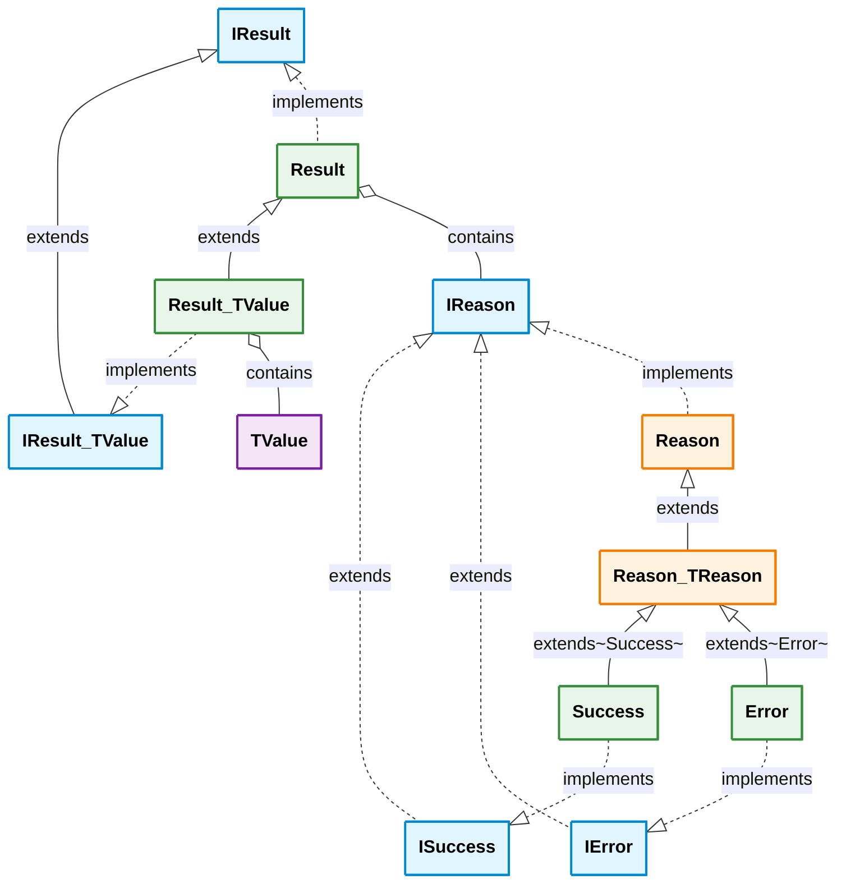

##### legend

- blue: interfaces 
- orange: abstract 
- green: class 
- purple: type

```mermaid
---
  config:
    class:
      hideEmptyMembersBox: true
---
classDiagram
    class IReason:::interface
    class ISuccess:::interface
    class IError:::interface
    class IResult:::interface
    class IResult_TValue:::interface
    
    class Reason:::abstract
    class Reason_TReason:::abstract
    
    class Success:::concrete
    class Error:::concrete
    class Result:::concrete
    class Result_TValue:::concrete
    class TValue:::type  
    
    IReason <|.. ISuccess : extends
    IReason <|.. IError : extends
    IResult <|-- IResult_TValue : extends
    
    IReason <|.. Reason : implements
    Reason <|-- Reason_TReason : extends
    Reason_TReason <|-- Success : extends~Success~
    Reason_TReason <|-- Error : extends~Error~
    Success ..|> ISuccess : implements
    Error ..|> IError : implements
    
    IResult <|.. Result : implements
    Result <|-- Result_TValue : extends
    Result_TValue ..|> IResult_TValue : implements
    
    Result o-- IReason : contains
    Result_TValue o-- TValue : contains 

    classDef interface fill:#e1f5ff,stroke:#0288d1,stroke-width:2px,color:black
    classDef abstract fill:#fff3e0,stroke:#f57c00,stroke-width:2px,color:black
    classDef concrete fill:#e8f5e9,stroke:#388e3c,stroke-width:2px,color:black
    classDef type fill:#f3e5f5,stroke:#7b1fa2,stroke-width:2px,color:black
```
