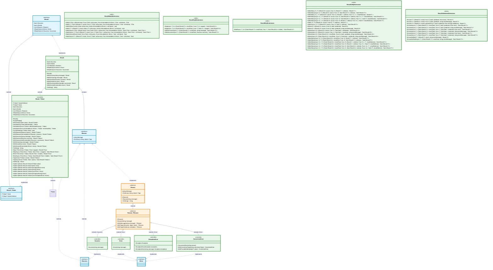

```mermaid
classDiagram
    class IReason:::interface {
        <<interface>>
        +string Message
        +Dictionary~string, object~ Tags
    }
    
    class ISuccess:::interface {
        <<interface>>
    }
    
    class IError:::interface  {
        <<interface>>
    }
    
    class IResult:::interface  {
        <<interface>>
        +bool IsSuccess
        +bool IsFailed
        +List~IReason~ Reasons
        +IReadOnlyList~IError~ Errors
        +IReadOnlyList~ISuccess~ Successes
    }
    
    class IResult_TValue:::interface  {
        <<interface>>
        +TValue? Value
        +TValue? ValueOrDefault
    }
    
    class Reason:::abstract {
        <<abstract>>
        #string Message
        +Dictionary~string, object~ Tags
        #Reason()
        +Reason(string message)
        +ToString() string
    }
    
    class Reason_TReason:::abstract {
        <<abstract>>
        +Reason()
        +Reason(string message)
        +WithMessage(string message) TReason
        +WithTags(string key, object value) TReason
        +WithTags(Dictionary metadata) TReason
    }
    
    class Success:::concrete {
        <<concrete>>
        +Success(string message)
    }
    
    class Error:::concrete {
        <<concrete>>
        +Error(string message)
    }
    
    class ExceptionError:::concrete {
        <<concrete>>
        +ExceptionError(Exception exception)
        +ExceptionError(string message, Exception exception)
        +Exception Exception
    }
    
    class ConversionError:::concrete {
        <<concrete>>
        +ConversionError(string reason)
        +WithConversionType(string conversionType) ConversionError
        +WithProvidedValue(object? value) ConversionError
    }
    
    class ResultMatchExtensions:::concrete {
        <<static>>
        +Match~TOut~~(Result result, Func~TOut~ onSuccess, Func~ImmutableList~IError~, TOut~ onFailure) TOut
        +Match~T, TOut~~(Result~T~ result, Func~T, TOut~ onSuccess, Func~ImmutableList~IError~, TOut~ onFailure) TOut
        +Match(Result result, Action onSuccess, Action~ImmutableList~IError~~ onFailure) void
        +Match~T~~(Result~T~ result, Action~T~ onSuccess, Action~ImmutableList~IError~~ onFailure) void
        +MatchAsync~TOut~~(Result result, Func~Task~TOut~~ onSuccess, Func~ImmutableList~IError~, Task~TOut~~ onFailure) Task~TOut~~
        +MatchAsync~T, TOut~~(Result~T~ result, Func~T, Task~TOut~~ onSuccess, Func~ImmutableList~IError~, Task~TOut~~ onFailure) Task~TOut~~
        +MatchAsync(Result result, Func~Task~ onSuccess, Func~ImmutableList~IError~, Task~ onFailure) Task
        +MatchAsync~T~~(Result~T~ result, Func~T, Task~ onSuccess, Func~ImmutableList~IError~, Task~ onFailure) Task
    }
    
    class ResultTaskExtensions:::concrete {
        <<static>>
        +MapAsync~T, U~~(Task~Result~T~~ resultTask, Func~T, U~ mapper) Task~Result~U~~
        +MapAsync~T, U~~(Task~Result~T~~ resultTask, Func~T, Task~U~~ mapper) Task~Result~U~~
        +WithSuccessAsync~T~~(Task~Result~T~~ resultTask, string message) Task~Result~T~~
        +WithSuccessAsync~T~~(Task~Result~T~~ resultTask, ISuccess success) Task~Result~T~~
    }
    
    class ResultBindExtensions:::concrete {
        <<static>>
        +BindAsync~T, U~~(Task~Result~T~~ resultTask, Func~T, Task~Result~U~~ binder) Task~Result~U~~
    }
    
    class ResultLINQExtensions:::concrete {
        <<static>>
        +SelectMany~S, T~~(Result~S~ source, Func~S, Result~T~~ selector) Result~T~~
        +SelectManyAsync~S, T~~(Result~S~ source, Func~S, Task~Result~T~~ selector) Task~Result~T~~
        +SelectMany~S, I, T~~(Result~S~ source, Func~S, Result~I~~ selector, Func~S, I, T~ resultSelector) Result~T~~
        +SelectManyAsync~S, I, T~~(Result~S~ source, Func~S, Task~Result~I~~ selector, Func~S, I, T~ resultSelector) Task~Result~T~~
        +SelectManyAsync~S, I, T~~(Result~S~ source, Func~S, Task~Result~I~~ selector, Func~S, I, Task~T~ resultSelector) Task~Result~T~~
        +SelectManyAsync~S, I, T~~(Result~S~ source, Func~S, Result~I~~ selector, Func~S, I, Task~T~ resultSelector) Task~Result~T~~
        +Select~S, T~~(Result~S~ source, Func~S, T~ selector) Result~T~~
        +SelectAsync~S, T~~(Result~S~ source, Func~S, Task~T~ selector) Task~Result~T~~
        +Where~S~~(Result~S~ source, Func~S, bool~ predicate) Result~S~
        +Where~S~~(Result~S~ source, Func~S, bool~ predicate, string errorMessage) Result~S~
        +WhereAsync~S~~(Result~S~ source, Func~S, Task~bool~~ predicate) Task~Result~S~~
        +WhereAsync~S~~(Result~S~ source, Func~S, Task~bool~~ predicate, string errorMessage) Task~Result~S~~
        +WhereAsync~S~~(Task~Result~S~~ resultTask, Func~S, bool~ predicate, string errorMessage) Task~Result~S~~
        +WhereAsync~S~~(Task~Result~S~~ resultTask, Func~S, Task~bool~~ predicate, string errorMessage) Task~Result~S~~
        +SelectManyAsync~S, T~~(Task~Result~S~~ resultTask, Func~S, Result~T~~ selector) Task~Result~T~~
        +SelectManyAsync~S, T~~(Task~Result~S~~ resultTask, Func~S, Task~Result~T~~ selector) Task~Result~T~~
        +SelectManyAsync~S, I, T~~(Task~Result~S~~ resultTask, Func~S, Result~I~~ selector, Func~S, I, T~ resultSelector) Task~Result~T~~
        +SelectManyAsync~S, I, T~~(Task~Result~S~~ resultTask, Func~S, Result~I~~ selector, Func~S, I, Task~T~ resultSelector) Task~Result~T~~
        +SelectManyAsync~S, I, T~~(Task~Result~S~~ resultTask, Func~S, Task~Result~I~~ selector, Func~S, I, T~ resultSelector) Task~Result~T~~
        +SelectManyAsync~S, I, T~~(Task~Result~S~~ resultTask, Func~S, Task~Result~I~~ selector, Func~S, I, Task~T~ resultSelector) Task~Result~T~~
    }
    
    class ResultValidationExtensions:::concrete {
        <<static>>
        +Ensure~T~~(Result~T~ result, Func~T, bool~ predicate, Error error) Result~T~
        +Ensure~T~~(Result~T~ result, Func~T, bool~ predicate, string errorMessage) Result~T~
        +Ensure~T~~(Result~T~ result, params (Func~T, bool~ predicate, Error error)[] validations) Result~T~
        +EnsureAsync~T~~(Task~Result~T~~ resultTask, Func~T, bool~ predicate, Error error) Task~Result~T~~
        +EnsureAsync~T~~(Task~Result~T~~ resultTask, Func~T, bool~ predicate, string errorMessage) Task~Result~T~~
        +EnsureAsync~T~~(Task~Result~T~~ resultTask, Func~T, Task~bool~~ predicate, Error error) Task~Result~T~~
        +EnsureAsync~T~~(Task~Result~T~~ resultTask, Func~T, Task~bool~~ predicate, string errorMessage) Task~Result~T~~
        +EnsureAsync~T~~(Task~Result~T~~ resultTask, Func~T, Task~bool~~ predicate, Error error) Task~Result~T~~
        +EnsureAsync~T~~(Task~Result~T~~ resultTask, Func~T, Task~bool~~ predicate, string errorMessage) Task~Result~T~~
        +EnsureNotNull~T~~(Result~T~ result, string errorMessage) Result~T~
        +EnsureNotNullAsync~T~~(Task~Result~T~~ resultTask, string errorMessage) Task~Result~T~~
    }
    
    class Result:::concrete {
        +bool IsSuccess
        +bool IsFailed
        +List~IReason~ Reasons
        +IReadOnlyList~IError~ Errors
        +IReadOnlyList~ISuccess~ Successes
        +Result()
        +WithSuccess(string message) Result
        +WithError(string message) Result
        +WithSuccess(Success success) Result
        +WithError(Error error) Result
        +WithSuccesses(IEnumerable successes) Result
        +WithErrors(IEnumerable errors) Result
        +ToString() string
    }
    
    class Result_TValue:::concrete {
        <<concrete>>
        +TValue? ValueOrDefault
        +TValue? Value
        +bool IsSuccess
        +bool IsFailed
        +List~IReason~ Reasons
        +IReadOnlyList~IError~ Errors
        +IReadOnlyList~ISuccess~ Successes
        +Result()
        -ThrowIfFailed()
        +WithValue(TValue value) Result~TValue~
        +GetValueOr(TValue defaultValue) TValue
        +GetValueOr(Func~TValue~ defaultValueFactory) TValue
        +GetValueOr(Func~ImmutableList~IError~, TValue~ errorHandler) TValue
        +TryGetValue(out TValue value) bool
        +WithReason(IReason reason) Result~TValue~
        +WithReasons(ImmutableList~IReason~ reasons) Result~TValue~
        +WithSuccess(string message) Result~TValue~
        +WithSuccess(ISuccess success) Result~TValue~
        +WithSuccesses(IEnumerable~ISuccess~ successes) Result~TValue~
        +WithError(string message) Result~TValue~
        +WithError(IError error) Result~TValue~
        +WithErrors(IEnumerable~IError~ errors) Result~TValue~
        +ToString() string
        +Map~TOut~(Func~TValue, TOut~ mapper) Result~TOut~
        +MapAsync~TOut~(Func~TValue, Task~TOut~~ mapper) Task~Result~TOut~~
        +Bind~TOut~(Func~TValue, Result~TOut~~ binder) Result~TOut~
        +BindAsync~TOut~(Func~TValue, Task~Result~TOut~~ binder) Task~Result~TOut~~
        +Tap(Action~TValue~ action) Result~TValue~
        +TapAsync(Func~TValue, Task~ action) Task~Result~TValue~~
        +ToResult() Result
        +implicit operator Result~TValue~(TValue value)
        +implicit operator Result~TValue~(Error error)
        +implicit operator Result~TValue~(ExceptionError error)
        +implicit operator Result~TValue~(Error[] errors)
        +implicit operator Result~TValue~(List~Error~ errors)
        +implicit operator Result~TValue~(ExceptionError[] errors)
        +implicit operator Result~TValue~(List~ExceptionError~ errors)
    }
    
    IReason <|.. ISuccess : extends
    IReason <|.. IError : extends
    IResult <|-- IResult_TValue : extends
    
    IReason <|.. Reason : implements
    Reason <|-- Reason_TReason : extends
    Reason_TReason <|-- Success : extends~Success~
    Reason_TReason <|-- Error : extends~Error~
    Reason_TReason <|-- ExceptionError : extends~Error~
    Reason_TReason <|-- ConversionError : extends~Error~
    Success ..|> ISuccess : implements
    Error ..|> IError : implements
    ExceptionError ..|> IError : implements
    ConversionError ..|> IError : implements
    
    IResult <|.. Result : implements
    Result <|-- Result_TValue : extends
    Result_TValue ..|> IResult_TValue : implements
    
    Result o-- IReason : contains
    Result_TValue o-- TValue : contains

    classDef interface fill:#e1f5ff,stroke:#0288d1,stroke-width:2px,color:black
    classDef abstract fill:#fff3e0,stroke:#f57c00,stroke-width:2px,color:black
    classDef concrete fill:#e8f5e9,stroke:#388e3c,stroke-width:2px,color:black
    classDef type fill:#f3e5f5,stroke:#7b1fa2,stroke-width:2px,color:black
```
