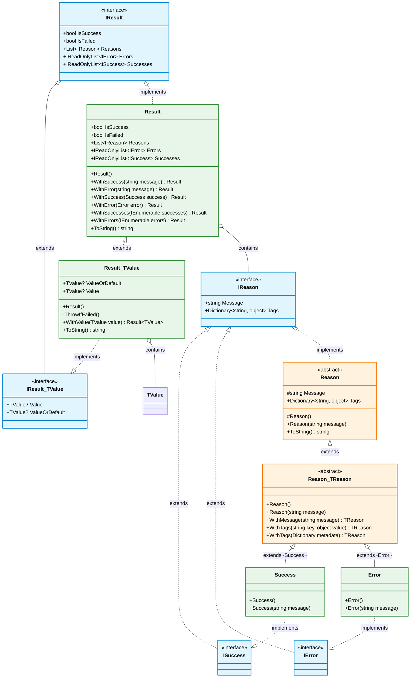

```mermaid
classDiagram
    class IReason:::interface {
        <<interface>>
        +string Message
        +Dictionary~string, object~ Tags
    }
    
    class ISuccess:::interface {
        <<interface>>
    }
    
    class IError:::interface  {
        <<interface>>
    }
    
    class IResult:::interface  {
        <<interface>>
        +bool IsSuccess
        +bool IsFailed
        +List~IReason~ Reasons
        +IReadOnlyList~IError~ Errors
        +IReadOnlyList~ISuccess~ Successes
    }
    
    class IResult_TValue:::interface  {
        <<interface>>
        +TValue? Value
        +TValue? ValueOrDefault
    }
    
    class Reason:::abstract {
        <<abstract>>
        #string Message
        +Dictionary~string, object~ Tags
        #Reason()
        +Reason(string message)
        +ToString() string
    }
    
    class Reason_TReason:::abstract {
        <<abstract>>
        +Reason()
        +Reason(string message)
        +WithMessage(string message) TReason
        +WithTags(string key, object value) TReason
        +WithTags(Dictionary metadata) TReason
    }
    
    class Success:::concrete {
        +Success()
        +Success(string message)
    }
    
    class Error:::concrete {
        +Error()
        +Error(string message)
    }
    
    class Result:::concrete {
        +bool IsSuccess
        +bool IsFailed
        +List~IReason~ Reasons
        +IReadOnlyList~IError~ Errors
        +IReadOnlyList~ISuccess~ Successes
        +Result()
        +WithSuccess(string message) Result
        +WithError(string message) Result
        +WithSuccess(Success success) Result
        +WithError(Error error) Result
        +WithSuccesses(IEnumerable successes) Result
        +WithErrors(IEnumerable errors) Result
        +ToString() string
    }
    
    class Result_TValue:::concrete {
        +TValue? ValueOrDefault
        +TValue? Value
        +Result()
        -ThrowIfFailed()
        +WithValue(TValue value) Result~TValue~
        +ToString() string
    }
    
    IReason <|.. ISuccess : extends
    IReason <|.. IError : extends
    IResult <|-- IResult_TValue : extends
    
    IReason <|.. Reason : implements
    Reason <|-- Reason_TReason : extends
    Reason_TReason <|-- Success : extends~Success~
    Reason_TReason <|-- Error : extends~Error~
    Success ..|> ISuccess : implements
    Error ..|> IError : implements
    
    IResult <|.. Result : implements
    Result <|-- Result_TValue : extends
    Result_TValue ..|> IResult_TValue : implements
    
    Result o-- IReason : contains
    Result_TValue o-- TValue : contains

    classDef interface fill:#e1f5ff,stroke:#0288d1,stroke-width:2px,color:black
    classDef abstract fill:#fff3e0,stroke:#f57c00,stroke-width:2px,color:black
    classDef concrete fill:#e8f5e9,stroke:#388e3c,stroke-width:2px,color:black
    classDef type fill:#f3e5f5,stroke:#7b1fa2,stroke-width:2px,color:black
```
