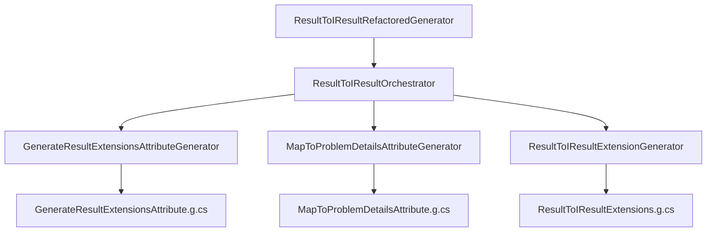

# 📐 SOLID Architecture - REslava.Result.SourceGenerators v1.9.4+

## Overview

The REslava.Result.SourceGenerators library has been completely refactored in v1.9.4 to follow SOLID principles, eliminating duplicate generation issues and creating a maintainable, extensible codebase.

## 🎯 SOLID Principles Implementation

### Single Responsibility Principle (SRP)

#### Before v1.9.4 - Problems
```csharp
// ❌ Single class doing everything
[Generator]
public class ResultToIResultGenerator : IIncrementalGenerator
{
    // Attribute generation
    // Code generation  
    // Pipeline coordination
    // Configuration parsing
    // Error handling
    // All mixed together!
}
```

#### After v1.9.4 - Solution
```csharp
// ✅ Each class has one responsibility
public interface IAttributeGenerator
{
    SourceText GenerateAttribute();
}

public interface ICodeGenerator  
{
    SourceText GenerateCode(Compilation compilation, object config);
}

public interface IOrchestrator
{
    void Initialize(IncrementalGeneratorInitializationContext context);
}

// Separate classes for each responsibility
public class GenerateResultExtensionsAttributeGenerator : IAttributeGenerator { }
public class ResultToIResultExtensionGenerator : ICodeGenerator { }
public class ResultToIResultOrchestrator : IOrchestrator { }
```

### Open/Closed Principle (OCP)

#### Extensible Design
```csharp
// ✅ Open for extension, closed for modification
public interface ICodeGenerator
{
    SourceText GenerateCode(Compilation compilation, object config);
}

// New generators can be added without changing existing code
public class CustomExtensionGenerator : ICodeGenerator
{
    public SourceText GenerateCode(Compilation compilation, object config)
    {
        // New functionality without modifying existing generators
    }
}
```

### Dependency Inversion Principle (DIP)

#### Before v1.9.4 - Tight Coupling
```csharp
// ❌ Depends on concrete implementations
public class ResultToIResultGenerator
{
    private readonly SomeConcreteHelper _helper = new SomeConcreteHelper();
    private readonly AnotherConcreteService _service = new AnotherConcreteService();
}
```

#### After v1.9.4 - Loose Coupling
```csharp
// ✅ Depends on abstractions
public class ResultToIResultOrchestrator : IOrchestrator
{
    private readonly IAttributeGenerator _attributeGenerator;
    private readonly ICodeGenerator _codeGenerator;

    // Constructor injection
    public ResultToIResultOrchestrator(
        IAttributeGenerator attributeGenerator,
        ICodeGenerator codeGenerator)
    {
        _attributeGenerator = attributeGenerator;
        _codeGenerator = codeGenerator;
    }
}
```

### Interface Segregation Principle (ISP)

#### Focused Interfaces
```csharp
// ✅ Each interface has a single, focused responsibility
public interface IAttributeGenerator
{
    SourceText GenerateAttribute();
}

public interface ICodeGenerator
{
    SourceText GenerateCode(Compilation compilation, object config);
}

public interface IOrchestrator
{
    void Initialize(IncrementalGeneratorInitializationContext context);
}

// No fat interfaces with multiple responsibilities
```

## 📐 New Architecture Structure

### Directory Organization
```
SourceGenerator/Generators/ResultToIResult/
├── Interfaces/
│   ├── IAttributeGenerator.cs          # Attribute generation contract
│   ├── ICodeGenerator.cs              # Code generation contract
│   └── IOrchestrator.cs               # Orchestration contract
├── Attributes/
│   ├── GenerateResultExtensionsAttributeGenerator.cs  # Generates attributes only
│   └── MapToProblemDetailsAttributeGenerator.cs        # Generates mapping attributes only
├── CodeGeneration/
│   └── ResultToIResultExtensionGenerator.cs              # Generates extension methods only
├── Orchestration/
│   └── ResultToIResultOrchestrator.cs                    # Coordinates pipeline only
├── ResultToIResultConfig.cs                              # Configuration model
└── ResultToIResultRefactoredGenerator.cs                  # Main entry point
```

### Class Responsibilities

| Class | Responsibility | SOLID Principle |
|-------|----------------|------------------|
| `GenerateResultExtensionsAttributeGenerator` | Generate `[GenerateResultExtensions]` attribute | SRP |
| `MapToProblemDetailsAttributeGenerator` | Generate `[MapToProblemDetails]` attribute | SRP |
| `ResultToIResultExtensionGenerator` | Generate HTTP extension methods | SRP |
| `ResultToIResultOrchestrator` | Coordinate generation pipeline | SRP |
| `ResultToIResultRefactoredGenerator` | Delegate to orchestrator | SRP |
| `IAttributeGenerator` | Attribute generation contract | ISP |
| `ICodeGenerator` | Code generation contract | ISP |
| `IOrchestrator` | Orchestration contract | ISP |

## 🔄 Generation Pipeline

### Step-by-Step Process


### Pipeline Flow
1. **Attribute Generation**: Attributes generated immediately for use in user code
2. **Code Generation**: Extension methods generated based on compilation analysis
3. **Single Execution**: Each file generated once per compilation
4. **Clean Output**: No duplicate classes or attributes

## 🎯 Benefits of SOLID Architecture

### For Developers
- **Zero Duplicate Errors**: No more CS0101 or CS0579 compilation errors
- **Faster Compilation**: Single execution instead of multiple generators
- **Cleaner Generated Code**: Consistent patterns and proper separation
- **Easier Debugging**: Clear separation makes issues easier to identify

### For Maintainers
- **Maintainable Code**: Each class has a single, clear responsibility
- **Extensible Design**: New generators can be added without modifying existing code
- **Testable Components**: Each generator can be tested in isolation
- **Clear Documentation**: Well-defined interfaces and responsibilities

### For Users
- **Reliable Generation**: Consistent, error-free code generation
- **Better Performance**: Faster compilation times
- **Smaller Packages**: Reduced package size without losing functionality
- **Future-Proof**: Architecture designed for long-term maintainability

## 📦 Package Structure

### v1.9.4 Package Contents
```
REslava.Result.SourceGenerators.1.9.4.nupkg/
├── analyzers/
│   └── dotnet/
│       └── cs/
│           ├── REslava.Result.SourceGenerators.dll     # Main generator
│           └── REslava.Result.SourceGenerators.Core.dll # Core infrastructure
├── content/
│   └── MapToProblemDetailsAttribute.cs              # Content file
└── build/
    └── REslava.Result.SourceGenerators.props        # Build integration
```

### Package Configuration
```xml
<PropertyGroup>
  <DevelopmentDependency>true</DevelopmentDependency>
  <SuppressDependenciesWhenPacking>true</SuppressDependenciesWhenPacking>
  <IsRoslynComponent>true</IsRoslynComponent>
</PropertyGroup>

<ItemGroup>
  <None Include="$(OutputPath)\$(AssemblyName).dll" 
        Pack="true" 
        PackagePath="analyzers/dotnet/cs" 
        Visible="false" />
</ItemGroup>
```

## 🧪 Testing Strategy

### Unit Testing
```csharp
[Test]
public void GenerateResultExtensionsAttributeGenerator_ShouldCreateValidAttribute()
{
    var generator = new GenerateResultExtensionsAttributeGenerator();
    var result = generator.GenerateAttribute();
    
    Assert.That(result.ToString(), Contains.String("[AttributeUsage(AttributeTargets.Assembly, AllowMultiple = false)]"));
    Assert.That(result.ToString(), Contains.String("public sealed class GenerateResultExtensionsAttribute"));
}
```

### Integration Testing
```csharp
[Test]
public void Orchestrator_ShouldGenerateAllFiles()
{
    var orchestrator = new ResultToIResultOrchestrator();
    var context = new TestIncrementalGeneratorInitializationContext();
    
    orchestrator.Initialize(context);
    
    Assert.That(context.GeneratedFiles, Contains.Item("GenerateResultExtensionsAttribute.g.cs"));
    Assert.That(context.GeneratedFiles, Contains.Item("MapToProblemDetailsAttribute.g.cs"));
    Assert.That(context.GeneratedFiles, Contains.Item("ResultToIResultExtensions.g.cs"));
}
```

## 🚀 Migration from Previous Versions

### Breaking Changes
- **None** - v1.9.4 is a drop-in replacement with zero breaking changes

### Internal Changes
- **Removed**: Old duplicate generator classes
- **Added**: New SOLID-based architecture
- **Improved**: Package configuration and structure

### Migration Steps
```xml
<!-- Old version -->
<PackageReference Include="REslava.Result.SourceGenerators" Version="1.9.3" />

<!-- New version -->
<PackageReference Include="REslava.Result.SourceGenerators" Version="1.9.4" />
```

```bash
# Clear NuGet cache
dotnet nuget locals http-cache --clear

# Rebuild project
dotnet clean && dotnet build
```

## 🎯 Future Extensibility

### Adding New Generators
```csharp
// 1. Create new generator implementing ICodeGenerator
public class CustomExtensionGenerator : ICodeGenerator
{
    public SourceText GenerateCode(Compilation compilation, object config)
    {
        // Custom generation logic
    }
}

// 2. Register in orchestrator
public class CustomOrchestrator : IOrchestrator
{
    public void Initialize(IncrementalGeneratorInitializationContext context)
    {
        var customGenerator = new CustomExtensionGenerator();
        // Register custom generator
    }
}
```

### Adding New Attributes
```csharp
// 1. Create new attribute generator
public class CustomAttributeGenerator : IAttributeGenerator
{
    public SourceText GenerateAttribute()
    {
        // Custom attribute generation
    }
}

// 2. Register in orchestrator
context.RegisterPostInitializationOutput(ctx =>
{
    ctx.AddSource("CustomAttribute.g.cs", customGenerator.GenerateAttribute());
});
```

---

## 📝 Conclusion

The SOLID architecture in v1.9.4 represents a fundamental improvement in the REslava.Result.SourceGenerators library. By following SOLID principles, we've eliminated the duplicate generation issues that plagued previous versions while creating a maintainable, extensible codebase that will serve as a foundation for future enhancements.

**The architecture is now production-ready, testable, and designed for long-term maintainability.** 🚀
