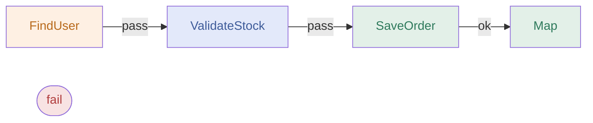
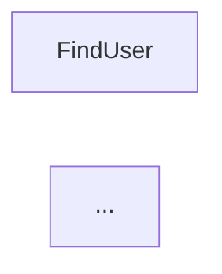

# REslava.Result v1.43.0

`[DomainBoundary]` + RESL1030, SmartEndpoints typed OpenAPI metadata, and clickable Mermaid pipeline diagrams with VS Code navigation and sidecar markdown constants.

---

## ✨ `[DomainBoundary]` + RESL1030 — Domain Layer Guard

Mark any method or constructor as a domain boundary entry point:

```csharp
[DomainBoundary("Application")]
public IActionResult Handle(Result<Order, AppError> result) { ... }
```

RESL1030 warns at the **call site** whenever a `Result<T, TError>` is passed directly without mapping the error:

```csharp
var domainResult = orderService.FindOrder(id);

// ⚠️ RESL1030: 'Handle' receives Result<Order, DomainError> directly.
// Call .MapError() before crossing the [DomainBoundary].
Handle(domainResult);

// ✅ Map the error surface before crossing the boundary:
Handle(domainResult.MapError(e => new AppError(e.Message)));
```

**`[DomainBoundary]` attribute** — lives in `REslava.Result` (not the analyzers assembly, which has `IncludeBuildOutput=false`). Accepts an optional layer name string for documentation.

---

## ✨ SmartEndpoints — `ProducesResponseType` per Error Type

When a `[AutoGenerateEndpoints]` method returns `Result<T, ErrorsOf<T1..Tn>>`, the generator now emits one `.Produces<Ti>(statusCode)` per union error type in the OpenAPI metadata, giving precise error documentation with zero boilerplate:

```csharp
[AutoGenerateEndpoints]
public class OrderService
{
    public Result<OrderDto, ErrorsOf<ValidationError, NotFoundError>> GetOrder(int id) { ... }
}
```

Generated endpoint (simplified):

```csharp
app.MapGet("/orders/{id}", ...)
   .Produces<OrderDto>(200)
   .Produces<ValidationError>(400)
   .Produces<NotFoundError>(404);
```

---

## ✨ Clickable Mermaid Nodes — VS Code Navigation

Set `ResultFlowLinkMode` to `vscode` and every node in the generated diagram becomes a hyperlink that opens the exact source line in VS Code.

**`REslava.Result.Flow`** — via MSBuild property:

```xml
<PropertyGroup>
  <ResultFlowLinkMode>vscode</ResultFlowLinkMode>
</PropertyGroup>
```

**`REslava.ResultFlow`** — via `resultflow.json`:

```json
{ "linkMode": "vscode", "mappings": [] }
```

Generated Mermaid output includes `click` directives:

```
flowchart LR
    N0_FindUser["FindUser"]:::operation
    N0_FindUser -->|pass| N1_ValidateStock
    N1_ValidateStock["ValidateStock"]:::gatekeeper
    ...
    click N0_FindUser "vscode://file/C:/src/OrderService.cs:42" "Go to FindUser"
    click N1_ValidateStock "vscode://file/C:/src/OrderService.cs:43" "Go to ValidateStock"
```



Clicking a node in the VS Code Mermaid preview (`Ctrl+Shift+V`) jumps directly to the method call. Nodes without a known source location are silently skipped.

---

## ✨ `{MethodName}_Sidecar` — Pipeline Docs Alongside Code

For every `[ResultFlow]`-decorated method, a second constant is generated alongside the diagram constant. It wraps the Mermaid diagram in a fenced markdown block:

```csharp
// Auto-generated — always present alongside the diagram constant:
public const string GetOrder_Sidecar = @"
# Pipeline — GetOrder


";
```

Write it to disk with a one-liner:

```csharp
File.WriteAllText("GetOrder.ResultFlow.md", OrderService_Flows.GetOrder_Sidecar);
```

The `.md` file renders immediately in VS Code (`Ctrl+Shift+V`) or on GitHub — no copy-paste required. Always generated regardless of `ResultFlowLinkMode`.

---

## 📦 NuGet

| Package | Link |
|---------|------|
| REslava.Result | [View on NuGet](https://www.nuget.org/packages/REslava.Result/1.43.0) |
| REslava.Result.Flow | [View on NuGet](https://www.nuget.org/packages/REslava.Result.Flow/1.43.0) |
| REslava.Result.AspNetCore | [View on NuGet](https://www.nuget.org/packages/REslava.Result.AspNetCore/1.43.0) |
| REslava.Result.Http | [View on NuGet](https://www.nuget.org/packages/REslava.Result.Http/1.43.0) |
| REslava.Result.Analyzers | [View on NuGet](https://www.nuget.org/packages/REslava.Result.Analyzers/1.43.0) |
| REslava.Result.OpenTelemetry | [View on NuGet](https://www.nuget.org/packages/REslava.Result.OpenTelemetry/1.43.0) |
| REslava.ResultFlow | [View on NuGet](https://www.nuget.org/packages/REslava.ResultFlow/1.43.0) |
| REslava.Result.FluentValidation | [View on NuGet](https://www.nuget.org/packages/REslava.Result.FluentValidation/1.43.0) |

---

## Stats

- Tests: 4,510 passing (floor updated: >4,400 → >4,500)
- 187 features across 15 categories
