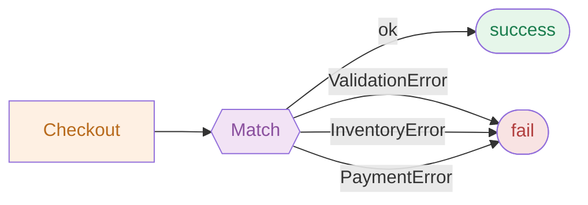

# REslava.Result v1.46.0

## Match — Multi-Branch Fan-Out Mermaid rendering

`Match` is now a first-class decision node in every generated pipeline diagram: a hexagon with explicit success and typed failure exits, replacing the dead-end rectangle.

---

## What's New

### Match hexagon + ok/fail edges (both packages)

`Match`/`MatchAsync` now renders as a Mermaid decision hexagon with two explicit exits:

```
N4_Match{{"Match"}}:::terminal
N4_Match -->|ok| SUCCESS([success]):::success
N4_Match -->|fail| FAIL([fail]):::failure
```

Applies to both `REslava.Result.Flow` (semantic) and `REslava.ResultFlow` (syntax-only).

### Typed N-branch fan-out (`REslava.Result.Flow` only)

When `Match` is called with explicitly-typed lambda parameters, the generator emits one typed fail edge per branch — all converging on the shared `FAIL` terminal:

```csharp
[ResultFlow]
public string PlaceOrder(CheckoutRequest req) =>
    Checkout(req).Match(
        (Order o)           => Confirm(o),
        (ValidationError v) => Reject(v.Message),
        (InventoryError i)  => Retry(i),
        (PaymentError p)    => Decline(p));
```



Type labels are extracted from explicit lambda parameter type annotations — no body scanning. Plain `Result<T>` with a 2-argument `Match` falls back to the generic `-->|fail| FAIL` edge.

### `PipelineNode.MatchBranchLabels` (`REslava.Result.Flow`)

New `IReadOnlyList<string>?` property on `PipelineNode`. Populated when the `Match` invocation has explicitly-typed fail branches; drives N typed fail edges in the renderer.

### Gap 1 Terminal guard (both packages)

The lambda body method-name heuristic (Gap 1) no longer overwrites the `Match` node label. Previously `Match(o => o.Id.ToString(), ...)` would rename the node to `"ToString"`.

---

## Stats

- Tests: 4,634 passing (floor: >4,500)
- Features: 197 across 15 categories

---

## NuGet Packages

| Package | Link |
|---|---|
| REslava.Result | [View on NuGet](https://www.nuget.org/packages/REslava.Result/1.46.0) |
| REslava.Result.Flow | [View on NuGet](https://www.nuget.org/packages/REslava.Result.Flow/1.46.0) |
| REslava.Result.AspNetCore | [View on NuGet](https://www.nuget.org/packages/REslava.Result.AspNetCore/1.46.0) |
| REslava.Result.Http | [View on NuGet](https://www.nuget.org/packages/REslava.Result.Http/1.46.0) |
| REslava.Result.Analyzers | [View on NuGet](https://www.nuget.org/packages/REslava.Result.Analyzers/1.46.0) |
| REslava.Result.OpenTelemetry | [View on NuGet](https://www.nuget.org/packages/REslava.Result.OpenTelemetry/1.46.0) |
| REslava.ResultFlow | [View on NuGet](https://www.nuget.org/packages/REslava.ResultFlow/1.46.0) |
| REslava.Result.FluentValidation | [View on NuGet](https://www.nuget.org/packages/REslava.Result.FluentValidation/1.46.0) |
