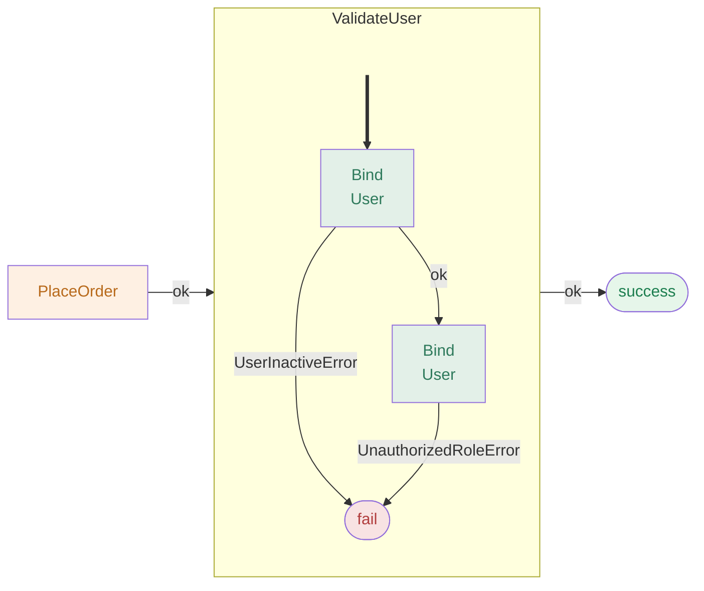

# REslava.Result v1.46.3

## Subgraph Entry Arrow — Cross-Method Pipeline Diagrams

Cross-method `subgraph` blocks (generated by `[ResultFlow(MaxDepth = 2)]`) now open with a thick `==>` arrow pointing to the first inner node, making the execution entry point immediately visible inside each expanded method.

- Flat (non-subgraph) pipelines are **unchanged** — the amber `:::operation` root node is already visually distinct
- `classDef entry fill:none,stroke:none` is emitted once per diagram when subgraphs are present
- Both `REslava.Result.Flow` and `REslava.ResultFlow` updated

No API changes.

---

## Stats

- Tests: 4,638 passing (floor: >4,500)
- Features: 197 across 15 categories

---

## NuGet Packages

| Package | Link |
|---|---|
| REslava.Result | [View on NuGet](https://www.nuget.org/packages/REslava.Result/1.46.3) |
| REslava.Result.Flow | [View on NuGet](https://www.nuget.org/packages/REslava.Result.Flow/1.46.3) |
| REslava.Result.AspNetCore | [View on NuGet](https://www.nuget.org/packages/REslava.Result.AspNetCore/1.46.3) |
| REslava.Result.Http | [View on NuGet](https://www.nuget.org/packages/REslava.Result.Http/1.46.3) |
| REslava.Result.Analyzers | [View on NuGet](https://www.nuget.org/packages/REslava.Result.Analyzers/1.46.3) |
| REslava.Result.OpenTelemetry | [View on NuGet](https://www.nuget.org/packages/REslava.Result.OpenTelemetry/1.46.3) |
| REslava.ResultFlow | [View on NuGet](https://www.nuget.org/packages/REslava.ResultFlow/1.46.3) |
| REslava.Result.FluentValidation | [View on NuGet](https://www.nuget.org/packages/REslava.Result.FluentValidation/1.46.3) |
