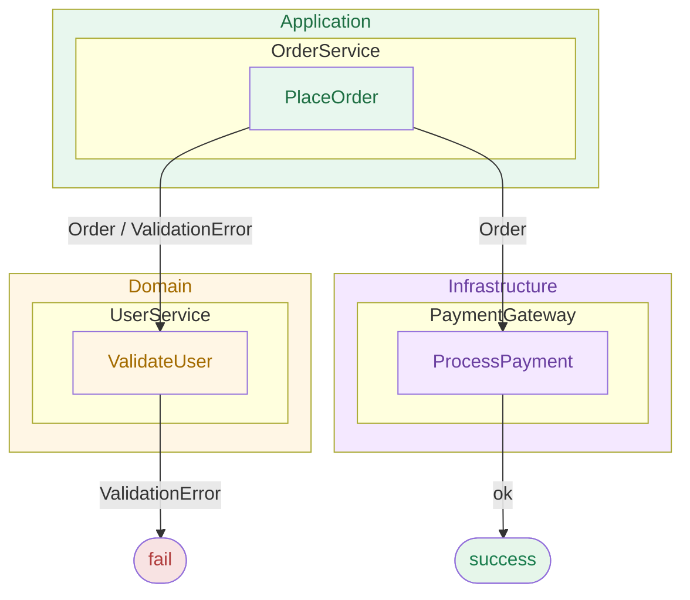

# REslava.Result.Flow

**The recommended pipeline visualization package for REslava.Result projects.** Generates Mermaid diagrams with full type travel, typed error edges from method body scanning, and entry-point detection — all via Roslyn semantic analysis.

> Using a different Result library (ErrorOr, LanguageExt, FluentResults)? Use [`REslava.ResultFlow`](https://www.nuget.org/packages/REslava.ResultFlow) — the library-agnostic alternative instead.

## Installation

```bash
dotnet add package REslava.Result.Flow
```

Requires `REslava.Result` in your project. The `[ResultFlow]` attribute is injected automatically — no extra `using` needed.

## What it does

Add `[ResultFlow]` to any `REslava.Result` fluent method and the generator produces:

- **Success type travel** — inferred from `IResultBase<T>` at each step; type-preserving steps show `"MethodName<br/>T"`; type-changing steps show `"MethodName<br/>T → U"`
- **Error surface** — scans method bodies of `Bind`/`Ensure` delegates for error construction, annotates failure edges with specific error types
- **Async step annotation** — ⚡ appended to any step that resolves via `await`

## Quick Start

```csharp
[ResultFlow]
public async Task<Result<UserDto>> RegisterAsync(RegisterCommand cmd) =>
    await CreateUser(cmd)
        .EnsureAsync(IsEmailValid, new InvalidEmailError())
        .BindAsync(SaveUser)
        .TapAsync(SendWelcomeEmail)
        .MapAsync(ToDto);
```

Use the **IDE code action** (REF002 — "Insert diagram as comment") to inject the diagram directly above the method — no build required:

```csharp
/*
```mermaid
flowchart LR
    N0_EnsureAsync["EnsureAsync ⚡<br/>User"]:::gatekeeper
    N0_EnsureAsync -->|pass| N1_BindAsync
    N0_EnsureAsync -->|fail| FAIL
    ...
```*/
[ResultFlow]
public async Task<Result<UserDto>> RegisterAsync(RegisterCommand cmd) => ...
```

The `` ```mermaid `` fence makes the diagram render inline in VS Code, GitHub, Rider, and other Markdown-aware IDEs.

## Generated Diagram Example

`_LayerView` — architecture diagram across layers, generated from `[DomainBoundary]` annotations:



Compared to `REslava.ResultFlow`, this package adds:
- Typed failure edges (e.g. `InvalidEmailError` instead of just `fail`)
- Error surface inference via `IError` — no manual annotation required

## Diagnostics

| ID | Severity | Description |
|---|---|---|
| `REF001` | Info | `[ResultFlow]` could not detect a fluent chain — diagram not generated. |
| `REF002` | Info | Fluent chain detected — use the "Insert diagram as comment" code action to embed the Mermaid diagram above the method. |
| `REF003` | Warning | `resultflow.json` could not be parsed — falling back to built-in conventions. |

## Documentation

Full documentation: [reslava.github.io/nuget-package-reslava-result](https://reslava.github.io/nuget-package-reslava-result/resultflow/)

**MIT License** | Works with any .NET project (netstandard2.0)
