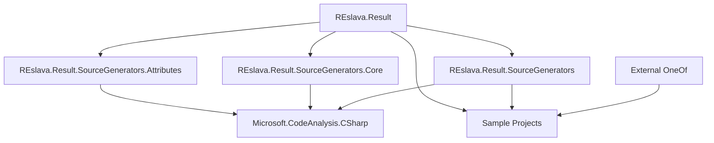

# REslava.Result Project Dependencies

## 📋 Main Projects Dependencies

| Project | Type | REslava.Result Dependencies | External Dependencies | Notes |
|--------|------|---------------------------|-------------------|-------|
| **REslava.Result** | Core Library | None (self-contained) | None | Foundation library with Result pattern implementation |
| **REslava.Result.SourceGenerators** | Source Generator | REslava.Result | Microsoft.CodeAnalysis.CSharp | Generates extension methods for Result types |
| **REslava.Result.SourceGenerators.Core** | Generator Infrastructure | None | Microsoft.CodeAnalysis.CSharp | Core infrastructure for source generators |
| **REslava.Result.SourceGenerators.Attributes** | Generator Attributes | None | Microsoft.CodeAnalysis.CSharp | Attributes for source generator configuration |

## 📋 Dependency Relationships

## 📋 External Dependencies Details

### Microsoft.CodeAnalysis.CSharp
- **Version**: Latest compatible with .NET 8.0/9.0/10.0
- **Purpose**: Roslyn compiler platform for source generators
- **Usage**: Required for all source generator projects
- **License**: MIT License (included with .NET SDK)

---

*Last Updated: February 1, 2026*
*Version: 1.0*
*Status: Current*
