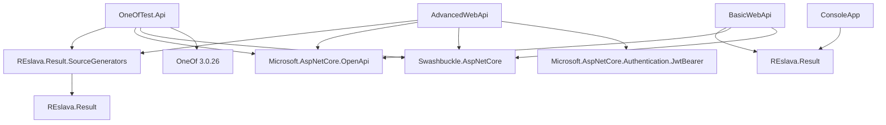

# REslava.Result Sample Projects Dependencies

## 📋 Sample Projects Dependencies

| Project | Type | REslava.Result Dependencies | External Dependencies | External OneOf | Notes |
|--------|------|---------------------------|-------------------|--------------|-------|
| **OneOfTest.Api** | Sample API | REslslava.Result.SourceGenerators | Microsoft.AspNetCore.OpenApi Swashbuckle.AspNetCore OneOf 3.0.26 | OneOf 3.0.26 | Demonstrates OneOf to IResult conversion |
| **BasicWebApi** | Sample API | REslava.Result | Microsoft.AspNetCore.OpenApi Swashbuckle.AspNetCore | None | Basic API without source generators |
| **AdvancedWebApi** | Sample API | REslava.Result.SourceGenerators | Microsoft.AspNetCore.OpenApi Swashbuckle.AspNetCore Microsoft.AspNetCore.Authentication.JwtBearer | None | Advanced API with authentication |
| **ConsoleApp** | Console App | REslava.Result | None | None | Console application examples |

## 📋 Sample Project Architecture

## 📋 Sample Project Categories

### 🌐 Web API Samples
- **OneOfTest.Api**: Full-featured API with source generators
- **BasicWebApi**: Simple API without generators
- **AdvancedWebApi**: Production-ready API with authentication

### 🖥️ Console Applications
- **ConsoleApp**: Command-line examples and utilities

## 📋 External Dependencies Details

### ASP.NET Core
- **Microsoft.AspNetCore.OpenApi**: OpenAPI/Swagger support
- **Swashbuckle.AspNetCore**: Swagger UI generation
- **Microsoft.AspNetCore.Authentication.JwtBearer**: JWT authentication

### External OneOf
- **OneOf 3.0.26**: External OneOf library
- **Purpose**: Current testing implementation
- **Status**: Will be replaced by REslava.Result OneOf

---

## 📋 Sample Project Usage

### Development Phase
- **OneOfTest.Api**: Testing source generator functionality
- **External OneOf**: Current implementation validation
- **BasicWebApi**: Core functionality testing

### Production Phase
- **AdvancedWebApi**: Production-ready examples
- **ConsoleApp**: Utility applications
- **REslava.Result OneOf**: Self-contained implementation

---

*Last Updated: February 1, 2026*
*Version: 1.0*
*Status: Current*
