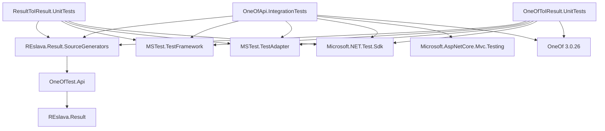

# REslava.Result MSTest Projects Dependencies

## 📋 MSTest Projects Dependencies

| Project | Type | REslava.Result Dependencies | External Dependencies | External OneOf | Notes |
|--------|------|---------------------------|-------------------|--------------|-------|
| **OneOfApi.IntegrationTests** | Integration Tests | REslava.Result.SourceGenerators | MSTest.TestFramework MSTest.TestAdapter Microsoft.NET.Test.Sdk Microsoft.AspNetCore.Mvc.Testing | OneOf 3.0.26 | Tests source generator functionality in real API |
| **ResultToIResult.UnitTests** | Unit Tests | REslslava.Result.SourceGenerators | MSTest.TestFramework MSTest.TestAdapter Microsoft.NET.Test.Sdk | None | Tests Result to IResult conversion without OneOf |
| **OneOfToIResult.UnitTests** | Unit Tests | REslava.Result.SourceGenerators | MSTest.TestFramework MSTest.TestAdapter Microsoft.NET.Test.Sdk | OneOf 3.0.26 | Tests OneOf to IResult extension generation |

## 📋 Test Project Architecture

## 📋 External Dependencies Details

### MSTest Framework
- **MSTest.TestFramework**: Core testing framework
- **MSTest.TestAdapter**: Test adapter for Visual Studio
- **Microsoft.NET.Test.Sdk**: .NET testing SDK

### ASP.NET Core Testing
- **Microsoft.AspNetCore.Mvc.Testing**: Integration testing for ASP.NET Core

### External OneOf
- **OneOf 3.0.26**: External OneOf library by Andrew Arnott
- **Purpose**: Used for testing T1,T2,T3 functionality
- **Will be replaced**: By REslava.Result OneOf implementation

---

*Last Updated: February 1, 2026*
*Version: 1.0*
*Status: Current*
