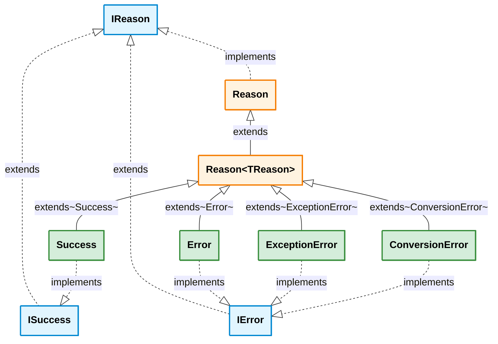
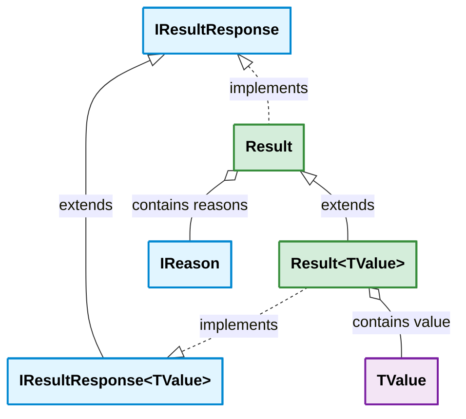
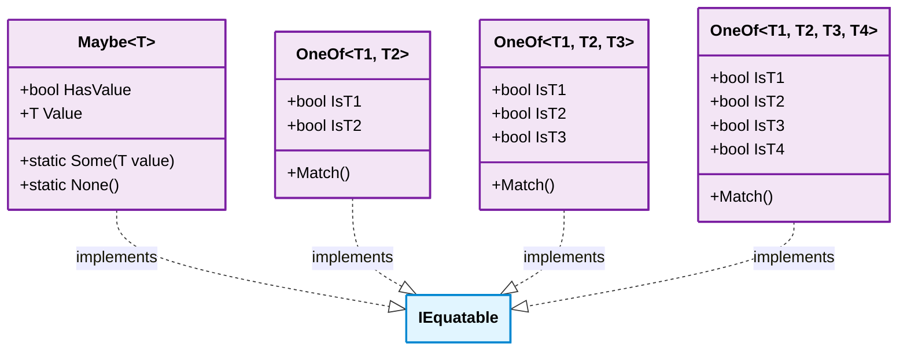

# REslava.Result — Core Type Hierarchy (v1.12.1)

##### Legend

- blue: interfaces
- orange: abstract classes
- green: concrete classes
- purple: struct types

## Reason & Error Hierarchy

## Result Hierarchy

## Advanced Patterns

## Notes

- `Reason<TReason>` uses the **Curiously Recurring Template Pattern (CRTP)** for type-safe reason hierarchies
- `Maybe<T>`, `OneOf<T1,T2>`, `OneOf<T1,T2,T3>`, and `OneOf<T1,T2,T3,T4>` are **readonly structs** — zero heap allocations
- `Result` and `Result<T>` are **classes** — immutable with `ImmutableList<IReason>` for reasons collection
- `IResultResponse<out TValue>` is **covariant** in TValue for polymorphic result handling
