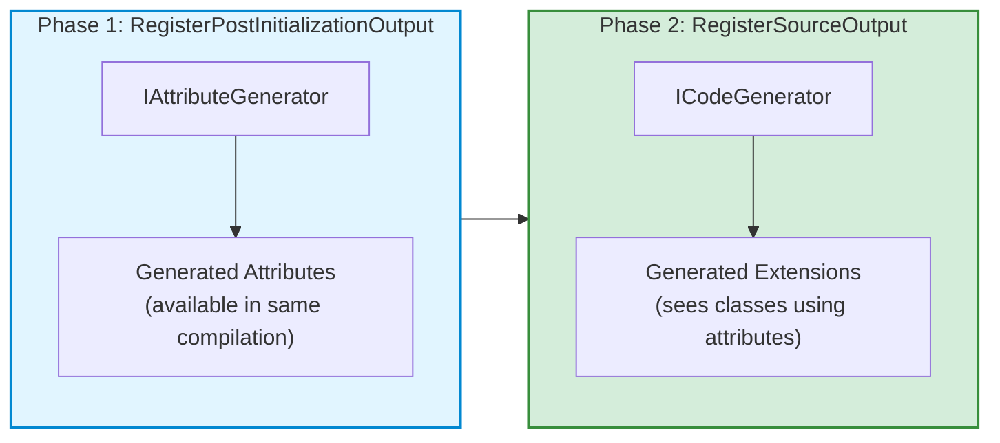
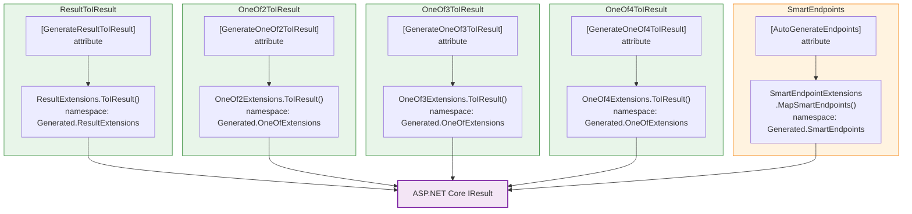

# REslava.Result — Source Generator Pipeline (v1.12.1)

##### Legend

- blue: Roslyn interfaces
- orange: orchestrators
- green: generators (entry points)
- purple: generated output

## Generator Architecture

```mermaid
---
  config:
    class:
      hideEmptyMembersBox: true
---
classDiagram
    class IIncrementalGenerator:::interface
    class IGeneratorOrchestrator:::interface
    class IAttributeGenerator:::interface
    class ICodeGenerator:::interface

    class ResultToIResultRefactoredGenerator:::generator
    class OneOf2ToIResultGenerator:::generator
    class OneOf3ToIResultGenerator:::generator
    class OneOf4ToIResultGenerator:::generator
    class SmartEndpointsGenerator:::generator

    class ResultToIResultOrchestrator:::orchestrator
    class OneOf2ToIResultOrchestrator:::orchestrator
    class OneOf3ToIResultOrchestrator:::orchestrator
    class OneOf4ToIResultOrchestrator:::orchestrator
    class SmartEndpointsOrchestrator:::orchestrator

    IIncrementalGenerator <|.. ResultToIResultRefactoredGenerator : implements
    IIncrementalGenerator <|.. OneOf2ToIResultGenerator : implements
    IIncrementalGenerator <|.. OneOf3ToIResultGenerator : implements
    IIncrementalGenerator <|.. OneOf4ToIResultGenerator : implements
    IIncrementalGenerator <|.. SmartEndpointsGenerator : implements

    ResultToIResultRefactoredGenerator --> ResultToIResultOrchestrator : delegates to
    OneOf2ToIResultGenerator --> OneOf2ToIResultOrchestrator : delegates to
    OneOf3ToIResultGenerator --> OneOf3ToIResultOrchestrator : delegates to
    OneOf4ToIResultGenerator --> OneOf4ToIResultOrchestrator : delegates to
    SmartEndpointsGenerator --> SmartEndpointsOrchestrator : delegates to

    IGeneratorOrchestrator <|.. ResultToIResultOrchestrator : implements
    IGeneratorOrchestrator <|.. OneOf2ToIResultOrchestrator : implements
    IGeneratorOrchestrator <|.. OneOf3ToIResultOrchestrator : implements
    IGeneratorOrchestrator <|.. OneOf4ToIResultOrchestrator : implements
    IGeneratorOrchestrator <|.. SmartEndpointsOrchestrator : implements

    classDef interface fill:#e1f5ff,stroke:#0288d1,stroke-width:2px,color:black
    classDef orchestrator fill:#fff3e0,stroke:#f57c00,stroke-width:2px,color:black
    classDef generator fill:#d4edda,stroke:#388e3c,stroke-width:2px,color:black
```

## Two-Phase Generation Pipeline

## Generated Output per Generator

## Notes

- Each generator follows the same **delegation pattern**: `Generator → Orchestrator → AttributeGenerator + CodeGenerator`
- The two-phase approach ensures generated attributes are available to user code in the same compilation cycle
- SmartEndpoints additionally generates `using Generated.ResultExtensions;` and `using Generated.OneOfExtensions;` in its output, so it depends on the other generators' output
- All orchestrators implement `IGeneratorOrchestrator` following the **Open/Closed Principle** — new generators can be added without modifying existing ones
