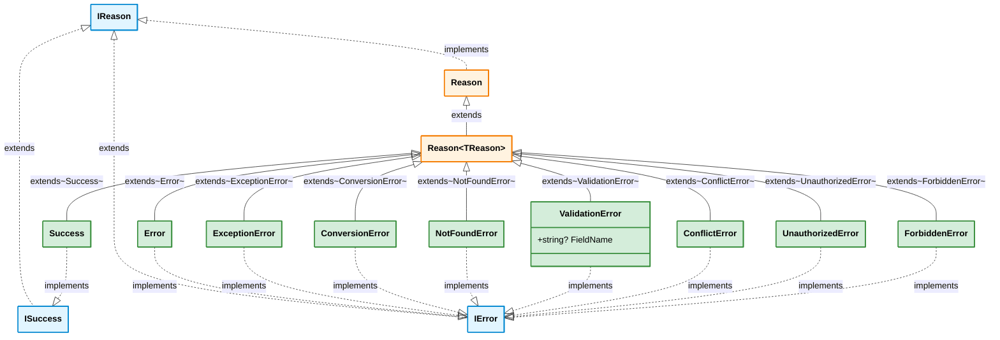
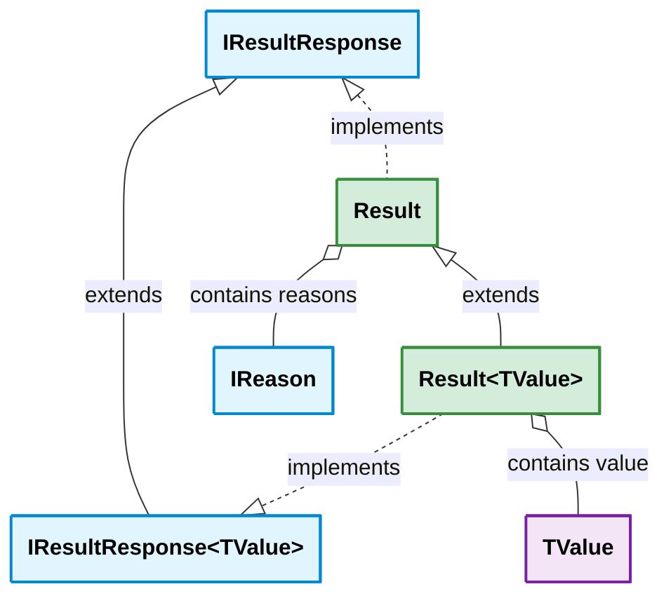
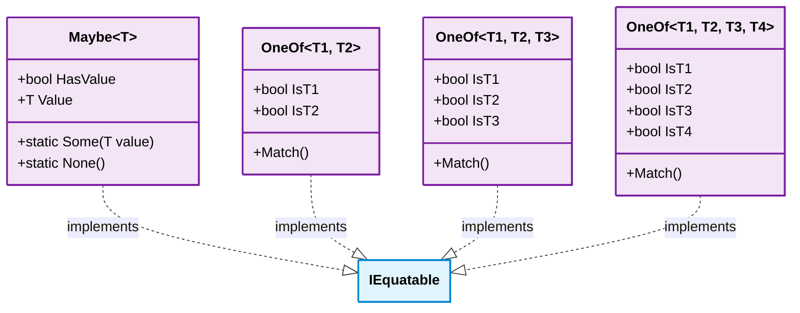

##### Legend

- blue: interfaces
- orange: abstract classes
- green: concrete classes
- purple: struct types

## Notes

- `Reason<TReason>` uses the **Curiously Recurring Template Pattern (CRTP)** for type-safe reason hierarchies
- All domain errors (`NotFoundError`, `ValidationError`, `ConflictError`, `UnauthorizedError`, `ForbiddenError`) inherit directly from `Reason<TReason>` — not from `Error` — keeping the CRTP chain type-safe
- Each domain error sets default `Tags` at construction time: `ErrorType` + `HttpStatusCode` (e.g. 404, 422, 409, 401, 403)
- `ValidationError` adds an optional `FieldName` property, surfaced by the `[Validate]` source generator (v1.24.0)
- `Maybe<T>`, `OneOf<T1,T2>`, `OneOf<T1,T2,T3>`, and `OneOf<T1,T2,T3,T4>` are **readonly structs** — zero heap allocations
- `Result` and `Result<T>` are **classes** — immutable with `ImmutableList<IReason>` for reasons collection
- `IResultResponse<out TValue>` is **covariant** in TValue for polymorphic result handling
