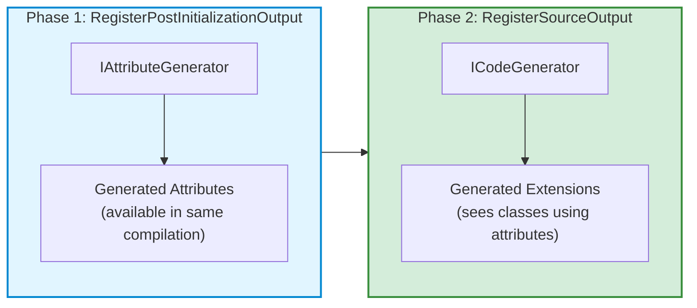

##### Legend

- blue: Roslyn interfaces
- orange: orchestrators (shared)
- green: generators (entry points, one per `[Generator]` class)
- purple: generated output

```mermaid
---
  config:
    class:
      hideEmptyMembersBox: true
---
classDiagram
    class IIncrementalGenerator:::interface
    class IGeneratorOrchestrator:::interface
    class IAttributeGenerator:::interface
    class ICodeGenerator:::interface

    %% IResult generators (Minimal API)
    class ResultToIResultRefactoredGenerator:::generator
    class OneOf2ToIResultGenerator:::generator
    class OneOf3ToIResultGenerator:::generator
    class OneOf4ToIResultGenerator:::generator

    %% ActionResult generators (MVC)
    class ResultToActionResultGenerator:::generator
    class OneOf2ToActionResultGenerator:::generator
    class OneOf3ToActionResultGenerator:::generator
    class OneOf4ToActionResultGenerator:::generator

    %% SmartEndpoints + Validate
    class SmartEndpointsGenerator:::generator
    class ValidateGenerator:::generator

    %% Orchestrators
    class ResultToIResultOrchestrator:::orchestrator
    class OneOfToIResultOrchestrator:::orchestrator
    class ResultToActionResultOrchestrator:::orchestrator
    class OneOfToActionResultOrchestrator:::orchestrator
    class SmartEndpointsOrchestrator:::orchestrator
    class ValidateOrchestrator:::orchestrator

    IIncrementalGenerator <|.. ResultToIResultRefactoredGenerator : implements
    IIncrementalGenerator <|.. OneOf2ToIResultGenerator : implements
    IIncrementalGenerator <|.. OneOf3ToIResultGenerator : implements
    IIncrementalGenerator <|.. OneOf4ToIResultGenerator : implements
    IIncrementalGenerator <|.. ResultToActionResultGenerator : implements
    IIncrementalGenerator <|.. OneOf2ToActionResultGenerator : implements
    IIncrementalGenerator <|.. OneOf3ToActionResultGenerator : implements
    IIncrementalGenerator <|.. OneOf4ToActionResultGenerator : implements
    IIncrementalGenerator <|.. SmartEndpointsGenerator : implements
    IIncrementalGenerator <|.. ValidateGenerator : implements

    ResultToIResultRefactoredGenerator --> ResultToIResultOrchestrator : delegates to
    OneOf2ToIResultGenerator --> OneOfToIResultOrchestrator : delegates to~arity=2~
    OneOf3ToIResultGenerator --> OneOfToIResultOrchestrator : delegates to~arity=3~
    OneOf4ToIResultGenerator --> OneOfToIResultOrchestrator : delegates to~arity=4~
    ResultToActionResultGenerator --> ResultToActionResultOrchestrator : delegates to
    OneOf2ToActionResultGenerator --> OneOfToActionResultOrchestrator : delegates to~arity=2~
    OneOf3ToActionResultGenerator --> OneOfToActionResultOrchestrator : delegates to~arity=3~
    OneOf4ToActionResultGenerator --> OneOfToActionResultOrchestrator : delegates to~arity=4~
    SmartEndpointsGenerator --> SmartEndpointsOrchestrator : delegates to
    ValidateGenerator --> ValidateOrchestrator : delegates to

    IGeneratorOrchestrator <|.. ResultToIResultOrchestrator : implements
    IGeneratorOrchestrator <|.. OneOfToIResultOrchestrator : implements
    IGeneratorOrchestrator <|.. ResultToActionResultOrchestrator : implements
    IGeneratorOrchestrator <|.. OneOfToActionResultOrchestrator : implements
    IGeneratorOrchestrator <|.. SmartEndpointsOrchestrator : implements
    IGeneratorOrchestrator <|.. ValidateOrchestrator : implements

    classDef interface fill:#e1f5ff,stroke:#0288d1,stroke-width:2px,color:black
    classDef orchestrator fill:#fff3e0,stroke:#f57c00,stroke-width:2px,color:black
    classDef generator fill:#d4edda,stroke:#388e3c,stroke-width:2px,color:black
```

```mermaid
flowchart TB
    subgraph ResultToIResult["Result → IResult (Minimal API)"]
        R_ATTR["[GenerateResultToIResult]<br/>attribute"] --> R_EXT["ResultExtensions.ToIResult()<br/>namespace: Generated.ResultExtensions"]
    end

    subgraph OneOfToIResult["OneOf → IResult (Minimal API)"]
        O_ATTR["[GenerateOneOf2/3/4ToIResult]<br/>attributes"] --> O_EXT["OneOfExtensions.ToIResult()<br/>namespace: Generated.OneOfExtensions"]
    end

    subgraph ResultToActionResult["Result → ActionResult (MVC)"]
        RA_ATTR["[GenerateResultToActionResult]<br/>attribute"] --> RA_EXT["ResultActionExtensions.ToActionResult()<br/>namespace: Generated.ActionResultExtensions"]
    end

    subgraph OneOfToActionResult["OneOf → ActionResult (MVC)"]
        OA_ATTR["[GenerateOneOf2/3/4ToActionResult]<br/>attributes"] --> OA_EXT["OneOfActionExtensions.ToActionResult()<br/>namespace: Generated.ActionResultExtensions"]
    end

    subgraph SmartEndpoints["SmartEndpoints"]
        SE_ATTR["[AutoGenerateEndpoints]<br/>attribute"] --> SE_EXT["SmartEndpointExtensions<br/>.MapSmartEndpoints()<br/>namespace: Generated.SmartEndpoints"]
    end

    subgraph Validate["Validate (v1.24.0)"]
        V_ATTR["[Validate]<br/>attribute"] --> V_EXT[".Validate() → Result&lt;T&gt;<br/>namespace: Generated.ValidationExtensions"]
    end

    R_EXT --> IRESULT["ASP.NET Core IResult"]
    O_EXT --> IRESULT
    RA_EXT --> ACTIONRESULT["ASP.NET Core ActionResult"]
    OA_EXT --> ACTIONRESULT
    SE_EXT --> IRESULT
    V_EXT --> PIPELINE["Result&lt;T&gt; Pipeline<br/>.Bind() / .ToIResult() / .ToActionResult()"]

    style ResultToIResult fill:#e8f5e9,stroke:#388e3c
    style OneOfToIResult fill:#e8f5e9,stroke:#388e3c
    style ResultToActionResult fill:#e3f2fd,stroke:#1565c0
    style OneOfToActionResult fill:#e3f2fd,stroke:#1565c0
    style SmartEndpoints fill:#fff3e0,stroke:#f57c00
    style Validate fill:#f3e5f5,stroke:#7b1fa2
    style IRESULT fill:#f3e5f5,stroke:#7b1fa2,stroke-width:2px
    style ACTIONRESULT fill:#e3f2fd,stroke:#1565c0,stroke-width:2px
    style PIPELINE fill:#f3e5f5,stroke:#7b1fa2,stroke-width:2px
```

## Notes

- Each generator follows the same **delegation pattern**: `Generator → Orchestrator → AttributeGenerator + CodeGenerator`
- **OneOf2/3/4ToIResultGenerator** and **OneOf2/3/4ToActionResultGenerator** share a single orchestrator instance (parameterised by arity). Roslyn requires separate `[Generator]` classes, but all delegate to the same orchestrator object.
- The two-phase approach ensures generated attributes are available to user code in the same compilation cycle
- SmartEndpoints additionally emits `using Generated.ResultExtensions;` and `using Generated.OneOfExtensions;` in its generated code, so it depends on the other generators' output
- **ValidateGenerator** (v1.24.0) delegates to `Validator.TryValidateObject` — no per-annotation parsing; all 20+ `DataAnnotations` types supported automatically
- All orchestrators implement `IGeneratorOrchestrator` following the **Open/Closed Principle** — new generators can be added without modifying existing ones
