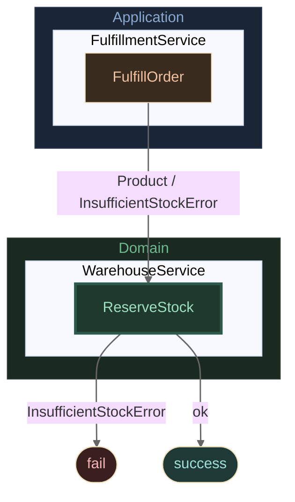
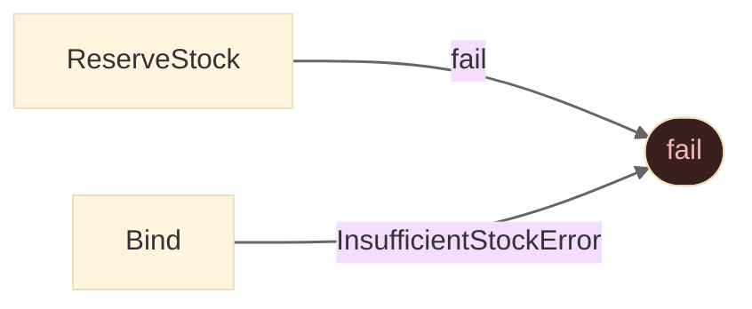
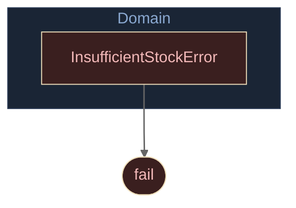

# 🌙 Dark Theme Flow Catalog

> **Same diagrams, dark palette.** Annotate any `[ResultFlow]` method with `Theme = ResultFlowTheme.Dark` to emit the full diagram set using a dark colour scheme — optimised for dark-mode editors, MkDocs slate, and presentation slides.

```csharp
[ResultFlow(MaxDepth = 2, Theme = ResultFlowTheme.Dark)]
public static Result<StockReservation> FulfillOrder(int productId, int quantity) => ...
```

Each method with `Theme = Dark` generates the same set of constants as the light theme — pipeline, layer view, error surface, and error propagation — all using the dark `classDef` palette.

!!! info
    This page is regenerated automatically on every release. Do not edit manually.

---

## FulfillmentService

### FulfillOrder

#### Pipeline

*Cross-method pipeline — Application → Domain, dark palette*

```mermaid
---
title: FulfillOrder → ⟨StockReservation⟩
---
%%{init: {'theme': 'base', 'flowchart': {'scale': 1}, 'themeVariables': {'primaryTextColor': '#fff', 'titleColor': '#fff', 'edgeLabelBackground': '#2a2a2a'}}}%%
flowchart LR
    ENTRY_ROOT["FindProduct<br/>→ Product"]:::operation ==> sg_N0_ReserveStock
    subgraph sg_N0_ReserveStock["ReserveStock"]
        ENTRY_N0_ReserveStock[ ]:::entry
        ENTRY_N0_ReserveStock[ ] ==> N0_ReserveStock_0_Ok
        N0_ReserveStock_0_Ok["Ok<br/>Product"]:::operation
        N0_ReserveStock_0_Ok --> N0_ReserveStock_1_Bind
        N0_ReserveStock_1_Bind["Bind<br/>Product"]:::bind
        N0_ReserveStock_1_Bind -->|InsufficientStockError| FAIL
    end
    sg_N0_ReserveStock -->|ok| N1_Map
    sg_N0_ReserveStock -->|fail| FAIL
    N1_Map["Map<br/>Product → StockReservation"]:::map
    N1_Map -->|ok| SUCCESS
    SUCCESS([success]):::success
    FAIL([fail])
    FAIL:::failure
classDef entry      fill:none,stroke:none
classDef operation  fill:#3a2b1f,color:#f2c2a0
classDef bind       fill:#1f3a2d,color:#9fe0c0,stroke:#2d5a4a,stroke-width:3px
classDef map        fill:#1f3a2d,color:#9fe0c0
classDef transform  fill:#1f3a2d,color:#9fe0c0
classDef gatekeeper fill:#1f263a,color:#b8c8f2
classDef sideeffect fill:#3a331f,color:#f2e0a0
classDef terminal   fill:#33203a,color:#d6b0f2
classDef success    fill:#1f3a36,color:#9fe0d6
classDef failure    fill:#3a1f1f,color:#f2b8b8
classDef note       fill:#2a2a2a,color:#aaaaaa,stroke:#555555
classDef subgraphStyle fill:#252520,stroke:#665,stroke-width:1px
linkStyle default stroke:#666,stroke-width:1.5px
class sg_N0_ReserveStock subgraphStyle
```



#### Layer View

*Domain boundary — Application (FulfillmentService) → Domain (WarehouseService)*



#### Error Surface

*Fail-edges only — dark palette*



#### Error Propagation

*Error types grouped by the layer they originate from — dark palette*



---
