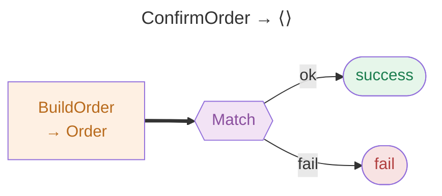
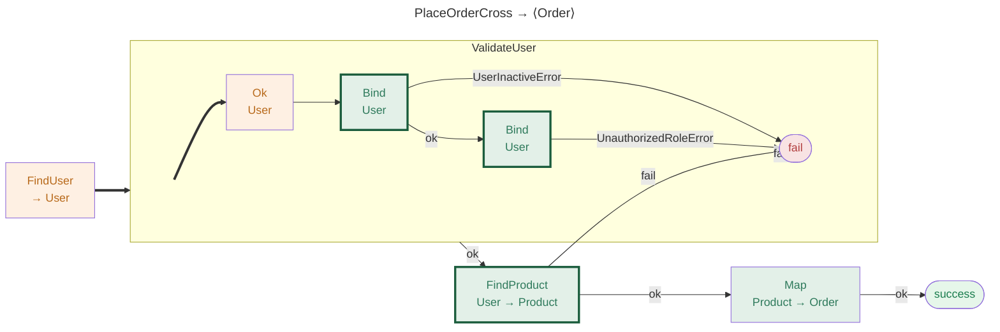
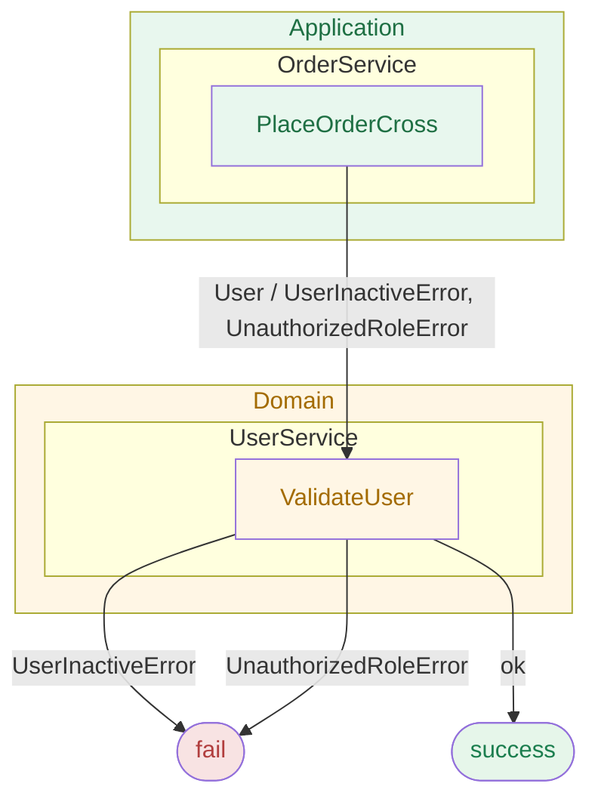
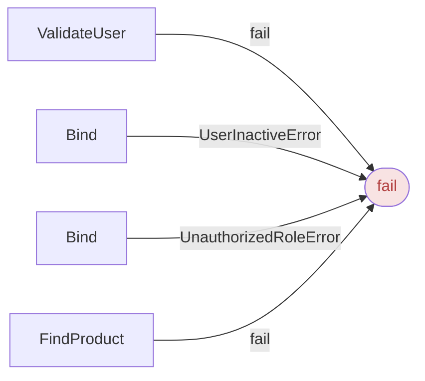
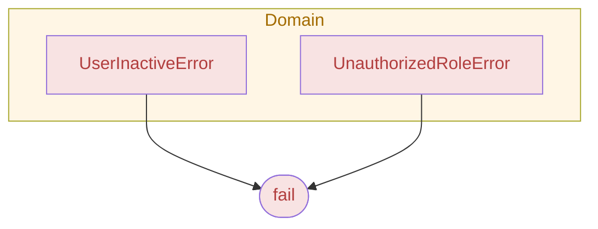
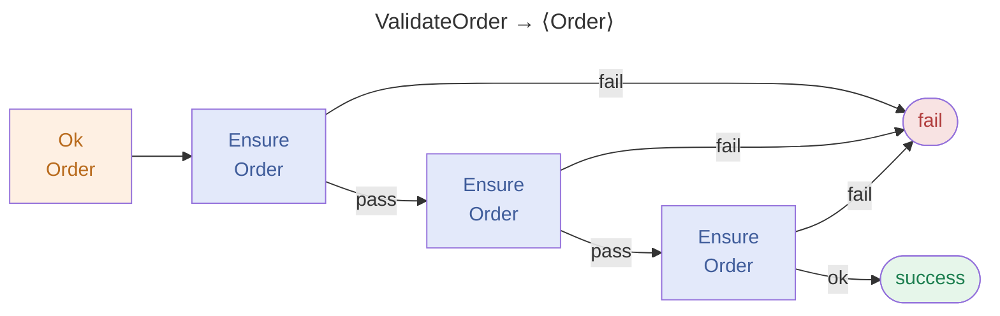
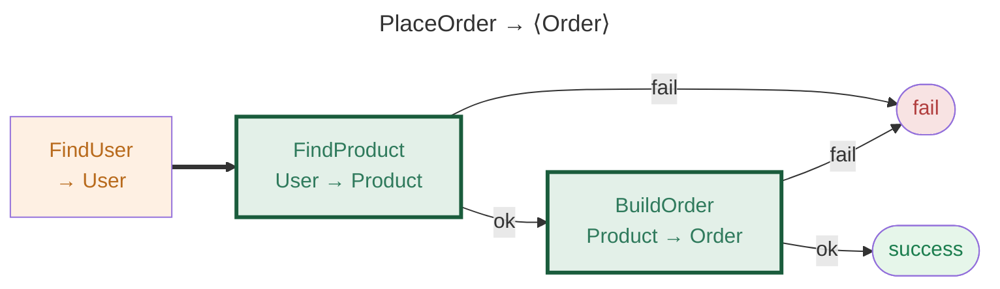
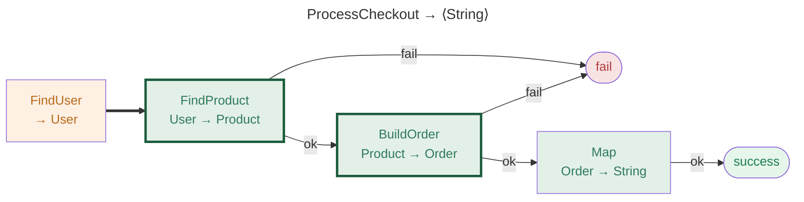
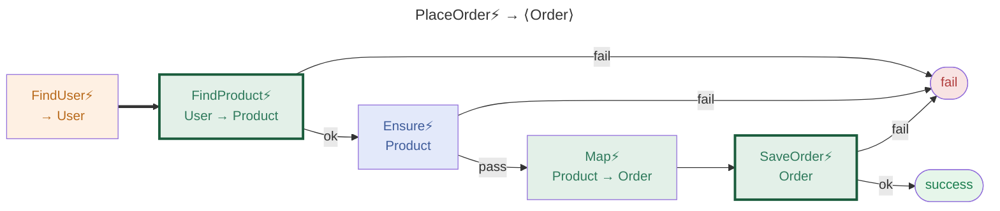

```mermaid
---
title: AdminCheckout → ⟨String⟩
---
flowchart LR
    ENTRY_ROOT["FindUser⚡<br/>→ User"]:::operation ==> N0_EnsureAsync
    N0_EnsureAsync["<span title='u.Role == &quot;Admin&quot;'>Ensure⚡<br/>User</span>"]:::gatekeeper
    N0_EnsureAsync -->|pass| N1_FindProductAsync
    N0_EnsureAsync -->|fail| FAIL
    N1_FindProductAsync["FindProduct⚡<br/>User → Product"]:::bind
    N1_FindProductAsync -->|ok| N2_EnsureAsync
    N1_FindProductAsync -->|fail| FAIL
    N2_EnsureAsync["<span title='p.Stock > 0'>Ensure⚡<br/>Product</span>"]:::gatekeeper
    N2_EnsureAsync -->|pass| N3_MapAsync
    N2_EnsureAsync -->|fail| FAIL
    N3_MapAsync["Map⚡<br/>Product → Order"]:::map
    N3_MapAsync --> N4_SaveOrderAsync
    N4_SaveOrderAsync["SaveOrder⚡<br/>Order"]:::bind
    N4_SaveOrderAsync -->|ok| N5_Log
    N4_SaveOrderAsync -->|fail| FAIL
    N5_Log["Log<br/>Order"]:::sideeffect
    N5_Log --> N6_Log
    N6_Log["Log<br/>Order"]:::sideeffect
    N6_Log --> N7_MapAsync
    N7_MapAsync["Map⚡<br/>Order → String"]:::map
    N7_MapAsync -->|ok| SUCCESS
    SUCCESS([success]):::success
    FAIL([fail])
    FAIL:::failure
    classDef operation fill:#fef0e3,color:#b86a1c
    classDef gatekeeper fill:#e3e9fa,color:#3f5c9a
    classDef bind fill:#e3f0e8,color:#2f7a5c,stroke:#1a5c3c,stroke-width:3px
    classDef map fill:#e3f0e8,color:#2f7a5c
    classDef sideeffect fill:#fff4d9,color:#b8882c
    classDef success fill:#e6f6ea,color:#1c7e4f
    classDef failure fill:#f8e3e3,color:#b13e3e
%% --- Node correlation (ReasonMetadata.NodeId / PipelineStep) ---
%%   N0_EnsureAsync → EnsureAsync
%%   N1_FindProductAsync → FindProductAsync
%%   N2_EnsureAsync → EnsureAsync
%%   N3_MapAsync → MapAsync
%%   N4_SaveOrderAsync → SaveOrderAsync
%%   N5_Log → Log
%%   N6_Log → Log
%%   N7_MapAsync → MapAsync
```

# 🗺️ Architectural Flow Catalog

> **See ResultFlow in action on real code.** Every diagram on this page is auto-generated from the [`REslava.Result.Flow.Demo`](https://github.com/reslava/nuget-package-reslava-result/tree/main/samples/REslava.Result.Flow.Demo) project — the same output you get when you annotate your own methods with `[ResultFlow]`.

Each method shows its full set of generated views: pipeline flow, architecture layer view, stats, error surface, and error propagation — all derived automatically from the source code with zero manual work.

!!! info
    This page is regenerated automatically on every release. Do not edit manually.

---

## MatchDemo

### ConfirmOrder

#### Pipeline

*Success path, typed error edges, async steps*

---

## OrderService

### PlaceOrderCross

#### Pipeline

*Success path, typed error edges, async steps*

#### Layer View

*Architecture layers — Domain / Application / Infrastructure boundaries*

#### Stats

*Node count, error count, depth, async steps*

| Property        | Value                                    |
|-----------------|------------------------------------------|
| Steps           | 6                                        |
| Async steps     | 0                                        |
| Possible errors | UserInactiveError, UnauthorizedRoleError |
| Layers crossed  | Domain                                   |
| Max depth traced | 1                                        |

#### Error Surface

*All possible errors grouped by the step that produces them*

#### Error Propagation

*Error types grouped by the architectural layer they originate from*

---

## Pipelines

### ValidateOrder

#### Pipeline

*Success path, typed error edges, async steps*

---

### PlaceOrder

#### Pipeline

*Success path, typed error edges, async steps*

---

### ProcessCheckout

#### Pipeline

*Success path, typed error edges, async steps*

---

### PlaceOrderAsync

#### Pipeline

*Success path, typed error edges, async steps*

---

### AdminCheckout

#### Pipeline

*Success path, typed error edges, async steps*

---
