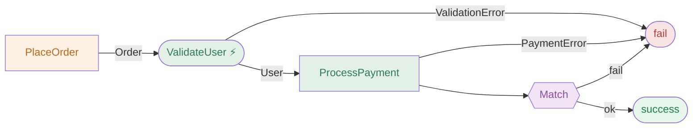
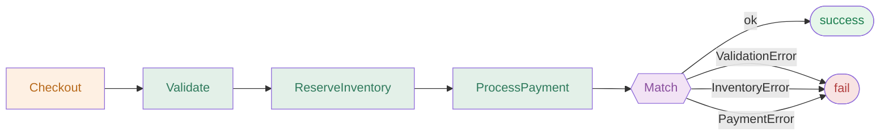
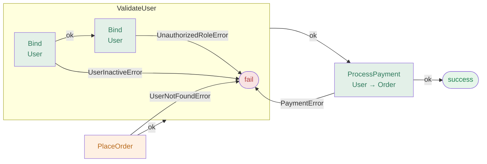
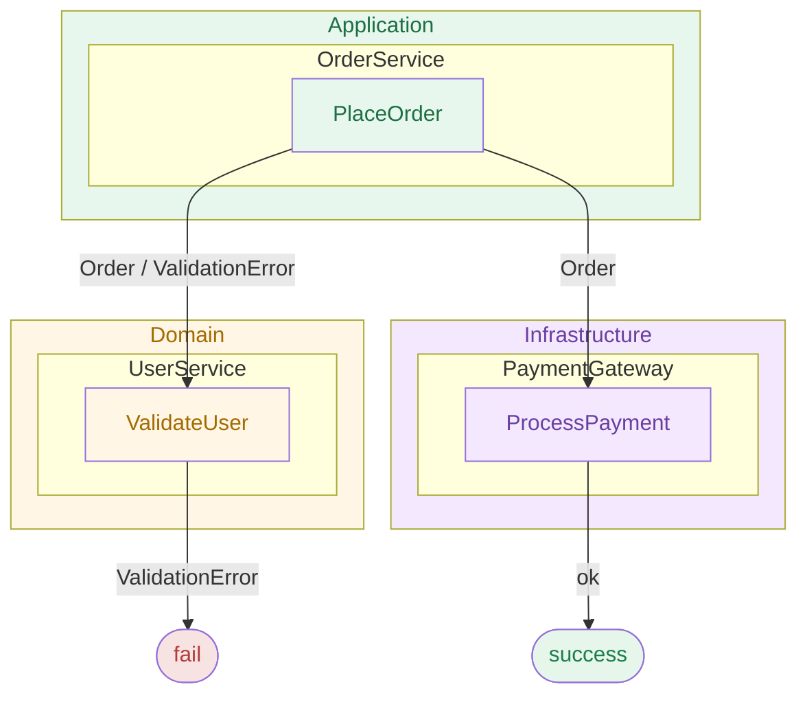
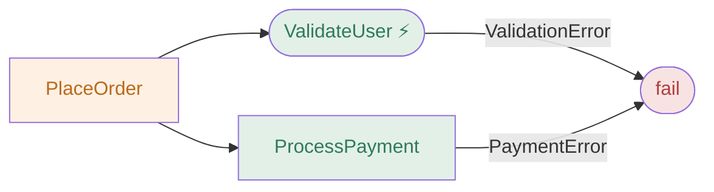
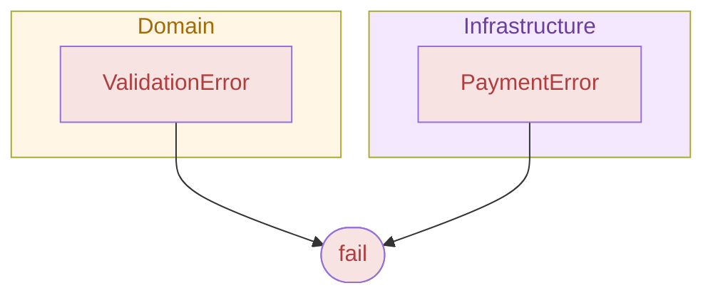

# ResultFlow — Diagram Gallery

All diagram types generated by `REslava.Result.Flow`, shown on the same `PlaceOrder → ValidateUser (Domain) + ProcessPayment (Infrastructure)` scenario for easy comparison.

---

## `_Diagram` — Pipeline flowchart

The base diagram. Every success path, failure branch, async step, and side effect — rendered as a `flowchart LR`.

---

## `_Diagram` — Match with typed N-branch fan-out

When `Match` is called with explicitly-typed lambda parameters (e.g. `(ValidationError v) => ...`), `REslava.Result.Flow` emits one typed fail edge per error branch — all converging on the shared `FAIL` terminal.

---

## `_Diagram` — Cross-method tracing

With `[ResultFlow(MaxDepth = 2)]`, called methods are expanded inline as `subgraph` blocks — one diagram spanning multiple classes and layers.

---

## `_LayerView` — Architecture diagram

Requires `[DomainBoundary]` on at least one class or method. Groups nodes by architectural layer (`flowchart TD`) with color-coded subgraphs.

---

## `_ErrorSurface` — Fail-edges only

Same pipeline, but only failure edges are shown — the complete error surface at a glance.

---

## `_ErrorPropagation` — Errors grouped by layer

Each error type is shown under the layer subgraph where it originates. Requires `[DomainBoundary]`.

---

## `_Stats` — Pipeline statistics table

A plain Markdown table — no Mermaid block. Counts steps, async steps, error types, layers crossed, and max depth traced.

| Property        | Value                                      |
|-----------------|--------------------------------------------|
| Steps           | 3                                          |
| Async steps     | 1                                          |
| Possible errors | ValidationError, PaymentError              |
| Layers crossed  | Application → Domain → Infrastructure      |
| Max depth traced| 2                                          |

---

!!! note "Static page"
    This gallery is hand-maintained. When a renderer or `MethodKindMap` changes, update the diagrams here to match. See `release-workflow.md` §1.5 for the pre-release checklist.
