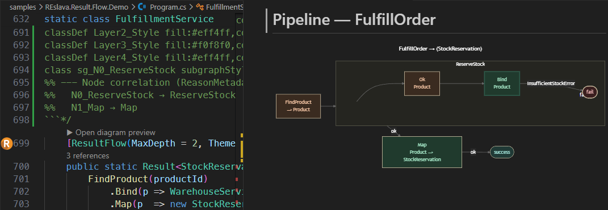

# REslava.Result Extensions

VS Code companion for the [REslava.Result](https://www.nuget.org/packages/REslava.Result) NuGet library.

Adds **CodeLens** and a **gutter icon** to every `[ResultFlow]` method — click once to open a rendered Mermaid pipeline diagram.

---

## Features

### ▶ Open diagram preview — CodeLens
A `▶ Open diagram preview` CodeLens appears above every method decorated with `[ResultFlow]`.
Click it to open the Mermaid flowchart for that pipeline in a side panel.

### Orange R gutter icon
A branded gutter icon marks every `[ResultFlow]` attribute line so pipelines are visible at a glance while scrolling.



---

## Requirements

Install one of the two ResultFlow NuGet packages in your project:

| Package | Description |
|---|---|
| [REslava.Result.Flow](https://www.nuget.org/packages/REslava.Result.Flow) | Full semantic analysis — requires `REslava.Result` |
| [REslava.ResultFlow](https://www.nuget.org/packages/REslava.ResultFlow) | Syntax-only, library-agnostic |

Both packages generate `*_Flows.g.cs` files at build time. The extension reads these files to render the diagram — **build your project at least once** to generate them.

---

## How it works

When you click `▶ Open diagram preview`, the extension tries four steps in order:

1. Reads the generated `*_Flows.g.cs` file from your `obj/` folder *(fastest — works after any build)*
2. Asks Roslyn to run the "Insert diagram as comment" code action and reads the result
3. Reads an existing `/*```mermaid...```*/` block comment in your source
4. Shows a *"diagram not ready yet"* message if none of the above succeeds

---

## Links

- [GitHub Repository](https://github.com/reslava/nuget-package-reslava-result)
- [REslava.Result on NuGet](https://www.nuget.org/packages/REslava.Result)
- [REslava.Result.Flow on NuGet](https://www.nuget.org/packages/REslava.Result.Flow)
- [REslava.ResultFlow on NuGet](https://www.nuget.org/packages/REslava.ResultFlow)
